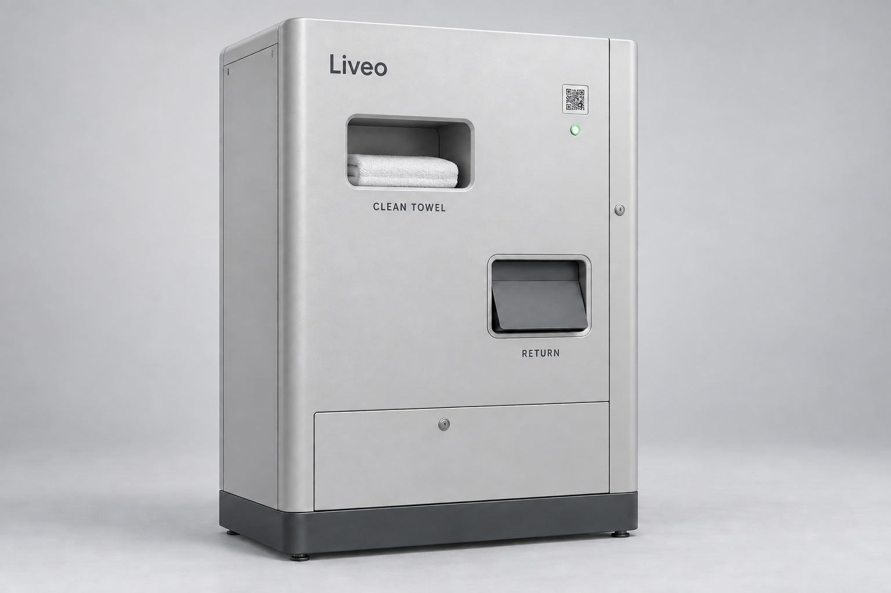
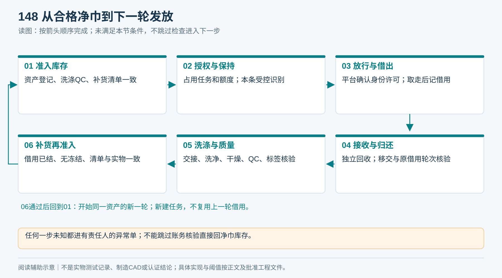
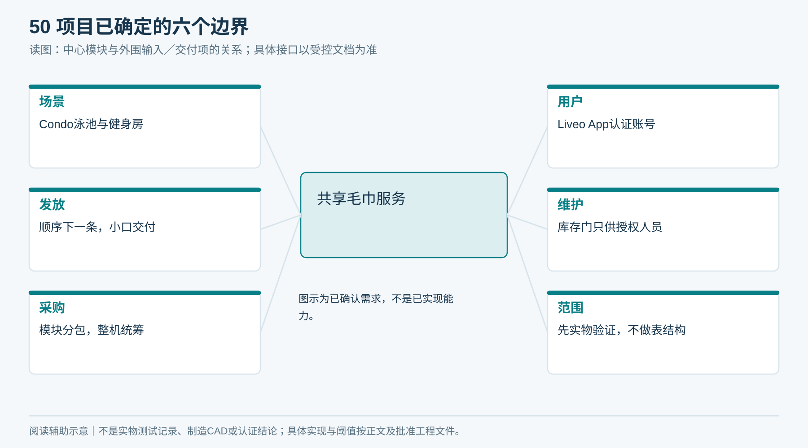
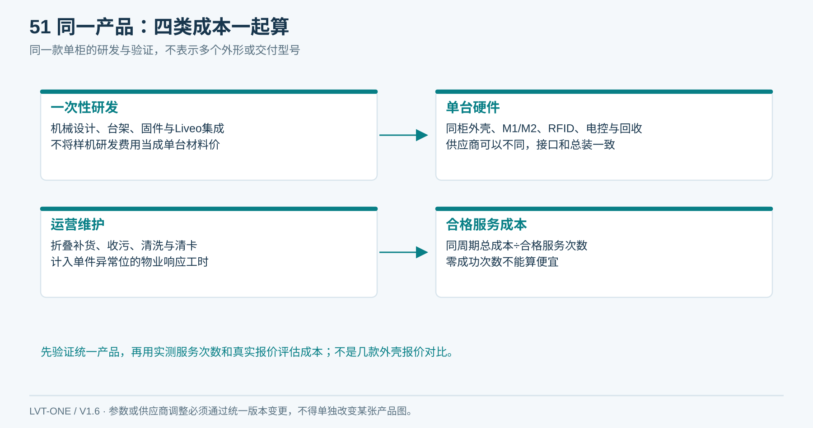
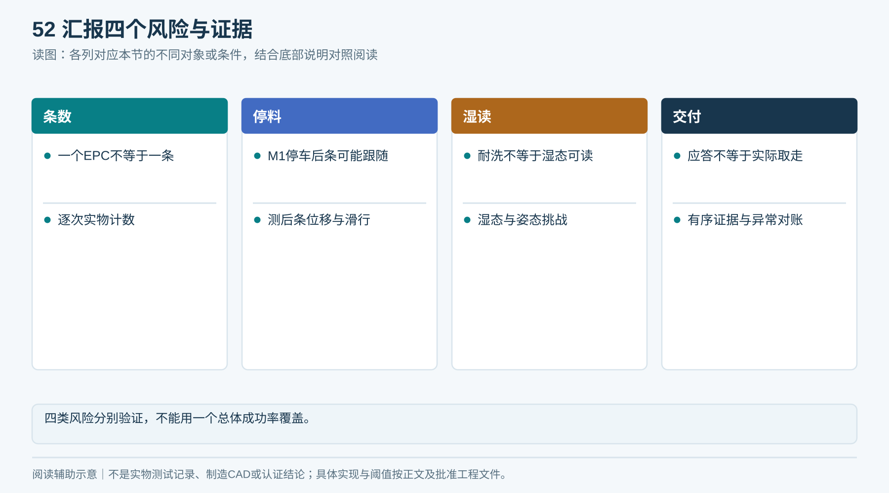
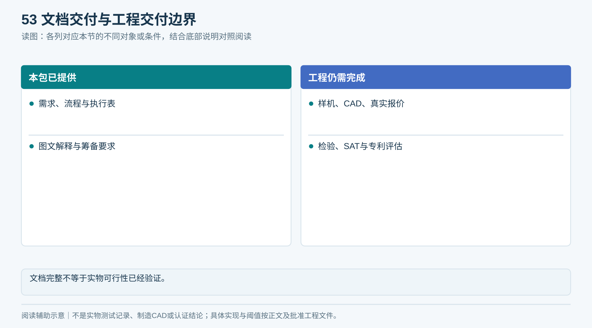
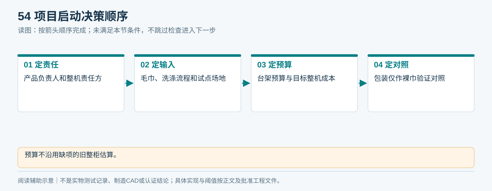

# 01｜项目概述

版本：V1.6 · 2026-09-17 · 方案设计阶段

## 产品概述

住户在 Condo 泳池或健身房使用 **Liveo App** 扫码，柜内顺序分出下一条干净毛巾，在住户能接触到它之前读取候选身份并取得平台对本条资产的释放许可，再送到小取物口；平台核验实际取走证据后，才确认这条毛巾属于本次授权账号的借用。归还通过独立湿巾通道，物体入箱和身份核验都通过后才销账。

*同一外观母图置入泳池配套干燥区域；没有外置回收副柜。设计场景，非实际交付照片。*

<!-- figure-14 -->
### 图14｜产品外观效果

*单一产品外观母图：银灰单柜、左上领巾、右下归还、右上二维码与绿灯、底部服务门。领巾口展示一条折叠毛巾；这是设计效果图，不是样机照片。*

**闭环约束（V1.4复核）**

完整循环必须走到“领用→取走→归还→洗涤→QC→核账→补货→同资产再次领用”。实物、任务、借用额度、通道与责任同时对齐；正常和异常均有受控出口。优先阅读[21章闭环基线](21_端到端逻辑闭环与验收矩阵.md)，再按各模块实施。

*任何一步未知都进有责任人的异常单；不能跳过账务核验直接回净巾库存。*

## 已确定的设计要求

- 服务场景：Condo 泳池／健身房共享领还毛巾。
- 用户端统一名称：Liveo App。
- 每次目标为一条；住户不能打开净巾库存门。补货门只供授权工作人员使用。
- 内部模块分开采购、测试、报价、更换；指定一个整机集成责任方。
- 优先比较“顺序出下一条”，没有必要按住户随机取指定储位。
- 先验证物理出巾与归还，再接完整业务；本包不设计数据库表。

<!-- module-figure-50 -->
**子模块图｜项目已确定的六个边界**

*读图说明：图示为已确认需求，不是已实现能力。*

## 推荐推进路线

| 阶段 | 阶段投入与交付成果 | 阶段放行条件 |
|---|---|---|
| G0 规格确认 | 毛巾样本、场地测量、成本边界 | 台架正式询价 |
| G1 分离台架 | 实际毛巾单条分离证据和完整失败记录 | 确认当前单条分离机构是否通过 |
| G2 工程样机 | 出口防护、局部RFID、控制和Liveo任务闭环 | 设计冻结与试制 |
| G3 出厂验收 | 每台装配记录、版本、功能和安全检查 | 包装发运 |
| G4 现场验收 | 场地、电源、网络、账号、实际领还验证 | 受控试运营 |
| G5 运营复盘 | 维护成本、使用成功率、损耗和反馈 | 批量采购 |

## 成本决策

成本同时包含机械/软件研发、单台BOM、折叠补货、清洗收污、清卡维修和异常响应。用同一周期的真实总成本除以合格服务次数；没有报价或零成功次数不能推出成本优势。

**当前只推进统一单柜、折叠裸巾、M1/M2独立送料这一套产品。先用实际毛巾完成台架和空间验证，再冻结零件与整柜；单次成功或统一效果图都不代表可量产。**

<!-- module-figure-51 -->
**子模块图｜成本路线怎样比较**

*读图说明：同一产品按同周期和合格服务口径核算，采购及运行成本仍须取证。*

## 关键技术风险与验证要求

1. 只读到一个RFID编号，不代表物理上只有一条毛巾。
2. M1停止时，第二条是否已被带出，是裸巾方案最关键的机械验证点。
3. 标签耐水耐洗，不等于湿毛巾包住标签时仍能可靠读出。
4. 指令成功、识别成功、毛巾送出、毛巾取走是不同状态；结果不明时不能再自动发一条。

<!-- module-figure-52 -->
**子模块图｜关键风险与验证依据**

*读图说明：四类风险分别验证，不能用一个总体成功率覆盖。*

## 当前成果与待验证事项

已提供需求、机械与控制方案、采购要求、生产资料清单、测试方法、验收用例、运维流程、专利交底筹备材料和可填写表单。

待完成事项包括台架试验、加工CAD、供应商有效报价、检验报告、现场验收及专利检索评估。参数缺口在[决策台账](18_风险与决策台账.md)登记了负责人、关闭方法和阻断阶段。

<!-- module-figure-53 -->
**子模块图｜文档交付与工程交付边界**

*读图说明：样机可行性待通过实物试验验证。*

**闭环约束（V1.4复核）**

现行V1.6包含21章、14份执行表单和158张产品配图，配套44项实机验收计划用例及简化规则模型。实机用例尚未执行，Liveo接入待验证；D01—D18未决项按证据签核。

## 待决策事项

- 任命产品负责人和整机集成责任方。
- 提供目标毛巾与真实洗涤条件，落实试点场地。
- 给出台架预算、目标整机成本、试运营窗口。
- 确定裸巾分离试验的对照条件；纸套／独立包装仅作为验证对照，不属于现行产品配置。

本阶段预算不引用旧报告约5000元的整柜估算；该估算有漏项和标签重复计价风险，不能成为采购上限。

<!-- module-figure-54 -->
**子模块图｜项目启动决策顺序**

*读图说明：预算不沿用缺项的旧整柜估算。*

