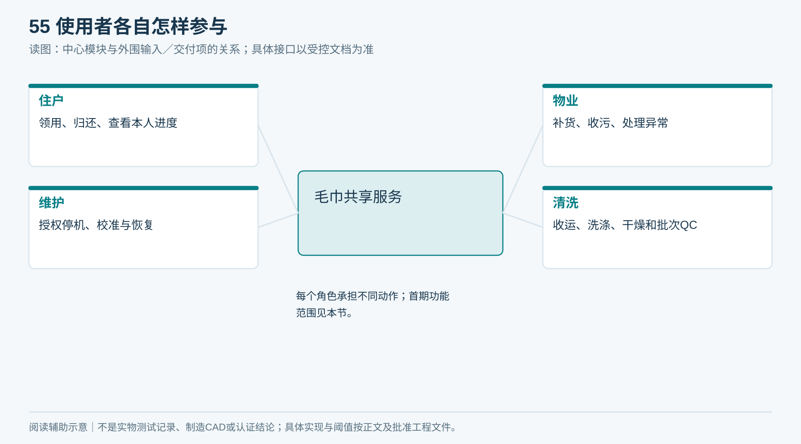
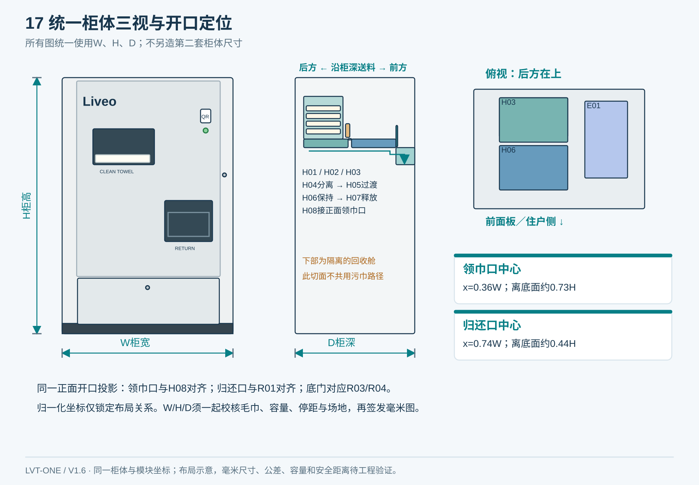
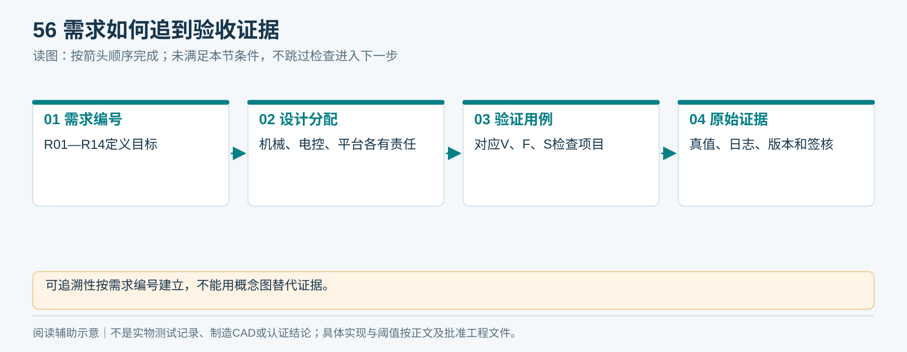
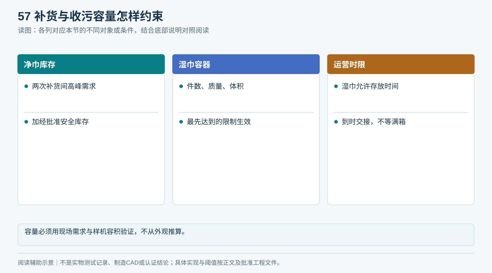
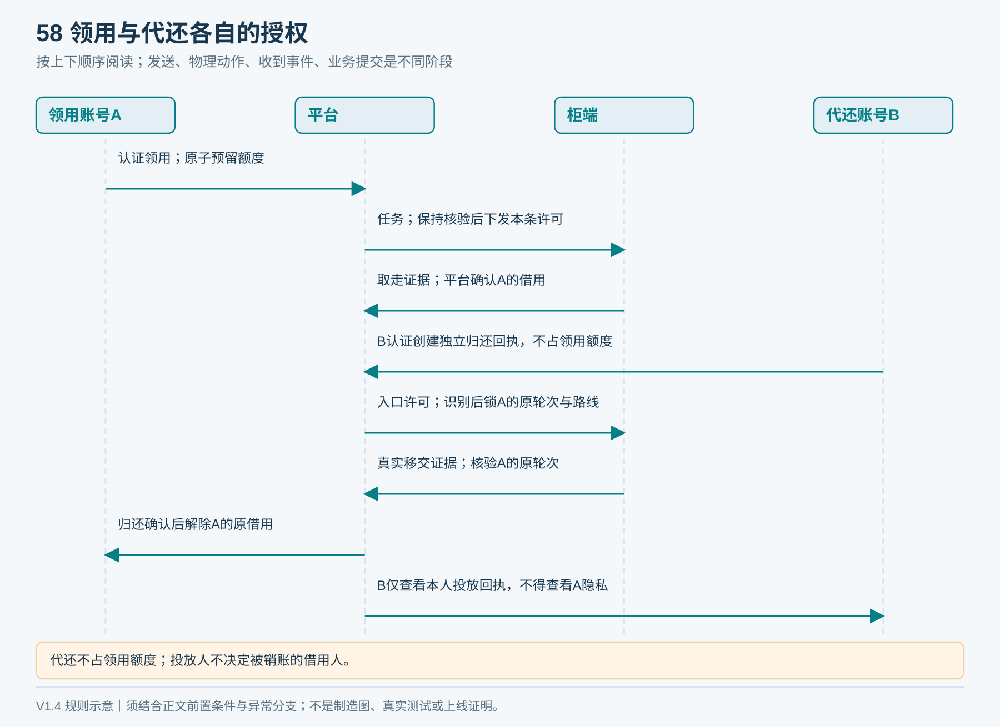
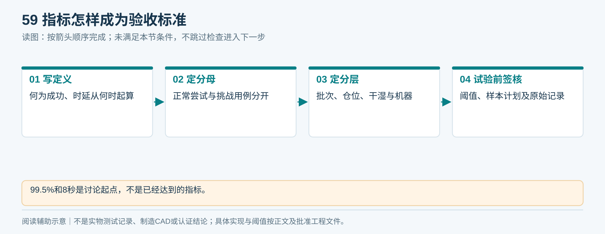

# 02｜产品需求与毛巾规格

**单一产品基线 V1.6：** 本章采用同一台柜：左上领巾、右下归还、上右独立电气舱、下部两只独立回收抽箱；净巾沿柜深从后向前送料。所有整体视图由[统一布局源](统一设计源/单一产品布局.json)和[图形一致性说明](统一设计源/单一产品说明.md)约束。

状态：建议需求基线；现场数值和毛巾范围须在G0签核。

## 1. 范围与使用者

住户：领一条、归还、查看本人领还与异常进度。

物业：补货、收污、检查库存、处理待核验、查看本项目服务统计。

维护人员：经授权进行停机维修、校准、版本升级和恢复检查。

清洗服务方：收运、洗涤、干燥、质量检查、折叠与批次追踪。

首期不要求大屏、人脸识别、自动收费、柜内清洗、紫外消毒、随机储位机械手、离线新领巾、离线新归还或匿名借用。后续增加必须单独核算成本和风险。

<!-- module-figure-55 -->
**子模块图｜使用者各自怎样参与**

*读图说明：每个角色承担不同动作；首期功能范围见本节。*

## 2. 可追溯需求

| 编号 | 要求 | 验证与证据 |
|---|---|---|
| R01 | 一次授权最多驱动一个有效出巾任务 | 重复指令、并发与重启用例 |
| R02 | 住户无法接触库存和危险运动部件 | 结构检查、可触及与拉拽试验 |
| R03 | 每次正常发放实际恰好一条 | 人工真值计数与逐次视频 |
| R04 | 出口释放前身份、资产准入和本任务ReleasePermit已核验 | EPC原始读数、状态和门／带时序 |
| R05 | 借用记录属于本次认证账号及实际毛巾 | 任务、EPC、物理证据对账 |
| R06 | 湿巾与净巾通道和容器分离 | 结构检查、清洁和泄漏检查 |
| R07 | 归还必须确认不可取回地移交到目标容器 | 识别、转移到位、箱内接收证据 |
| R08 | 不明物体、串读和多条进入异常流程 | 归还故障注入 |
| R09 | 断网不接新领用或新归还；已接任务按许可及实际位置安全收尾／保持，未定结果待核验 | 各状态断网测试 |
| R10 | 断电重启不重复发放，不丢失未完成任务 | 各状态断电测试 |
| R11 | 关键易损件可单独更换 | 清卡、换带、换传感器实测工时 |
| R12 | 项目、账号、设备和毛巾归属由服务端核对 | 跨项目、跨账号、伪造事件用例 |
| R13 | 供应商交付版本、图纸、协议和维修资料 | 文件清单与到货核验 |
| R14 | 完成现场和运营验收后才能批量推广 | SAT和运营复盘签核 |

<!-- figure-17 -->
### 图17｜整柜三视尺寸关系

*同一布局生成三视图；开口中心与内部模块投影一致，W/H/D尚未按实测冻结。*

<!-- module-figure-56 -->
**子模块图｜需求如何追到验收证据**

*读图说明：可追溯性按需求编号建立，不能用概念图替代证据。*

## 3. 毛巾是机械系统的一部分

需冻结以下“可接受范围”，不能只指定颜色或品牌。填写[毛巾规格采样表](执行表单/T01_毛巾规格采样.md)。

| 参数 | 测量方法 | 对机械／RFID的影响 |
|---|---|---|
| 材质、长宽、克重、干质量 | 同批多条，至少覆盖不同洗涤批次 | 牵引、惯性、容积 |
| 折后长宽 | 按固定折叠工序，多人重复测 | 料仓导向和识别保持段长度 |
| 厚度 | 指定测量压板面积与载荷，记录方法 | 软布受压后变化，不能仅用自由厚度 |
| 折口与包边方向 | 拍正反面照片，标注送料前缘 | 勾连、卷边、过渡板卡塞 |
| 标签位置与固定方法 | 距固定边的尺寸及允许偏差 | 读区和摩擦接触，不能缝穿天线 |
| 洗后缩水与磨损 | 实际洗涤程序分阶段采样 | 规格漂移与寿命 |
| 残余潮气 | 以规范干燥后的质量为参照记录 | 摩擦、卫生与射频表现 |
| 拉出力 | 拉力计，满／半／近空仓、启动与稳定值 | 电机、分离件和接触材料 |
| 包材（如选用） | 封口、厚度、折角、破损、透湿状态 | 货道、抓持、防潮与耗材成本 |

建议首轮收集不少于30条、覆盖至少3个真实批次；这是工程筛选建议，不是统计寿命证明。运营可接受范围由样机和清洗方共同确认。

<!-- figure-18 -->
### 图18｜毛巾折叠与测量尺寸

*L/B为长宽；t受压不是自由厚度。标签禁缝区依厂家工艺；本图标签位置仅演示测量方法，不是已确定的缝制位置。*

## 4. 服务容量与补货

用试点高峰用量测算，不预先承诺“柜内能装多少条”：

- 可用净巾容量 ≥ 两次补货间的高峰需求 + 经批准的安全库存。
- 湿巾箱容量同时受件数、湿质量、体积和允许存放时长限制，以最先达到的阈值为准。
- 按资产唯一标识分三个维度统计：位置（库存、保持区、取物口、外借位置、回收箱、隔离位、运输／清洗）、卫生状态、借用责任。待核验是处理状态，不能与位置重复加总；报废是资产退出记录，退出前须核清实际去向与未结责任。
- 补货前停发并核对未完成任务；补货完成核实实际数量与毛巾身份。无需为实时盘全仓而默认增加多天线。

<!-- module-figure-57 -->
**子模块图｜补货与收污容量怎样约束**

*读图说明：容量必须用现场需求与样机容积验证，不从外观推算。*

**闭环约束（V1.4复核）**

补货的六项准入为：卫生QC合格、身份有效、原借用结束、无冻结、目标柜装载清单合法、实物与清单一致。按受控单条读取建立清单，不仅记录总数量；补货中断保持维护，盘清后再恢复。

*毛巾位置、卫生状态、借用状态是三个维度，不可用一个状态互相代替。*

**装载中断与移出：** 装载清单同时记录本次新增、移出及原柜余量，扫码清单与实际物体不一致则保留维护占用。开门暴露、残余潮气或超过批准存放时限的毛巾转卫生复核，不因标签可读而继续发放；QC有效期与再清洁条件由D15冻结。

## 5. 首期建议业务规则

一个已认证账号一次发放一条；领用额度和期限由项目配置签核，本文不擅自设为每日一条或固定罚款。是否按Unit共享额度另由D08决定。

归还可由他人代投，但销账对象取自已核验毛巾并锁定的原借用轮次（matchedIssueSessionId＋assetCycleVersion），不能按当前扫码人直接销账。跨Project归还首期拒绝自动销账，转物业流程。

“取走确认”表示传感器支持毛巾从取物口移除，不证明取走者的自然人身份。共享现场冒领风险及是否需要现场确认手段由D09关闭。

<!-- module-figure-58 -->
**子模块图｜首期领用与代还规则**

*读图说明：代还人不是销账依据；跨项目先走受控物业流程。*

**闭环约束（V1.4复核）**

Liveo App在线建立归还回执后才开放入口；代还无需领用额度，销原借用轮次。首期不接新离线领还任务；已有任务按释放许可与本地安全边界收尾。预留、同时在借、周期累计三种量独立：归还只减少对应在借，不自动退周期已用次数。规则与快照见[21章闭环基线](21_端到端逻辑闭环与验收矩阵.md)。

*按账号或Unit共享、周期和上限由D08签核；不擅自启用收费。*

## 6. 建议指标与冻结方式

| 指标 | 建议讨论起点 | 必须记录的口径 |
|---|---|---|
| 正常自动发放成功率 | ≥99.5% | 无人工干预完成且确实一条／有效正常尝试 |
| 错绑、虚假归还、意外重复出巾 | 验收样本中0次 | 分事件类型记录，不当作绝对零风险承诺 |
| 柜端服务到可取的P95时间 T_service | ≤8秒（讨论值） | 平台授权任务耐久提交至物理可取，包含送料、读取、许可往返与释放；时钟校准另记 |
| 用户感知时间 T_user | 单独实测后签核 | App确认领用请求至App收到可取提示；包含授权、网络与提示，不与T_service混算 |
| 湿归还性能 | 分含水与姿态报告，阈值在试验前签核 | 自动完成率、待核验率、错误销账率分列 |
| 维护与补货工时 | 台架和试点实测后签核 | 每次清卡、每次补货、每次清洁的分钟数 |

未签核的指标不是供应合同承诺，也不得在验收后选择有利口径。

<!-- module-figure-59 -->
**子模块图｜指标怎样成为验收标准**

*读图说明：99.5%和8秒是讨论起点，不是已经达到的指标。*

**时延核算口径：** T_service与T_user分开报告P50/P95及网络条件，不能只报电机运动时间，也不能将8秒直接套到两个指标。App感知时延用同一客户端单调时钟；跨平台／柜端阶段时延须记录时钟偏差、校准方式和测量误差，无法校准时仅报告同一时钟域可测分段。若保持等待使体验不达标，先实测网络与动作时序再优化；不得以跳过资产准入换取速度。
