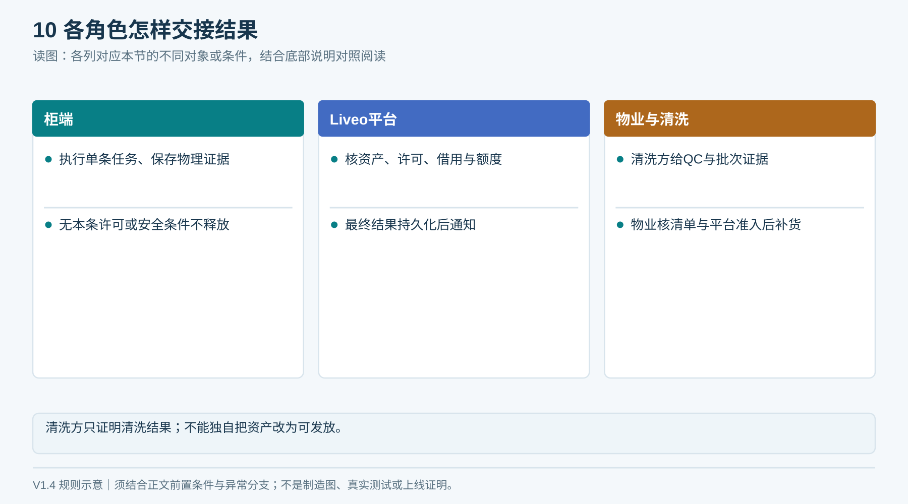
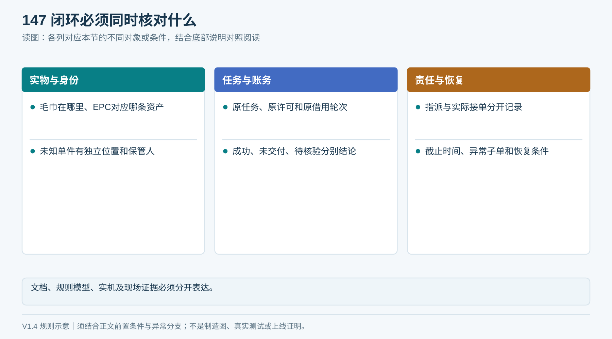
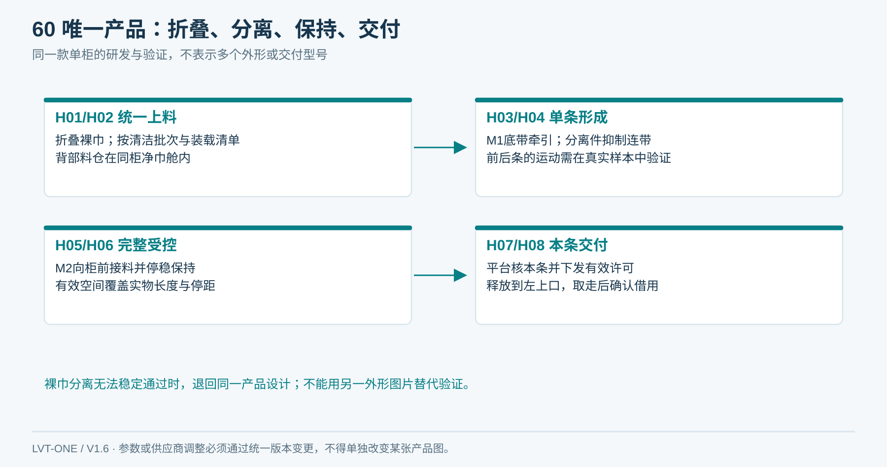
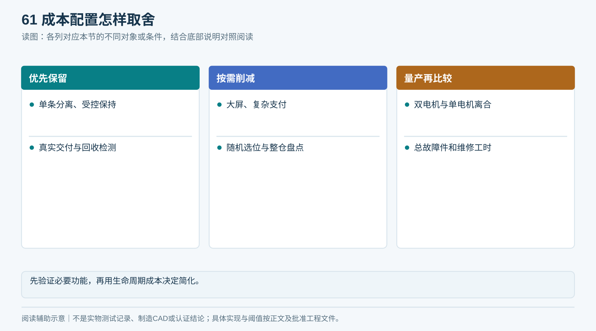
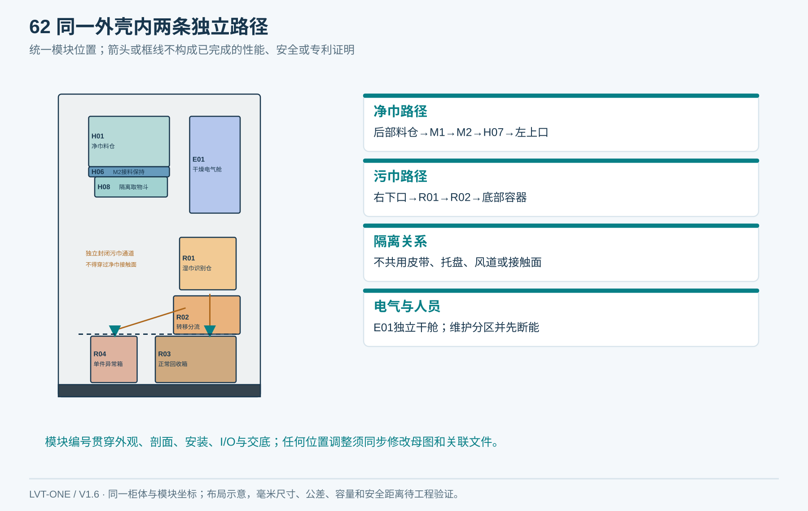
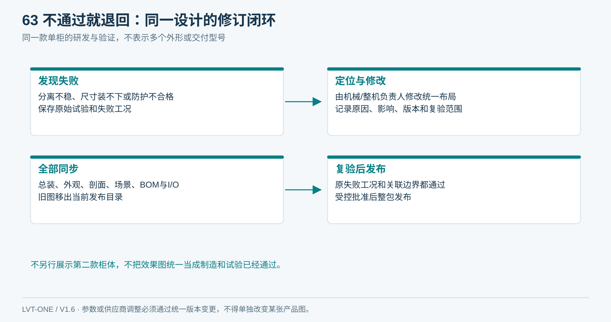

# 03｜总体架构与方案选择

**单一产品基线 V1.6：** 本章采用同一台柜：左上领巾、右下归还、上右独立电气舱、下部两只独立回收抽箱；净巾沿柜深从后向前送料。所有整体视图由[统一布局源](统一设计源/单一产品布局.json)和[图形一致性说明](统一设计源/单一产品说明.md)约束。

## 1. 模块边界

| 模块 | 输入→输出 | 责任边界 |
|---|---|---|
| 净巾供料 | 合格折叠毛巾→单条进入受控区 | 物理分离、料仓、M1 |
| 接料识别 | 受控区物体→经核验的毛巾身份 | M2、保持空间、天线、读写器 |
| 安全交付 | 已识别毛巾→隔离的取物口 | 释放件、防掏取结构、S2/S3 |
| 独立回收 | 湿巾→已接收或待核验隔离 | 投入口、转移件、正常／异常路径 |
| 本地控制 | 有效任务→动作与可追溯事件 | 传感器、持久化、互锁、断网恢复 |
| 平台服务 | 认证账号→授权、借还、异常处理 | Project/Unit范围、额度、业务一致性 |
| 运营闭环 | 污巾→洗涤、干燥、QC、重装 | 清洗方与物业SOP |

上位联网与底层运动控制可集成或分开。无论采用何种硬件，危险动作的停止与门状态检查必须在本地完成，不能等待云端应答。

**闭环约束（V1.4复核）**

模块交接统一使用任务ID、资产轮次、实物位置及版本。机械识别保持→平台核本条→柜端持久化释放许可→本地安全释放→平台确认结果；每次交接失败都保留原责任，不能默认下游已完成。

*文档闭环是规则齐全；实机闭环还需按同一用例验证。*

## 2. 当前唯一产品结构

| 项目 | 本产品采用 | 对应图／编号 |
|---|---|---|
| 外部 | 单柜、左上领巾、右下归还，无外置副柜 | 图14、17 |
| 毛巾 | 统一折叠裸巾，不使用卷巾或格口库存 | 图18、H01 |
| 供料 | 后部料仓，M1底部摩擦分离，M2接料保持 | H01—H06 |
| 交付 | H07内部释放＋H08固定取物斗 | 图19 |
| 回收 | R01识别、R02分流，R03正常箱、R04单件异常箱 | 图26 |
| 维护 | 主门分区内罩；底门分别抽取两个回收容器 | 图15 |

*研发中可以试验参数和替代零件，但对外、总装、BOM和现场图只维持这一套产品结构。旧A/B/C路线比较退出当前产品展示；不等于已证明裸巾分离可行。*

## 3. 成本优先的配置边界

先选一个有效发放通道和独立回收模块；容量由现场需求计算。本产品为一条发放通道；不得在某张图中自行加通道或改变外壳。

优先减少无必要的大屏、复杂支付、整仓盘点和随机储位选择；保留能决定是否正确发放、是否安全、是否真实归还的检测与保持机构。

统一保留M1、M2两段独立驱动，以实测分离和接料时序评估总成本；任何减少电机的改动先验证原有保持与释放功能，再通过工程变更同步全部图纸。

<!-- module-figure-61 -->
**子模块图｜成本配置怎样取舍**

*读图说明：先验证必要功能，再用生命周期成本决定简化。*

**闭环约束（V1.4复核）**

成本基线优先使用Liveo App回执与已有读写器受控单条补货核验；不为离线新回收默认增配打印机。耐久任务存储、可追溯异常位置、物业处置工时与平台资产许可不可从BOM或服务费用中漏掉。

## 4. 推荐的物理路径

净巾库存 → M1分离 → M2受控保持／RFID识别 → 释放与固定防触及结构 → 小取物口。

湿巾投入口 → 小识别仓 → 正常／待核验路径 → 独立容器 → 清洗服务。

毛巾在释放前应完全脱离库存，且用户不能通过牵拉当前毛巾带出下一条。受控保持区必须容纳实际可能展开的尺寸，不能只按漂亮折叠图算长度。

<!-- module-figure-62 -->
**子模块图｜净污两条独立物理路径**

*引用同一产品布局；模块位置与图02、图17一致。*

## 5. 统一设计的退回与变更门

出现以下任一情况，暂停整柜出图与采购冻结，退回毛巾样本、分离机构或空间设计：

- 多批样本找不到共同的稳定分离参数范围。
- 满仓和近空仓需要人工反复调参数。
- 必须依赖非常严格、难以复现的折法才能达标。
- 维修／补货总人工抵消省下的耗材费用。
- 安全出口和读区空间使整机超过场地限制。

结论由[方案成本表](执行表单/T04_成本与报价.md)、原始试验数据和D03签核共同形成，不从概念图选型。

<!-- module-figure-63 -->
**子模块图｜何时退回统一设计整改**

*读图说明：不能以单次成功视频决定量产路线。*

修改须形成一个新修订：更新布局源→总装与接口→全部外观/场景/剖面→BOM→验证记录，旧图撤出当前图册。不得把无法装入的机构画到另一款外壳中解释。
