# 04｜内部机械结构与传动

**单一产品基线 V1.6：** 本章采用同一台柜：左上领巾、右下归还、上右独立电气舱、下部两只独立回收抽箱；净巾沿柜深从后向前送料。所有整体视图由[统一布局源](统一设计源/单一产品布局.json)和[图形一致性说明](统一设计源/单一产品说明.md)约束。

状态：功能与台架设计要求。尺寸、配合、公差、力矩和防护距离未经实测冻结，不能按概念图直接加工。

<!-- figure-15 -->
### 图15｜同柜模块拆装对应

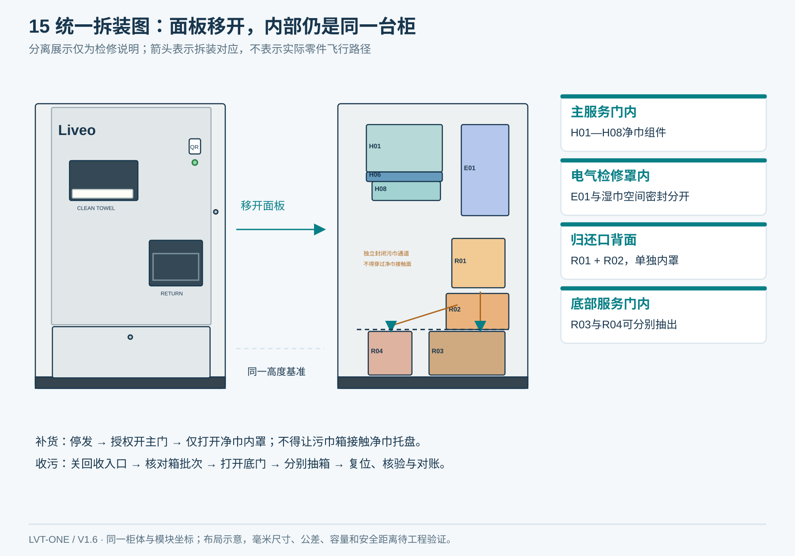

*面板轮廓、开口、下部服务门与内部模块来自同一个布局源；未用另一个外壳作为爆炸图。*

### 图163｜同柜剖切轴测

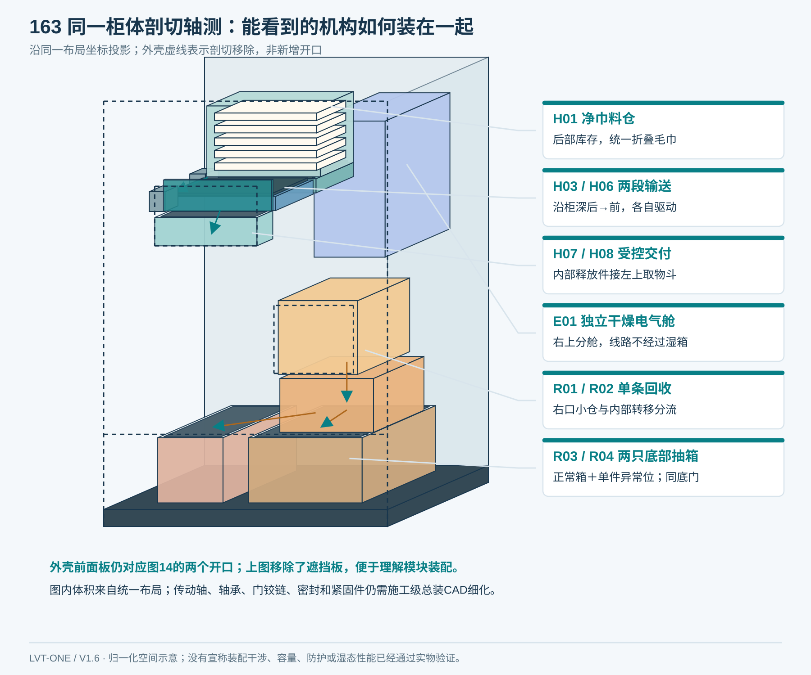

*同一布局源投影；前面板剖开后显示柜内组件，不增加第二个外壳。图15对应面板与内部位置，本图对应模块的前后关系。*

## 1. 总剖面怎么理解

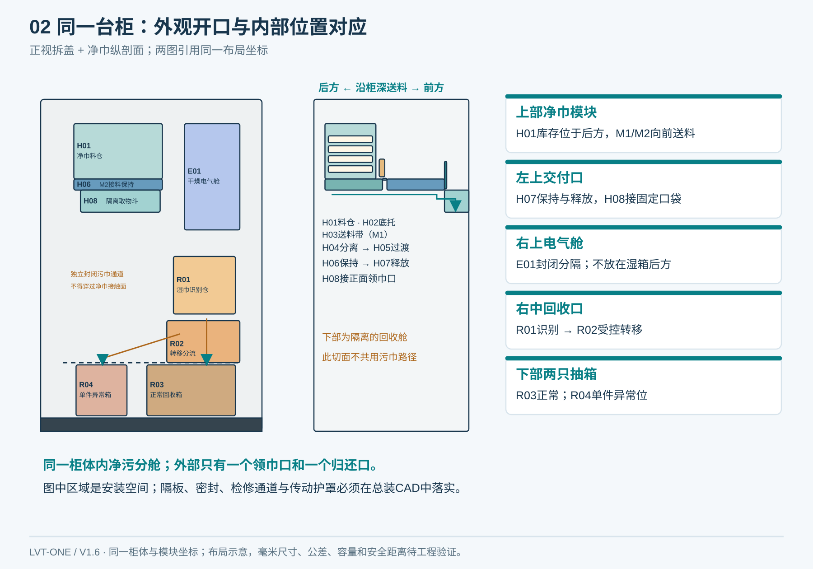

本图与外观母图的开口、柜体及服务门一一对应。H01/H03在净巾舱后部，H06/H07位于前部，H08连接同一个左上领巾口。局部详图允许放大，但不能改变模块装配方向和所属分舱。

| 编号 | 部件 | 做什么 | 可独立维护项 |
|---|---|---|---|
| H01 | 可拆料仓与导向 | 控制叠放姿态，承受堆叠重量 | 导向宽度、料仓拆洗 |
| H02 | 底托与开窗 | 支撑部分重量，让皮带接触底条 | 开窗位置、表面、圆角 |
| H03 | M1送料平带 | 依靠摩擦拖动最下面的毛巾 | 皮带、主动／从动滚筒、张紧 |
| H04 | 弹性分离件 | 抑制上层连带 | 接触垫、弹簧、预紧与高度调节 |
| H05 | 过渡与剥离件 | 避免毛巾卷入回程或掉入段间缝隙 | 圆滑过渡板、间隙调节 |
| H06 | M2接料带 | 接住本条并在保持区定位 | 独立驱动、轴承、跑偏调整 |
| H07 | 识别保持与释放 | 未确认身份不进入公共取物区 | 保持空间、释放件、到位反馈 |
| H08 | 固定隔离及取物斗 | 隔离库存与危险动作，提供可取位置 | 可清洁斗、S2/S3、固定护罩 |
| H09 | 机架与传动腔 | 保持轴系位置，隔离润滑和污物 | 可拆护罩、线束支架、机脚 |

以下按H01—H09分别展开。每个部件都有独立示意与工作／调节／维护说明，可直接用于模块评审。

### H01｜可拆料仓与导向

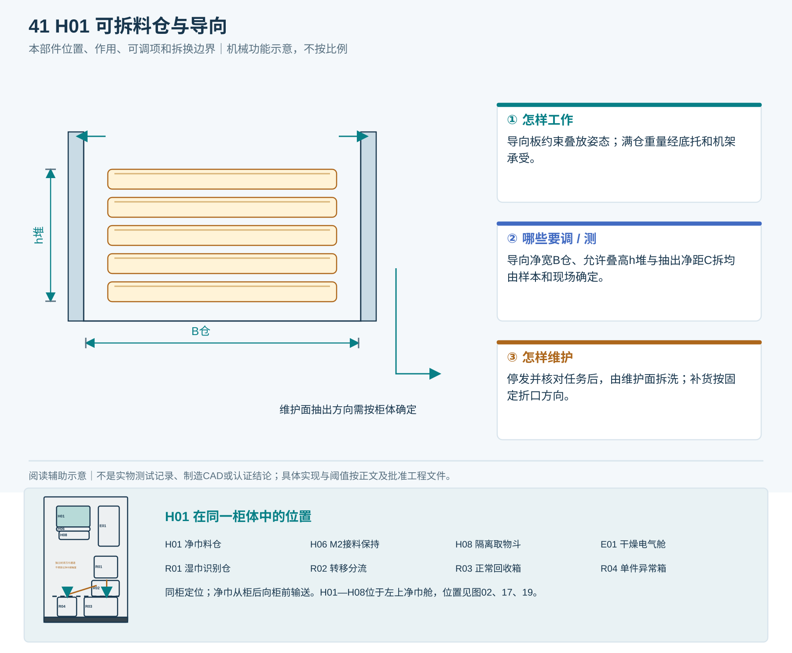

- **工作方式**：导向板约束叠放姿态；满仓重量经底托和机架承受。
- **需要确认**：导向净宽B仓、允许叠高h堆与抽出净距C拆均由样本和现场确定。
- **拆换维护**：停发并核对任务后，由维护面拆洗；补货按固定折口方向。

- **复装与放行**：复装核导向间隙与折口方向，逐条核装载清单；卡碰或清单差异留在维护，满／半／近空试送通过后由维护与物业交接。

### H02｜底托与皮带开窗

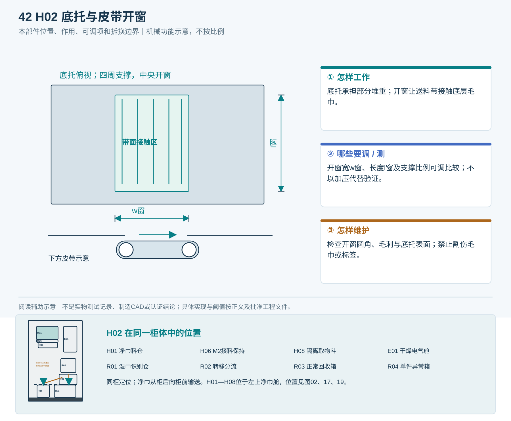

- **工作方式**：底托承担部分堆重；开窗让送料带接触底层毛巾。
- **需要确认**：开窗宽w窗、长度l窗及支撑比例可调比较；不以加压代替验证。
- **拆换维护**：检查开窗圆角、毛刺与底托表面；禁止割伤毛巾或标签。

- **复装与放行**：复装核开窗支撑、紧固及边缘防勾；底托变形或物体去向不明禁止试发，修复后用边界厚度样本复验。

### H03｜M1送料平带与轴承

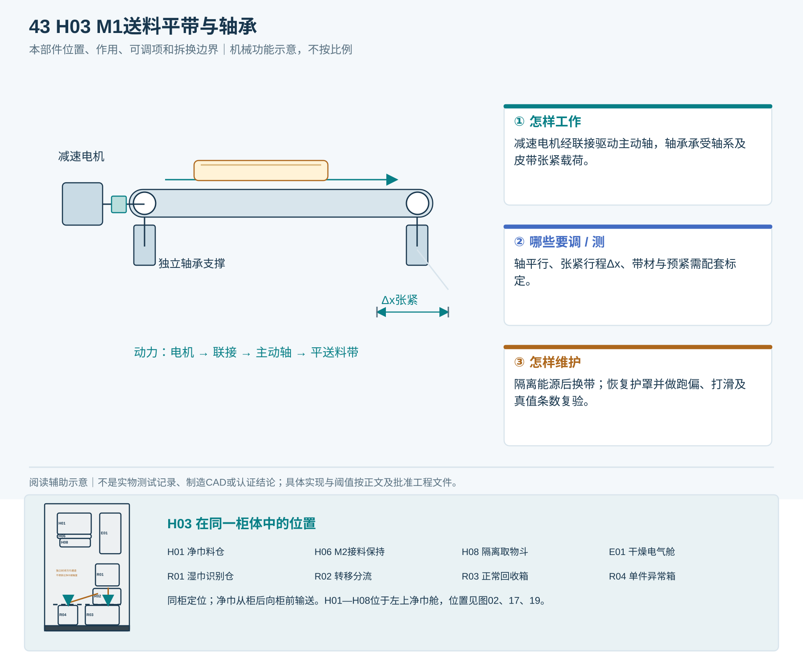

- **工作方式**：减速电机经联接驱动主动轴，轴承承受轴系及皮带张紧载荷。
- **需要确认**：轴平行、张紧行程Δx、带材与预紧需配套标定。
- **拆换维护**：隔离能源后换带；恢复护罩并做跑偏、打滑及真值条数复验。

- **复装与放行**：换带后记录张紧与轴系版本，核护罩、跑偏、打滑及停距；真值条数异常返回分离标定，不能仅空转放行。

### H04｜弹性分离件

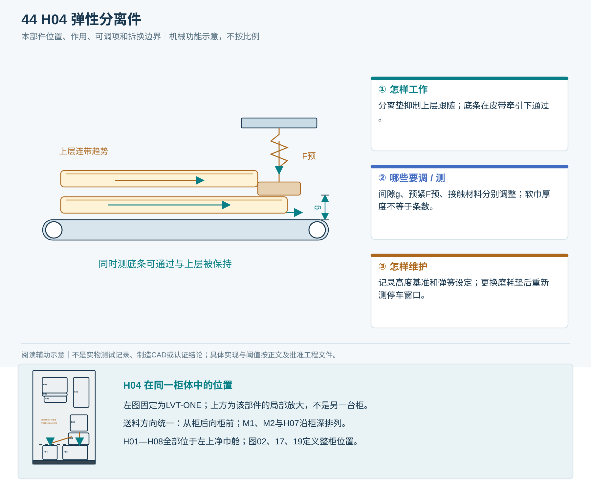

- **工作方式**：分离垫抑制上层跟随；底条在皮带牵引下通过。
- **需要确认**：间隙g、预紧F预、接触材料分别调整；软巾厚度不等于条数。
- **拆换维护**：记录高度基准和弹簧设定；更换磨耗垫后重新测停车窗口。

- **复装与放行**：更换分离垫或预紧后重做最薄／最厚、满仓／近空验证；底条过不去或上条跟随均不合格，回到D03/D04重定窗口。

### H05｜过渡板与剥离件

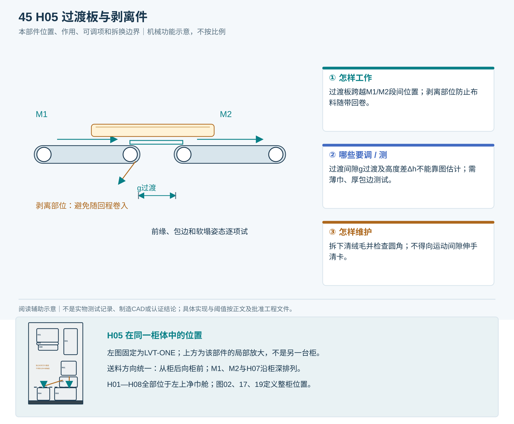

- **工作方式**：过渡板跨越M1/M2段间位置；剥离部位防止布料随带回卷。
- **需要确认**：过渡间隙g过渡及高度差Δh不能靠图估计；需薄巾、厚包边测试。
- **拆换维护**：拆下清绒毛并检查圆角；不得向运动间隙伸手清卡。

- **复装与放行**：复装核过渡间隙、高差和剥离方向；以前缘、包边、软塌姿态验证，卷入立即停机，人工清场后重测。

### H06｜M2接料与受控定位

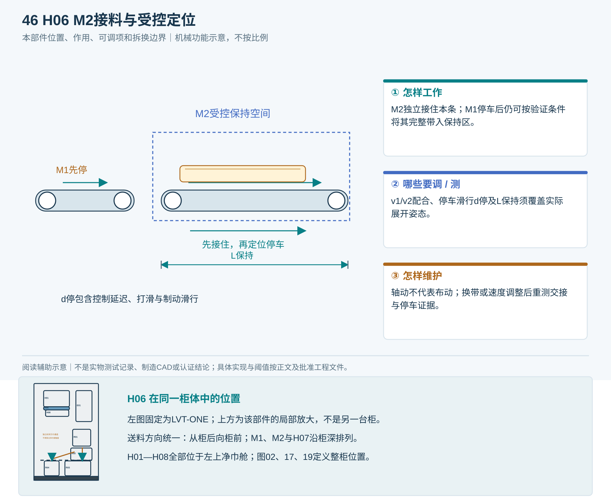

- **工作方式**：M2独立接住本条；M1停车后仍可按验证条件将其完整带入保持区。
- **需要确认**：v1/v2配合、停车滑行d停及L保持须覆盖实际展开姿态。
- **拆换维护**：轴动不代表布动；换带或速度调整后重测交接与停车证据。

- **复装与放行**：复装验证接料、停止位置、许可等待与断电滑行；未能保持整条受控则禁止释放，返回保持机构整改。

### H07｜身份保持与释放件

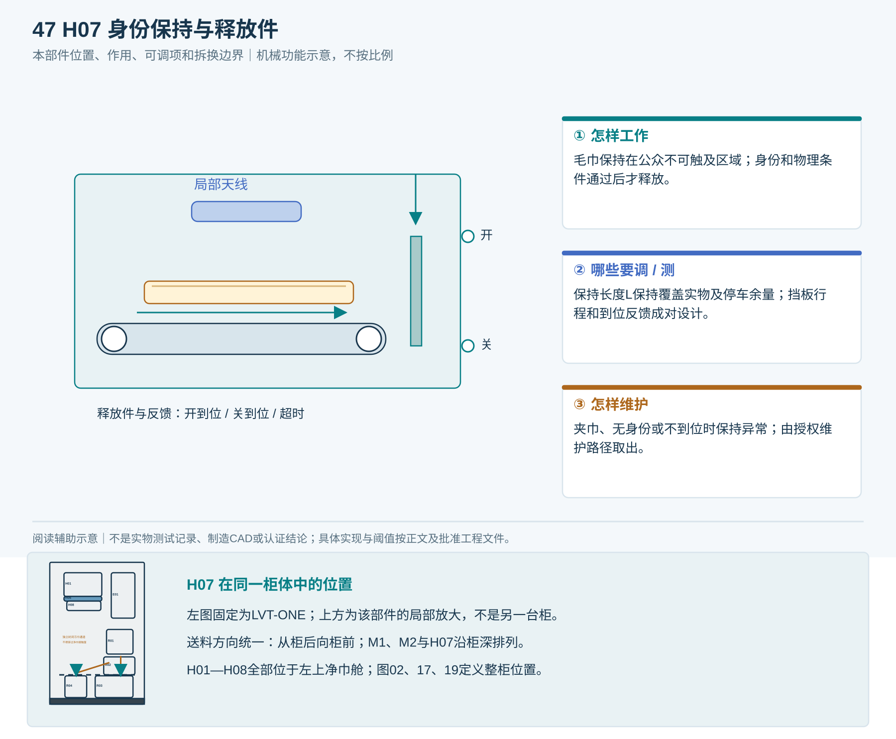

- **工作方式**：毛巾保持在公众不可触及区域；身份和物理条件通过后才释放。
- **需要确认**：保持长度L保持覆盖实物及停车余量；挡板行程和到位反馈成对设计。
- **拆换维护**：夹巾、无身份或不到位时保持异常；由授权维护路径取出。

- **复装与放行**：复装点检开关反馈、无许可不释放及失电状态；任何反馈矛盾保留原任务，维修与平台对账均完成后恢复。

### H08｜固定隔离与取物斗

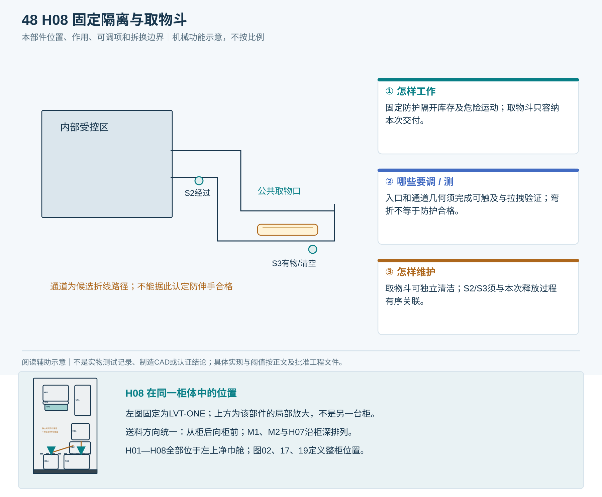

- **工作方式**：固定防护隔开库存及危险运动；取物斗只容纳本次交付。
- **需要确认**：入口和通道几何须完成可触及与拉拽验证；弯折不等于防护合格。
- **拆换维护**：取物斗可独立清洁；S2/S3须与本次释放过程有序关联。

- **复装与放行**：改变通道或取物斗后重做防伸手／拉拽与S2/S3时序测试；公共口有残留物不接新任务，卫生处理后再核清场。

### H09｜机架传动腔与检修

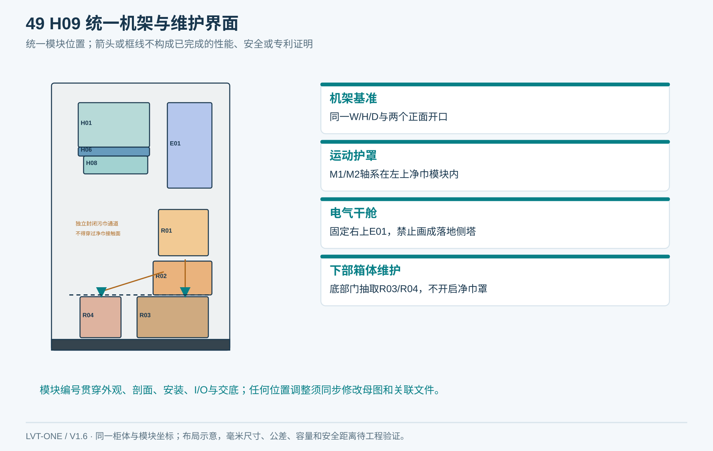

- **工作方式**：刚性机架保持轴系位置；传动和电气维护空间与净污路径分开。
- **需要确认**：安装基准A、轴线平行度、紧固与检修净距均由工程图定义。
- **拆换维护**：拆护罩前隔离能源；换件后检查线束、防护、紧固和任务清场。

- **复装与放行**：复装核机架固定、护罩、线束应力及净污隔离；移动后重做现场安装检查，工程签核与任务对账完成后恢复。

## 2. 电机如何把毛巾送出来

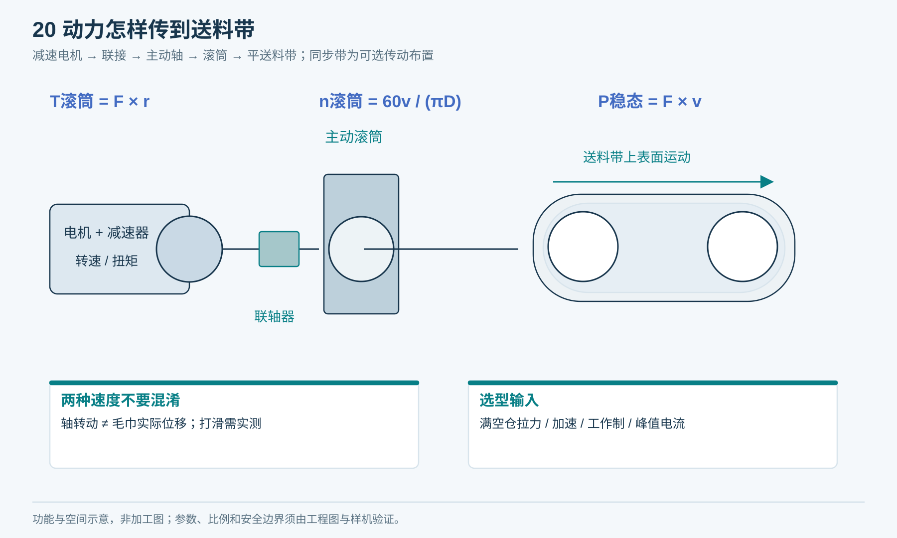

动力顺序：驱动器供电 → 电机转动 → 减速器降速增扭 → 联轴器或同步带传到主动轴 → 主动滚筒带动平送料带 → 皮带摩擦接触毛巾。

同步带是两轴之间的传动件；平送料带是碰到毛巾的搬运件，两者不是同一条带。优先比较减速电机与滚筒同轴联接；布置不允许时再加同步带轮和张紧、护罩。

图中零件不按真实轴线排列。机械厂须交付轴系剖面、轴承定位、轴端连接、紧固防松、皮带预紧和检修空间。电机输出轴允许的径向载荷与滚筒所需支撑也要核对，不能用电机轴直接承受未经计算的张紧力。

<!-- figure-20 -->
### 图20｜动力怎样传到送料带

*功能图将轴系分开展示，非真实装配投影。电机轴载荷、轴承支撑、联轴器与张紧按实际图纸核算；公式不替代动态选型。*

## 3. 单条分离的关键矛盾

皮带牵引底层时，上层会通过摩擦和纤维勾连一起移动。分离件需要留住上层，又不能将底条压死。提高电机扭矩只能增加驱动力，不能保证只出一条。

近似关系：有效牵引能力受 μ×N 限制；实际拉出阻力包括层间、底托、分离件、弯折等。软布的μ与受压、潮气、洗涤、速度有关，只能作为测量分析线索。

固定出口缝隙不能作为可靠条数判断：一条蓬松厚巾可能比两条压紧薄巾更厚。首轮保留分离件高度、预紧、材料、底托支撑比例和叠高的独立调节。

## 4. 什么时候停M1：必须验证的核心

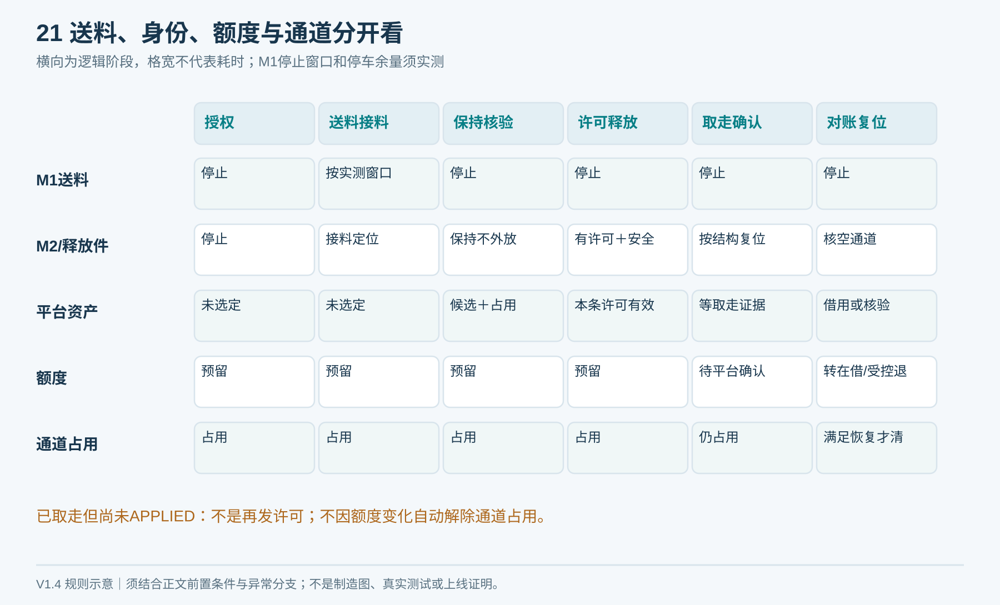

> M1停机触发以实测有效窗口为准；本图统一为当前动作时序，不再显示旧的另一套送料机构。

1. M1开始推送，M2按接近速度接料，S1记录前缘通过。
2. 根据实际位置／通过时序识别本条交接过程，M2保持牵引；不能只等固定秒数。
3. 在本条已被接住、后条仍被保持的有效窗口内停止M1；实测滑行和后条位移。
4. M2将本条完整带入受控区并停车，检查通道状态，读取身份。
5. 将本条身份与保持证据交平台核准，取得并落盘本任务有效ReleasePermit，再确认后方隔离及本地释放路径安全，才放到取物斗；公共可触及时危险动作已停止或被可靠隔离。

**S1尾缘、编码器、RFID、电流任何一个信号，都不能单独证明后面没有重叠跟随。** 台架必须用逐次录像和实际条数真值找出可用停车窗口；若两条重叠时信号不可区分，需改机械分离或采用经验证的附加检测，而非假定软件可以识别。

**长度闭合要求：** H06保持有效长度必须大于实物在运动中可能展开的最大长度、停车距离和定位余量之和；H01/M1占用长度、H05过渡、H06/H07、H08、防护和前后板厚一起纳入D柜深校核。装不下则当前总装不通过，统一调整母图、外形与全部关联视图后重审，不能只拉长某张剖面。

先分别测：本条前缘到M2稳定接住的时间、本条尾缘脱离位置、后条开始移动时刻、停机滑行距离。若在规格全范围内不存在稳定窗口，G1不通过，转方案对比。

<!-- figure-19 -->
### 图19｜净巾机构剖面与受控保持段

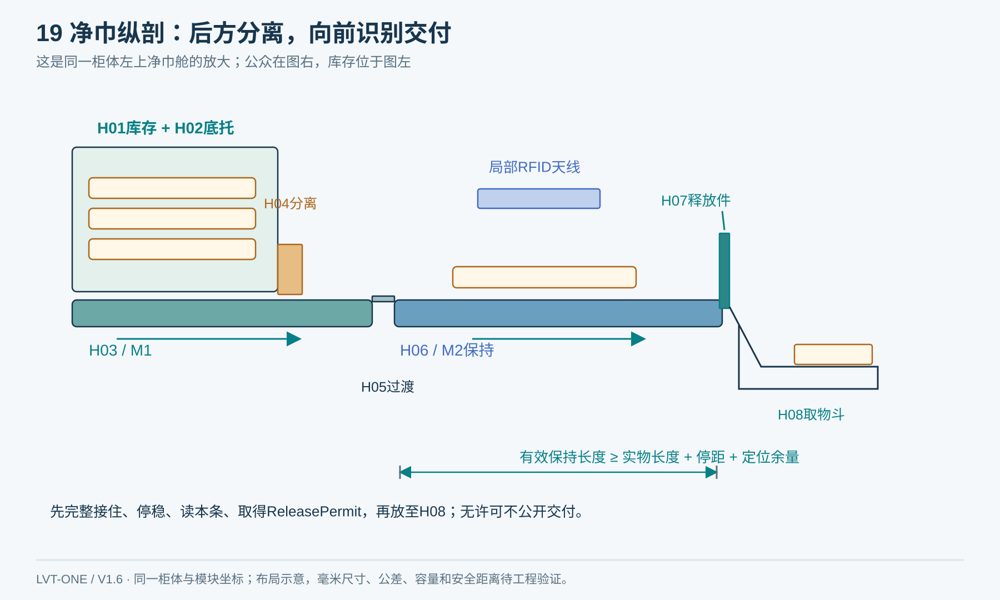

*沿柜深后→前，与图02纵剖方向一致；禁止将整条输送线横向摆进柜宽。*

**供料失败的出口：** 满仓／有库存却未出现预期S1过程，记供料失败而非自动扣减为“库存为空”；空仓须有独立库存及物体证据。连带、多条、传感器矛盾或超过批准运动窗口均停在可控位置，不通过再次启动M1试运气。确认未交付还须清场、原许可终止／封禁及平台结论；物体结果不明则由维护人员接管原任务。

## 5. 读区和出口不是画个框就够

> **读图前置条件（V1.4）：** 本节既有动作图展示机械阶段；“核验通过”在当前版本包括平台本条ReleasePermit。未获得许可不得公开释放。

读区有效长度需要容纳实际输送状态下的整条物体、定位误差和停车余量。初估停车距离可用 `d≈v×控制延迟+v²/(2a)`，但制动减速度、打滑、软布变形和掉电滑行必须实测；不能把公式当验收。

H07要在无有效身份时阻止物体进入公共区。挡板关闭时不能硬夹毛巾；需要位置反馈、异常保持和维护取出路径。

H08统一采用固定隔离取物斗，H07为内部受控释放件；公众不能打开库存门。廉价不等于“弯一下即可防伸手”。按最终适用安全评估方法验证可触及、拉拽、工具探入、夹点与维护开口。

本产品没有另一套“双门领巾外观”。固定口袋、内侧释放件和防触及护罩必须作为一个总成验证：失电、拉拽和反馈异常不得形成直通库存的路径。

<!-- figure-21 -->
### 图21｜单条发放动作时序

*此图是一种候选控制顺序。高电平色块代表“该阶段允许/可能动作”，不表示精确波形；S3须稳定判定，额度与通道各自按业务结果及机械复位释放。*

**闭环约束（V1.4复核）**

保持位置必须能等待平台ConfirmHeldAsset核验并返回ReleasePermit。未获本条许可，M2／释放件不得把本条送到公众区；未取得有效许可或释放开始前许可已过期则安全保持；断网前已持久化且仍有效的本条许可，仅允许原任务依安全条件继续，不能领取新任务，不能借重试再次启动M1。许可有效后仍由本地防护决定能否动作，云端不能越过互锁。具体保持失电行为、最大等待及清场按结构实测冻结。

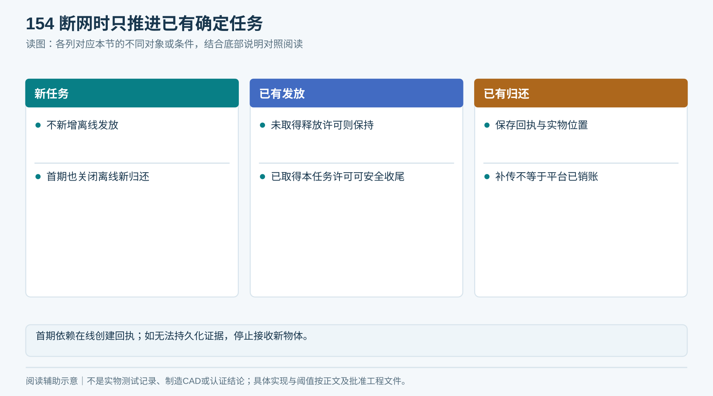

*首期依赖在线创建回执；如无法持久化证据，停止接收新物体。*

**当前动作图的读法：** 图21说明两段动力分工；M1停车窗口须覆盖连带与滑行。身份绑定统一按图27：平台本条许可 → 释放 → 取走证据 → 平台提交借用。旧图05/07已撤出当前图册。

## 6. 电机计算示例：不作为采购规格

| 假设量 | 演示计算 |
|---|---|
| 实测所需拉力暂假设20N；滚筒半径0.02m | 滚筒负载扭矩0.40N·m |
| 1:1后级传动效率假设0.8 | 减速器稳态输出需求0.50N·m，尚未加其他负载 |
| 演示裕量2 | 约1.0N·m仅供初选比较，实际需算加速及工作制 |
| 带速0.10m/s；直径0.04m | 转速约47.7rpm |
| 匀速行程0.30m | 理想输送3秒，不含识别和门动作 |

额定扭矩、峰值扭矩、堵转扭矩不能混用。`F×v=2W`不表示2W电机足够。采购前补齐转动惯量、启动加速、频繁启停、满仓拉力、减速器效率、热平衡及电源峰值。方法参考[电机计算资料](https://www.orientalmotor.com/products/pdfs/2012-2013/G/usa_tech_calculation.pdf)，链接本轮未重新全文核验。

<!-- module-figure-64 -->
**子模块图｜电机选型计算链**

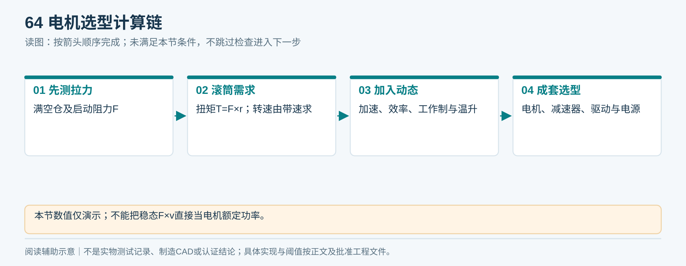

*读图说明：本节数值仅演示；不能把稳态F×v直接当电机额定功率。*

## 7. 可制造性清单

结构工程师交付：整机总装、各模块装配、轴系剖面、钣金展开、关键尺寸公差、材料和表面处理、紧固件、门铰链及限位、装配顺序、线缆空间、清洁与换件步骤。

特别标注：M1/M2中心距与平行度、滚筒包角、过渡间隙、分离件调节范围和基准、标签经过位置、最低／最高库存边界、运输锁定方式。每项有图纸编号和版本，由整机集成方统一审图。

<!-- module-figure-65 -->
**子模块图｜机械图纸应交付哪些界面**

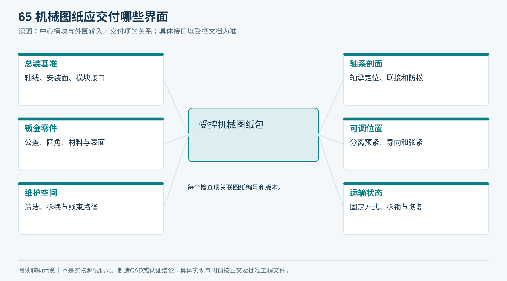

*读图说明：每个检查项关联图纸编号和版本。*

## 8. 失效分析

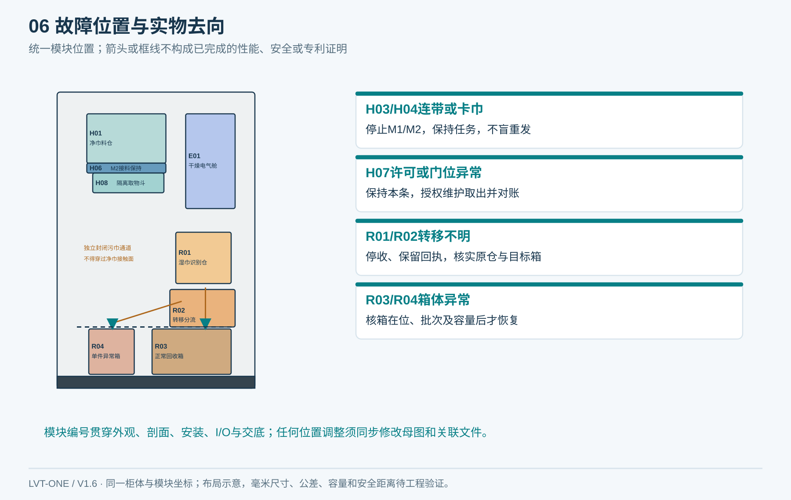

本图故障位置与统一模块编号相对应。连带看后条实际位移；打滑看毛巾与轴的相对运动；卷边检查过渡和包边；跑偏核对轴平行与张紧。

卡巾首期进入受控停机、隔离能源、授权人工清理。未验证安全性前不远程反转、不连续自动重试。清卡之后还要核对任务、通道物体和毛巾身份，不能只按“电机又能转”恢复业务。

**闭环约束（V1.4复核）**

清卡后的物体须有身份／unknownItemRef、原任务、实际去向和保管人；暴露物转卫生处理。维修完成仅恢复机械条件；平台结论、事件对账和安全复验全部完成后才解锁业务。

*旧项目事件只入原任务审计与受控对账，不能当成新项目操作。*

