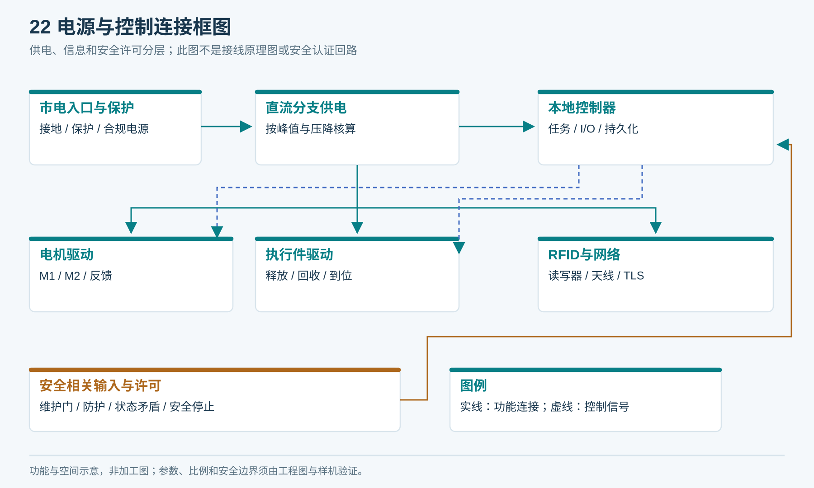
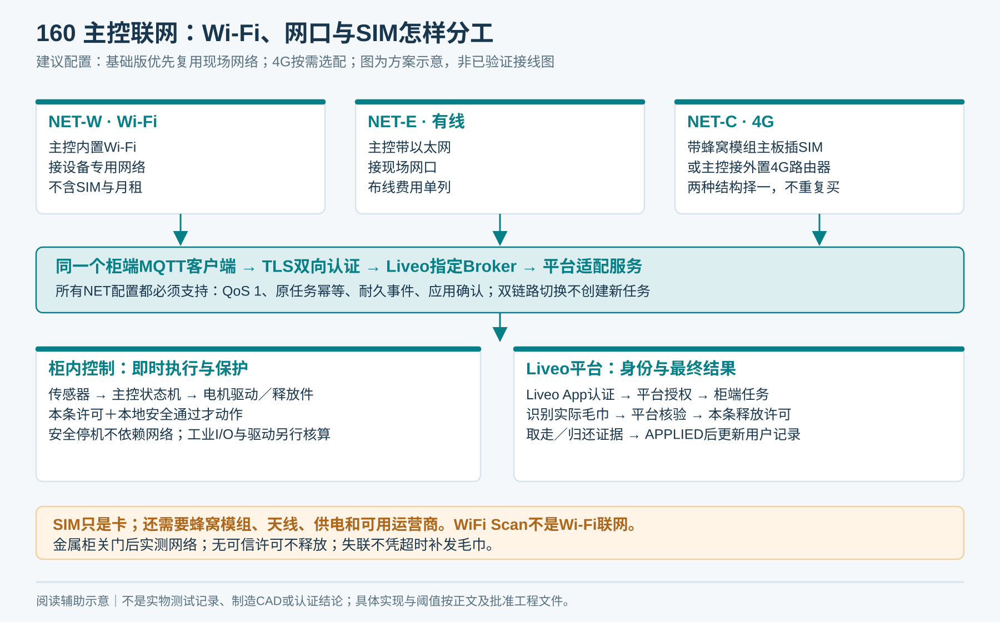
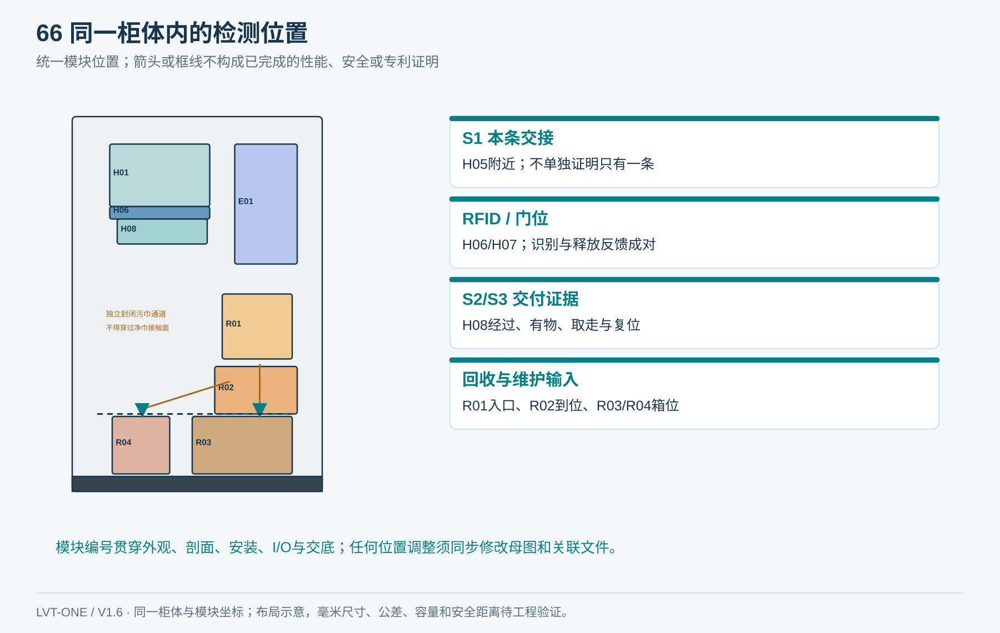
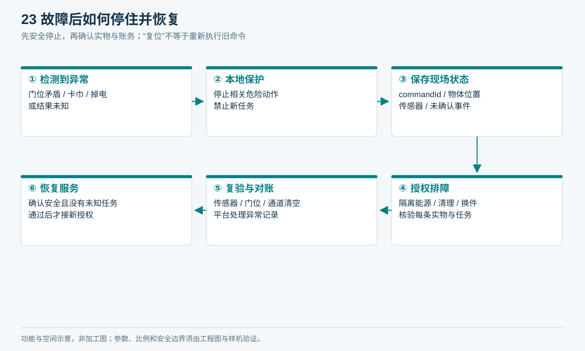
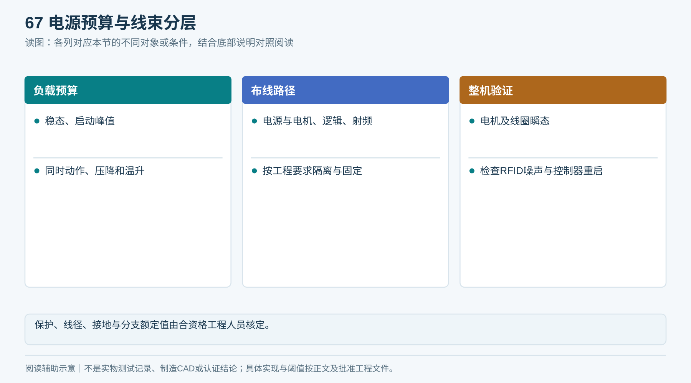
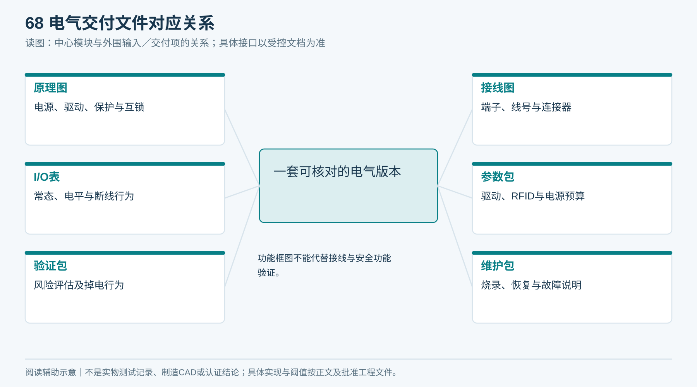

# 05｜电气控制与安全设计

**单一产品基线 V1.6：** 本章采用同一台柜：左上领巾、右下归还、上右独立电气舱、下部两只独立回收抽箱；净巾沿柜深从后向前送料。所有整体视图由[统一布局源](统一设计源/单一产品布局.json)和[图形一致性说明](统一设计源/单一产品说明.md)约束。

状态：电气需求与I/O功能定义；不是可直接接线的原理图。整机设计单位应按目标市场和风险评估确定保护等级及适用标准。

## 1. 电源与控制分层

市电入口 → 隔离／过流等配套保护 → 合规电源 → 按执行件、RFID、控制器分支供电。

24V直流仅为执行件询价候选；电机、门执行件、驱动器、传感器电平与电源必须成套核对。控制器GPIO不能直接带电机或电磁执行件。

本地运动与安全逻辑处理门位、异常停车和恢复；联网任务层处理授权、业务状态和补传。普通应用软件或普通限位开关不自动构成经过验证的安全系统。

<!-- figure-22 -->
### 图22｜电源与控制连接框图

*供电分支、熔断/过流、线径、电平、针脚与安全回路由电气图定义。24V仅为原文询价候选；普通I/O不自动构成安全功能。*

**闭环约束（V1.4复核）**

平台释放许可属于业务准入，本地保护属于动作准入，两者必须同时成立。断网不新增领还；已有净巾任务未有许可只能保持，已有回收任务保存位置和证据；存储不可写停止新接收。平台不能通过强制状态覆盖本地安全反馈。

### 主控板候选：Wi‑Fi 和 SIM 必须分开看（V1.5）

**推荐打样顺序：先用微雪 ESP32-S3-ETH-8DI-8RO 做电控台架；用乐鑫 ESP32-S3-DevKitC-1 做低成本定制板的开发参考；现场没有可用网络时，再验证带 SIM 的版本。这里是候选路线，不是已批准采购清单。** Wi‑Fi 是联网方式；SIM 卡需要配合蜂窝通信模组和天线；MQTT 是联网后与平台交换消息的协议，三者不是同一级概念。

| 编号／厂家与型号 | Wi‑Fi／网口 | SIM／4G | MQTT能力与缺口 | 适用阶段与采购边界 |
|---|---|---|---|---|
| MC01 微雪 Waveshare：ESP32-S3-ETH-8DI-8RO | 板载2.4GHz Wi‑Fi、以太网 | 本板没有蜂窝模组；需另配4G路由器，通过网口接入 | 厂家有MQTT示例；须改为满足本项目TLS、QoS 1、耐久记录和业务确认的固件 | 电控台架优先候选；8DI、8继电器、隔离RS485，7—36V输入；点数和编码器接口须另算，不能当作整柜即插即用控制器 |
| MC02 微雪：ESP32-S3-SIM7670G-4G-EN | 板载2.4GHz Wi‑Fi；不视为自带有线网口 | 板载SIM7670G LTE Cat.1，使用SIM与配套天线 | 有蜂窝通信／MQTT开发资料；TLS认证和项目固件仍须开发验证 | Wi‑Fi＋4G通信台架候选；不自带整柜工业隔离I/O及电机驱动；相机、太阳能等外围不属于柜体必需配置 |
| MC03 乐鑫 Espressif：ESP32-S3-DevKitC-1 | 板载Wi‑Fi；网口需扩展 | 无板载蜂窝通信及SIM接口 | 使用ESP-IDF＋ESP-MQTT开发MQTT/TLS、QoS 1；买板不等于买到本项目固件 | 低成本自研控制板的开发参考；量产要增加隔离、驱动、保护、连接器及存储设计，并计开发和验证费用 |
| MC04 上海合宙：Air780EPM核心板／开发板 | 不把WiFi Scan当成Wi‑Fi联网；Wi‑Fi联网需外部适配 | 4G Cat.1路线；订货必须明确核心板版本、SIM座、电平和天线 | LuatOS有MQTT及单／双向证书例程；逻辑仍需开发 | 国内台架备选；新加坡现场频段、运营商、证书未核定，暂不能作为海外量产定版 |

官方依据（核对日期2026-09-16）：[MC01规格与例程](https://www.waveshare.com/wiki/ESP32-S3-ETH-8DI-8RO)、[MC01中文例程](https://docs.waveshare.net/ESP32-S3-ETH-8DI-8RO/Arduino/)、[MC02产品页](https://www.waveshare.com/product/esp32-s3-sim7670g-4g.htm)、[MC02开发资料](https://docs.waveshare.net/ESP32-S3-SIM7670G-4G/)、[MC03官方开发板说明](https://docs.espressif.com/projects/esp-dev-kits/en/latest/esp32s3/esp32-s3-devkitc-1/)、[MC04官方资料](https://docs.openluat.com/air780epm/product/)、[MC04 MQTT证书例程](https://docs.openluat.com/air780epm/luatos/app/socket/mqtt/)。官网入口用于核规格与索样；本轮未取得上述四款的可核实1688官方商品页，不以其他型号代替。价格、库存、交期均未报价。

**为什么不能直接照抄示例：** 微雪Arduino例程列出的PubSubClient 2.8仅支持QoS 0发布，不能满足本项目关键事件QoS 1上报要求。ESP32方案建议改用ESP-MQTT，并自己实现耐久事件队列。库的内存outbox不等于断电保存；微雪演示云已停止维护，也不能作为Liveo正式依赖。依据：[PubSubClient维护方说明](https://github.com/knolleary/pubsubclient)、[ESP-MQTT官方说明](https://docs.espressif.com/projects/esp-mqtt/en/latest/esp32/)。

### 联网配置与成本边界

| 配置 | 必需硬件 | SIM插在哪里 | 使用前提／成本 |
|---|---|---|---|
| NET-W 基础Wi‑Fi版 | MC01或MC03路线、合适天线、工业I/O与驱动 | 不配SIM | 有稳定的设备专用2.4GHz网络；不采用需要住户网页反复登录的访客Wi‑Fi。Wi‑Fi本身不产生SIM月租 |
| NET-E 有线版 | 带以太网主板＋现场网口、线缆 | 不配SIM | 现场已布线且费用合理时优先；布线施工单列报价 |
| NET-C 蜂窝版 | MC02路线，或NET-E主板＋外置4G路由器 | MC02板载卡座，或外置路由器卡座 | 无可用现场网络；需SIM、流量、APN、天线及运营商实测。两种结构择一报价，避免重复购买 |
| NET-D 双链路版（选配） | 已验证的Wi‑Fi／网口＋4G组合 | 同NET-C | 仅在停机成本能覆盖硬件、流量及维护增量时采用；切换期间只保留同一设备执行身份，不同时启动两套任务 |

首期成本建议为NET-W／NET-E；4G作为现场条件需要的选配，**不是默认每台都加SIM**。NET-D自动切换策略必须通过09章网络子用例才能交付。金属柜应验证外置天线位置、密封引出、馈线损耗和湿区隔离；不得把“全球频段”或“全网通”当成新加坡现场已可用的证明。

MQTT客户端在主控固件运行；外置4G路由器只提供IP网络，**不要求路由器代替主控维护领还业务状态**。RS485／UART／GPIO是柜内接口，不替代柜端到Liveo的MQTT。Liveo App仍通过平台接口操作，不能持有柜端证书直接发电机指令。

*图160：Wi‑Fi、有线、蜂窝是可选网络入口；MQTT/TLS及本地安全要求在每种配置下相同。*

**主板选型放行条件：** 先把本章S0—L1及所有执行反馈逐点落到T02/T06，列出普通DI、编码器高速输入、模拟电流采样、PWM／方向／使能和总线需求，再决定扩展板。MC01的8个DI不能据此认定足够；继电器不用于高频PWM，也不能不经额定值核算直接承担电机正反转。安全停机回路独立于MQTT、Wi‑Fi、4G和上位平台。样机先核整套电控成本，不能只比裸板价格。

## 2. I/O定义

| 名称 | 用途 | 不足与失效处理 |
|---|---|---|
| S0维护门 | 维护入口状态 | 失效不得让自动动作获得许可；是否采用监测回路由风险评估确定 |
| S1分离出口 | 前／尾缘通过检测 | 卡常亮常灭、绒毛遮挡进入故障；不是条数真值 |
| S2释放通道 | 物体经过出口 | 必须与释放指令及S3有序关联 |
| S3取物斗 | 有物及取走检测 | 故障不能直接置为已取走；手或光照误触要验证 |
| G1/G2反馈 | 释放件开／关到位 | 命令与反馈分开；矛盾或超时停发 |
| E1/E2 | 编码器或运动反馈（按方案） | 轴动不代表布动，作为异常诊断辅助 |
| I1/I2 | 电机电流采集（按方案） | 需测基线及限值，不能直接计条数 |
| R0/R1 | 回收入口与转移件状态 | 防止入口与下游形成可回掏通路 |
| R2/R3 | 回收转移与接收检测 | 排除卡在门上却销账 |
| B1/B2 | 正常／异常容器在位和满载 | 缺箱或满箱禁止相关路由 |
| L1 | 可能积液位置监测（按环境） | 报警并隔离受影响模块，不能只静音继续运行 |

针脚、电平、上拉、常态、断线行为、线号和连接器不能由本表推断；交付时填写[接线与I/O表](执行表单/T06_IO与接线核验.md)。

<!-- module-figure-66 -->
**子模块图｜I_O逐点位置与作用**

*引用同一产品布局；模块位置与图02、图17一致。*

## 3. 每种失效的预期行为

| 事件 | 必须达到的系统行为 | 恢复条件 |
|---|---|---|
| 市电消失 | 危险运动进入设计的安全状态；库存不能意外对外释放 | 本地重启核对门位、物体和未完成任务 |
| CPU死机／看门狗 | 驱动许可失效；不自动重复上一动作 | 自检和任务核对通过 |
| 网络失联 | 不接新领还；已有任务依许可及本地安全边界收尾 | 事件补传、平台对账完成 |
| 维护门打开 | 禁止自动危险动作；保留业务证据 | 维护结束、门位正常、授权复位 |
| 电机堵转／驱动异常 | 停相关动作，锁定通道 | 排障并核对实物，不盲目反转 |
| 释放件不到位 | 不转成已交付，不接下一任务 | 排障及物体定位明确 |
| 传感器矛盾 | 进入NEEDS_REVIEW | 校准和完整恢复检查 |
| 容器缺失／满载 | 回收不进入不可接收路径 | 换箱、登记和在位确认 |

“断电所有门打开”不作为方案：需要同时满足不夹人、不直通库存、不让湿巾泄漏的具体设计。每个执行件的弹簧、制动、重力运动及手动释放必须逐一论证。

<!-- figure-23 -->
### 图23｜故障后如何停住并恢复

*故障分类决定停机范围和执行件安全状态。不得把所有门打开、自动反转或自动重发作为通用恢复策略。*

**闭环约束（V1.4复核）**

断电恢复不自动续跑未知动作；读取持久化开始意图、取消封禁和原任务，结合实物判断。无法可信确认许可有效期或动作位置时进入待核验。固件回滚不能回滚执行历史；维修后还需平台核账和本地安全复位。

*旧项目事件只入原任务审计与受控对账，不能当成新项目操作。*

**安全动作与记录失效：** 网络或平台不得阻塞本地安全停止。存储故障时停止接新任务；已有动作优先按经验证的失电／安全策略停止或安全收尾，恢复后若缺失执行证据即转人工核验，不能因日志缺失推断未动作。电气安全评审及D05相关防护验证须覆盖安全链失效、控制重启和能量隔离，软件状态不能替代硬件风险评估。

## 4. 电源预算与布线交付

电气工程师填写各器件稳态、启动峰值、允许同时动作、限流、供电压降与温升。不能只把铭牌平均功率相加。电机干扰、门线圈瞬态、RFID电源噪声和控制器重启必须在整机同时动作时测试。

电源／电机线、逻辑线和射频馈线按工程要求走线；有应力释放、防磨边与可维护连接器。标注保护接地、金属件等电位连接、熔断／断路器额定值及替换规格。线径、保护器和接地方案由合资格工程人员核定。

<!-- module-figure-67 -->
**子模块图｜电源预算与线束分层**

*读图说明：保护、线径、接地与分支额定值由合资格工程人员核定。*

## 5. 必交电气文件

- 电气原理图、接线图、端子图和线束加工图。
- I/O表、驱动参数、射频配置、完整电源预算。
- 风险评估与安全功能验证方案、掉电／重启行为表。
- 元器件规格、合规证据、替代料验证要求。
- 固件烧录、版本读取、恢复、检修和故障码说明。

涉及市电和运动安全的检查由具备资格的人员执行；本包不提供绕过保护或带电排障步骤。

<!-- module-figure-68 -->
**子模块图｜电气交付文件对应关系**

*读图说明：功能框图不能代替接线与安全功能验证。*

