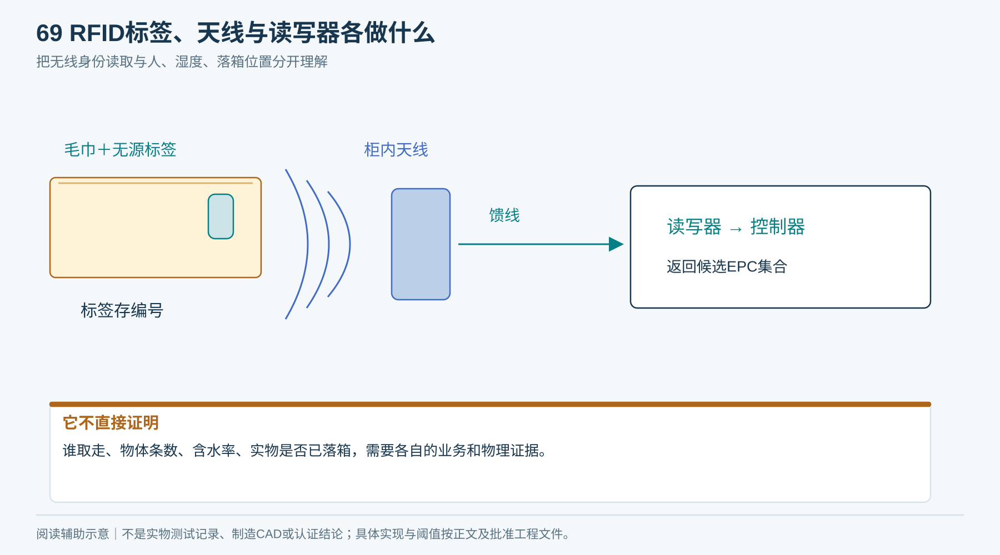
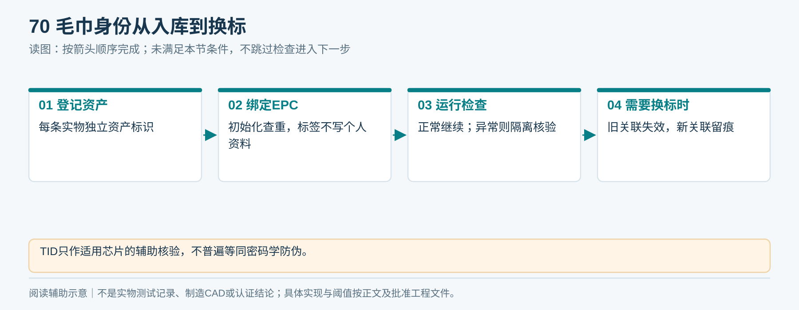
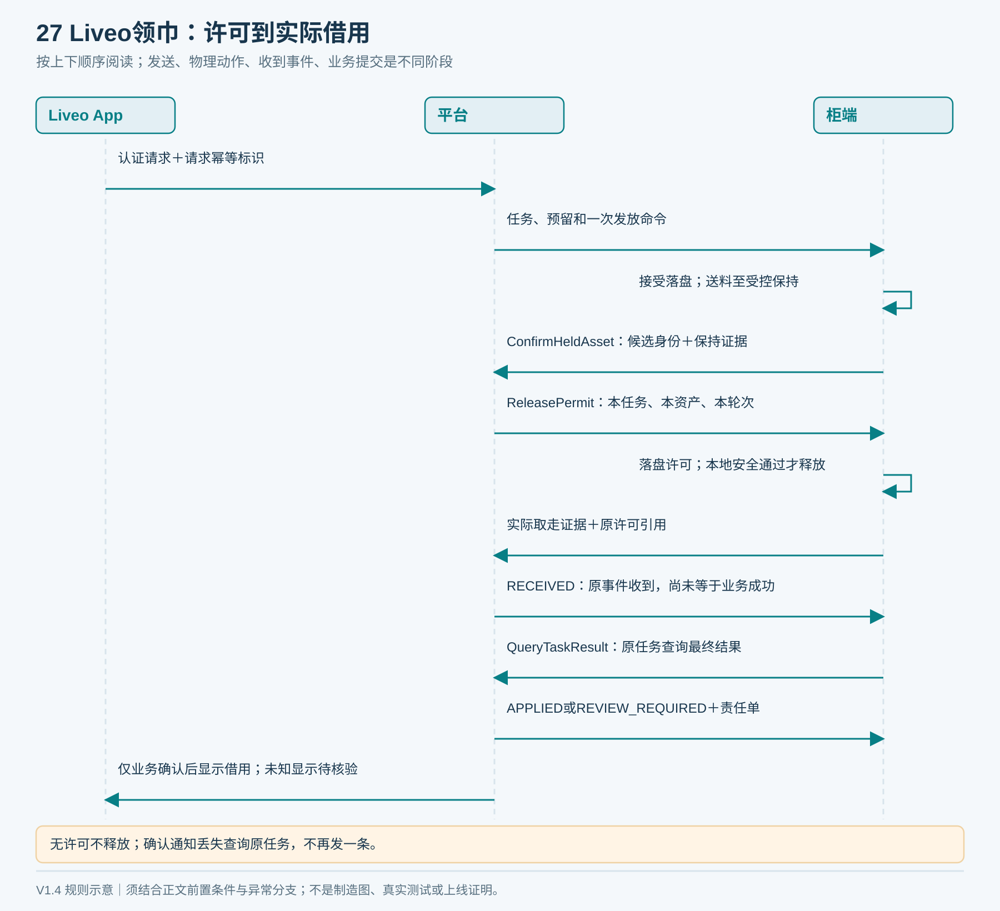
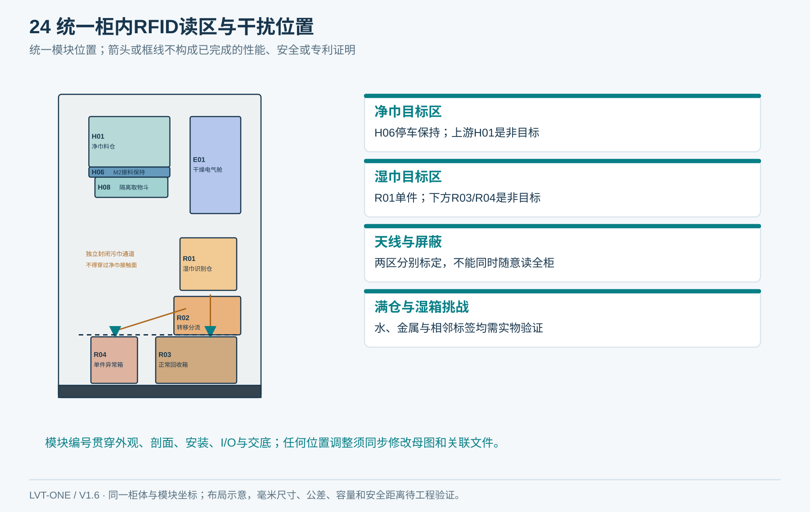
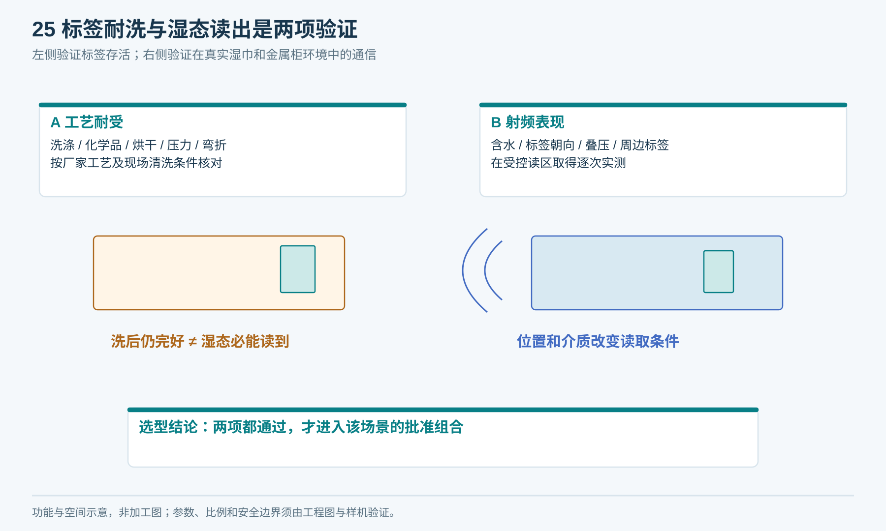
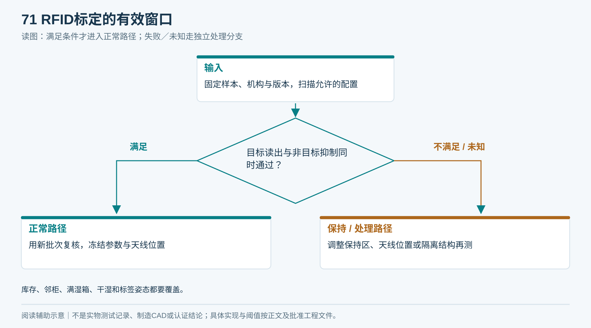

# 06｜RFID与毛巾身份验证

**单一产品基线 V1.6：** 本章采用同一台柜：左上领巾、右下归还、上右独立电气舱、下部两只独立回收抽箱；净巾沿柜深从后向前送料。所有整体视图由[统一布局源](统一设计源/单一产品布局.json)和[图形一致性说明](统一设计源/单一产品说明.md)约束。

## 1. 直观理解

RFID可以理解为毛巾上的“无线编号牌”：标签里存编号，柜内读写器通过天线读取。它用于识别是哪条毛巾；它不直接知道是谁拿走、毛巾有多湿或是否落进箱子。

无源UHF洗涤标签适合作为候选；最终频段、读区和标签组合必须按国内测试与新加坡部署分别验证。耐洗结构只说明封装与工艺耐受条件，不能代替湿态读性能。

水及高介电介质可引起UHF吸收、反射和天线失谐，位置与姿态也影响读距。因此不采用“整箱湿巾自然都能读全”的前提。[NXP天线应用资料，材料影响章节](https://www.nxp.com/docs/en/application-note/AN162910.pdf)

<!-- module-figure-69 -->
**子模块图｜RFID部件如何协作**

*读图说明：RFID用于识别标签身份；标签耐受与湿态读性能是不同问题。*

## 2. 身份规则

- 每条毛巾登记独立资产标识，与标签EPC关联；初始化查重。
- 不将住户姓名、Unit、电话写入毛巾标签；住户关系保留在平台任务中。
- TID可作为某些芯片的辅助核验信息，不能普遍当作密码学防伪。
- 标签脱落、读不到、重复EPC或身份冲突均转隔离；不凭最近一次读数猜测本条身份。
- 可比较增加耐洗可视编号，用于工作人员人工对账；不是未经验证的自动光学替代方案。
- 换标应使旧关联失效并留痕，不能让同一资产同时存在两个有效身份。

<!-- module-figure-70 -->
**子模块图｜毛巾身份从入库到换标**

*读图说明：TID只作适用芯片的辅助核验，不普遍等同密码学防伪。*

**闭环约束（V1.4复核）**

EPC只标识毛巾候选身份。资产还必须有有效卫生状态、位置／装载批次、活动借用轮次和冻结情况；换标保留资产与借用历史，旧EPC失效。未知物体先用独立编号追踪，不得猜测它属于某个住户。

**换标交接：** 暂停该资产新发放，核对实物与原资产标识，保留旧EPC历史并撤销旧标的当前准入；新标与同一资产建立受控关联。若仍有活动借用／归还，先保留原轮次的历史身份映射完成核验，不新建第二条资产消除差异。无法证明实物身份时隔离，由资产负责人决定调查或报废。

## 3. 发放读区

> 历史概念图07：读标仅得候选身份；正式顺序是取得本条平台许可、实际交付并由平台确认借用，见图27。

图示不同位置表示流程阶段；虚线仅为读区概念边界，不是绝对射频隔离。当前任务先由平台授权，再读取本条；无需预先为每个住户分配一条固定毛巾。

读取前保持物体位置，库存与湿巾箱分别远离或采用经验证的隔离结构。调节天线位置、角度、极化和发射配置，逐步取得稳定工作窗口。四根天线、提高功率或软件过滤都不能承诺消除串读。

释放条件包括：当前通道任务唯一、候选EPC合法且唯一、资产状态允许、机械过程符合验证条件、后方隔离和出口安全。单EPC不是条数证明。

<!-- figure-24 -->
### 图24｜局部读区与串读挑战

*引用同一产品布局；模块位置与图02、图17一致。*

**闭环约束（V1.4复核）**

本条保持后平台原子核对清单归属、QC、资产轮次及其他活动占用，才发一次性ReleasePermit；参数绑定任务／设备／通道／EPC／轮次／归属版本。仅读到一个EPC既不证明单条，也不证明该资产可借。断网前未取得许可则不得公开释放。

## 4. 选品必须索要的数据

| 标签 | 读写器／天线 |
|---|---|
| 具体料号、芯片、尺寸、安装方式 | 精确型号、地区频段、天线端口与连接器 |
| 洗涤次数对应的温度／时间／化学条件 | 功率范围与配置锁定，完整SDK／协议 |
| 烘干、熨烫、压力、弯折限制 | RSSI等诊断字段的定义与限制 |
| 热压／缝制工艺及标签禁缝区 | Linux／控制器接口、授权费用、离线使用 |
| 湿态和不同折向原始测试 | 多标签、邻柜、金属柜实测与合规资料 |

厂家宣称“200次洗涤”不能直接写成我们的寿命保证。验证使用现场实际洗涤流程；50次初筛不等于200次寿命证明。

<!-- figure-25 -->
### 图25｜标签耐洗与湿态读出是两项验证

*蓝色毛巾仅表示湿态，不代表含水率的数值。RSSI或响应时间不能直接当湿度计；图中没有承诺特定标签型号的湿读性能。*

## 5. 标定与挑战测试

1. 固定机构、标签位置和软件版本，记录天线、馈线和配置版本。
2. 以空仓、满库存、邻柜、湿箱满载分别测试目标标签和周围非目标标签。
3. 每个样本覆盖标签朝向、包边位置、干／潮／湿状态与洗涤阶段。
4. 扫描批准频段内允许的功率和天线方案，找同时满足目标读取与非目标抑制的窗口。
5. 无窗口时改位置、保持区或隔离结构，不无限加功率。
6. 用新批样本复核，将通过参数固化；换天线、馈线、标签或结构后评估重新标定。

国内900MHz RFID规定指定920–925MHz，并于2024年11月1日起施行；设备使用与型号等要求按原文核验。[工信部规定](https://www.miit.gov.cn/zwgk/zcwj/wjfb/tz/art/2024/art_4765b439c05049bdb64df80f744b4f22.html)

新加坡部署须按具体射频配置、设备类别和IMDA技术规范核对适用注册路径；不能用国内测试配置或模块证书直接宣布整机合规。[IMDA设备注册指南](https://iris.imda.gov.sg/guide/equipment-registration-guide)

<!-- module-figure-71 -->
**子模块图｜RFID标定的有效窗口**

*读图说明：库存、邻柜、满湿箱、干湿和标签姿态都要覆盖。*

