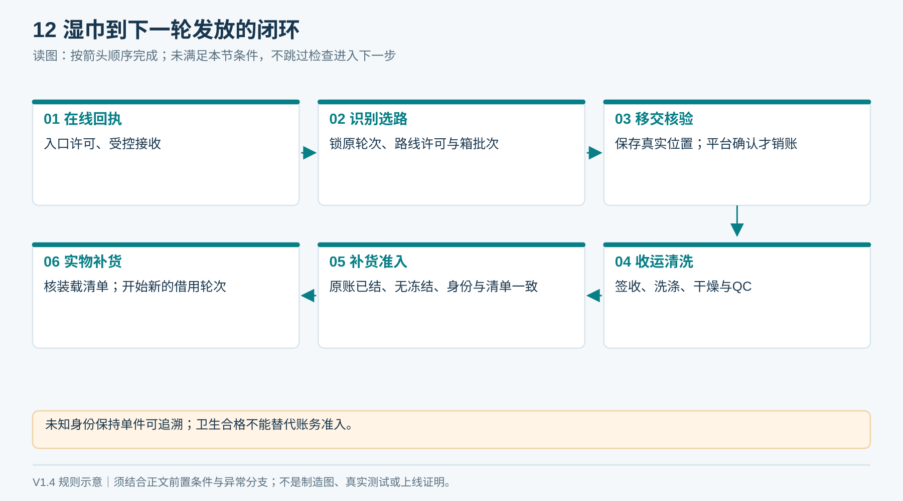
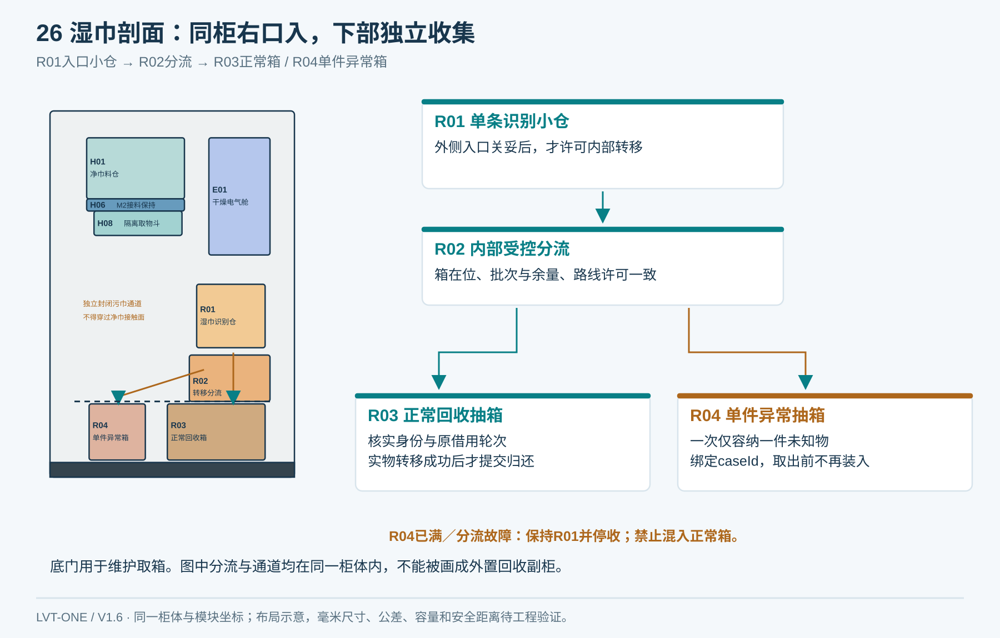
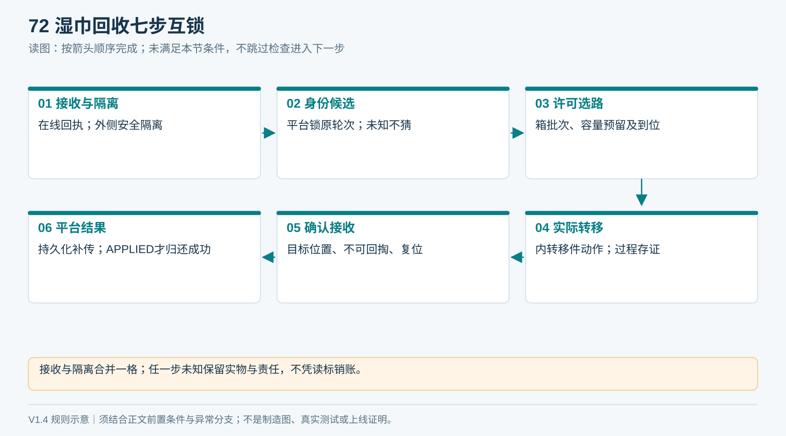
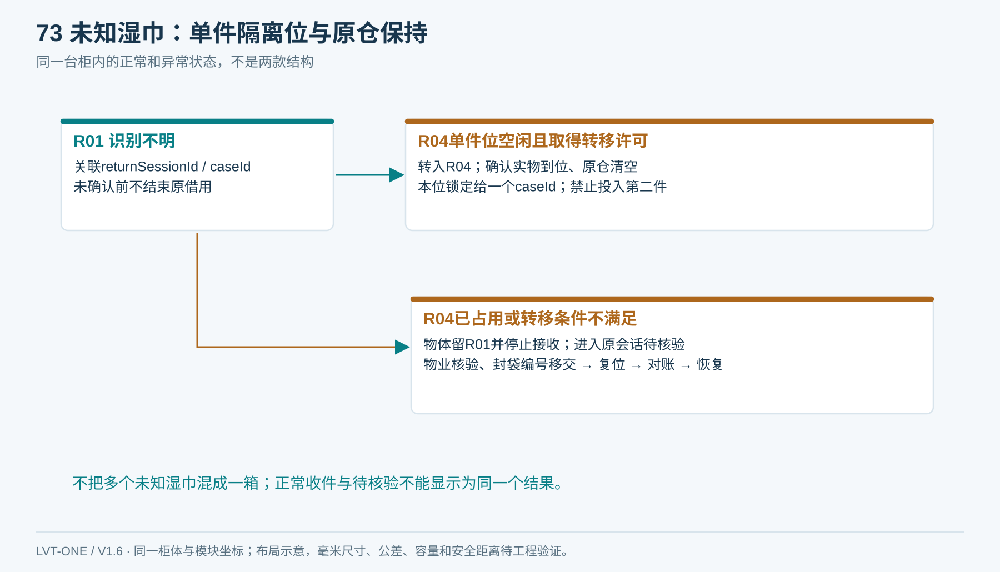
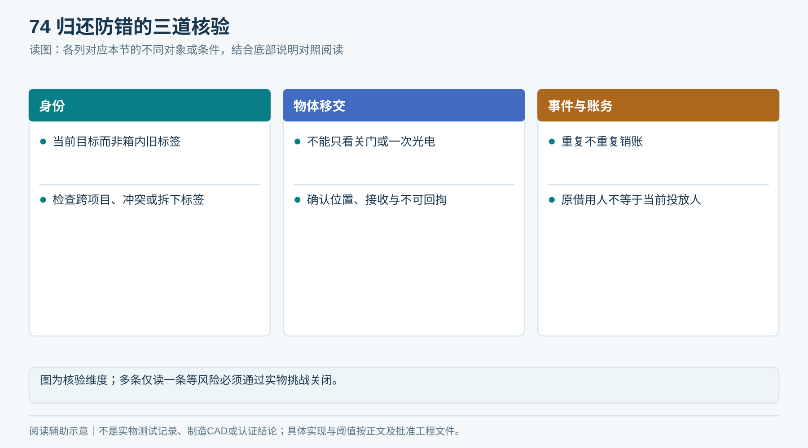
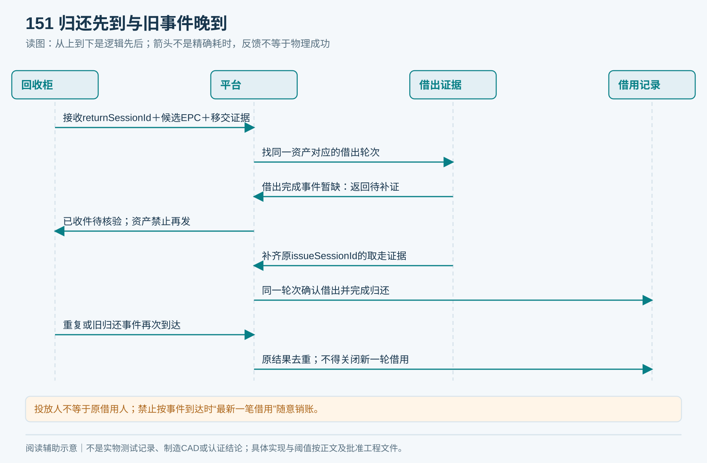
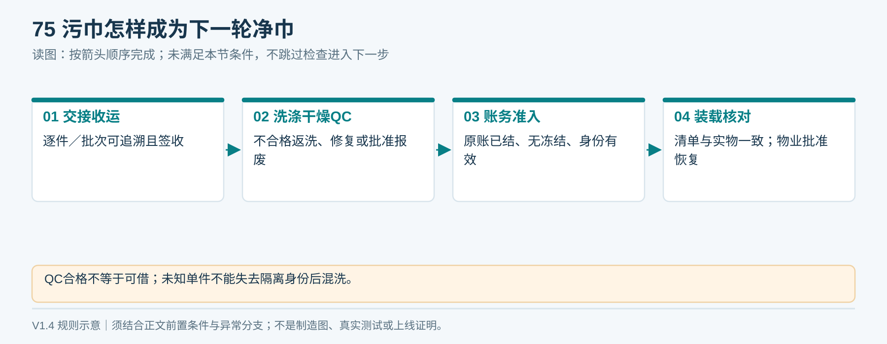

# 07｜湿巾归还与洗涤闭环

**单一产品基线 V1.6：** 本章采用同一台柜：左上领巾、右下归还、上右独立电气舱、下部两只独立回收抽箱；净巾沿柜深从后向前送料。所有整体视图由[统一布局源](统一设计源/单一产品布局.json)和[图形一致性说明](统一设计源/单一产品说明.md)约束。

## 1. 回收小仓的实际作用

> **读图前置条件（V1.4）：** 本节旧图的“可接收条件”包含在线回执；进入补货前还须原借用已结、无冻结及装载清单核对。

住户一次放一条进入小仓，系统先关闭外侧访问路径，再核验毛巾身份并将实物转移到回收容器。小仓的作用是控制物体位置、减少周围标签影响、确认实物移交；并不保证湿态RFID必然成功。

回收不使用净巾输送带反转，净／污接触面、箱体和维护工具分开。湿箱积液、渗漏、异味与清洁方式应纳入现场环境及材料设计。

<!-- figure-26 -->
### 图26｜湿巾回收小仓剖面

*确定正常箱＋一个单件异常位；异常位占用时原仓保持停收，不新增第二种产品。*

**闭环约束（V1.4复核）**

首期投放前在线用Liveo App创建returnSessionId，柜端接受后显示“等待投放”。会话超时不直接释放通道：柜端确认入口关闭、仓内无物并持久化终止；与实物进入竞争不明确则待核验。未得到新回执的离线场景由物业受控人工接收。

**入口许可终止：** CreateReturnSession成功只表示有回执，柜端接受且入口可安全开放才提示投放。超时与投放竞争不明时保持原会话并建单；确认无物、入口关妥且持久化终止后，释放入口／容量预留，迟到开门命令被原会话封禁。归还入口不占领用额度。无授权却已有遗留物时按现场未知物接管，不能编造投放账号。

## 2. 受控动作顺序

| 步骤 | 动作与许可 | 失败处理 |
|---|---|---|
| 1 接收 | 在线回执已建立并在柜端持久化；下游隔离、箱在位未满；允许投入 | 不满足条件则停止接收 |
| 2 隔离 | 确认手及物体不阻挡关门；外侧路径安全闭合 | 不强制夹闭，不进入转移动作 |
| 3 识别 | 读取并校验本项目毛巾、借用状态与物体过程 | 无标签、多标签、冲突转待核验 |
| 4 选路 | 平台确认原轮次并返回本回执路线许可；核容器周转批次、容量预留及到位反馈；不明物只进单件隔离位 | 路线许可、箱批次或容量不符则保持，不盲落 |
| 5 转移 | 打开内部转移件，实物落入目标路径 | 卡住则停机，不销账 |
| 6 确认 | 通道清空、接收证据、不可回掏与机构复位 | 结果不明保留待核验 |
| 7 记账 | 本地持久化事件并补传；平台验证后结束借用 | 上传不明保持待同步 |

RFID读取成功但物体仍卡在仓里不能算归还。仅外门关闭、仅称重变化或仅单次光电触发也不能单独证明完成。

<!-- module-figure-72 -->
**子模块图｜湿巾回收的七步互锁**

*读图说明：接收与隔离合并示图；任一失败保持异常，不因读到标签就销账。*

## 3. 无法识别怎么处理

本产品固定采用R03正常抽箱＋R04单件异常抽箱，均位于同一柜体底部；R01是右侧识别小仓，R02为内部转移与分流机构。R04只允许容纳一个caseId对应的一件实物。

- 识别不明且R04为空、转移许可和反馈均成立：进入R04，保存实物转移证据，显示待核验。
- R04已占用、许可不足或分流故障：物体留R01、保持外侧隔离并停止接收；不得挤入正常箱或再投入第二条。
- 物业通过授权维护面取出，封袋贴单件编号并在T14签收；实物移交、机构清空复位、原任务对账全部完成后才释放该位置。

异常位容量为一件，不以大筐混装未知物。D06仍需验证湿态失败率、物业响应时间及该容量能否满足运营；不达标则走统一工程变更，不能擅自加外置副柜。

App显示“已收件，待核验”与“归还成功”分开；前者不自动解除某个住户的借用责任。工作人员依据可视编号、重新读取、任务证据和实物核对处理；证据不足记录争议，不凭用户自报强行映射标签。

<!-- module-figure-73 -->
**子模块图｜未知湿巾单件隔离与原仓保持**

*固定R04单件异常位；满位或故障时留在R01，停止接收并人工闭环。*

**闭环约束（V1.4复核）**

每个异常回执绑定caseId、单件位置、指派责任人和期限；实际接单人及接单时间在本人确认后记录，尚未响应不能伪填已接单。转交必须签收；无接单人、无异常容量或无批准响应时间不得上线。到期升级不等于归还成功，处置填写T14。

*超时只触发升级；证据不足不能自动罚款、销账或放开通道。*

## 4. 防错场景

| 场景 | 预期 |
|---|---|
| 扫到箱中旧毛巾而新物未进 | 不产生新归还 |
| 两条叠投仅读到一条 | 按验证中可检测的异常保持；该风险必须通过机械/运营控制与挑战测试关闭 |
| 投入自带毛巾或仅标签 | 不因RFID合法就自动销账；核验物体及异常证据 |
| 同一毛巾重复事件 | 按回执与原借用轮次幂等，不重复减少在借占用，不退周期次数 |
| 当前投放人不是借用人 | 按已锁定的原借用轮次核验，不转绑当前人，也不误销后来的新借用 |
| 跨项目标签 | 不自动清跨项目记录，按物业受控流程处理 |
| 离线处理 | 首期不接新归还；仅已建立回执并被柜端接受的任务安全收尾，转移前保持／逐件隔离；不可逆转移已开始则安全完成原路径并记录实际箱及批次，冻结待对账 |
| 本地存储满 | 停止接受新回收，不丢弃未确认事件 |

首期不宣称能自动鉴定毛巾真伪、卫生合格或标签未被拆下；若防“仅投标签”是强制要求，须增加并验证物体判别方案，成本单列。

<!-- module-figure-74 -->
**子模块图｜归还防错的三道核验**

*读图说明：图为核验维度；多条仅读一条等风险必须通过实物挑战关闭。*

**闭环约束（V1.4复核）**

归还先到而取走事件未到：保存回执和移交证据，冻结该资产，等待原借出证据，再结原轮次。旧归还晚到：使用原matchedIssueSessionId／assetCycleVersion，不用处理时最新借用。找不到借用的合法实物走受控无借用收件，不减其他人的额度。

*投放人不等于原借用人；禁止按事件到达时“最新一笔借用”随意销账。*

**已开始转移时断网：** 物体若已进入不可逆的正常箱路径，只安全收尾并保存实际容器及周转批次，冻结该批正常收运／重发待核验；超过卫生暂存时限前，按批准的封存异常交接移交给明确保管人，保留逐件身份或整批冻结关系；不能虚构已转到单件隔离位。未知身份在选路前仍须原仓保持或逐件隔离。

## 5. 清洗到补货

借出 → 已收件／移交 → 原借用轮次核验 → 收运交接 → 洗涤 → 完全干燥 → 质量检查 → 标签核验 → 确认原账已结且无冻结 → 规范折叠与装载清单 → 补货核对 → 可发放。

不能将“归还成功”直接变成“净巾可借”。不在柜内做未经验证的消毒承诺。清洗方确认化学品、温度、烘干、压力、损伤报废条件和交接数量；具体卫生要求由项目和适用规范确定。

物业按[运营记录表](执行表单/T10_运营维护记录.md)登记污巾移交、净巾接收、数量差异、批次、标签异常和责任人。涉及未知物体隔离，需单独交接，不能混入正常补货。

<!-- module-figure-75 -->
**子模块图｜污巾如何重新成为净巾**

*读图说明：归还成功仅结束借用，不代表卫生合格或可直接再发放。*

**闭环约束（V1.4复核）**

位置、卫生、借用状态三维独立；湿巾可能已在隔离位但原借用未结，不能重复计算成两条资产。未知单件不得失去隔离编号后混洗。洗净原账未结仍留待入库；补货六条件及库存守恒见[21章闭环基线](21_端到端逻辑闭环与验收矩阵.md)。

*毛巾位置、卫生状态、借用状态是三个维度，不可用一个状态互相代替。*

**不合格与卫生时限：** 清洗QC失败先隔离，按批准返洗次数和损伤标准决定返洗、修复／换标或报废；每次复检保留原资产与批次，失败不得回柜。湿物不能因业务待核验而无限期滞留：D15定义暂存与转运上限，D17安排受控封存交接，接收人签收后保管责任才转移；身份不明的单件仍保持独立编号，不进入普通混洗。卫生合格也不能解除未结借用或资产冻结。

