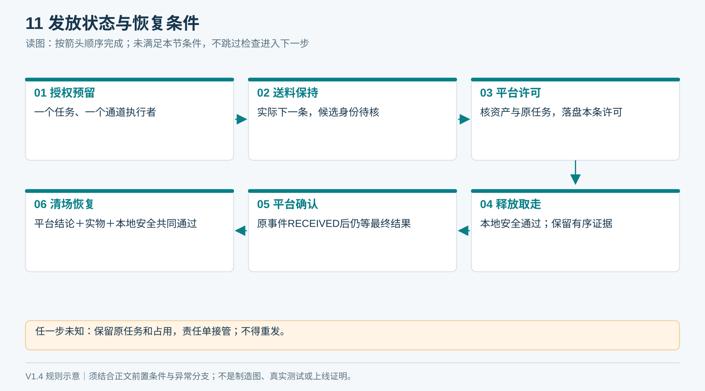
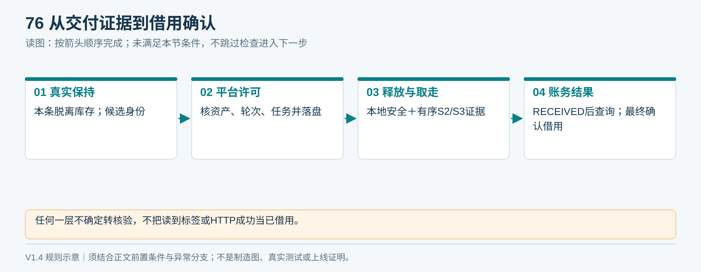
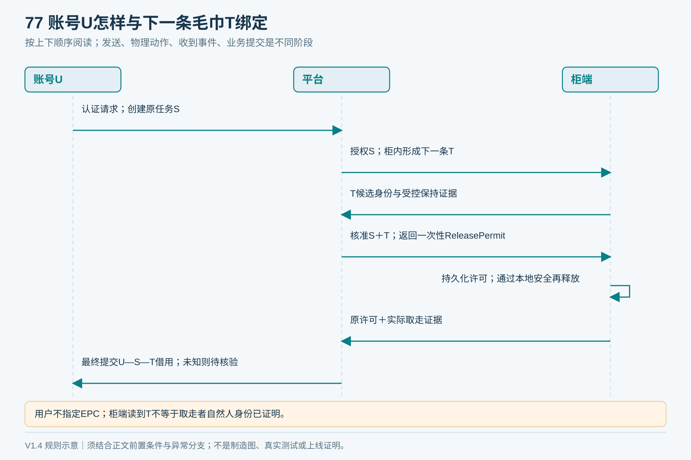
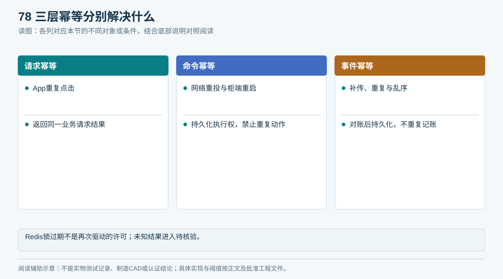
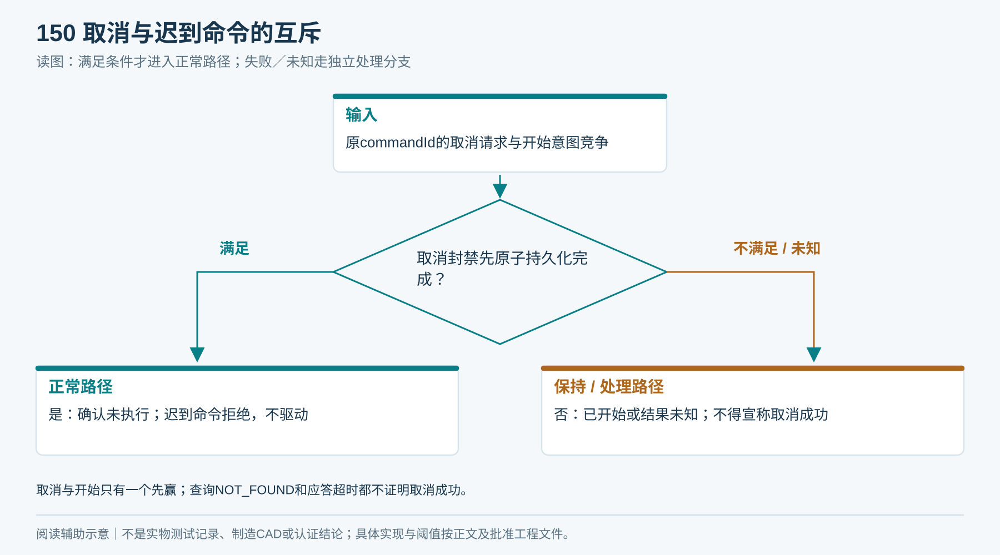
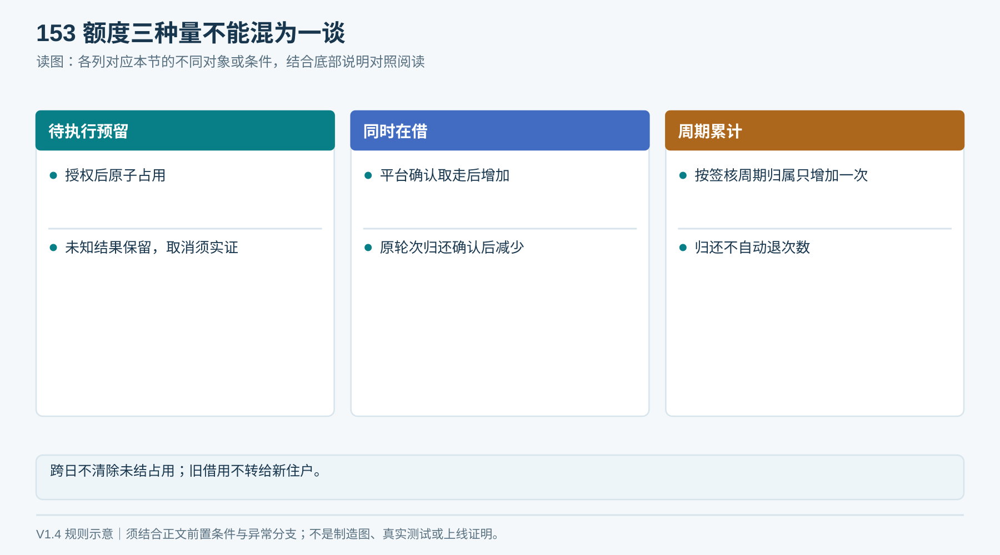
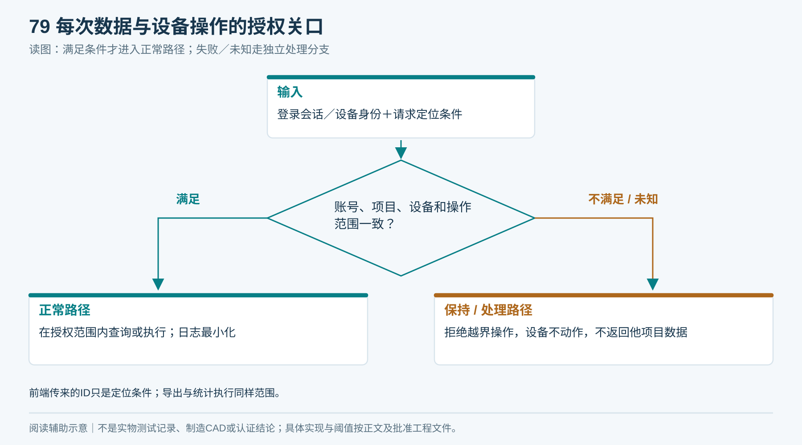
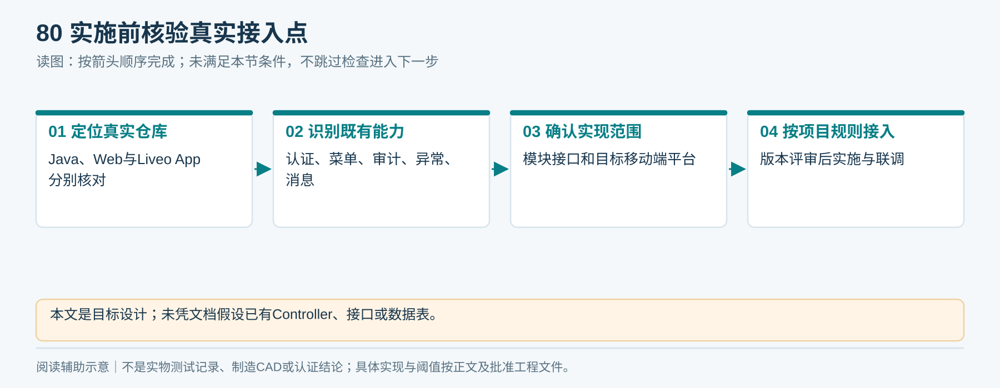

# 08｜Liveo平台集成与业务状态

状态：目标设计；未实施接口、修改代码或验证部署。字段为协议语义，不是数据库表结构。Liveo App技术框架需在移动端实际仓库核验，不由当前Web仓库推定。

## 1. 系统分工

> **读图前置条件（V1.4）：** 图27已补入本条ReleasePermit及平台最终确认；完整字段、丢确认和异常恢复见09/21章。

Liveo App：认证后扫码、发起领用、显示真实进度、查看本人记录及待核验回执。

Spring Boot业务服务：按当前身份校验Project、Unit、设备服务范围和额度，生成任务，接收并核验事件，驱动借还状态。

设备适配层：映射供应商协议与标准事件，处理连接、版本、设备身份；不自行决定住户借用权限。

柜端控制器：持久化已接受任务、控制一次物理过程、本地互锁、记录证据、重发未确认事件。

物业Web管理：本项目库存与设备状态、补货收污、异常处理、维护记录和统计；菜单与权限接入在开发前按现行规范核验。

<!-- figure-27 -->
### 图27｜Liveo领巾：账号与毛巾如何绑定

*箭头表示逻辑消息顺序，不表示网络时延。柜端安全动作不依赖云端实时回路；结果不明保留任务，不能直接重发。*

## 2. 发放任务和借用分开

| 状态 | 含义 | 账务与通道处理 |
|---|---|---|
| AUTHORIZED | 已授权并预留额度 | 未形成已借出；准备占用通道 |
| ACCEPTED | 柜端已持久化接受 | 禁止同通道接受另一个任务 |
| FEEDING | 分离与接料中 | 不因前端取消或断网再发 |
| IDENTIFIED_HELD | 实物受控保持、读取到候选身份 | 平台核准资产后发ReleasePermit；无许可不释放，尚未借出 |
| READY_FOR_PICKUP | 本条许可及本地安全均满足后，已释放到隔离取物斗 | 继续保留额度和通道，不自动取消 |
| TAKEN_CONFIRMED | 经验证时序支持已取走 | 平台确认借出并关联本任务账号及EPC |
| FAILED_NO_DELIVERY | 有证据证明未向用户交付且已安全清场 | 平台可取消预留，通道自检后复用 |
| NEEDS_REVIEW | 位置、身份或结果不明 | 保留预留与证据，人工／受控对账 |

“借出”业务结果与“设备通道可接下一任务”分开：即使平台已确认借出，设备仍需完成空通道与复位检查才能接新任务。

**闭环约束（V1.4复核）**

补充REJECTED与CANCELLED_NO_EXECUTION：前者未接受不动作，后者须柜端持久化取消封禁。设备物理阶段、平台业务结果、通道能否复用独立；取走后仍需平台确认＋通道清空与复位＋无矛盾才接下一单。

## 3. 交付证据定义

推荐首期定义：有效授权任务与合法EPC → 已验证的一条分离过程 → 平台核本条并持久化ReleasePermit → 释放到取物斗的S2/S3有序证据 → 在危险动作隔离条件下确认取物斗由有物变为空 → 柜端持久化TAKEN_CONFIRMED事件 → 平台核验并确认借出。

S3单次跳变不能等同取走，应结合释放记录、稳定时间及互相校验的信号；具体时间阈值由传感器现场标定生成版本化参数。矛盾进入待核验，不用超时当作成功。

不能由这些传感器证明取走者就是账号本人。首期降低风险需近柜操作、现场提示及异常申诉；静态二维码可被拍照转发，若必须防远程发巾，D09须选定并验证现场确认方式后再上线。

<!-- module-figure-76 -->
**子模块图｜从交付证据到借用确认**

*读图说明：单次跳变或超时不能作成功证据；取走不证明自然人身份。*

## 4. 住户绑定示例

账号U演示在设备C演示创建任务S演示，柜内下一条毛巾T演示被识别。取得本条ReleasePermit、完成实际取走且平台核验提交后，借用关系才为“U演示借用T演示”。标签事前不写住户，也不按住户从库存挑某一条。

若没取：保留任务、额度和实物状态。工作人员回收取物口遗留毛巾，完成身份与位置核对后，按卫生规则记录再处理去向，同时终止／封禁原许可并由平台确认未交付后，才可释放预留；不能直接把暴露过的毛巾塞回净巾仓。

<!-- module-figure-77 -->
**子模块图｜账号U与下一条毛巾T如何绑定**

*读图说明：未取走保留任务与额度；暴露过的遗留毛巾按卫生规则再处理。*

**闭环约束（V1.4复核）**

ReleasePermit由平台核本任务与实际下一条资产后签发，不能用用户指定EPC替代。资产占用与许可原子保存；后续取走证据引用该许可与资产轮次，仍绑定原任务认证账号。取走者自然人身份不能仅由RFID证明。

## 5. 一致性与异常

- API请求幂等、物理命令幂等、事件幂等分别实现，不依赖一个Redis锁承担全部职责。
- 同一任务接受后，执行权必须持久化；重启不能仅看“缓存锁过期”就重发。
- 网络无法保证物理动作与服务器事务原子提交。目标是最多一次受控执行、结果可对账；不承诺网络层天然“恰好一次”。
- 断电发生在动作与事件记录之间时可能无法证明结果，进入NEEDS_REVIEW；不能根据最后命令推测成功。
- 平台收到乱序事件先核对状态版本，缺中间证据时查询／补齐；较旧状态不得覆盖新终态。
- 撤销仅在设备确认尚未物理执行且清场后完成；取消请求和动作开始竞态必须有唯一结果。
- 首期离线不新增领还；已有发放未获本条许可只能安全保持，已持久化有效许可才允许该任务安全收尾；已有回收保留原回执：转移前保持或逐件隔离，已不可逆转移则记录实际箱和批次并冻结正常流转，按07章受控交接。

<!-- module-figure-78 -->
**子模块图｜三层幂等分别解决什么**

*读图说明：Redis锁过期不是再次驱动的许可；未知结果进入待核验。*

**闭环约束（V1.4复核）**

授权任务、额度预留、待发送命令同事务保存；可靠处理避免孤儿预留。取消封禁与开始意图柜端原子互斥，NOT_FOUND不退额度。事件确认分RECEIVED（原件持久化）、APPLIED（业务提交）、REVIEW_REQUIRED（责任单已建）。原件确认后未结任务与证据仍保留。

*取消与开始只有一个先赢；查询NOT_FOUND和应答超时都不证明取消成功。*

**闭环约束（V1.4复核）**

归还按returnSessionId及原借用轮次处理，旧归还不销新借用；归还早到时保留证据冻结资产，待原取走证据补齐。额度区分预留、同时在借和周期次数；政策豁免单列，不伪造物理归还。详见[21章闭环基线](21_端到端逻辑闭环与验收矩阵.md)。

*按账号或Unit共享、周期和上限由D08签核；不擅自启用收费。*

**额度与资产是两类占用：** 待执行预留、在借数量、周期用量按21章分别处理；资产持有许可必须绑定同一任务和同一轮次。平台已接收事件但未应用时，柜端继续查询原任务结果并保留占用；查询超时由明确责任单接管，不能由缓存锁到期放行下一条。

## 6. 权限与数据最小化

账号来自登录会话；Project、Unit与设备范围由后端查证。前端传来的ID是定位条件，不是授权证明。设备证书／凭据映射设备及所属项目，事件上报项目与映射不符则拒绝。

本人记录、本项目工作人员数据、技术维护数据各有范围；查询、详情、导出和统计同权。严禁把现有CCTV或VLS权限码套到毛巾模块；新权限名称与菜单接入在开发前核验并登记。

标签不含个人资料；柜端仅持有完成任务所必需的伪名化引用。日志不记录认证凭据；保留期由物业运营、争议处理和隐私规则共同定稿。

<!-- module-figure-79 -->
**子模块图｜每次数据与设备操作的授权关口**

*读图说明：前端传来的ID只是定位条件；导出与统计执行同样范围。*

**迁移后的迟到证据：** 旧归属事件不得写入新项目业务。对已认证且可核对历史归属版本的原任务证据，进入原项目受控对账与审计；无法核验的事件进入安全审计，不向新项目泄露住户数据。停用账号及迁出Unit保留原借用主体快照，不把历史借用转给新住户。此为待实施权限契约，未验证当前Liveo源码。

## 7. 实施前回源核验清单

核对Java与Web当前模块、认证来源、动态菜单、统一异常、审计和消息机制；另定位Liveo App真实仓库与目标平台。按实际项目技术栈接入，不据本文虚构已有Controller或表。Java项目编译遵循现有JDK8要求，SQL若后续需要设计仍统一Mapper.xml；本包不包含DDL。

<!-- module-figure-80 -->
**子模块图｜实施前核验真实接入点**

*读图说明：本文是目标设计；未凭文档假设已有Controller、接口或数据表。*

