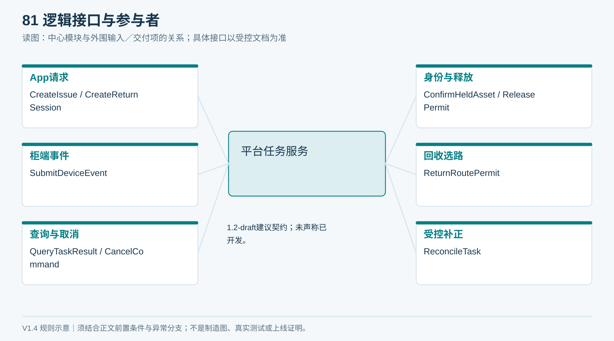
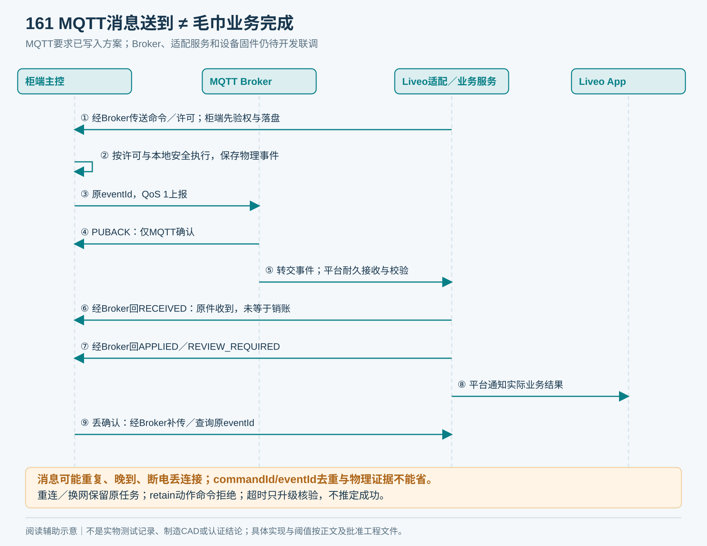
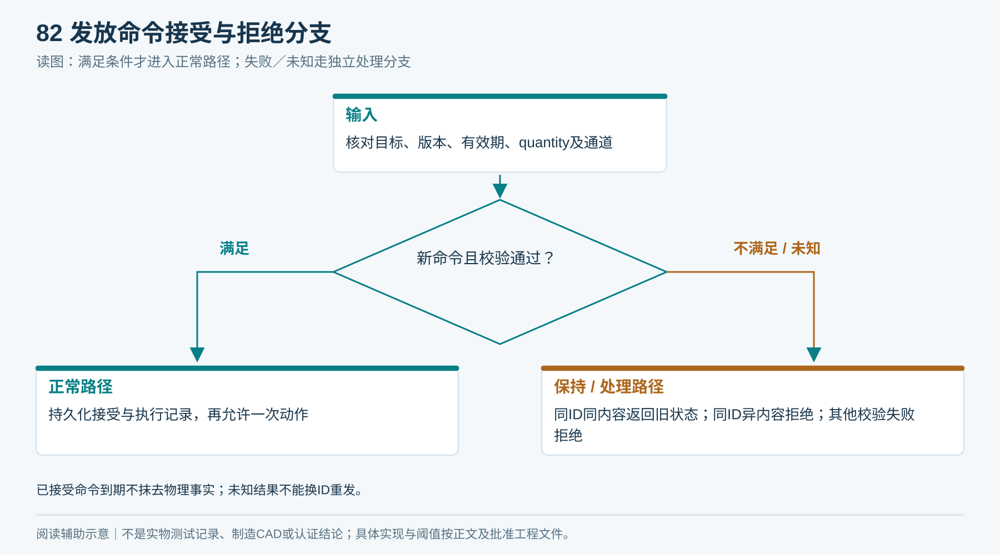
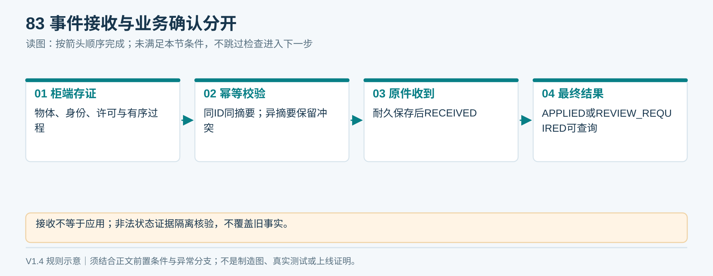
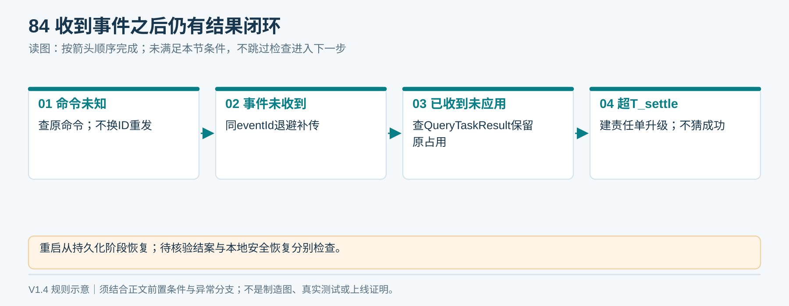
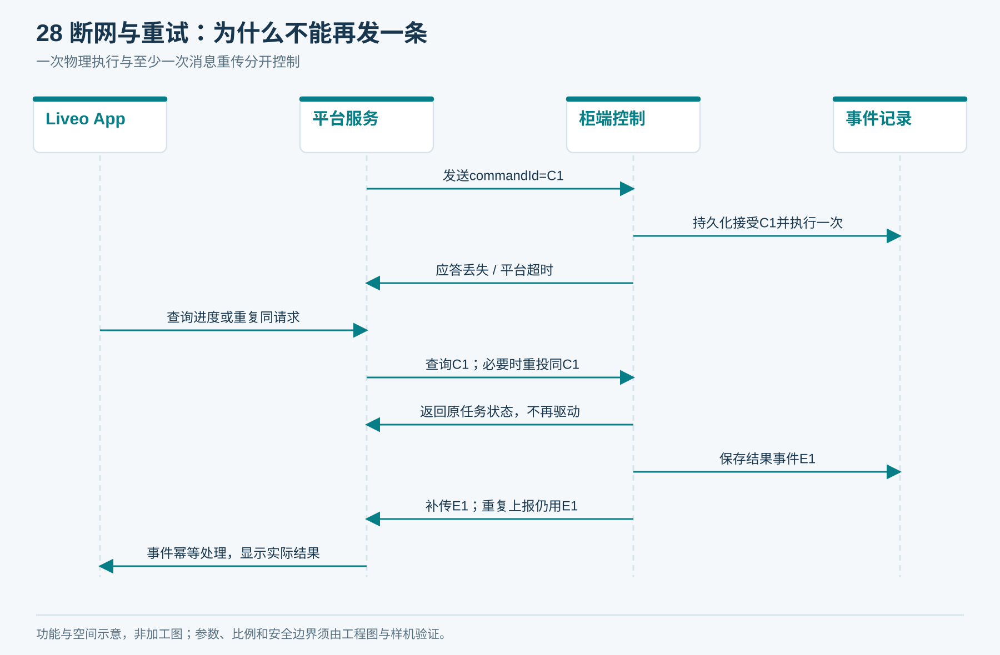
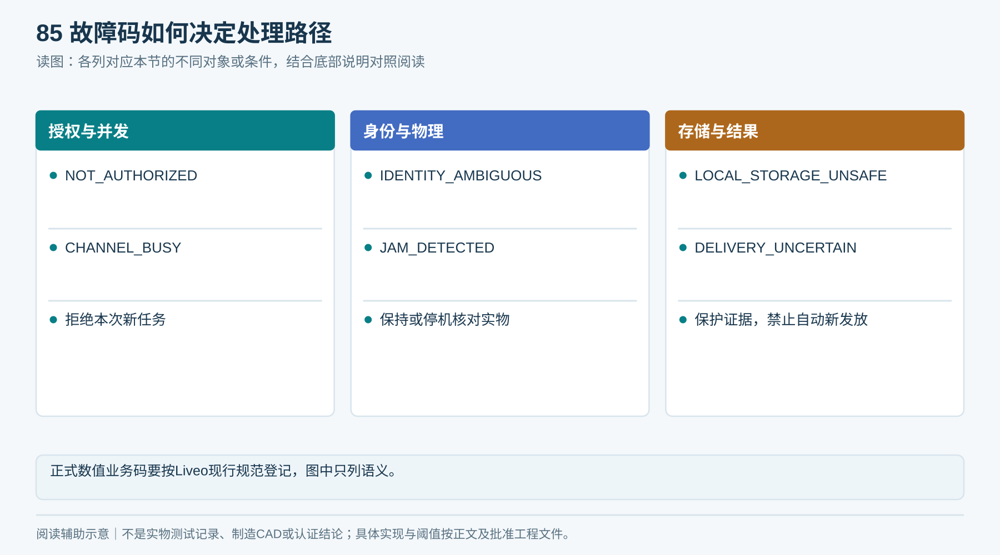
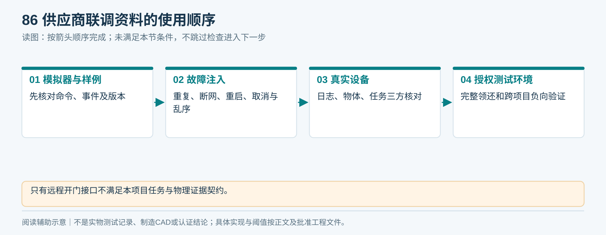
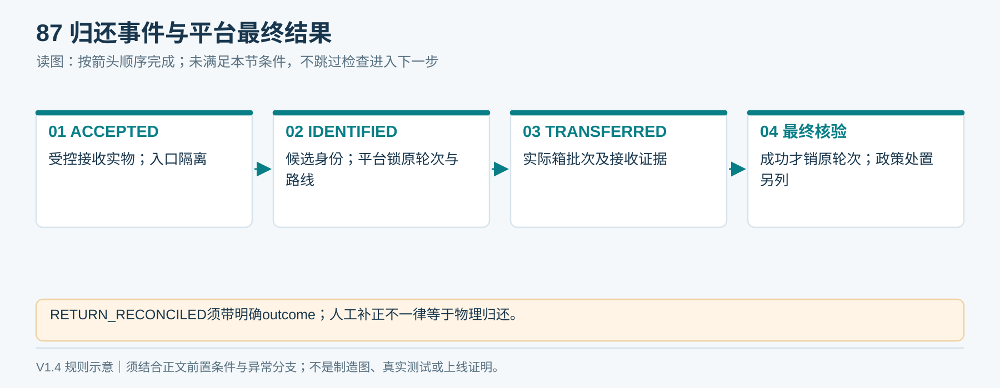
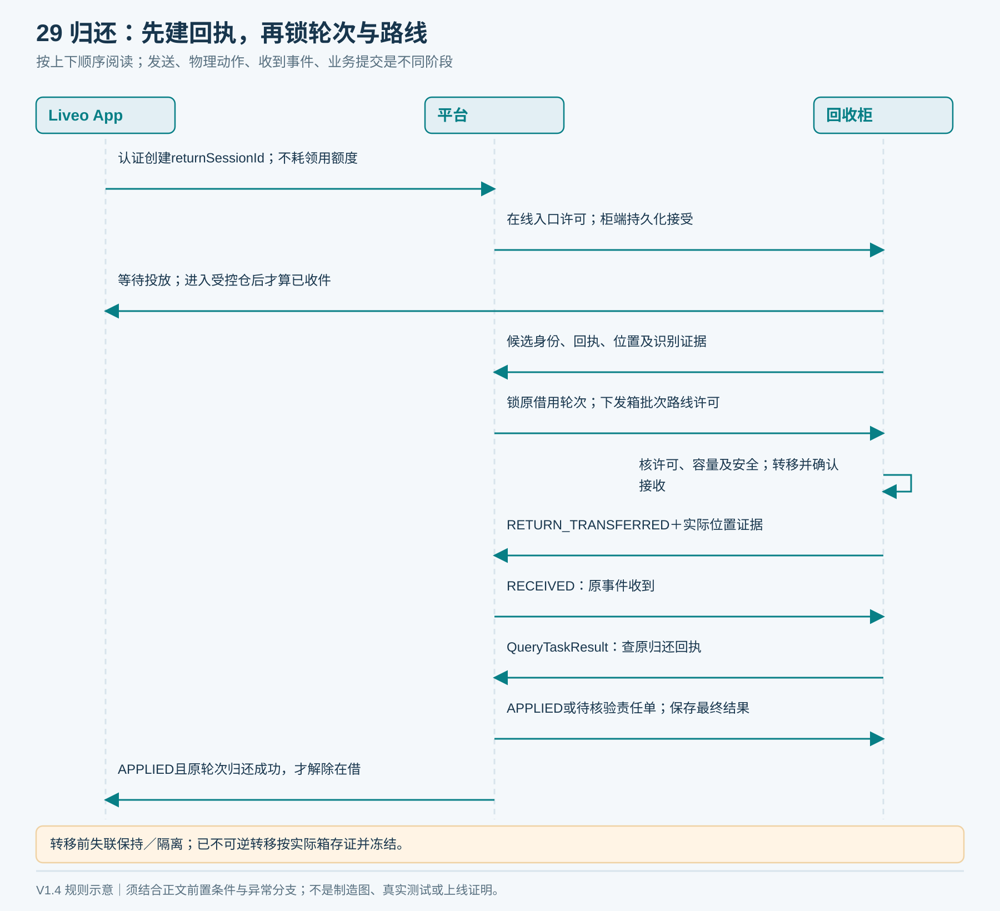

# 09｜设备协议与联调契约

状态：可用于供应商协议评审的建议契约，不是已发布Liveo接口。设备与服务端需共同冻结版本后实施。V1.4将协议建议稿修订为1.2-draft，尚未部署。

## 1. 逻辑接口


| 操作 | 输入 | 输出／约束 |
|---|---|---|
| CreateIssue | cabinetRef、clientRequestId | issueSessionId、当前状态；账号由认证获得 |
| QueryIssue | issueSessionId | 本人授权范围内状态、可执行下一步 |
| RequestCancel | issueSessionId | 取消请求已接收或当前不允许；不是直接取消成功 |
| SubmitDeviceEvent | 设备认证、标准事件 | eventId、RECEIVED／APPLIED／REVIEW_REQUIRED及可查询结果；或明确拒绝 |
| QueryCommand | commandId | 柜端当前状态与证据版本，不触发电机 |
| ReconcileTask | 授权维护身份、任务、实物证据、处理原因 | 受控补正结果和审计标识 |

**设备到Liveo的命令、事件、状态查询与应用确认，强制支持MQTT 3.1.1 over TLS；MQTT 5.0为可选扩展，不能作为唯一接入方式。** 设备主动向Liveo指定Broker出站连接，基础端口8883可配置。HTTPS仅用于App平台接口、受控升级和资料传输等独立用途，不能替代设备MQTT必选项。当前是待实现的接口要求，未核定Liveo已有Broker或适配服务。


<!-- module-figure-81 -->
**子模块图｜逻辑接口与参与者**



*读图说明：HTTP应答或QoS不等于物理交付成功。*


**闭环约束（V1.4复核）**

| 补充逻辑操作 | 输入语义 | 输出／约束 |
|---|---|---|
| ConfirmHeldAsset | issueSessionId、候选EPC、装载批次、物理保持证据、版本 | 原子核资产准入和占用；拒绝或返回ReleasePermit |
| ReleasePermit | 原任务／命令／设备／通道／资产／EPC／assetCycleVersion／assignmentVersion、有效期 | 一次性本条业务许可；柜端落盘后仍须本地安全通过 |
| CreateReturnSession | 认证会话、设备、clientRequestId | 独立回执；无需领用额度；柜端接管前不显示已收件 |
| CancelCommand | 原commandId、内容摘要、归属版本 | 与开始意图原子竞争；落盘取消封禁后才CANCEL_CONFIRMED |
| QueryTaskResult | 原任务／回执、授权身份 | 物理阶段、业务结果、reasonCode、caseId、evidenceRef；不触发动作 |

待投放归还会话的终止同样需要柜端确认无物、入口关闭并留下终止记录；迟到开入口命令不得重开。所有操作均为待开发契约，不表示Liveo已有同名接口。

**许可幂等与续期：** 同一ConfirmHeldAsset请求、资产和原任务返回同一个许可结果，不生成新资产轮次。更改EPC或载荷使用同请求标识须报冲突。续期保留同一物理执行身份；只有柜端确认未开始释放并耐久撤销旧许可后，才能提交新许可版本；失联时不能推定撤销成功。原任务／资产占用在业务终结或受控补正前保持，QC或清单变更不得绕过活动许可。

### MQTT采购硬要求（V1.5，与联网方式无关）

| 项目 | 必须交付的行为 | 不接受的替代说法 |
|---|---|---|
| 平台可控 | Broker域名、端口、CA、设备身份、Topic可配置；断开厂家云仍能与Liveo测试Broker运行 | 只能连厂家小程序／私有云 |
| TLS | TLS 1.2或以上，校验服务器证书链与域名；每台唯一客户端证书做双向认证；私钥受保护、可轮换／撤销 | 只写“SSL”、跳过证书校验、全柜共用密码 |
| 双向消息 | 关键命令、事件、应用确认均QoS 1；订阅也请求QoS 1；收到SUBACK后才声明接入就绪 | TCP透传、仅订阅QoS 1却用QoS 0发布事件 |
| 防止旧命令复活 | 所有动作命令retain=false；Broker限制命令保留，柜端拒绝保留命令；每次都验证有效期、assignmentVersion及channelEpoch | 重连后收到什么就执行什么 |
| 稳定身份 | 一个设备一个固定clientId，一个逻辑活动连接；同ID并发连接触发故障诊断；网络切换不产生新的业务命令ID | 换网即建新设备／新发放任务 |
| 会话与重发 | MQTT 3.1.1使用受控持久会话；Broker队列有容量与保留时限；设备去重和事件耐久日志独立于MQTT会话 | 把Broker缓存或内存outbox当作断电日志 |
| 业务确认 | PUBACK仅为MQTT确认；RECEIVED仅为平台原件耐久接收；APPLIED或REVIEW_REQUIRED才给业务结论 | 把QoS 1、连上网或收到消息当作毛巾已取走／已归还 |
| 离线与满队列 | 已接受任务按21章许可和本地安全收尾；关键事件耐久存储直到应用接收；空间不足拒绝新动作并告警 | 为腾空间静默丢失未确认事件；离线新建领用 |
| 运维 | 可配置心跳与LWT、指数退避和抖动重连、证书到期预警；时钟不可信拒绝新物理命令 | 网络故障触发无条件整机重启／重复吐巾 |

Topic建议命名（待双方冻结；不是已上线地址）：

| Topic | 发布→订阅 | 说明 |
|---|---|---|
| `liveo/towel/v1/devices/{deviceId}/command` | Liveo适配服务→本设备 | 发放、归还入口、释放／路线许可、取消、结果查询；均带请求标识和期限 |
| `liveo/towel/v1/devices/{deviceId}/event` | 本设备→Liveo适配服务 | 物理证据、命令接受／拒绝／查询应答；eventId及版本可追溯 |
| `liveo/towel/v1/devices/{deviceId}/ack` | Liveo适配服务→本设备 | 原eventId的RECEIVED／APPLIED／REVIEW_REQUIRED；丢失时查询原结果 |
| `liveo/towel/v1/devices/{deviceId}/status` | 本设备／LWT→平台 | 在线及诊断状态；不能代替业务确认；首期也不使用retained消息 |

Broker按证书映射deviceId并限制上述发布／订阅方向，禁止设备通配订阅其他设备；Liveo服务端仍按当前设备归属与assignmentVersion复核授权。新项目迁移必须先结清／冻结旧任务、撤销旧会话与待投递旧命令，按16／21章受控切换；不能只改Topic里的字符串。平台端发送队列和事件消费均需耐久化；适配服务崩溃后恢复原commandId/eventId，不能仅依赖MQTT自动确认。状态查询及应答关联原任务，绝不重新触发动作。



*图161：两层确认分开；Wi‑Fi／4G切换只影响传输，不改变任务、实物和账号绑定。*

#### 网络验收子用例 NET01—NET08（计划，尚未执行）

| 子用例 | 故障注入／场景 | 验收结论必须证明 |
|---|---|---|
| NET01 | 各交付网络配置连接Liveo测试Broker；Wi‑Fi重启，蜂窝版换真实SIM／APN | 每个实际交付配置均能双向MQTT/TLS；未选配网络记不适用并说明 |
| NET02 | 错CA、错域名、过期／撤销客户端证书；订阅他柜Topic | 连接／访问被拒；本地不放行新任务；合法证书恢复可对账 |
| NET03 | QoS 1同commandId重复、同ID异载荷、订阅恢复收到旧命令 | 相同命令只执行一次；冲突／过期／旧归属拒绝，保留记录 |
| NET04 | 注入retained动作命令；重启设备重新订阅 | 拒绝动作，日志可追；修正配置清除残留后按新合法任务恢复 |
| NET05 | PUBACK已到但RECEIVED丢失；RECEIVED已到但APPLIED丢失；服务端重启 | 依原eventId补传／查询，账务只应用一次；App保持真实处理中／待核验 |
| NET06 | 送料、保持、释放、取走、归还转移各阶段断网；选配双链路切换 | 遵循21章许可规则，保持原任务；不再发、不误销账；恢复后实物与账一致 |
| NET07 | 事件队列将满、断电、存储损坏、重复clientId | 不丢未确认物理事实；无法耐久记录则停新任务；损坏进入核验，不重放电机 |
| NET08 | 运营商弱信号／欠费／SIM移除、DNS故障、证书轮换、时钟偏差 | 诊断区分原因；由维护人员恢复并对账后解除限制；轮换不丢活动任务 |

NET子用例补充原C01—C44的网络与恢复验证，不改变原44项编号。总计另有8个网络验收场景，全部待台架／FAT／SAT执行；结果填T13，具体网络、固件、证书版本、Broker日志、设备日志和对应业务记录一起归档。阈值（重连时间、队列容量、离线保留期、时钟容差）须T02冻结，空值不能判通过。


## 2. 发放命令示例


以下为虚构标识，禁止包含真实凭据。项目与账号授权在服务端完成，柜端不接收客户端任意拼出的命令。

```json
{
  "protocolVersion": "1.2-draft",
  "commandId": "CMD-DEMO-001",
  "issueSessionId": "ISSUE-DEMO-001",
  "deviceId": "CAB-DEMO-001",
  "channelId": "CLEAN-01",
  "action": "ISSUE_ONE",
  "issuedAt": "2026-09-16T06:00:00Z",
  "expiresAt": "2026-09-16T06:00:30Z",
  "expectedChannelEpoch": 42,
  "assignmentVersion": 3,
  "quantity": 1
}
```

示例30秒有效期只是演示。有效期用于判断是否接受新命令；已接受任务执行中到期，不得直接取消已发生的物理事实。时钟偏差与离线策略须双方定义；无法可信判断新指令有效期时拒绝新发放。

设备验证：身份/目标匹配、协议兼容、有效期、状态版本、quantity=1、通道可用。持久化接受与执行记录后才能动作。相同commandId及相同内容返回已有状态；同ID不同内容报冲突。


<!-- module-figure-82 -->
**子模块图｜发放命令接受与拒绝分支**



*读图说明：已接受命令到期不抹去物理事实；未知结果不能换ID重发。*


**闭环约束（V1.4复核）**

版本分工：taskStateVersion对同任务单调递增，重启不归零；channelEpoch在清场与平台结论均确认后更新，用于拒绝上一通道周期指令；assignmentVersion在受控项目归属变更后更新。bootId仅诊断，不能充当去重边界。许可有效期无法可信判断时保持不释放；平台离线不能单方面假定已撤销柜端许可。

## 3. 事件示例


```json
{
  "protocolVersion": "1.2-draft",
  "eventId": "EVT-DEMO-006",
  "commandId": "CMD-DEMO-001",
  "issueSessionId": "ISSUE-DEMO-001",
  "deviceId": "CAB-DEMO-001",
  "channelId": "CLEAN-01",
  "bootId": "BOOT-DEMO-01",
  "sequence": 6,
  "taskStateVersion": 6,
  "channelEpoch": 42,
  "assignmentVersion": 3,
  "assetCycleVersion": 8,
  "releasePermitRef": "PERMIT-DEMO-001",
  "eventType": "TAKEN_CONFIRMED",
  "observedAt": "2026-09-16T06:00:09Z",
  "assetRef": "TOWEL-DEMO-008",
  "epc": "300000000000000000000008",
  "evidence": {
    "releasePassageConfirmed": true,
    "pickupOccupiedThenCleared": true,
    "safetyStateValid": true,
    "sensorTraceRef": "TRACE-DEMO-001"
  },
  "firmwareVersion": "prototype-1.0",
  "configVersion": "calibration-demo-1"
}
```

布尔字段是柜端按已验证规则得到的摘要，不是允许任意信号直接宣称成功；必须保留可追查时序证据。observedAt与服务器接收时间分开；sequence按任务严格递增，重启继续，bootId用于诊断，不能因重启把任务序号归零后覆盖旧事件。


<!-- module-figure-83 -->
**子模块图｜事件数据怎样形成可追溯证据**



*读图说明：布尔字段只是经验证规则的摘要，不能随意置true宣称完成。*

**同ID载荷冲突：** 同eventId且内容摘要相同才按重复事件返回原结果；不同摘要返回EVENT_CONTENT_CONFLICT并保留冲突证据，不覆盖原事件。身份有效但状态、序号或轮次不合法的物理事件须耐久隔离并建立核验记录；拒绝业务应用不等于否认物理已发生。未经认证的内容进入独立安全审计，不进入住户账务。

## 4. 重试与恢复规则


- 柜端落盘事件后发送；平台原件耐久保存后回RECEIVED，业务提交后回APPLIED，异常回REVIEW_REQUIRED及caseId。重复事件返回当前持久化结果，不重复应用；两种确认不能混为一谈。
- 未确认事件保留，采用有上限的退避重传；后台长期补传不能阻塞本地安全动作。
- 本地存储容量按预期离线时长和峰值事件量计算，达到高水位报警，无法可靠写入时停止接新任务。
- 平台命令超时先QueryCommand；只能重投同一commandId，不产生新ID绕过去。
- 重启读取未终结任务、传感器与实物；无法恢复确定性时锁定通道并待核验。
- 升级只能在无活动任务、物体位置明确时开始；升级失败保留已执行历史并有可验证回退路径。


<!-- module-figure-84 -->
**子模块图｜超时、补传与重启恢复**



*读图说明：安全动作不等待网络；存储不能可靠写入时停止接新任务。*


<!-- figure-28 -->
### 图28｜断网与重试：为什么不能再发一条



*“应答丢失”箭头说明事件，不表示平台收到成功。重启时若无法确认物体或执行结果进入待核验；不能凭缓存锁过期创建新物理任务。*


**闭环约束（V1.4复核）**

QueryCommand返回NOT_FOUND仍保留任务与预留；取消必须柜端持久化封禁并确认。重投原ID也须核封禁、归属与通道版本。执行／取消历史留存覆盖签核重放窗口，未证明安全封存前不清空；D18签核升级、备份恢复和凭据迁移。柜端损坏丢日志转人工核验，不在新控制器重放旧命令。


*取消与开始只有一个先赢；查询NOT_FOUND和应答超时都不证明取消成功。*

**业务结果通知丢失：** RECEIVED后可停止原事件重传，但柜端／App仍按原taskId或returnSessionId调用QueryTaskResult，直到APPLIED或REVIEW_REQUIRED；状态、caseId和证据引用可重复查询。平台由持久化待处理事件恢复业务提交和结果通知，不依赖单次推送。超过T_settle仍未确定时由平台告警建单、值班人员接管，保留预留及受影响通道。平台T_settle从原事件耐久接收时起算；柜端另外记录收到RECEIVED后的本地等待时长，跨时钟不直接相减。T_settle、查询退避与升级时限由D18/D17在联调前签核；无限查询不是处置出口。

## 5. 标准故障语义


| 错误 | 含义 | 是否允许自动新发放 |
|---|---|---|
| NOT_AUTHORIZED | 账号／项目／设备范围不合法 | 否 |
| CHANNEL_BUSY | 有未结束任务 | 否 |
| QUOTA_UNAVAILABLE | 额度不足或有预留 | 否 |
| IDENTITY_AMBIGUOUS | 无标签／多标签／资产冲突 | 否 |
| JAM_DETECTED | 运动与物体过程异常 | 否 |
| DELIVERY_UNCERTAIN | 交付证据不足 | 否 |
| BIN_NOT_READY | 回收箱缺失／满载 | 否，停止对应回收路径 |
| COMMAND_CONFLICT | 同ID内容冲突 | 否 |
| LOCAL_STORAGE_UNSAFE | 无法可靠保存任务或事件 | 否 |

数值业务码依现有Liveo规范登记，不在文档里编造与现有码冲突的编号。


<!-- module-figure-85 -->
**子模块图｜故障码如何决定处理路径**



*读图说明：正式数值业务码要按Liveo现行规范登记，图中只列语义。*

## 6. 联调必须提供


可独立启动的设备模拟器／协议样例、真实设备日志导出、指令接收与物理完成分离的回执、断网补传演示、重复命令演示、设备凭据更换、版本兼容表。供应商只给“远程开门接口”不足以满足本方案。

台架先联调协议和故障注入，再连接授权测试环境。禁止用生产账号、生产设备或真实住户试错。


<!-- module-figure-86 -->
**子模块图｜供应商联调资料的使用顺序**



*读图说明：只有远程开门接口不满足本项目任务与物理证据契约。*

## 7. 归还事件契约补充

> **读图前置条件（V1.4）：** 归还图中的“核验”包含锁定原借用轮次与移交证据；离线仅允许已有回执任务收尾，不允许首期新离线接收。


归还另用returnSessionId，不复用issueSessionId表达一次新的物理回收。事件共用eventId、deviceId、bootId、sequence、taskStateVersion、channelEpoch、assignmentVersion、版本与证据字段。

| 事件 | 物理与业务含义 | 必须携带的关联 |
|---|---|---|
| RETURN_ACCEPTED | 物体进入受控仓、外侧已隔离，尚未销账 | returnSessionId、仓位、入口与物体证据 |
| RETURN_IDENTIFIED | 得到候选身份，尚未完成移交 | 候选EPC/assetRef及读取证据；平台核验状态、matchedIssueSessionId与assetCycleVersion，未确定则留待核验 |
| RETURN_TRANSFERRED | 已不可回掏地进入指定接收位置 | targetBinId或isolationSlotId、转移/接收/复位证据 |
| RETURN_PENDING_REVIEW | 无法确定身份或移交结果 | reasonCode、物体所在位置、待核验回执 |
| RETURN_RECONCILED | 平台核验完成或人工受控补正 | 原归还任务、资产与原借用关联、处理依据及审计引用 |

设备上报RETURN_TRANSFERRED不直接代表App可显示归还成功；平台需核对身份、有效借用与移交证据并持久化结果。离线或身份不明返回待同步/待核验。客户端操作者与原借用人是不同语义，不可互相代替。正常容器ID用于物品交接；未知物体进入异常隔离时必须有可逐件追踪的隔离位或保留仓位。

<!-- module-figure-87 -->
**子模块图｜归还事件与平台最终确认**



*读图说明：任一步不明转RETURN_PENDING_REVIEW；离线移交不能直接显示归还成功。*


<!-- figure-29 -->
### 图29｜归还与销账：投放人不一定是借用人



*只有平台完成核验后才能显示归还成功。无法识别或离线时形成独立回执，不按当前投放人直接解除借用。*


**闭环约束（V1.4复核）**

归还先到等待原借出证据，旧归还晚到只作用于锁定原轮次。首期acceptNewOfflineReturn=false；在线回执被柜端接受后才允许安全收尾与存证，未核验物体逐件隔离。收到RETURN_TRANSFERRED不释放借用；平台APPLIED且结论为归还成功后才向用户确认。


*投放人不等于原借用人；禁止按事件到达时“最新一笔借用”随意销账。*


**回收确认握手补充：** RETURN_IDENTIFIED仅上报候选。正常路由开放前，平台给出本回执对应资产及原轮次的核验结果，柜端持久化该结果并核本地路由安全；结果未知／失联走保持或逐件隔离。若断网发生在正常转移已经不可逆开始之后，只安全完成既定转移、记录实际容器位置并冻结该批正常收运／重发；必要的卫生处置只能走07章有保管责任的封存异常交接，不能反向搬回或伪记为隔离位；恢复后核验原回执再解除限制。平台最终应用前仍显示待同步。

**ReturnRoutePermit（建议逻辑契约）：** 绑定returnSessionId、assetRef或unknownItemRef、matchedIssueSessionId／assetCycleVersion（未知则明确为空且仅允许隔离）、deviceId、channelEpoch、assignmentVersion、targetBinId／isolationSlotId、binCycle及capacityReservationId、有效期。平台批准正常路线时先锁定原借用轮次，柜端落盘并核到位及本地安全后才转移；容器缺失、换箱／批次改变或容量不足均使未开始的路线许可失效。容量预留与路线授权原子更新，终止会话仅在确认未移交后释放预留；完成后转为实际占用。不可逆转移开始后不得换箱或重分配该预留，必须按真实接收结果对账。

