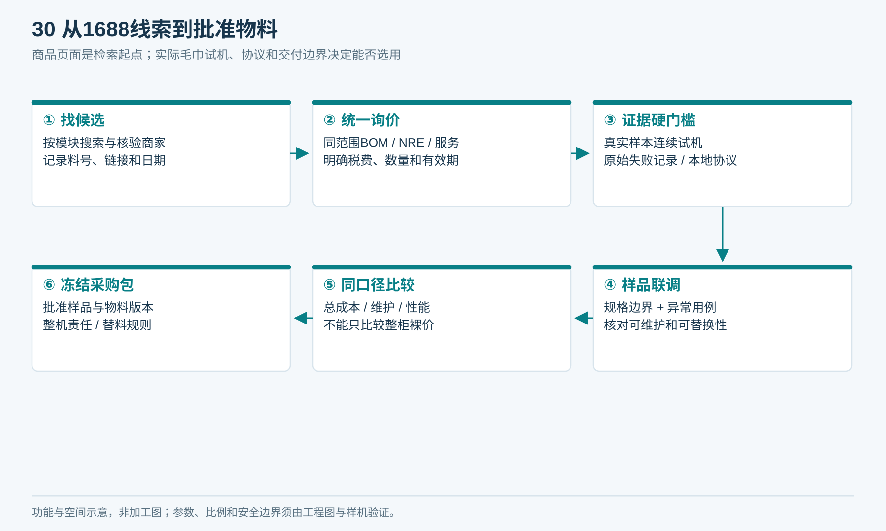
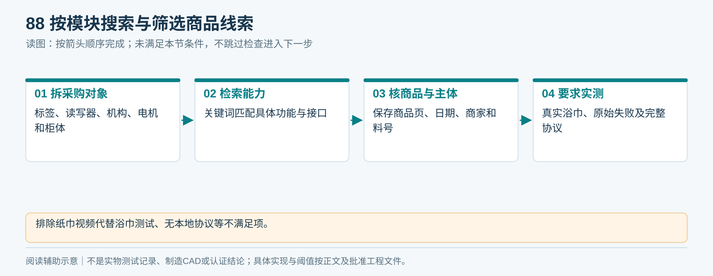
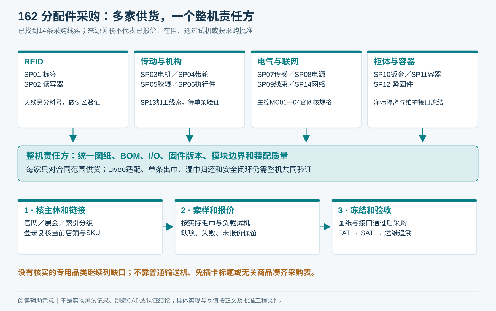
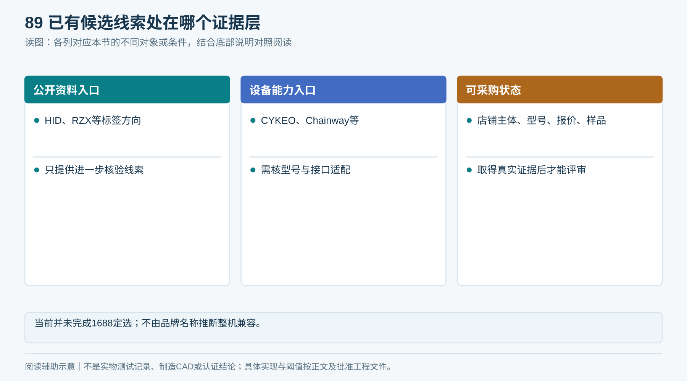
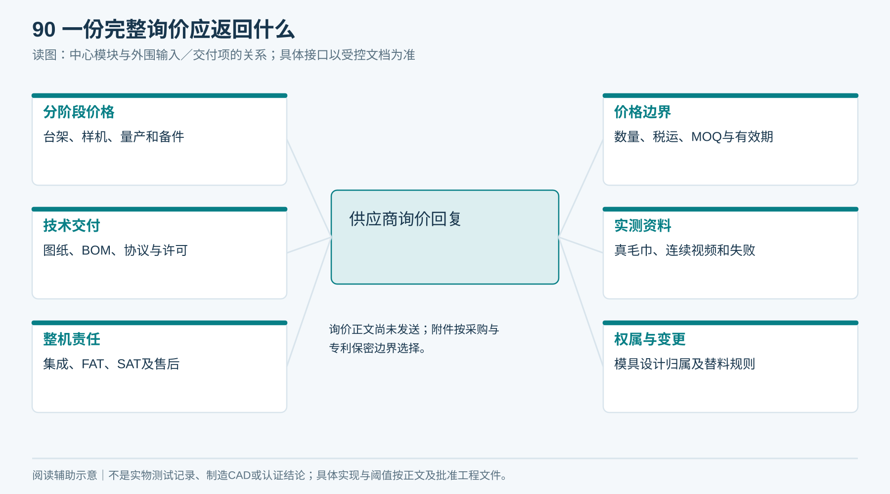
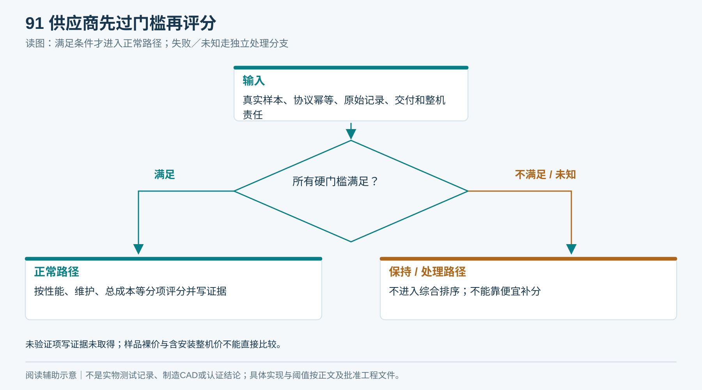

# 10｜1688选品与供应商询价

状态：采购执行包，未下单或联系供应商。2026-09-16 V1.5已补14条不同配件的具体1688店铺／商品线索及来源级别；部分店铺页面无法读取，未取得当前SKU核验、有效报价或试样结果，尚未完成供应商定选。

## 1. 分包采购，但整机责任不能分散

| 采购包 | 组成 | 主验收点 |
|---|---|---|
| P01 净巾机构 | 料仓、分离、M1/M2、传动、保持与出口 | 真实毛巾单条分离与防触及 |
| P02 湿巾回收 | 入口、识别仓、转移／异常路径、容器 | 湿态识别、真实落箱、清洁与隔离 |
| P03 RFID | 标签、读写器、天线、馈线、SDK | 目标身份识别及非目标抑制 |
| P04 电控 | 控制器、驱动、电源、传感器、线束 | 本地互锁、掉电恢复、可诊断性 |
| P05 柜体装配 | 柜体、门、机架、防护、固定、包装 | 装配公差、耐环境与维护 |
| P06 平台适配 | 柜端协议、适配层、联调和版本交付 | 任务幂等与业务对账 |

指定整机集成方负责模块接口、整机风险、装配验证、FAT及问题闭环。不能让机械厂、电控厂和标签商分别声称“自己的零件没问题”后无人负责整机。

<!-- figure-30 -->
### 图30｜从1688线索到批准物料

*本图是采购工作流，不代表已取得1688有效报价或批准供应商。对应执行表单T03/T04。*

## 2. 1688搜索词与筛选

平台入口：[1688](https://www.1688.com/)。逐项搜索并保存实际商品页、日期、商家主体与技术回复。

| 对象 | 搜索词 | 必须排除 |
|---|---|---|
| 标签 | UHF RFID 洗涤标签 布草 缝制 | 普通不干胶标签冒充耐洗 |
| 读写器 | UHF RFID 嵌入式 读写器 SDK 可调功率 | 只有云平台无本地协议 |
| 分离台架 | 毛巾 单条 分离机构 定制；布料 摩擦 分离 送料 | 纸巾机视频代替实际浴巾试验 |
| 包体机构 | 售货机 皮带 货道 推板 软包装 | 仅按硬盒尺寸承诺适配 |
| 电机 | 减速电机 编码器 频繁启停 | 堵转扭矩当持续额定扭矩 |
| 柜体 | 钣金机柜 定制 可拆料仓 防潮 | 有外观图无内部装配图 |
| 回收模块 | 布草 RFID 回收柜 识别仓 | 整箱读取率宣传无湿巾真值 |

<!-- module-figure-88 -->
**子模块图｜按模块搜索与筛选商品线索**

*读图说明：排除纸巾视频代替浴巾测试、无本地协议等不满足项。*

### 按配件分厂商的采购候选（V1.5，2026-09-16）

**下表是可追来源的具体店铺／商品线索，不是笼统1688搜索页，也不是已认可供方。** A＝厂家／渠道官网公布链接；B＝展会资料或供应商自述页公布链接；C＝第三方索引，主体与商品关联须重新核对。A也只证明来源关联，不证明在售、授权、质量和整柜适用性。部分1688店铺直开未返回可用正文；所有有效报价、销量、履约、当前SKU及样品结果均未取得，不采信转载价格。第三方链接只用于追溯采购入口，不作为技术参数依据。

| 编号／采购配件 | 候选供应商 | 1688入口 | 来源及核验层级 | 必须向供应商确认 |
|---|---|---|---|---|
| SP01 · 耐洗RFID标签（B05／P03） | 深圳市融智兴科技有限公司；柔性UHF布草洗涤标签，芯片／尺寸待选 | [具体店铺／商品](https://szvipcard.1688.com/) | [A-历史官网店链](https://www.szvipcard.com/news/company/1631.html) | 仅证明洗涤标签品类和店铺入口；要水洗报告、湿态试样、EPC/TID与缝制规范 |
| SP02 · RFID读写器（B05／P03） | 深圳市谷智远技术有限公司；GZY-E91／E94作为单／多通道询样候选 | [具体店铺／商品](https://shop2j21996996867.1688.com/) | [A-官网店链](https://infowise.tech/Products/index/id/25.html) | 核UART/RS485实际电平、地区频段、SDK、功率步进、两读区调度；不能用标称读距认定湿态可靠 |
| SP03 · M1／M2减速电机（B03／P01） | 东莞市佳力电机有限公司；直流齿轮减速电机＋编码器版本待核 | [具体店铺／商品](https://gdmada.1688.com/) | [A-官网店链](https://www.sumotor.com/zxwfdj.html) | 按扭矩／速度／占空比／堵转电流索样；无已核编码器SKU，不提前冻结 |
| SP04 · 同步带轮／轻型送料平带（B03／P01） | 上海驾临传动设备有限公司（全称待营业执照复核）；HOYEAR轻型输送带、PU带及同步轮 | [具体店铺／商品](https://hoyear.1688.com/) | [B-展会资料](https://hjtexpo-storage.www.comocloud.net/cibrush_com/2025/12/15/20251215104739584e48f1.pdf) | 送料平带与传动同步带分料号；核最小辊径、伸长、表面摩擦、接头及掉屑 |
| SP05 · 胶辊／包胶轮（B03／P01） | 绍兴福天机械有限公司；小直径胶辊按图报价 | [具体店铺／商品](https://rollerft.1688.com/) | [A-官网店链](https://www.rollerft.cn/contact/) | 核小批量能力、直径跳动、胶层硬度、粘接与清洁耐受；不是已定毛巾分离机构 |
| SP06 · 保持／释放执行件（B04／P01） | 东莞市石碣德昂电子厂；DU1053推拉电磁铁仅作行程／力曲线比较候选 | [具体店铺／商品](http://tangbenyang.1688.com/) | [B-企业自述商品页](https://cn.diytrade.com/china/pd/12687795/长行程推拉电磁铁.html) | 核24V版本、失电位置、保持力、占空比及温升；未按实际机构验证不得认定防夹 |
| SP07 · 光电及位置检测（B07／P04） | 深圳市天为机电设备有限公司（销售渠道）；对射型光电开关；参考Z3T系列询价 | [具体店铺／商品](https://dayfor.1688.com/) | [B-供应商发布页](https://www.gkong.com/products/pro_content.asp?products_id=1723311) | 不是原品牌制造厂；核授权、PNP/NPN、湿毛巾与深浅色、失光故障及输入匹配 |
| SP08 · 24V主电源（B07／P04） | 江苏台源明纬电子科技有限公司（销售渠道）；明纬工业24V恒压系列，功率待负载预算 | [具体店铺／商品](https://taiyuanmingwei.1688.com/) | [A-渠道官网店链](https://www.ty-meanwell.com/) | 品牌原厂为明纬；渠道授权待核。不要把店名当原厂；启动峰值、降额、保护及目标市场资料齐全 |
| SP09 · 线束／连接器（B07／P04） | 东莞伟昌电子科技有限公司；低压线束按T02针脚图定制 | [具体店铺／商品](https://weichangdianzi.1688.com/) | [A-官网公开店链](https://www.cn-connector.com/sys-nd/60.html) | 核线径、端子压接、拉脱力、线号、防呆；其现有汽车线束介绍不等于已接受柜体定制 |
| SP10 · 钣金柜体／机架／护罩（B01／P05） | 青县拓达电子机箱有限公司；净污隔离柜、支架、维护门按图打样 | [具体店铺／商品](https://tuodajx.1688.com/) | [B-展会展商页](https://www.china-metalform.com/m/zsshow853.html) | 材料／板厚／腐蚀环境／边缘处理／固定孔位待工程图冻结；整机装配责任单独指定 |
| SP11 · 回收容器（B06／P02） | 汕头市嘉乐亿塑胶制品有限公司；带盖可拆洗塑料箱，容量／尺寸待选 | [具体店铺／商品](https://stjialeyi.1688.com/) | [B-展会展商页](https://www.ccfsh.net/show-1781-2332.html) | 核消毒剂相容性、防漏、箱体在位与满载检测安装；正常箱／异常单件容器分开定义 |
| SP12 · 压铆／紧固件（B01／P05） | 温州万胜紧固件有限公司；Z/NZ等压铆件及紧固件按图选 | [具体店铺／商品](https://wzwansheng.1688.com/) | [A-官网店链](https://www.wzwansheng.com/content4_98.htm) | 螺纹、板厚适配、压铆抗扭、耐腐蚀材料及防松验证 |
| SP13 · 传送模块加工候选（B03／P01） | 东莞市华欣自动化传送设备有限公司；3060皮带机滚筒套件线索，非单条出巾整机 | [具体店铺／商品](https://shop8g1699w883o94.1688.com/) | [C-第三方商品索引](https://hao1828.com/caigou/product/1005303795764) | 仅作加工厂线索；不能认为普通输送机已能分离单条毛巾；主体／店铺／定制能力均待核 |
| SP14 · 外置4G路由器线索（B07／NET-C） | 有人USR品牌；1688实际卖方待核；USR-G805C现有商品线索，非批准型号 | [具体店铺／商品](https://detail.1688.com/offer/695120026102.html) | [C-第三方商品索引](https://www.1688wholesale.com/zh-CHS/1688/china_alibaba_item/695120026102.html) | 页面标题为免插卡版本，不能认定支持自选SIM／新加坡网络；未获正式型号和频段资料前不下单 |

[下载可筛选采购表CSV](采购候选与链接_V1.5.csv) · [机器可读候选记录](采购候选与链接_V1.5.json)。表中14条线索分属不同配件／采购范围。标签、读写器、电机、带轮、胶辊、执行件、传感器、电源、线束、柜体、容器、紧固件分别询价；SP13是机构加工补充线索，SP14未满足SIM要求，不能直接选用。**标注“销售渠道”的不冒充制造厂；C级不得直接转入采购冻结。**

### 尚需补齐的专用品类，不用无关商品凑链接

| 配件／工作包 | 当前明确的供货边界 | 继续关闭的方法 |
|---|---|---|
| MC01—MC04主控板 | 05章已给4款、3家厂商及官方规格链接；1688对应型号官方销售页未核实 | 采购核对官方渠道与报价、准确板卡版本后补T03，禁止以无SIM板或其他Air型号冒充 |
| 电机驱动／24V转5V／工业I/O扩展 | 型号由电机堵转电流、反馈方式和I/O预算决定；没有可直接冻结的独立厂商SKU | P04负责电控选型，驱动单独询价；不得把普通调速器当闭环驱动，也不强塞不适用链接 |
| RFID天线／馈线 | 与SP02读写器接口配套询样，可同RFID分包但须独立料号、单价、厂家 | 读区验证后允许替代厂家；不把远距天线直接等同小仓近场天线 |
| 分离垫／弹性件／防夹结构 | 材料、硬度、预紧和失电行为没有冻结；SP05仅覆盖胶辊，不宣称覆盖分离垫 | P01机构责任方按实际毛巾台架选择橡胶材料与弹簧厂，并提供专件图与更换周期 |
| 基础毛巾／缝标／清洗服务 | T01样本与清洗合作流程尚未批准；已有标签店不能替代布草厂与洗涤服务 | 按02／07章先冻结毛巾与洗涤条件，独立确认布草、缝标和清洗供方 |
| 单条形成／湿巾分流定制总成 | 普通输送机或机柜页不能证明能完成本项目动作 | P01/P02分别交付图纸和台架录像；整机责任方总装并做FAT。无合格样机不签量产单 |

未完成选型的配件列入D12采购待办清单；现有候选的商品型号、报价及样品结果仍待确认。

*图162：配件分别采购，接口由整机责任方统一冻结；分散采购不等于无人负责总装和领还闭环。*

## 3. 已有研究线索

以下只用于找相近能力；不是整机兼容推荐，也不证明其1688店铺身份。

| 候选 | 可以进一步核验什么 | 当前证据边界 |
|---|---|---|
| HID Textile／LinTRAK系列 | 耐洗标签文档、安装与实际工艺条件 | [官方支持入口](https://support.hidglobal.com/textile-management)本轮可访问；具体料号须索样 |
| RZX RZX5020U9-5D-G200+线索 | 尺寸、工艺与湿态表现 | [既有产品链接](https://www.rzxrfid.com/product/156.html)本轮读取失败，型号/参数需重新确认 |
| CYKEO CK-G0628相关线索 | 布草／服装回收柜和集成能力 | [既有产品页](https://www.cykeo.com/17796.html)待供应商核对，不证明单条毛巾出货 |
| Chainway相关读写器 | 嵌入式接口、地区版本、SDK | [既有产品入口](https://www.chainway.net/Products/Info/56)本轮未复核型号 |
| 定制机械／钣金厂 | 实际毛巾试机、图纸与可维护设计 | 必须提交完整台架证据再评审 |

<!-- module-figure-89 -->
**子模块图｜已有候选线索处在哪个证据层**

*读图说明：当前并未完成1688定选；不由品牌名称推断整机兼容。*

## 4. 可以直接复制的询价正文

> 我们开发用于Condo泳池／健身房的智能毛巾柜，住户使用Liveo App授权，每次自动输出一条干净毛巾，通过受控局部RFID识别与物理检测完成记录，湿巾独立回收。请分别报价可调单条出巾台架、工程样机、量产整机和易损备件。裸巾为台架主路线，同时提供纸套／包体顺序出货对照方案。真实毛巾样本和规格冻结后提供。
>
> 请返回：精确型号与BOM、设计／治具费、各采购数量阶梯价、税费运费、MOQ、交期、保修及易损件范围、完整图纸和协议交付范围、SDK授权、源码或长期维护方式、样品与量产一致性控制、适用地区合规资料。任何替代料必须提前书面申请。
>
> 请使用我们的实际毛巾测试满仓、半仓、近空仓、不同洗涤批次和标签方向，提交连续完整视频、逐次原始记录、失败原因、清卡工时和改动版本；只展示成功片段不能作为验收。明确一条识别、取物口交付和取走确认的传感证据，说明重复命令、断网断电与未取走时的行为。
>
> 报价须单列整机集成责任、调试、安装、FAT、SAT、培训、运输包装和售后响应费用；不能只报价柜体加读写器。

此文案未发送；正式外发按采购和专利保密边界选择附件。

<!-- module-figure-90 -->
**子模块图｜一份完整询价应返回什么**

*读图说明：询价正文尚未发送；附件按采购与专利保密边界选择。*

**闭环约束（V1.4复核）**

询价补充必答：能否持久化原任务、取消封禁和执行历史；是否支持本条ReleasePermit；是否能区分事件接收与业务应用；断网归还在转移前如何保持／隔离、转移已开始如何存实际位置与冻结批次；升级如何保留历史。要求演示C05—C13、C19—C21、C25—C30，书面承诺不能替代样机证据。

**未通过与资料缺失的去向：** 硬门槛不满足或证据未提供的候选保持不合格／待补证，不能靠评分进入采购冻结。采购负责人在T03/T11写明补件责任和期限；超期改选或停止该模块采购。技术资料、试验和报价版本必须指向同一型号，失效报价在下单前重新确认；本包候选只保留历史研究线索，不表示已联系、取得报价或完成样品认可。

### 追加给主控／联网供方的必答项

逐项回答MC型号、板卡版本、Wi‑Fi频段、是否含蜂窝模组／实体SIM座、SIM规格／APN、海外频段、天线、供电峰值、DI/DO与编码器能力。提供连接我们指定Broker的MQTT 3.1.1＋TLS 1.2以上、双向证书、QoS 1双向收发及NET01—NET08演示方案，说明所用库和授权。必须报网络基础版／4G版／双链路版的分项价格与流量续费；不含项逐项写清。厂家云停止服务时仍应可维护。供方若只交通信例程，不得按“完成Liveo对接”报价或验收。

## 5. 硬门槛与评分

硬门槛：真实样本试机、本地协议与幂等能力、关键物料可追溯、愿意交原始失败记录、接受图纸与版本交付、明确整机责任。任何一项不满足不能仅以低价补分。

通过门槛后建议评分：性能证据30、维护与清洁20、总成本20、接口与可替换性15、生产质量10、交期售后5。每项分数写具体依据，未验证写“证据未取得”，不能填满分。

用[供应商对比表](执行表单/T03_供应商对比.md)记录有效期及型号，保存报价原件。实际币种、税与运输条款分开比较，不拿样品裸价与含安装整机价直接比。

<!-- module-figure-91 -->
**子模块图｜供应商先过门槛再评分**

*读图说明：未验证项写证据未取得；样品裸价与含安装整机价不能直接比较。*

**闭环约束（V1.4复核）**

供应商交付责任按接口冻结表和T13闭环用例验收；不具备关键能力则淘汰或记录经批准替代方案及成本，不能采购后把断点推给物业。

*每次整改必须回写源文件与影响范围；文档签收不替代实物验收。*

