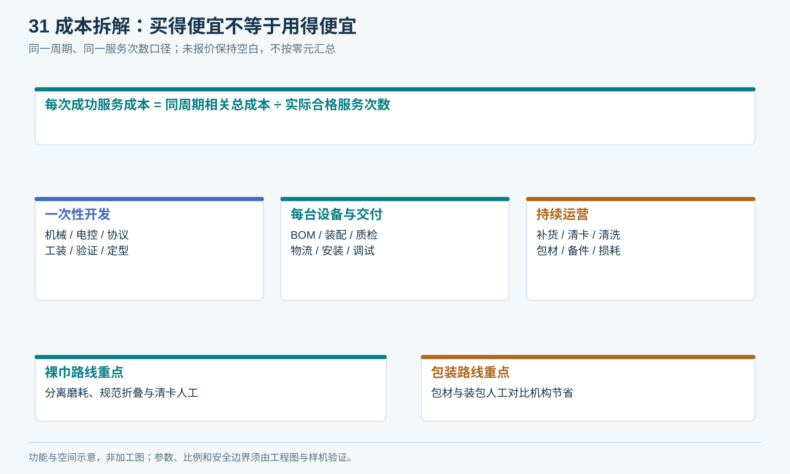
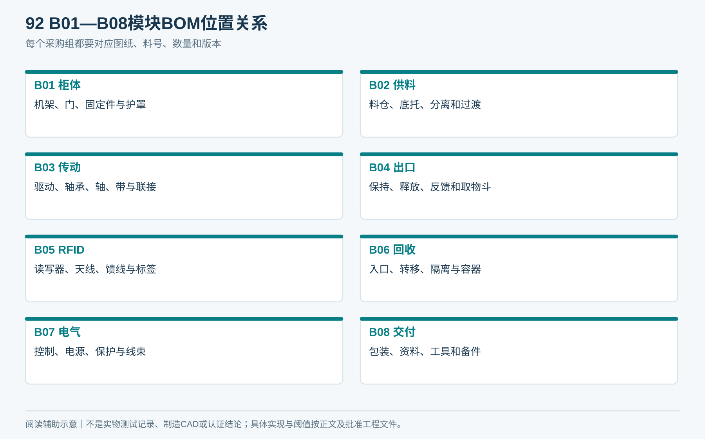
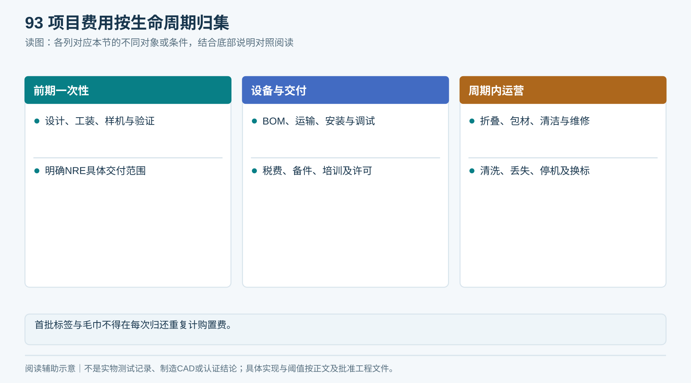
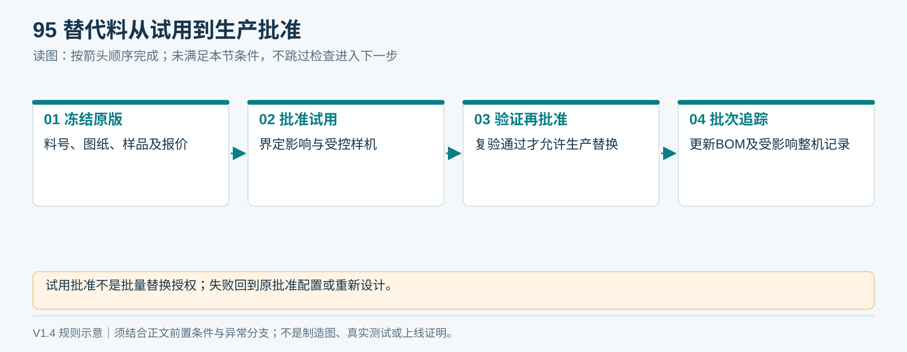

# 11｜BOM成本与采购冻结

> V1.6当前产品仅采用03章统一结构。本文保留的A/B成本比较用于历史研发或受控变更论证，不能作为第二种交付外形、装配结构或已采用的包材方案。

## 1. 成本结构

项目投入 = 一次性工程开发 + 样机和验证 + 量产设备 + 安装交付 + 同周期运营成本。

单次成功服务成本 = 同一核算周期内全部相关成本 ÷ 该周期实际完成的合格服务次数。

服务次数口径需固定，例如一次“合格发放”或一次“发放及归还闭环”，两种不能混算。资产购置可按选定周期全额列支或按明确方法分摊，但不得两种同时计入。首台与批量应分开报价。

<!-- figure-31 -->
### 图31｜成本拆解：买得便宜不等于用得便宜

*结构图没有金额、占比或柱长数据，不是报价。先统一折旧/摊销方式与服务分母，再比较A/B方案。*

**分母边界：** 本周期合格服务次数为0时，单次成功服务成本为“不可计算”，同时报告实际总投入及失败次数；不能写0元／次，也不删除失败耗材和工时。

## 2. 模块BOM清单

| BOM组 | 必含物料 | 数量规则 |
|---|---|---|
| B01 柜体 | 机架、门、护罩、机脚、固定件、表面工艺 | 按总装图 |
| B02 供料 | 料仓、底托、分离件、导向、过渡板 | 按通道数量 |
| B03 传动 | M1/M2、减速器、驱动、轴承、轴、带、联接 | 按真实驱动方案，不漏易损件 |
| B04 出口 | 保持／释放、反馈、固定隔离、取物斗 | 按通过验证的防护结构 |
| B05 RFID | 读写器、天线、馈线、标签、固定耗材 | 标签区分首批、备用和年度替换 |
| B06 回收 | 入口、转移、异常隔离、容器、在位／满载检测 | 按正常与异常容量 |
| B07 电气 | 控制器、电源、保护、传感器、线束、端子 | 按电气图和I/O表 |
| B08 交付 | 包装、说明书、标签、安装备件和工具 | 按合同范围 |

填[成本与报价表](执行表单/T04_成本与报价.md)。无报价字段保留空值且状态“未报价”；空白不能按0元汇总。NRE（一次性工程开发费）需明确是否包含图纸、打样迭代、软件、测试和模具归属。

<!-- module-figure-92 -->
**子模块图｜模块BOM逐项拆分**

*读图说明：空白报价不是0元；图示为采购范围，不是最终品牌或数量清单。*

### 联网与主控分项BOM（V1.5）

B07至少拆为：主控板及固件开发、工业I/O扩展、两路电机驱动、电流／编码器接口、耐久存储、电源转换、保护回路、天线馈线、线束端子。NET-C再单列4G模组或路由器（二选一）、SIM开通、流量续费及现场测试；NET-D额外列切换开发与故障注入验证。Broker／Liveo适配开发与运行费用独立计，不将ESP-MQTT开源误写为零集成成本。

四个主控候选只有技术路线，没有有效供应商报价；不得写“已最低价”。按相同I/O、保护、可靠性、质保及服务量比较三年或双方选定周期的总成本，明确首台开发费和批量摊销。候选来源关联SP01—SP14与T03，最终采购料号写入T04。

## 3. 不可遗漏的费用

设计修改、工装、试验损耗、RFID缝制、纸套及人工、软件许可和后续升级、整机检验、物流保险税费、现场固定、电源网络、调试差旅、备件、维护、清洗与丢失损耗。

毛巾如果已经包含在库存资产成本中，不能每次归还重复购置计价；标签首批已计入BOM时，后续只计实际新增／替换。历史报告4995元与约5000元的口径不足以覆盖整套出巾系统，不延续为定价结论。

<!-- module-figure-93 -->
**子模块图｜项目费用按生命周期归集**

*读图说明：首批标签与毛巾不得在每次归还重复计购置费。*

**闭环约束（V1.4复核）**

增加核算：持久化控制存储及故障恢复、异常单件位置、补货逐条核验工时、待核验物业响应、Liveo许可／回执／对账开发与验证。与省去打印机／大屏后的成本一起评估；未报价留空，不能当零成本。

## 4. A/B方案盈亏比较

先在相同服务范围和核算周期中分别归集A/B总成本，再各自除以实际合格服务次数。纸套总增量含所有实际消耗包材（包括失败、报损）、装包与处理人工；裸巾总增量含所有清卡工时、额外折叠／补货、易损件与已定义的停机损失。

“卡巾率×平均清卡工时×分钟人工费”只是每次尝试的维护估计项，不直接等于每次成功服务成本。两路线失败次数、人工完成和自动完成分列，确保分母与服务定义一致。

当包装能减少的机械摊销与维护成本大于其新增耗材人工时，包装方案才在该服务量下更便宜。比较低、中、高用量，分别改变卡巾率、人工费和寿命；不能只算理想满负载。

<!-- module-figure-94 -->
**子模块图｜纸套与裸巾的盈亏比较**

*读图说明：包装的机械与维护节省须大于新增包装成本；没有报价不画虚假成本曲线。*

## 5. 采购冻结与替代料

冻结清单含：料号、制造商、规格、图纸/固件/配置版本、批准样品、供应商、报价和有效期、质量验收、保修、备件以及所有权。

替代料评审分为：界定影响 → 批准受控试用 → 完成受影响验证 → 工程／质量签核生产替换 → 更新BOM与在制／已交付设备追踪。试用批准不等于允许批量装配，复验失败退回原批准配置或重新设计。皮带材质、分离垫、标签、读写器、天线、馈线、传感器和电机都可能改变实际行为，不能“参数差不多”就替换。

软件停服、供应商退出时，要能取得协议、参数备份、必要许可与本地维护方式。图纸、模具、源码和定制设计归属在采购合同中明确，不能等付清后再讨论。

<!-- module-figure-95 -->
**子模块图｜采购冻结与替代料批准**

*读图说明：“参数差不多”不构成替料批准；合同明确图纸、源码和模具权属。*

