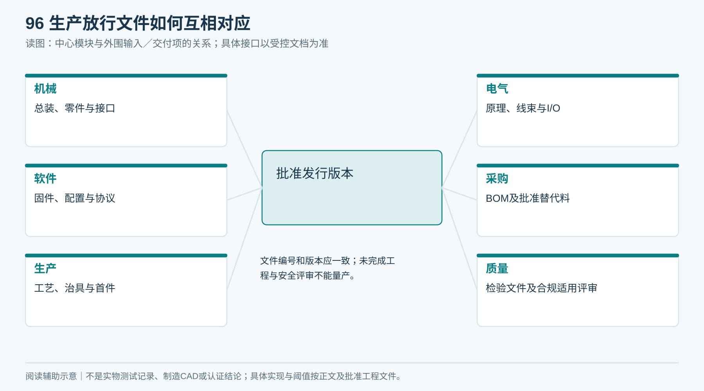
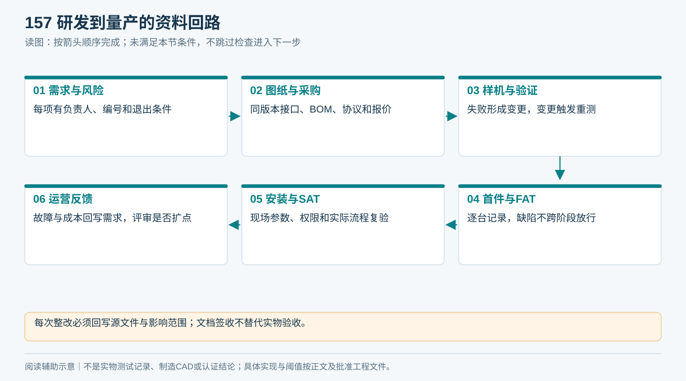
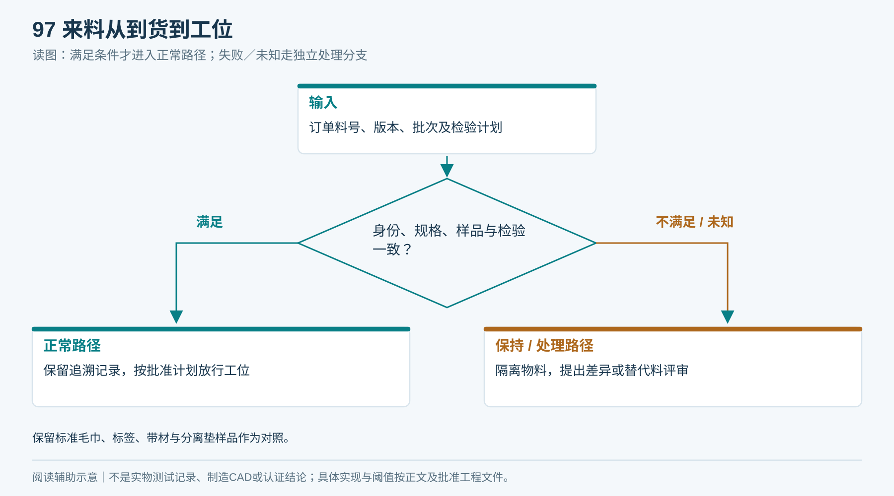
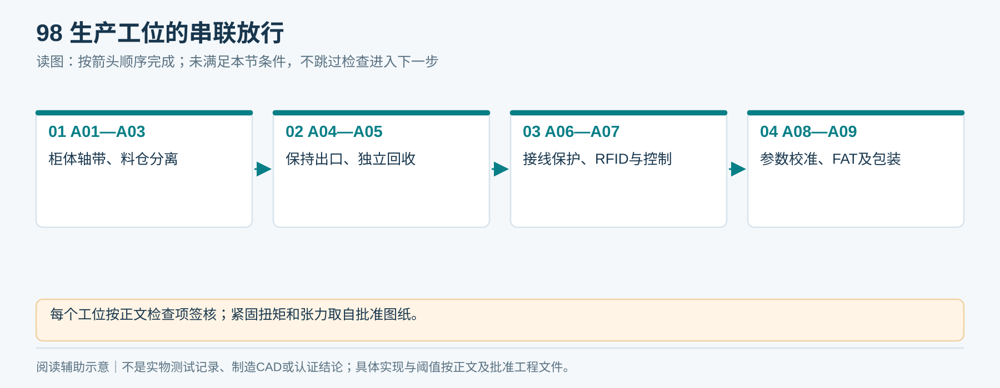
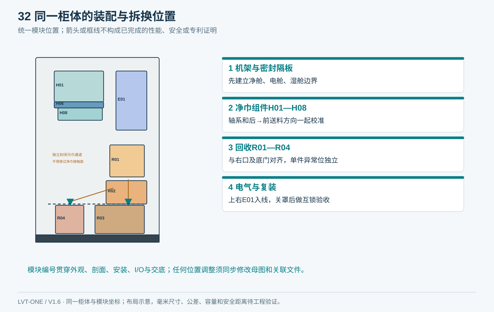
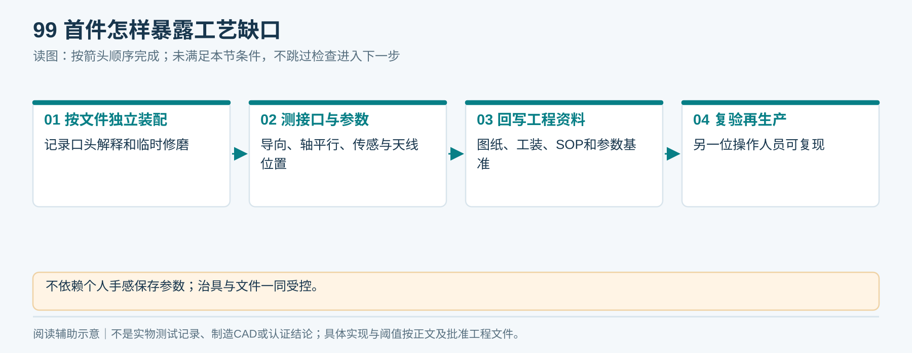
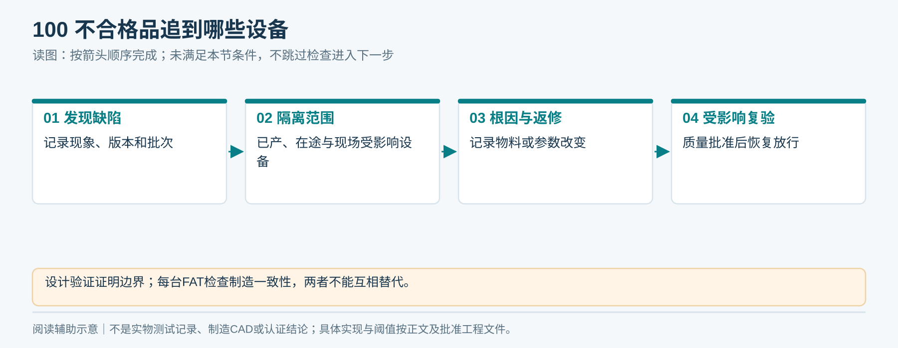
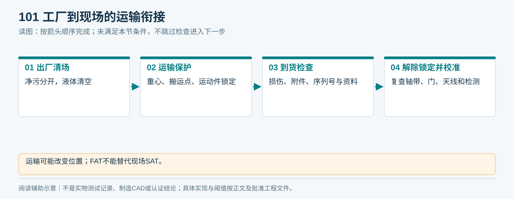

# 12｜工程出图与生产装配

**整机一致性检查：** 对照图14/17核柜形、两个开口、二维码/指示灯、主门与底门；对照图02/15核H01—H09、E01、R01—R04。外壳、总装、BOM或实物任一不一致，停止放行并用T11闭合变更，不能按“不同款式”解释。

**单一产品基线 V1.6：** 本章采用同一台柜：左上领巾、右下归还、上右独立电气舱、下部两只独立回收抽箱；净巾沿柜深从后向前送料。所有整体视图由[统一布局源](统一设计源/单一产品布局.json)和[图形一致性说明](统一设计源/单一产品说明.md)约束。

模块间以[接口冻结表](执行表单/T02_模块接口冻结.md)完成双向签核。

## 1. 生产放行前的文件包

| 文件 | 内容 | 责任人 |
|---|---|---|
| 机械总装与零件图 | 尺寸、公差、材料、表面工艺、接口、防护、拆洗 | 机械工程师 |
| 电气与线束图 | 原理、端子、电源、保护、线号、接地、I/O | 电气工程师 |
| 软件发行包 | 固件、配置、协议、版本读取、升级回退 | 固件／平台负责人 |
| BOM与批准替代料 | 与图纸逐项对应，关键件追溯 | 采购＋整机集成 |
| 工艺文件 | 装配顺序、工具、扭矩、治具、校准、首件 | 生产工程师 |
| 检验文件 | 来料、过程、FAT、抽样与不合格处理 | 质量负责人 |
| 合规适用评审 | 目标市场、结构与无线配置、测试与标识要求 | 合规／检测机构 |

没有实际工程图和关键安全评审不得量产。现有PNG均为概念说明，不能替代上述文件。

<!-- module-figure-96 -->
**子模块图｜生产放行文件如何互相对应**

*读图说明：文件编号和版本应一致；未完成工程与安全评审不能量产。*

**闭环约束（V1.4复核）**

放行文件同时包含21章闭环基线版本、协议1.2-draft冻结后的正式版、装载清单格式、取消／执行历史迁移规则、异常交接SOP和C用例证据。固件、图纸、BOM、参数与用例版本必须对应。

*每次整改必须回写源文件与影响范围；文档签收不替代实物验收。*

**V1.5联网配置补充：** 每台装配单注明MC型号／硬件版本和NET配置。按工位烧录固件、写入设备唯一证书并绑定资产序列号；不得复制整套私钥镜像。SIM、IMEI与天线料号按权限记录，交付包不包含明文私钥／Wi‑Fi密码。出厂前验证联网、证书身份、I/O映射和安全停机。

## 2. 来料检验

核对订单料号、版本、数量和批次；关键尺寸、电机/驱动组合、传感器输出类型、标签编码与重复情况按批准检验计划检查。记录替代料申请，未批准物料隔离。

同时保留毛巾和标签标准样品、合格折叠样本、皮带／分离垫材料样片。供应商变更材质、固件或标签芯片都触发变更评审。

<!-- module-figure-97 -->
**子模块图｜来料从到货到工位**

*读图说明：保留标准毛巾、标签、带材与分离垫样品作为对照。*

## 3. 装配工序与工位检查

| 工序 | 操作 | 工位放行条件 |
|---|---|---|
| A01 机架／柜体 | 去毛刺、检查材料和表面、装固定结构 | 尺寸与防护边缘合格 |
| A02 轴系／皮带 | 按图装轴承、滚筒、连接、张紧与护罩 | 转动顺畅、平行度/张紧记录 |
| A03 料仓／分离 | 装底托、导向、分离件并设初始参数 | 可调项有刻度/基准，无干涉 |
| A04 接料／出口 | 装过渡、保持段、释放和取物斗 | 不卷入、防护完整、到位反馈正确 |
| A05 回收 | 装入口、转移、异常隔离与容器 | 净污隔开、路线与容器反馈一致 |
| A06 电气／线束 | 按线号装配并检查保护连接 | 接线检查及规定电气检验通过 |
| A07 RFID／控制 | 装天线、馈线、控制器，载入批准版本 | 版本一致、通信与I/O逐点测试 |
| A08 校准／整机 | 标定检测阈值、射频、速度和停车 | 参数受控、完整样机用例通过 |
| A09 包装 | 清洁、清场、固定运动件、附交付资料 | FAT签核、运输锁定和解锁说明 |

紧固扭矩、皮带张力和检测限值必须来自批准图纸／器件说明，不在此凭空给通用数值。

<!-- module-figure-98 -->
**子模块图｜生产工位的串联放行**

*读图说明：每个工位按正文检查项签核；紧固扭矩和张力取自批准图纸。*

<!-- figure-32 -->
### 图32｜模块化装配与拆换关系

*引用同一产品布局；模块位置与图02、图17一致。*

## 4. 首件与工装

首件装配人员按文件独立完成，记录所有需口头解释或临时修磨的位置；将改动回写图纸再生产。使用料仓定位、轴平行、传感器位置和天线定位治具降低个体差异。

参数不能由某位师傅凭手感记忆。至少记录分离高度/预紧、导向位置、带速、停止触发、S1/S2/S3标定值、RFID配置、固件版本和样本批次。

<!-- module-figure-99 -->
**子模块图｜首件怎样暴露工艺缺口**

*读图说明：不依赖个人手感保存参数；治具与文件一同受控。*

**首件偏差回写：** 工位临时调整必须转T11工程变更，由机械／电气／固件责任人更新受控图纸、工艺或参数并经质量复验。未经批准的现场技巧不能继续复制到批量；新版本标明适用序列号，并追踪已装配设备是否返工。

## 5. 质量与不合格品

发现同类卡巾、错误身份、接线或安全缺陷，隔离受影响序列号和物料批次，判定已产/在途/现场影响。返修后执行受影响项目复验；不能只改一台样机参数而不追踪同批设备。

设计验证测试用于证明设计边界；FAT用于检查具体这台设备。设计通过不免除每台检查，每台短测通过也不证明寿命。

<!-- module-figure-100 -->
**子模块图｜不合格品追到哪些设备**

*读图说明：设计验证证明边界；每台FAT检查制造一致性，两者不能互相替代。*

**闭环约束（V1.4复核）**

整改不仅更换零件：建立T11，追踪受影响批次／设备，回写源图和协议，指定C／V／F／S回归范围并重测。失效记录保留，重新验收后才解封批次。

## 6. 运输与现场衔接

包装按运输方式评估振动、潮湿、倾倒风险，明确重心、搬运点、运动件锁定、箱内液体清空、毛巾独立清洁包装。现场先按解锁清单恢复机构，再校准；运输可能改变皮带、天线和传感器位置，不能跳过SAT。

生产使用[生产与首件表](执行表单/T07_生产首件与装配.md)，交付按[FAT](14_出厂验收FAT.md)及[SAT](15_安装调试与现场验收SAT.md)办理。

<!-- module-figure-101 -->
**子模块图｜工厂到现场的运输衔接**

*读图说明：运输可能改变位置；FAT不能替代现场SAT。*

**出厂到现场的身份交接：** 发运前列明测试环境任务和事件的终结证据、整机序列号、配置摘要及待关闭次要项。生产环境重新注册并核归属／版本，不能重放工厂测试指令；历史执行与取消封禁记录按D18保留，不能通过清空日志“恢复出厂”制造重复动作机会。

## 7. 同一总装源与跨专业签发（2026-09-19）

执行[22章第4节](22_固定模型下的系统集成审查与工程补充.md)：原布局JSON是空间基准，尚不是完整参数CAD；现有绘图脚本包含独立几何数值，且不能自动更新全部图。制造冻结前交付唯一原生总装、真实零件、装配变换、派生视图清单及一致性报告，不能仅重跑脚本就签发全套图。

发布组合记录CAD、电气图、BOM、固件、配置、协议、验收证据及适用序列号。外观母图、开口、分舱及模块位置受控不变；任何必须改变这些基准的冲突先提交T11批准。STEP、二维工程图与原生源成套交付；静态无包络重叠不替代运动/公差/维护或实物验收。
