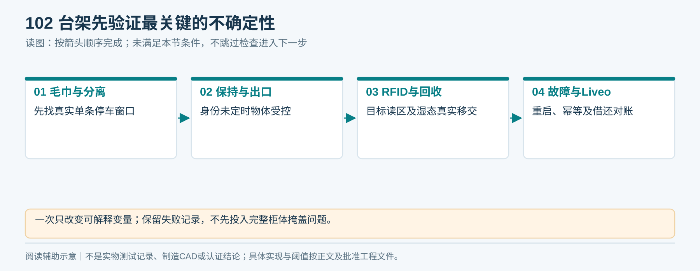
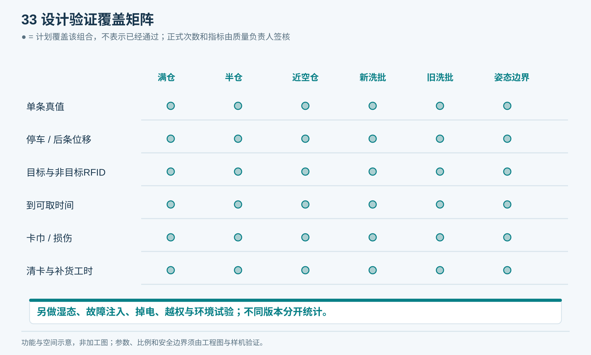
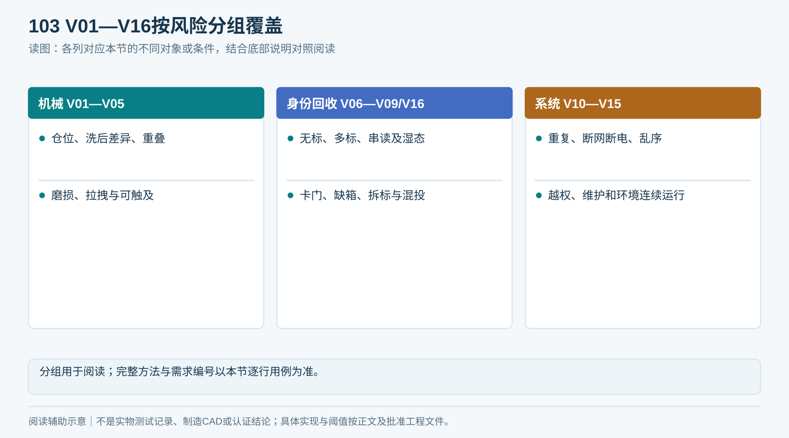
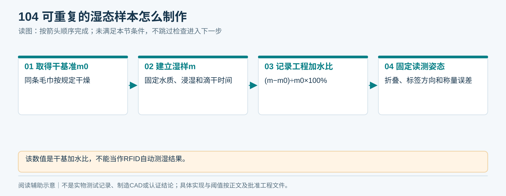
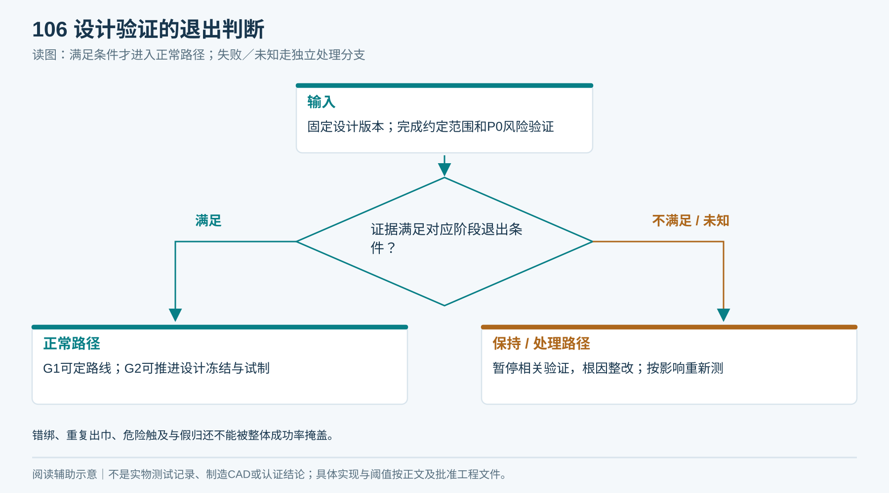

# 13｜台架试验与设计验证

## 1. 先证明哪个问题

按“毛巾规格 → 单条分离 → 保持和出口 → RFID → 湿回收 → 故障恢复 → Liveo闭环”推进。先用简单可调台架暴露连带、停车与包边问题，再投入整柜。

每轮试验固定图纸、固件、参数、毛巾批次与操作者；一次仅改变可解释的变量。失败保留，不重命名为“无效尝试”从分母删除；无效原因要在试验前定义。

<!-- module-figure-102 -->
**子模块图｜台架先验证最关键的不确定性**

*读图说明：一次只改变可解释变量；保留失败记录，不先投入完整柜体掩盖问题。*

## 2. 三层验证

1. 工程筛选：寻找有无稳定窗口，少量重复、完整观察，不宣称量产成功率。
2. 设计验证：在拟声明的全规格／环境范围，以多个批次和代表性机器验证冻结设计。
3. 生产与现场检查：使用批准用例核查每台设备与安装条件，见FAT/SAT。

首轮可按每个关键工况30次观察作为排障起点；不以此估算低概率故障上限。正式样本计划由质量负责人在试验前签核。

<!-- figure-33 -->
### 图33｜设计验证覆盖矩阵

*矩阵用于避免只测满仓或挑选新毛巾。所有标记是验证计划，不能复制为检验合格结果。*

## 3. 测试矩阵

| 编号 | 工况／刺激 | 方法与预期 | 需求 |
|---|---|---|---|
| V01 | 满、半、近空仓 | 各自记录实际出条数、停车窗口、轴与毛巾位移 | R03 |
| V02 | 新旧洗涤批次、折向、厚包边 | 覆盖规格边界，不能只用挑选样本 | R03/R11 |
| V03 | 故意双条重叠、无标签第二条 | 不把单EPC判为单条成功，评价失效检出和风险 | R03/R04 |
| V04 | 送料滑动、分离件磨损、低牵引 | 记录卡巾、损伤、干预与停机 | R03/R11 |
| V05 | 取物拉拽、探入、提前触碰 | 经风险评估的试具/方法，无危险触及或带出库存 | R02 |
| V06 | 无EPC、多EPC、错误资产状态 | 不向公共口释放，形成可恢复异常 | R04 |
| V07 | 满库存、满湿箱、邻柜标签 | 不把非目标标签计入本任务 | R04/R07 |
| V08 | 干、潮、湿、滴水及标签朝内 | 分状态报告识别、移交和异常比例 | R07/R08 |
| V09 | 回收卡门、缺箱、满箱、异常位满 | 不误销账、不丢失物体追踪 | R07/R08 |
| V10 | 重复命令、同ID异内容、并发请求 | 不重复驱动；冲突明确拒绝 | R01 |
| V11 | 状态逐一断网／断电／重启 | 不重发、不猜成功，证据补传或待核验 | R09/R10 |
| V12 | 未取走、取消竞态、事件乱序 | 额度与实物不脱离，通道不提前复用 | R05 |
| V13 | 跨项目、跨账号、伪造设备 | 拒绝且不泄露记录，不发生物理动作 | R12 |
| V14 | 维修、换件、重新标定 | 按SOP完成并记录工时，校准恢复 | R11 |
| V15 | 温湿、清洁剂、绒毛、振动、连续运行 | 按最终环境与寿命计划验证 | R02/R13 |
| V16 | 重复/非法/拆下标签、自带毛巾 | 不声称RFID能独立鉴伪，验证异常策略 | R07/R08 |

安全、耐压、接地、EMC及环境试验由符合要求的人员/机构按实际适用标准执行，本表不替代其方法或合格限值。

<!-- module-figure-103 -->
**子模块图｜V01—V16按风险分组覆盖**

*读图说明：分组用于阅读；完整方法与需求编号以本节逐行用例为准。*

**闭环约束（V1.4复核）**

V01—V16继续验证物理性能；新增C01—C44检查跨模块全链路，逐案见[21章闭环基线](21_端到端逻辑闭环与验收矩阵.md)与T13。正常至少两轮同资产；异常逐一检查实物、任务、借用额度、通道和责任。取消／乱序可先模拟；分离、湿态、夹困保护、真实交接仍须台架实测。

*C01—C44逐案记录四类结果：实物、任务、账务、通道；不能只检查App提示。*

## 4. 湿态怎么描述才可重复

以同条毛巾按规定干燥后的质量m0为基准，记录湿质量m，工程测试可用 `(m-m0)/m0×100%` 作为加水比；它不是传感器自动测出的含水率，也不与另一种湿基定义混用。记录水质、温度、浸湿方式、滴干时间、折叠、标签朝向和称量误差。

现场含氯泳池水、汗液和洗涤残留的代表性条件由运营与试验负责人确定；不能只用干毛巾和一杯纯水替代实际湿巾测试。

<!-- module-figure-104 -->
**子模块图｜可重复的湿态样本怎么制作**

*读图说明：该数值是干基加水比，不能当作RFID自动测湿结果。*

## 5. 数据与统计

每次记录：试验ID、机器/物料/参数版本、毛巾ID、真值条数、读到EPC集合、关键传感时间、结果、故障、人工分钟、视频文件和操作人。用[逐次试验表](执行表单/T05_逐次试验记录.md)，同时保留设备原始日志。

- 正常成功率：满足完整正常发放定义的次数／预先定义的有效正常尝试。
- 挑战用例：单独报告检出与错误后果，不能混入正常业务分母美化数据。
- 平均时间与P95均保留，时间点按02定义。人工排障后的完成不算自动成功。
- 分批次、机器、满空仓、干湿条件报告，汇总值不得掩盖某边界集中失败。

若近似独立且同类工况的n次试验中零失效，单侧95%失败率上界约为 `1-0.05^(1/n)`；n=3000时约0.10%。这不能证明绝对零风险，重复同一条毛巾、同一台机、同一姿态也不足以代表整体使用。发放、归还、错误账务分别统计。

<!-- module-figure-105 -->
**子模块图｜每次试验怎样进入统计**

*读图说明：预先定义有效尝试分母；混合版本和挑选样本不能合成通过率。*

**时延记录与试验边界：** 按02章分别记录T_service与T_user，注明计时端、时钟校准和误差。失败、超时与人工介入不从原始尝试中删除，正常工况和故障挑战分层报告；缺测值标缺测。所有阈值、样本分层和中止条件必须在执行前写入D16/T05，不能试后挑选有利样本。

## 6. 退出条件

- G1：确定有可重复的单条分离窗口，失败可解释，完成A/B总成本比较。
- G2：冻结结构和参数后，完整设计验证通过，P0风险均有证据关闭。
- 每次设计改动标识影响哪些验证并重测；不能在混合版本的数据上统计一个通过率。

出现错误账号记账、意外重复出巾、危险触及或虚假归还，停止受影响验证并调查；不能用整体99.5%掩盖这些关键错误。

<!-- module-figure-106 -->
**子模块图｜设计验证的退出判断**

*读图说明：错绑、重复出巾、危险触及与假归还不能被整体成功率掩盖。*

**闭环约束（V1.4复核）**

退出按阶段判定：G2完成本阶段适用设计／协议用例及真实物理证据，未来场地、值班或运输用例保持“待G3/G4执行”，不得提前填通过；G3对具体设备执行FAT并注明同版本可继承证据；G4完成现场与人员用例，关键项通过后才试运营，G5再依据运营数据判断扩点。全部C01—C44均须在适用阶段有结果或经批准的不适用理由，失败整改复验；简化模型结果不能填作真机结果。可靠性样本仍由D16事前批准，44个场景不是可靠性统计。

