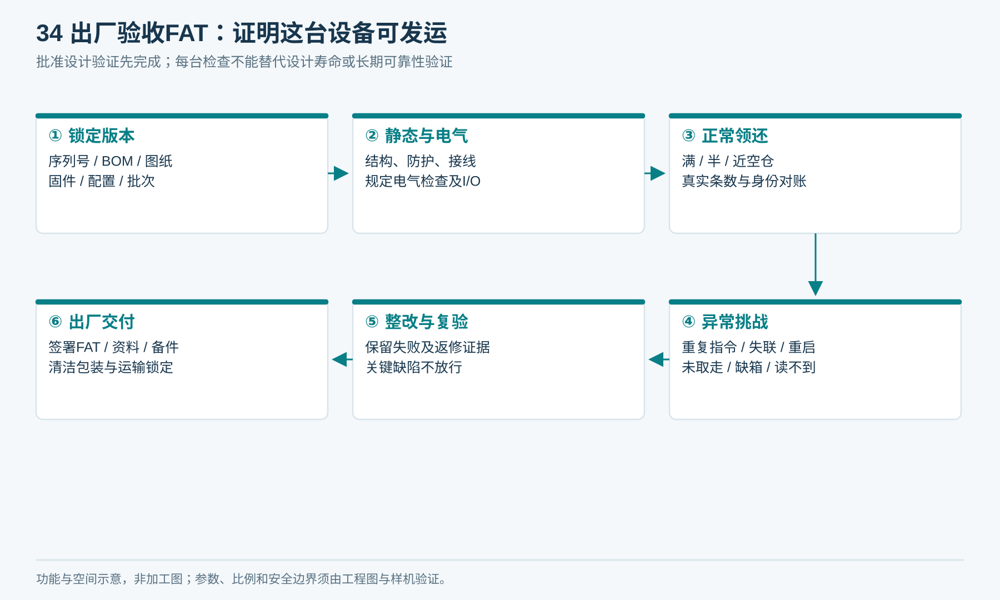
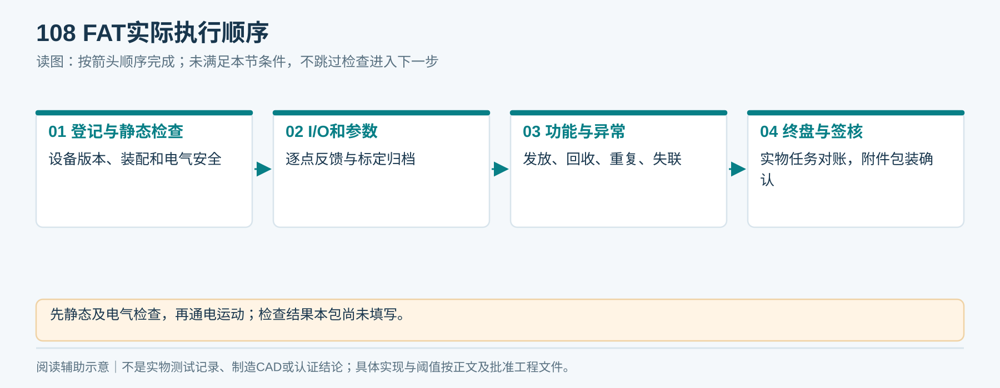
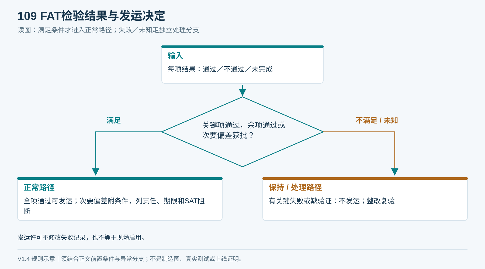
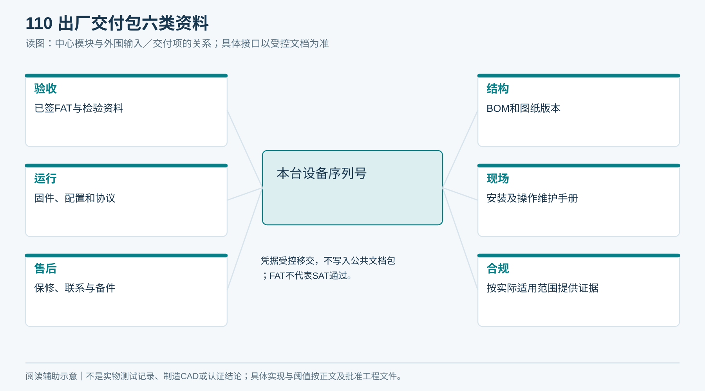

# 14｜出厂验收FAT

**整机一致性检查：** 对照图14/17核柜形、两个开口、二维码/指示灯、主门与底门；对照图02/15核H01—H09、E01、R01—R04。外壳、总装、BOM或实物任一不一致，停止放行并用T11闭合变更，不能按“不同款式”解释。

FAT指设备在工厂发运前的验收。状态：验收方案和表单已编制，未执行真实验收。

## 1. 入场条件

批准版本的需求、图纸、BOM、固件、参数、设计验证和适用合规资料齐全；设备有唯一序列号，检验仪器有效，毛巾与标签样本可追溯。设计验证未通过不得用一轮FAT短测代替。

<!-- figure-34 -->
### 图34｜出厂验收FAT：证明这台设备可发运

*对应F01—F13及T08。图中阶段不表示已执行，空白记录不得视为通过。*

**V1.5通信验收补充：** 按09章执行NET01—NET08中对应出厂配置的台架用例；必须连Liveo指定测试Broker而非厂家云。见证双向QoS 1、TLS认证、防越权、防旧命令、断电补传和切网不重复出巾。供方视频只作证据之一，记录整机／板卡／固件版本、原始日志与实物结果；纯网络连接成功不能判FAT领还闭环通过。

## 2. 每台验收清单

| FAT编号 | 检查 | 合格依据／证据 |
|---|---|---|
| F01 | 型号、序列号、物料/图纸/固件/参数版本 | 与批准清单逐项一致 |
| F02 | 外观、尺寸、毛刺、稳定性与安装件 | 图纸和现场接口要求 |
| F03 | 传动、防护、门与维护入口 | 装配记录、风险评估对应验证 |
| F04 | 接线、保护接地及规定电气测试 | 合资格人员按批准方法和限值记录 |
| F05 | I/O逐点与断线／矛盾状态 | 真实输入反馈一致，异常不误触发 |
| F06 | 满、半、近空仓发放 | 实际一条、身份正确、过程可追溯 |
| F07 | 无标签、多标签、通道遗留物 | 阻断正常释放并保留任务 |
| F08 | 未取走与取走 | 不误取消，取走确认及复位正确 |
| F09 | 湿归还、卡门、缺箱和异常路线 | 物体与账务一致，异常可追踪 |
| F10 | 重复指令和重启恢复 | 不发生第二次动作或丢任务 |
| F11 | 断网、补传和乱序 | 平台/柜端对账，无重复记录 |
| F12 | 清卡、清洁、更换易损件 | SOP可执行，工具和工时记录 |
| F13 | 文件、备件、标签、包装与运输锁 | 交付清单齐全且可打开 |

建议工程首批每台F06分别做满、半、近空各20次，并执行关键异常用例；该数量只是过程检查起点，由质量负责人结合设计验证确定最终检验计划，不作为寿命或99.5%的统计证明。

<!-- module-figure-107 -->
**子模块图｜每台FAT检查对象**

*读图说明：具体这台逐项留下证据；短测次数不代表寿命或总体可靠性。*

**闭环约束（V1.4复核）**

每台FAT在原清单上增加C05/C06/C07/C08/C10/C11/C12/C13/C17/C24/C25/C26/C30/C32的适用实机项；具体故障注入采用批准安全工装。其余C项引用同版本设计验证并在T13写明继承依据；不适用须说明，不得空白算通过。

*C01—C44逐案记录四类结果：实物、任务、账务、通道；不能只检查App提示。*

## 3. 测试步骤

1. 记录整机序列号与全部版本，拍摄内部装配和铭牌，不包含凭据。
2. 先完成静态与电气安全检查，再允许通电运动测试。
3. 按F05点检，标定参数写入版本档案。
4. 执行发放、归还、重复指令和失联用例，保存每次真值与日志。
5. 核对试验前后每条毛巾和任务，清空未终结异常，不删原始证据。
6. 检查清洁、包装、运输固定和附件，双方签核。

<!-- module-figure-108 -->
**子模块图｜FAT实际执行顺序**

*读图说明：先静态及电气检查，再通电运动；检查结果本包尚未填写。*

## 4. 不合格处理

安全、错绑、假归还、重复发放属于阻断项；不得用备注带病放行。其他偏差按责任、期限、影响和双方批准处理。返修记录包括原因、物料/参数变化及复验结果。

逐项检验结果限定为“通过／不通过／未完成”。另设发运决定“允许／附条件允许／不允许”：只有全部安全与关键功能通过，剩余确属次要偏差且双方书面批准时，才可附条件发运，列出责任人、期限、现场关闭证据及启用阻断条件。不能把失败检验改写为通过，也不能把发运许可当现场启用许可。

<!-- module-figure-109 -->
**子模块图｜FAT缺陷如何处理**

*读图说明：安全与关键功能缺陷不能有条件放行；不能以备注绕过阻断项。*

## 5. 出厂交付包

机器与备件、签署FAT、BOM/图纸版本、安装手册、操作维护手册、参数备份、固件与协议、检验和合规资料、维修联系及保修条款。凭据采用受控渠道移交，不放本公共资料包。

填写[FAT记录表](执行表单/T08_FAT记录.md)。FAT通过不等于现场安装、网络授权或真实住户使用已通过。

<!-- module-figure-110 -->
**子模块图｜出厂交付包六类资料**

*读图说明：凭据受控移交，不写入公共文档包；FAT不代表SAT通过。*

