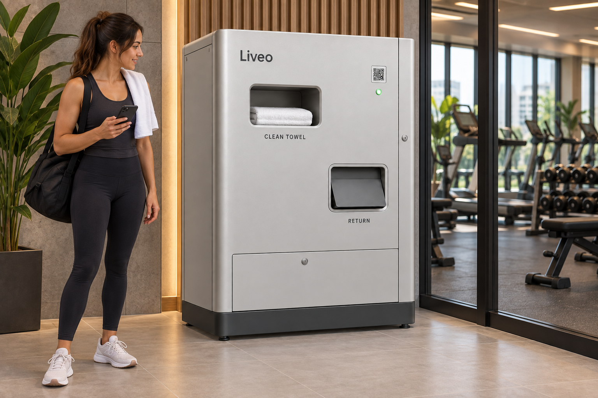
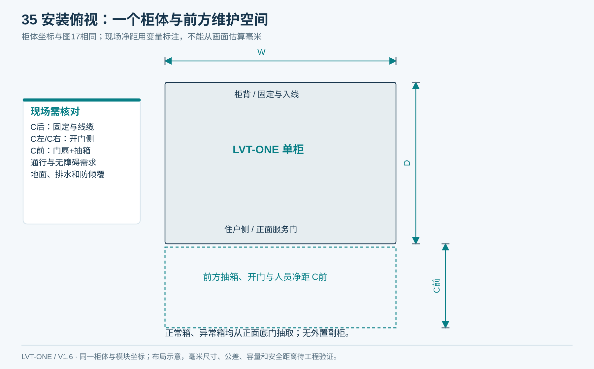
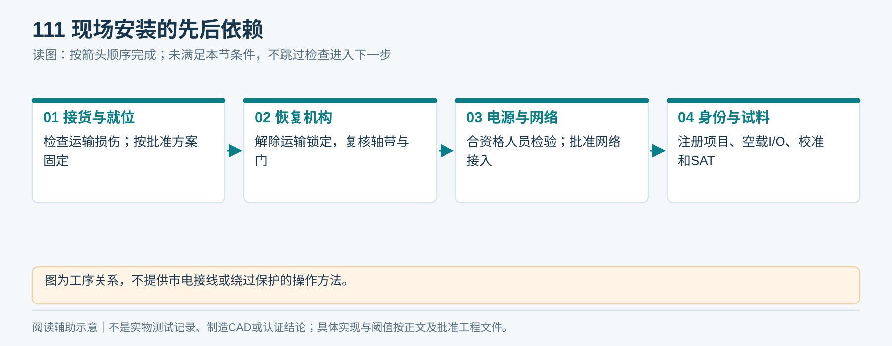
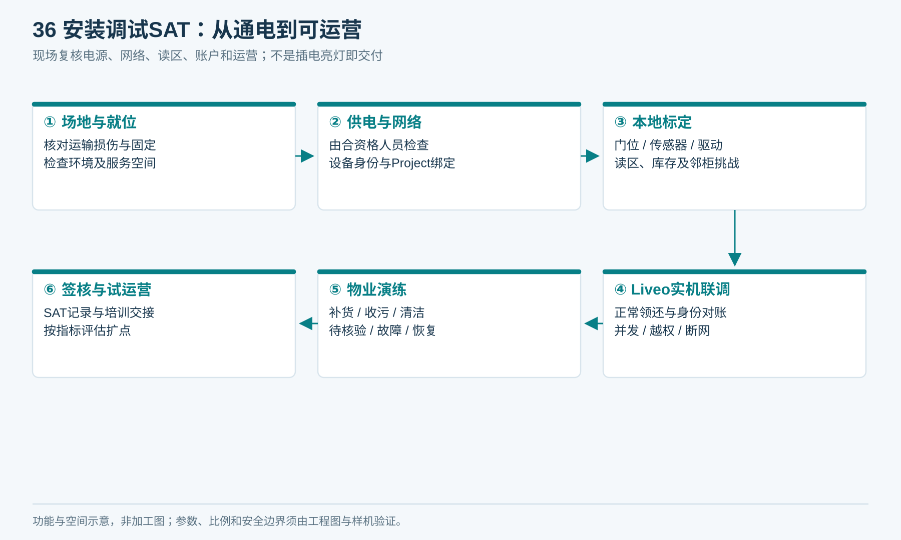
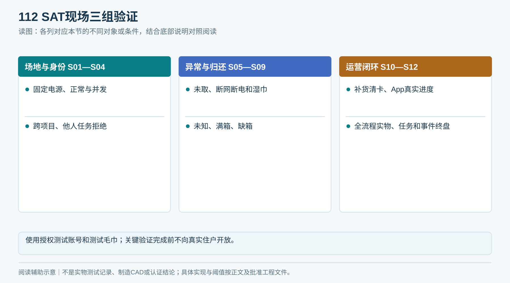
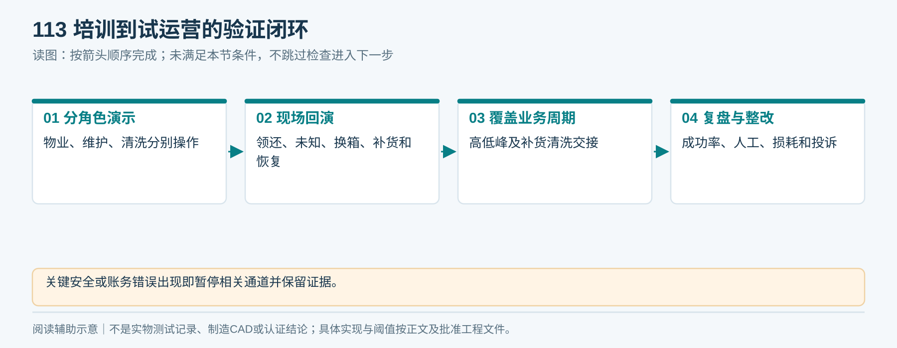
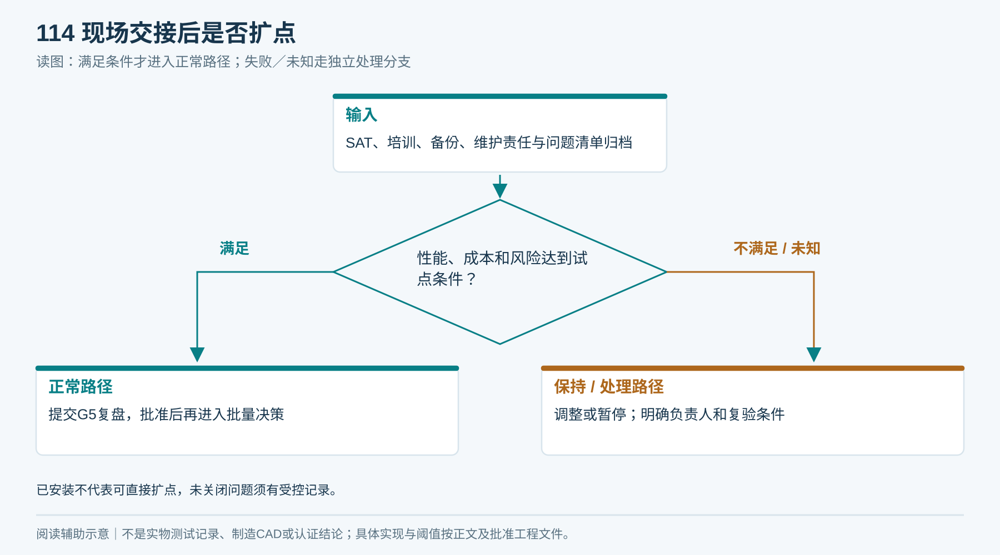

# 15｜安装调试与现场验收SAT

**整机一致性检查：** 对照图14/17核柜形、两个开口、二维码/指示灯、主门与底门；对照图02/15核H01—H09、E01、R01—R04。外壳、总装、BOM或实物任一不一致，停止放行并用T11闭合变更，不能按“不同款式”解释。

**单一产品基线 V1.6：** 本章采用同一台柜：左上领巾、右下归还、上右独立电气舱、下部两只独立回收抽箱；净巾沿柜深从后向前送料。所有整体视图由[统一布局源](统一设计源/单一产品布局.json)和[图形一致性说明](统一设计源/单一产品说明.md)约束。

SAT指安装地点的现场验收。状态：可执行流程已编制；场地测量、安装和验收尚未完成。

<!-- figure-16 -->
### 图16｜住户使用场景效果

*同一外观母图置入健身房入口，柜体及两个开口一致；图为设计场景，实际高度、通行与可达性须现场核验。*

## 1. 到场前勘察

填写[场地与SAT记录](执行表单/T09_场地与SAT.md)：Project/Location、负责人、通行和搬运尺寸、地面承重及平整、固定基材、维护门开启空间、取物高度、周边通行、飞溅/积水/雨淋/盐雾或泳池环境、清洁方式、电源、网络、信号覆盖、湿箱转运路线和物业施工窗口。

不能只在平面图上放一个柜子。若现有防护能力与实际飞溅、露天或冲洗环境不匹配，应调整位置或重新验证结构后安装。

<!-- figure-35 -->
### 图35｜安装与检修空间：俯视尺寸关系

*同柜俯视与正面抽箱空间；现场检修净距与防倾覆仍须勘察和验证。*

**到货异常先处理：** 运输损伤、倾斜、渗漏、固定件缺失或电气保护不明时，暂停通电与安装下一步，记录包装／序列号／损坏证据并转整机责任方。修复及复验后才能继续；不得因FAT曾通过而跳过到货核验。

**V1.5现场联网补充：** 按05章冻结NET-W/E/C/D，核实际安装点网络、2.4GHz覆盖或网口、金属柜关门后的信号、DNS/NTP与MQTT/TLS出站策略。蜂窝配置现场核SIM/APN、运营商及断网恢复；NET-D核切换。按09章NET01/02/05/06/08现场适用步骤验证，并将实物、柜端和Liveo借用记录对齐；台架联网不代替现场结论。

## 2. 安装顺序

1. 清点并检查运输损伤、版本和FAT资料；损坏件隔离。
2. 按批准搬运方案就位，水平与防倾倒固定由适当人员完成，核对现场基材。
3. 按说明解除运输固定，检查轴带、门、传感器与天线位置。
4. 由合资格人员完成供电、保护与必要电气检验；设备不能以不适用临时插线方式长期运行。
5. 接入批准网络；明确出站目的、端口、域名、时间同步与维护方式，禁止默认开放公网入站管理。
6. 注册设备唯一身份，绑定正确Project/Location与配置；凭据不复用其他项目。
7. 空载自检、I/O、受控试料、射频标定，再进行账号和业务联调。
8. 通过SAT后培训交接并开始受控试运营。

<!-- module-figure-111 -->
**子模块图｜现场安装的先后依赖**

*读图说明：图为工序关系，不提供市电接线或绕过保护的操作方法。*

## 3. 首次调试参数表

必须保存基准：设备版本、料仓和分离件位置、皮带速度与停车规则、门反馈、S1/S2/S3阈值、回收路径、RFID地区和天线/功率、网络和事件存储配置。所有参数都能导出并恢复，不只有拍照。

安装后重新进行满库存、满湿箱、周边标签和邻柜挑战。环境变化会改变读区；出厂标定不能自动替代现场结果。

<!-- figure-36 -->
### 图36｜安装调试SAT：从通电到可运营

*对应S01—S12及T09。供电、无线和安装要求按目标市场适用规则与现场条件确定。*

## 4. 现场验收用例

| SAT编号 | 现场动作 | 预期证据 |
|---|---|---|
| S01 | 检查固定、电源、空间、防水环境 | 勘察与安装记录一致 |
| S02 | 正常认证账号扫码领巾 | 一条、身份对应、取走后记录正确 |
| S03 | 同时两个用户请求同通道 | 只接受一个活动任务，另一请求明确返回忙 |
| S04 | 他项目账号／设备引用／他人任务 | 拒绝且设备无动作，无数据泄露 |
| S05 | 领巾后未取走、请求取消 | 不自动再发、不把物体遗留与额度分离 |
| S06 | 发放中断网及恢复 | 本地安全，平台最终与实物一致 |
| S07 | 选定状态受控断电与恢复 | 无意外发放，未知结果待核验 |
| S08 | 实际泳池/健身房湿巾归还 | 身份及落箱证据完整，借用正确解除 |
| S09 | 无法识别／异常位满／正常箱缺失 | 正确阻断或隔离，不显示假成功 |
| S10 | 补货、收污、清洁和清卡演练 | 物业人员按SOP完成并对账 |
| S11 | 可用性、显示文案、网络和告警 | App进度与设备真实状态一致 |
| S12 | 全流程终盘 | 所有毛巾位置、任务和事件可核对 |

使用授权测试账号和可追溯测试毛巾；真实居民开放前完成关键越权与异常验证。断电测试在受控条件下执行，不能让居民在危险动作旁参与故障试验。

<!-- module-figure-112 -->
**子模块图｜SAT现场三组验证**

*读图说明：使用授权测试账号和测试毛巾；关键验证完成前不向真实住户开放。*

**闭环约束（V1.4复核）**

SAT复核C01全生命周期（包含第二轮发放）、C02/C03权限额度、C18代还、C19/C20乱序、C23/C24异常容量、C25/C26断网、C27/C28补货、C29责任超期、C31规则变更与C32恢复。剩余C项须有同版本FAT／设计验证证据及现场适用性确认，组成完整44案证据包。

*C01—C44逐案记录四类结果：实物、任务、账务、通道；不能只检查App提示。*

## 5. 培训与试运营

培训对象分别为物业操作、技术维护和清洗人员。要求现场演示正常领还、未识别处理、缺箱、停机、补货、报修和恢复；培训不能只有一份PDF。

试点建议覆盖至少两个补货/清洗周期及典型高峰低峰，实际时长由样本数量与风险决定。每日检查自动成功率、人工干预、异常积压、耗材、损耗、出巾时延和住户投诉，不能只看累计领用量。

出现安全异常、错绑、重复发放或假归还，立即暂停相关通道并保全证据；完成根因、整改和复验才恢复。

<!-- module-figure-113 -->
**子模块图｜培训到试运营的验证闭环**

*读图说明：关键安全或账务错误出现即暂停相关通道并保留证据。*

## 6. 交接与退出

SAT签核、未关闭问题、培训记录、设备和备件序列号、维护责任与响应时限、版本备份、清洗交接和支持渠道归档。性能与成本达到试点目标后进入G5批量决策；未达到先修改或暂停，不默认扩点。

<!-- module-figure-114 -->
**子模块图｜现场交接后是否扩点**

*读图说明：已安装不代表可直接扩点，未关闭问题须有受控记录。*

**闭环约束（V1.4复核）**

物业必须签T_ack/T_resolve/T_pickup、值班名单、升级联系人、隔离位容量及洗涤交接责任。真实演练一次待核验从建单到结案、设备恢复的全过程；没有接单能力不进入自动运营。

