# 16｜运营维护与故障处理

## 1. 每班／每日例行工作

检查柜体与取物口、净污隔离、箱在位/满载、泄漏、异常任务积压、剩余净巾和告警。按批准清洁方法处理接触面，不能直接向电气和传动部位喷淋。

补货量根据实际需求和服务窗口确定；净巾必须经过干燥、QC与标签核验，按冻结折法和方向装入。补货时暂停出巾、确认通道物体与任务、打开维护门、核对数量、复位后执行必要自检。

收污先暂停受影响回收路径、关闭并核对箱体交接，登记正常箱与异常隔离位；换空箱后确认在位与路由反馈。不得将待核验物品混入普通箱造成证据丢失。

<!-- module-figure-115 -->
**子模块图｜每日运营检查与补货收污**

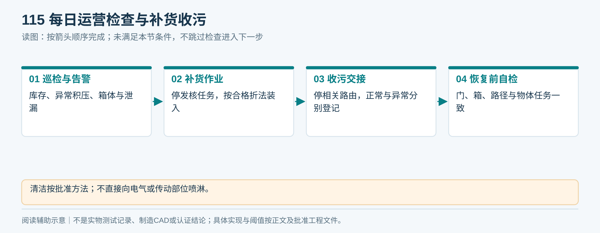

*读图说明：清洁按批准方法；不直接向电气或传动部位喷淋。*

**闭环约束（V1.4复核）**

补货必须六项准入（QC、有效身份、原账结束、无冻结、目标清单、实物一致）；已有读写器逐条核对。未结账的洗净毛巾停在待入库。换箱另记binId＋容器周转批次＋封签／交接单，固定箱号不能代替每次交接。

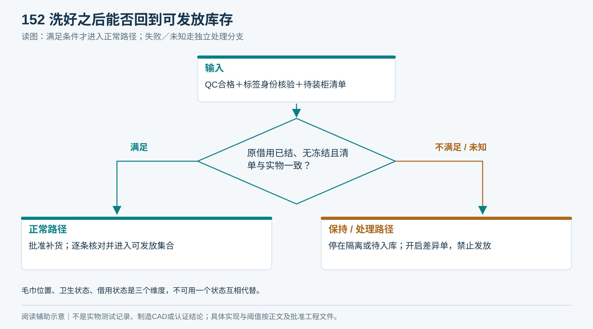

*毛巾位置、卫生状态、借用状态是三个维度，不可用一个状态互相代替。*

**换箱竞争处理：** 维护占用获得后，确认不存在尚未完成的转移及路线预留，再封存旧binCycle和清单；新箱生成新binCycle并实测在位／满载反馈。旧路线许可不能作用于新箱，恢复前由柜端与平台核清预留、实际数量和异常物去向。业务冻结批次若必须卫生转运，使用07章封存交接，保留原责任单与接收人。

## 2. 住户能看到的状态

> **读图前置条件（V1.4）：** 图中“已记录领用”对应平台业务已确认，不是柜端刚探测到取走；等待同步时单独显示。

| 状态 | 建议简短表达 |
|---|---|
| 正在出巾 | 正在准备毛巾，请在取物口等待 |
| 可取 | 请取走毛巾 |
| 平台已确认借出 | 已记录领用 |
| 回收待核验 | 已收件，正在核验；请查看处理进度 |
| 网络待同步 | 已记录本次操作，结果同步中 |
| 通道故障 | 当前暂停服务，请联系物业 |

界面内容应由真实状态驱动；传感器／联网不确定时不能显示“归还成功”。技术错误码保留给维护界面，住户不需理解M1、EPC等实现细节。

<!-- module-figure-116 -->
**子模块图｜真实状态怎样显示给住户**

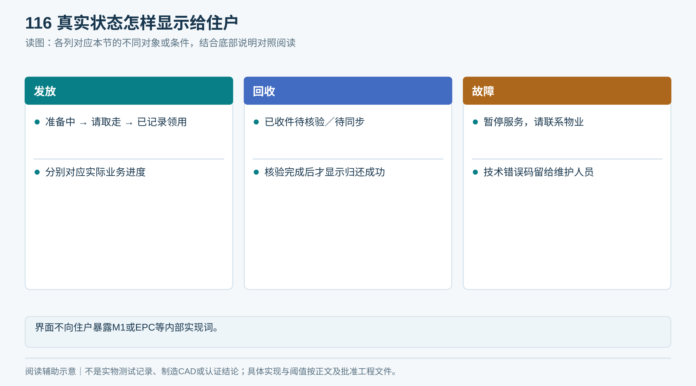

*读图说明：界面不向住户暴露M1或EPC等内部实现词。*

**闭环约束（V1.4复核）**

柜端探测已取走、平台确认借出是两个阶段，前者仍待同步时不能显示“已记录领用”。归还分等待投放、已收件待核验、结果待同步、平台确认归还、政策处置。政策免责不得显示实物已归还。

## 3. 故障处置卡

| 故障 | 第一动作 | 恢复前必查 |
|---|---|---|
| 卡巾／连续送料 | 停相关机构，禁止新任务 | 隔离能源后清卡，逐条核验实物和任务 |
| 未取走 | 保留占用，通知物业处理 | 回收遗留物、卫生处置、受控释放预留 |
| 无EPC／多EPC | 保持受控，不向公共区释放 | 位置、邻近标签、资产、读区参数 |
| 湿回收读不到 | 进入可追踪异常路径或保持 | 实物身份、异常位和回执对应 |
| 箱满／箱缺失 | 停对应接收 | 更换并记录数量、复核在位 |
| 断网 | 不接新领还；已有任务按许可与安全条件收尾，保留日志 | 恢复后补传与对账，无重复动作 |
| 重启后未知 | 锁定通道并待核验 | 物体位置、上一任务、执行件反馈 |
| 异常电气／泄漏 | 停机并由合资格人员处置 | 故障消除及规定检查通过 |

任何人工补正包括：操作人、原因、任务、实物身份、证据、前后状态和时间。不能直接删任务或手改数字掩盖差异。

<!-- module-figure-117 -->
**子模块图｜故障处置按实物位置分类**

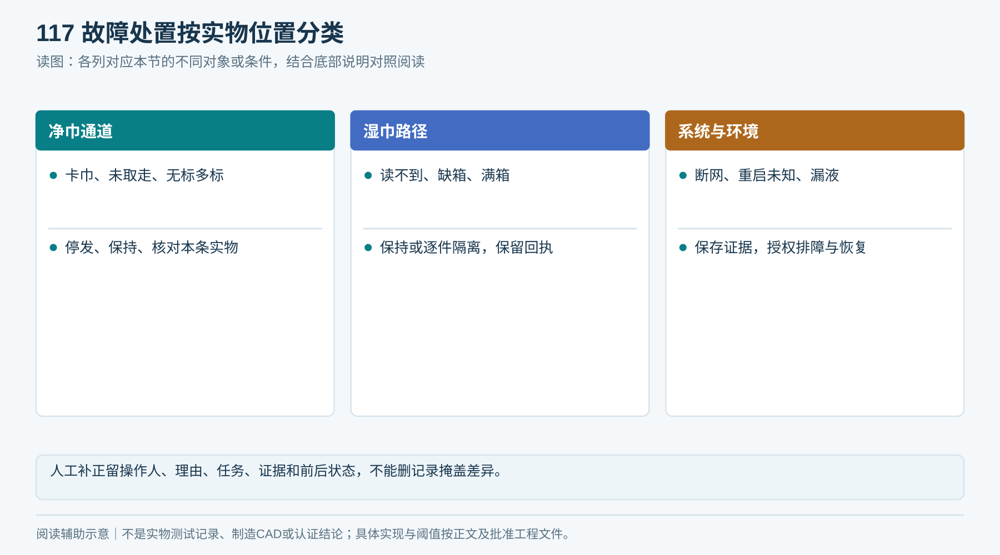

*读图说明：人工补正留操作人、理由、任务、证据和前后状态，不能删记录掩盖差异。*

<!-- figure-37 -->
### 图37｜卡巾排障：先看物体，再看电机

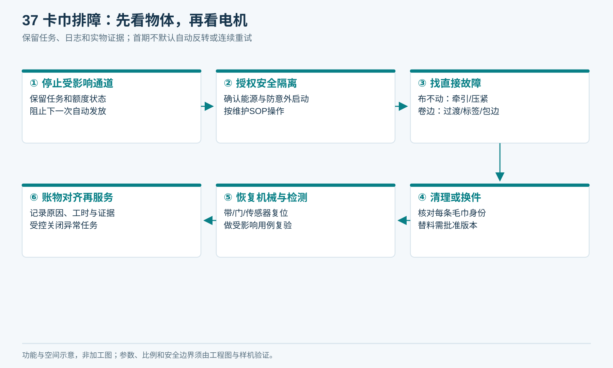

*无法确认上一任务是否交付时，不把它直接改成功或取消。维修工时进入运营成本。*

**闭环约束（V1.4复核）**

所有待核验建立T14责任单，填写指派责任人、实际接单人及时间（待响应时留空）、T_ack/T_resolve及单件保管位置；超时升级主管，不自动罚款、销账或放通道。物体转交须签收，未签收仍属原责任。关单须实物／批准损失去向、业务与额度结论、审计和用户可查询结果；若政策免责而物体未找到，关联资产差异子单继续负责。

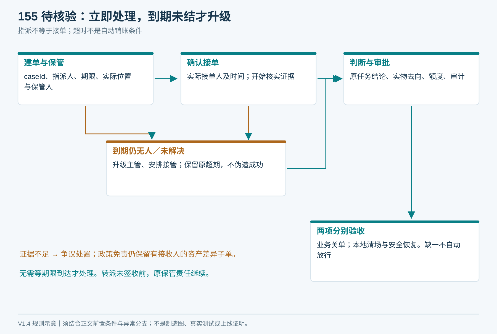

*超时只触发升级；证据不足不能自动罚款、销账或放开通道。*

## 4. 维护周期怎么定

按供应商说明、实际使用量和试点磨损确定皮带、分离垫、轴承、门件、标签、传感器的检查及更换周期；本文不给未经试验的固定寿命。维护工作量记录在[运营表](执行表单/T10_运营维护记录.md)。

备件优先准备单点故障且交期长的部件及高磨耗件；数量按设备数量、故障率和补货周期计算。未经批准的替代料不得现场随意替换。

<!-- module-figure-118 -->
**子模块图｜维护周期从何而来**

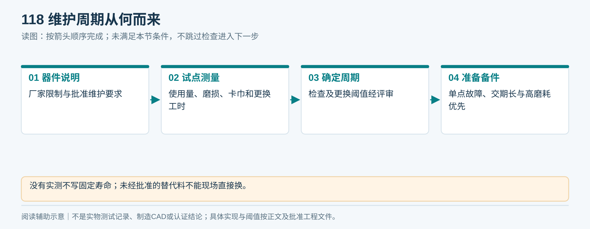

*读图说明：没有实测不写固定寿命；未经批准的替代料不能现场直接换。*

## 5. 版本与远程维护

升级前确认无活动任务、实物清场、备份参数、可回退。维护账号最小权限并留审计，不能用通用出厂密码；参数调整后记录影响并复验。对安全许可和关键账务状态的远程变更应受控，不能提供无条件“强制出巾”功能。

<!-- module-figure-119 -->
**子模块图｜远程维护前的状态关口**

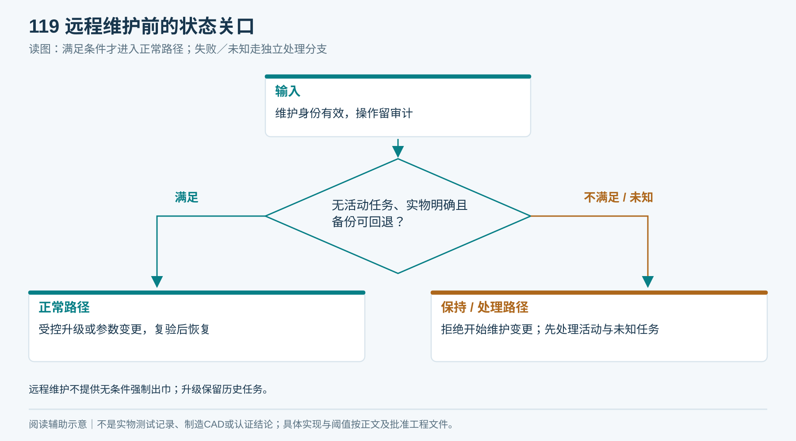

*读图说明：远程维护不提供无条件强制出巾；升级保留历史任务。*

**闭环约束（V1.4复核）**

升级回退不回退执行历史；恢复需平台原任务结论、事件对账、身份与位置、本地空通道及保护反馈全部确定。清卡或手动复位不能一次性清除账务与设备异常。

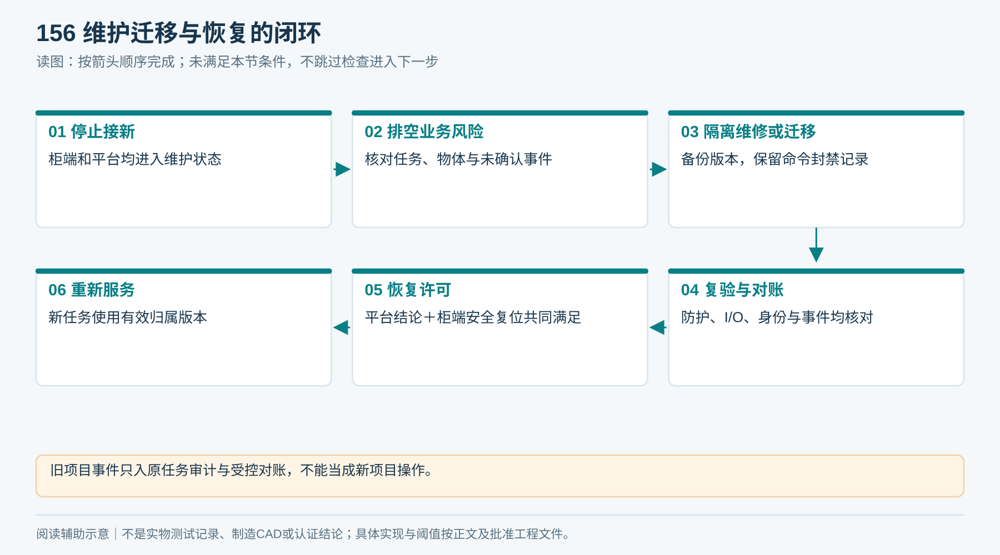

*旧项目事件只入原任务审计与受控对账，不能当成新项目操作。*

## 6. 运营指标

每台、每项目分开统计：需求量、真实成功发放、真实归还、待核验数及最长等待、双条/卡巾/损伤、重复命令阻断、错绑、补货工时、清洁工时、维修工时、耗材、清洗、损失、停机时长。

“已收件待核验”不能并入“自动归还成功”；人工处理后成功与自动成功分列。库存按互斥物理位置分析；借用及卫生另列，避免已收件但借用待核验重复计数。报废／损失是经批准的资产移出，不把全部盘差叫丢失。

<!-- module-figure-120 -->
**子模块图｜运营指标怎样避免看错**

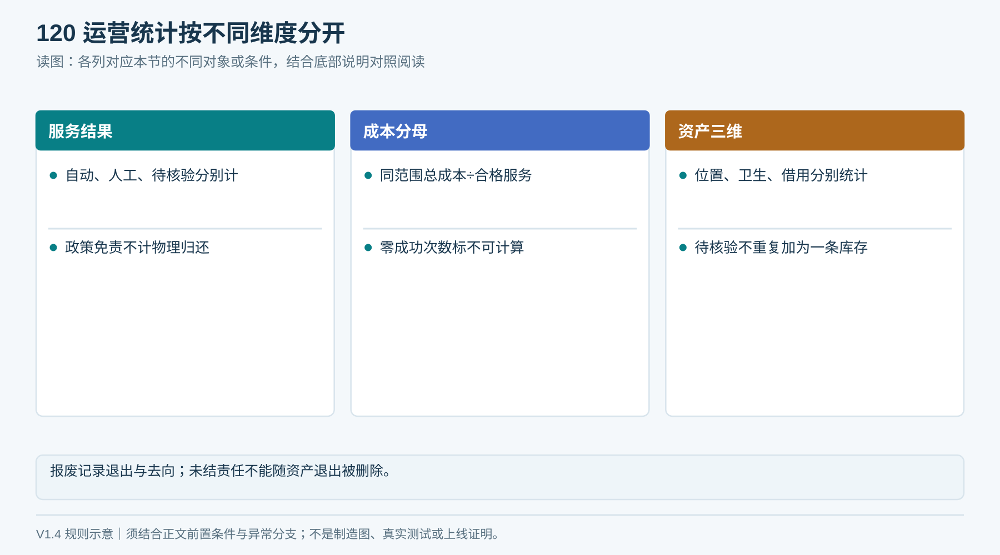

*读图说明：按每台和每Project统计；盘差不一概叫作丢失。*

**统计不重计：** 资产位置、卫生与借用状态分维度展示，待核验不得再作为一份实物库存加到隔离位上；报废有批准退出记录并保留未结责任。成功服务成本按11章处理零分母。待同步、人工补正、政策免责和自动归还分别计数，不能合并为自动成功率。

## 7. 停运／迁移

停止新任务，处理或交接未结束借用，盘点物品和异常，撤销或变更设备项目绑定与凭据，按批准保留期归档记录。迁移后重新执行现场必要检查和标定，不能沿用另一地点的读区结论。

<!-- module-figure-121 -->
**子模块图｜停运或迁移要闭合哪些事项**

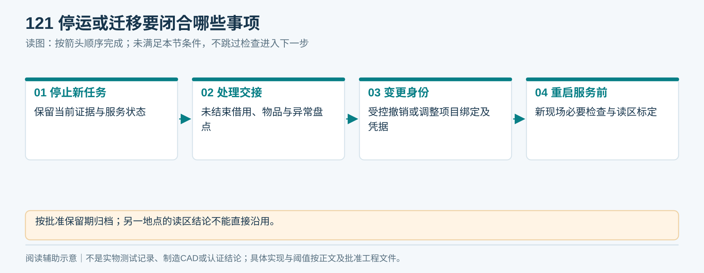

*读图说明：按批准保留期归档；另一地点的读区结论不能直接沿用。*

**闭环约束（V1.4复核）**

先封存旧归属与旧任务责任，再变更assignmentVersion和凭据。旧事件仅入原项目审计／受控对账，不按当前项目重记；没有排清的责任必须指定接收人，迁移不清零。

