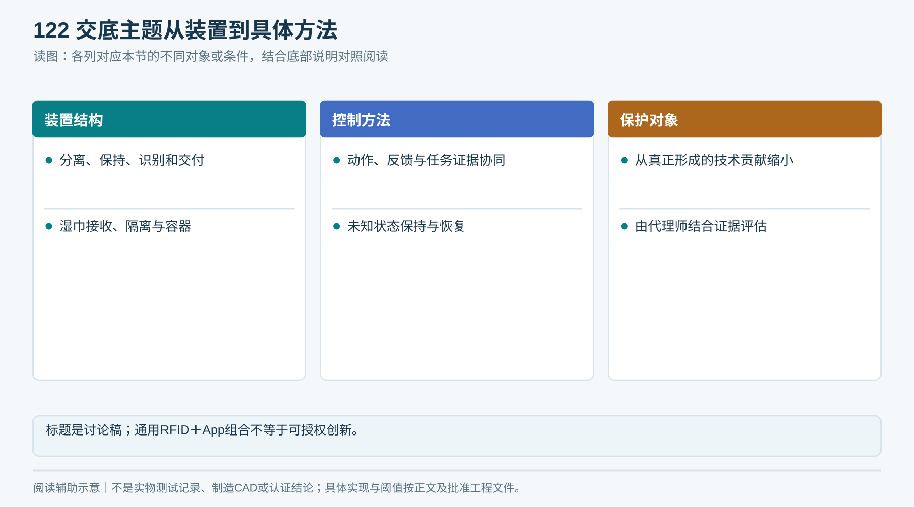
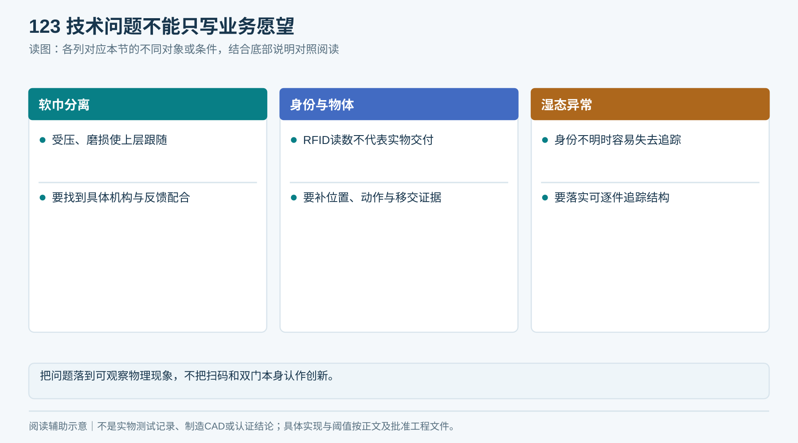
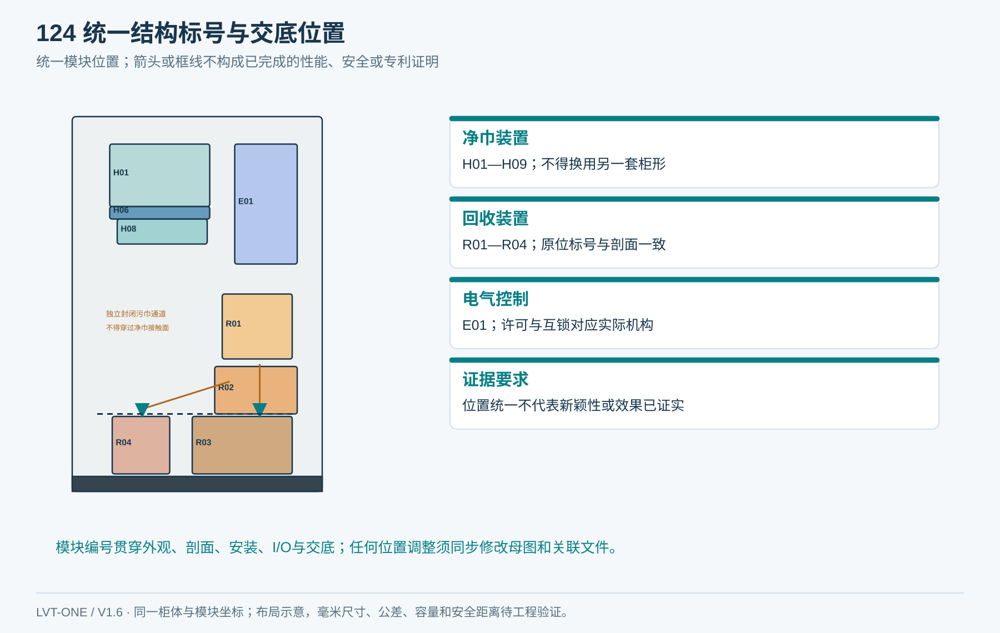
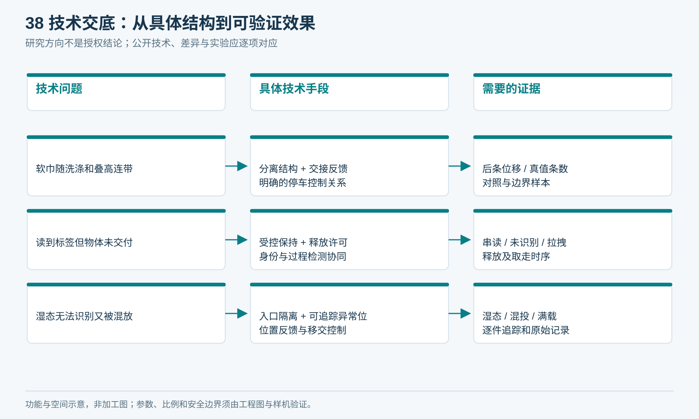
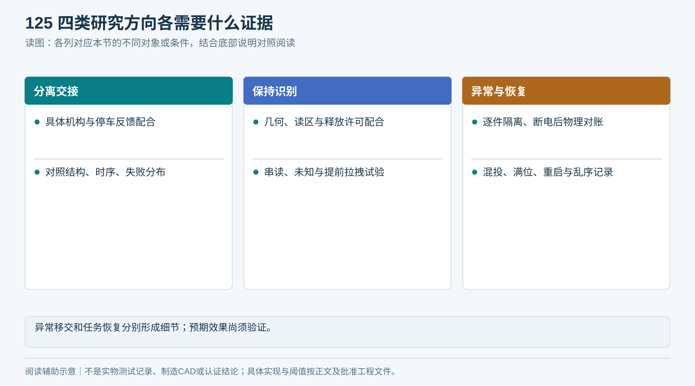
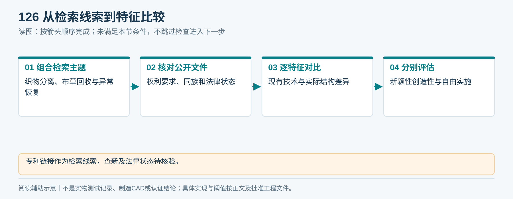
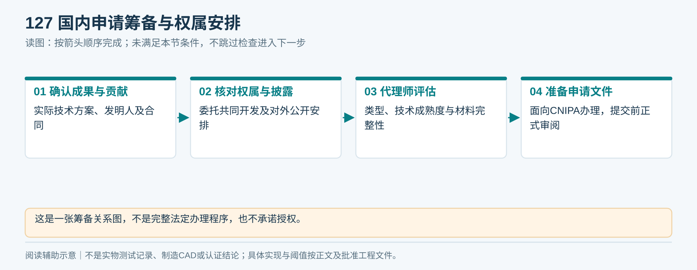
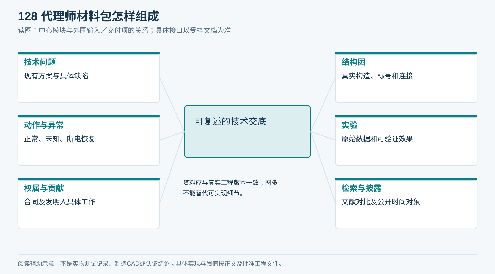

# 17｜国内专利技术交底筹备

**单一产品基线 V1.6：** 本章采用同一台柜：左上领巾、右下归还、上右独立电气舱、下部两只独立回收抽箱；净巾沿柜深从后向前送料。所有整体视图由[统一布局源](统一设计源/单一产品布局.json)和[图形一致性说明](统一设计源/单一产品说明.md)约束。

状态：供研发与代理师讨论的技术交底底稿；未完成查新、法律状态分析、权利要求撰写或申请提交。概念组合不等于可授权创新。

## 1. 拟定技术主题

“具有受控单条发放、身份核验与异常归还处理的毛巾管理装置及控制方法”。名称供讨论，最终根据真正形成的技术贡献缩小保护对象。

技术领域：纺织品发放／回收装置、射频识别、机电控制与物品交接记录。

<!-- module-figure-122 -->
**子模块图｜交底主题从装置到具体方法**

*读图说明：标题是讨论稿；通用RFID＋App组合不等于可授权创新。*

**闭环约束（V1.4复核）**

闭环新增许可、取消封禁、借用轮次和单件异常责任属于拟研究的实现细节；技术交底应提供真实结构及效果对照，不能仅凭业务流程宣称可授权。国内申请仍需查新及代理师评估，V1.4复核CNIPA专利法公开入口，但未完成新颖性、权利要求逐特征、同族或自由实施检索。

## 2. 要解决的技术问题

软质毛巾在叠放、磨损与受压变化下容易连带；RFID读数不等于实物已分离或已交付；湿毛巾造成读数不稳定时，如何保持物体、身份与任务的可追踪关系，并使未知结果不产生错误借还记录。

不能将“用App扫柜子”“RFID记录毛巾”“采用双门”本身作为已确认创新点；这些都需要与现有技术比较。

<!-- module-figure-123 -->
**子模块图｜技术问题不能只写业务愿望**

*读图说明：把问题落到可观察物理现象，不把扫码和双门本身认作创新。*

## 3. 目前可描述的系统结构

| 标号 | 构成 | 相互关系 |
|---|---|---|
| 100 | 净巾料仓及可调支撑/导向 | 向110提供规定姿态的毛巾 |
| 110 | 分离送料组件 | 向120输送候选单条，限制后条跟随 |
| 120 | 接料与受控保持区 | 在公开取物前容纳和保持当前物体 |
| 130 | 身份识别组件 | 在120中取得候选身份并抑制周边干扰 |
| 140 | 释放／物理隔离组件 | 满足身份与安全条件才向150移交 |
| 150 | 取物与过程检测 | 形成释放、到位和移除证据 |
| 200 | 独立湿巾接收及识别仓 | 将用户投入与下游转移隔开 |
| 210 | 正常／待核验转移路径 | 根据识别与位置状态保持可追踪移交 |
| 220 | 接收容器及到位/容量检测 | 确认物体可接收且已移交 |
| 300 | 本地控制器 | 互锁、任务持久化、异常保持与证据事件 |
| 400 | 平台任务服务 | 认证授权、身份关联、借还及对账 |

以上为功能结构；尚需实际构造、连接、尺寸关系和动作反馈实现。现有概念图不能作为定型专利附图直接提交。

<!-- module-figure-124 -->
**子模块图｜专利标号与功能结构**

*引用同一产品布局；模块位置与图02、图17一致。*

## 4. 可复述的实施过程

实施例A：平台授权任务后，110与120协同送料；经机械验证的停车策略阻止后一条继续跟随；当前毛巾保持在120，经130读取候选身份并由400确认本任务资产准入、返回ReleasePermit后，300持久化许可并确认140的本地隔离条件，才允许向150释放。150提供有序过程证据，300保存并发送任务结果，400据此建立借用关系。身份或位置不明则保持并进入待核验，不产生第二次发放。

实施例B：湿巾进入200后外侧访问路径关闭，识别结果和实物状态决定进入正常路径或可追踪待核验位置。只有220接收证据与身份关系满足规则后才确认归还；不可识别物体保留独立待核验记录。具体异常容器的逐件追踪方式必须设计和验证，不能用一句“分流处理”替代。

替代实施方式可包括纸套/包体顺序送料、不同保持件、不同传感组合；仅列能实际实现且原始交底支持的方案，不为扩大保护凭空列结构。

<!-- figure-38 -->
### 图38｜技术交底：从具体结构到可验证效果

*用于组织交底证据，不是新颖性或创造性对比结论。真正的差异须与检索文献逐特征比较，并由代理师评估。*

## 5. 可能形成贡献的研究方向

| 方向 | 必须补充的独特技术细节 | 证据 |
|---|---|---|
| 软巾分离与交接 | 在规格变化下形成稳定停车窗口的具体机构/反馈协同 | 对照结构、时序、失败分布 |
| 保持区与识别释放 | 几何、读区、实物位置及释放许可的特定配合 | 串读/未识别/提前拉拽实验 |
| 湿态异常移交 | 无法识别时仍保持逐件可追踪的具体结构和状态控制 | 湿态、混投、异常位满测试 |
| 物理动作与任务恢复 | 断电/乱序时防重复动作并重建实物状态的具体方法 | 故障注入和恢复过程 |

预期效果必须写为待验证假设；没有数据不得声称“完全消除漏读”“零串读”“准确判断含水率”或“已显著降低成本”。

<!-- module-figure-125 -->
**子模块图｜四类研究方向各需要什么证据**

*读图说明：异常移交和任务恢复分别形成细节；预期效果尚须验证。*

## 6. 初步检索线索

- [US3794148A 布毛巾发放机构](https://patents.google.com/patent/US3794148A/en)
- [US8362878B2 毛巾跟踪相关公开文献](https://patents.google.com/patent/US8362878B2/en)
- [CN210864849U 既有研究线索](https://patents.google.com/patent/CN210864849U/zh)
- [CN109146016B 既有研究线索](https://patents.google.com/patent/CN109146016B/zh)

这些沿用既有研究入口，本轮未逐份核对权利要求、同族、审查和法律状态。代理师需按“软质织物单条分离／布草回收／RFID物品交接／异常隔离／断电恢复”等组合检索，并制作逐特征对比。新颖性、创造性评估和自由实施分析是不同工作。

<!-- module-figure-126 -->
**子模块图｜从检索线索到特征比较**

*读图说明：已有专利链接仅是线索；本轮配图不构成查新或法律状态意见。*

## 7. 国内申请与权属

中国申请面向CNIPA办理。发明、实用新型、外观设计保护对象不同；所选类型要匹配实际技术方案。职务、委托或共同开发的申请权／成果归属应在设计合同中明确。申请说明书需清楚完整地描述可实现方案，不能用效果愿望代替技术手段。[CNIPA《专利法》](https://www.cnipa.gov.cn/art/2020/11/23/art_524_171347.html)

不承诺固定费用、固定授权时间或必然授权。公开演示、对外销售材料和供应商披露前，先确认保密边界和申请安排；不要自行假定公开后总有宽限期。申请入口：[CNIPA专利业务办理系统](https://cponline.cnipa.gov.cn/)。

<!-- module-figure-127 -->
**子模块图｜国内申请筹备与权属安排**

*读图说明：这是一张筹备关系图，不是完整法定办理程序，也不承诺授权。*

## 8. 给代理师的材料包

问题与现有方案缺陷、真实结构图、部件标号、完整动作与异常时序、替代实现、实验原始记录、发明人贡献、设计合同权属、公开披露时间及对象、已知专利文献和对比。

填写[专利证据表](执行表单/T12_专利交底证据.md)。若G1/G2尚未形成具体可实现差异，先与代理师讨论技术成熟度和申请节奏，不将本文件包装为可直接提交的最终申请书。

<!-- module-figure-128 -->
**子模块图｜代理师材料包怎样组成**

*读图说明：资料应与真实工程版本一致；图多不能替代可实现细节。*

**交底送审前核对：** 技术负责人把每个拟保护特征映射到当前图号、结构／控制细节和真实证据；未实验的效果明确为预期。申请主体、实际发明贡献、委托／联合开发权属、披露记录和申请时间由申请人与代理师核实；材料不全退回责任人补证，不将概念图或业务规则直接当已成立的创新点。

