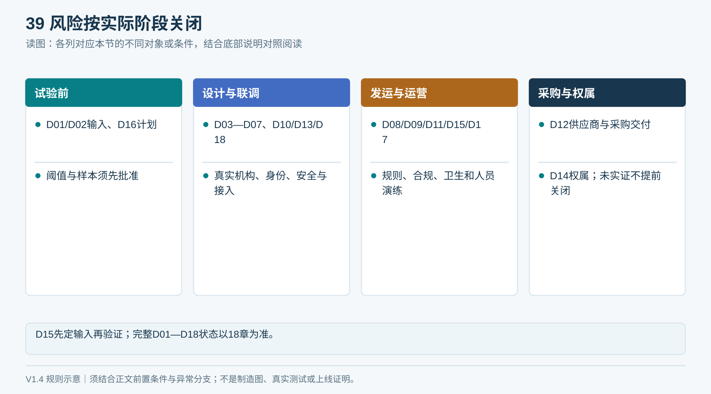
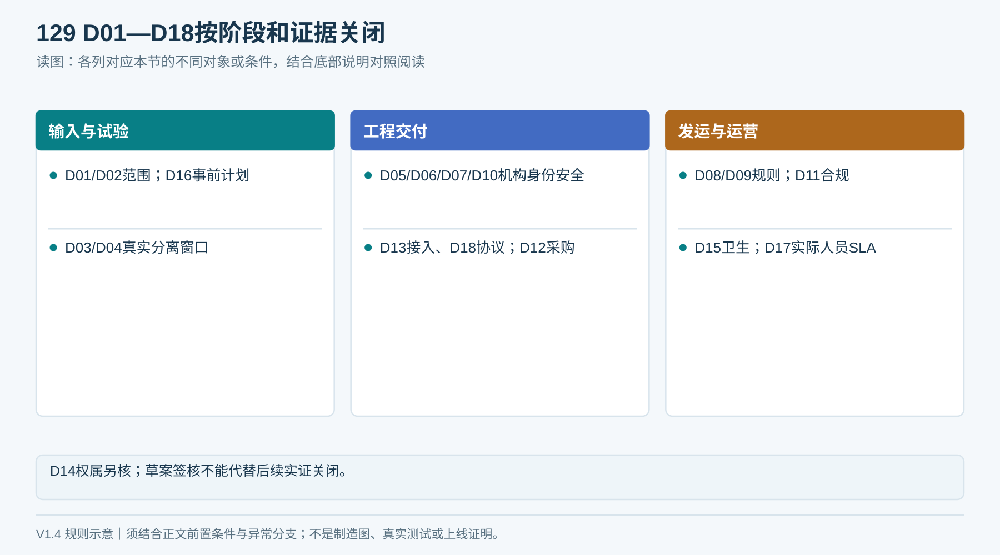
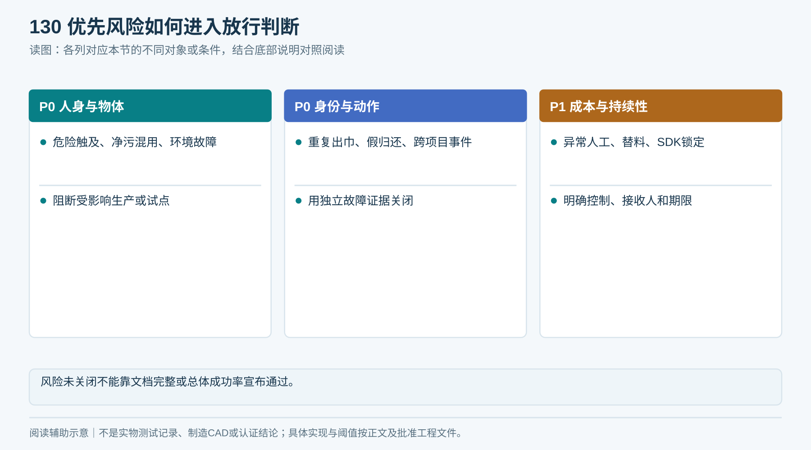
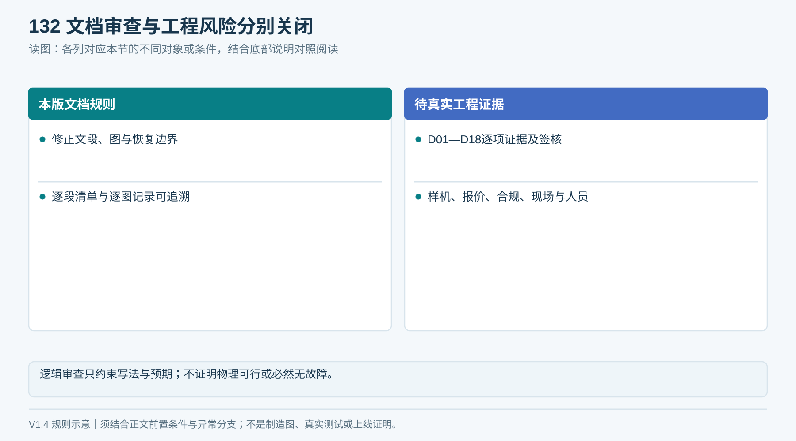
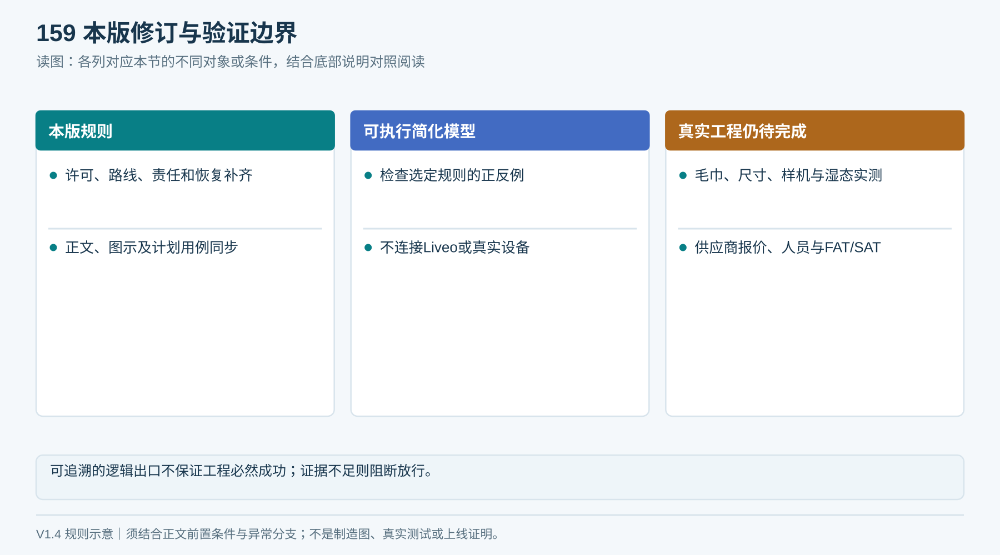

# 18｜风险与决策台账

本表将未知事项转成有责任与关闭条件的工作项。角色指岗位职责，实际姓名在项目启动时登记。以下均为“未关闭”，不伪造已审批结果。V1.6锁定一套图文布局，并不自动关闭任何工程实证事项。

<!-- figure-39 -->
### 图39｜决策项在哪个阶段关闭

*分组便于阅读，各事项以18章的具体阻断阶段为准。专利准备可穿插进行，不应误解为必须等到交付后才启动。*

## 1. 必须关闭的决策

| ID | 事项 | 当前建议与缺口 | 责任角色 | 关闭方法／阻断阶段 |
|---|---|---|---|---|
| D01 | 毛巾规格和折法 | 参数未实测 | 产品＋清洗＋机械 | T01实测及允许范围签核；阻断G0 |
| D02 | 场地、容量与预算 | 未取得现场数据和成本上限 | 产品＋物业 | 勘察、峰值需求与预算单；阻断正式整柜下单 |
| D03 | 统一裸巾机构可行性 | 选定当前设计方向，分离与总成本未实证 | 整机＋产品 | 分离数据及同周期成本比较；阻断G1 |
| D04 | 分离停车窗口 | S1/EPC不能单独证明单条 | 机械＋控制 | 边界样本逐次真值、停车/后条位移；阻断G1 |
| D05 | 保持与出口防护 | 具体长度、释放件和隔离未冻结 | 机械＋安全 | CAD、可触及、拉拽及断电验证；阻断G2 |
| D06 | 湿回收异常路线 | 已统一为R04单件位、满位时R01保持；容量与转移未实证 | 机械＋物业 | 湿态成功/异常量、追踪和人工成本；阻断G2 |
| D07 | 交付证据阈值 | 建议取走确认后借出，阈值未标定 | 产品＋控制＋平台 | 时序协议与传感验证签核；阻断G2 |
| D08 | 额度、期限、跨项目及争议 | 不默认按Unit或按日配额 | 产品＋物业 | 明确规则和异常处理；阻断上线 |
| D09 | 现场身份／防远程发放 | 静态二维码不证明人在柜前 | 产品＋安全＋平台 | 确定可接受风险或现场确认方式并验证；阻断上线 |
| D10 | 标签与读区 | 具体组合未定选 | RFID＋采购 | 真样本、洗涤及目标/非目标挑战；阻断G2 |
| D11 | 地区合规配置 | 国内研发/新加坡部署分别核对 | 合规＋整机 | 适用范围评审与要求证据；阻断发运/投用 |
| D12 | 供应商与责任 | 无有效订单和完整报价 | 采购＋项目经理 | 硬门槛、BOM、责任及合同；阻断采购冻结 |
| D13 | 手机端和现有代码接入 | 仅目标设计，未回源实施 | Liveo技术负责人 | 核验实际仓库与接口，范围评审；阻断软件实施 |
| D14 | 原创贡献与专利权属 | 未查新，无可授权保证 | 技术负责人＋代理师 | 结构实施证据、检索、权属与披露安排；阻断专利提交定稿 |
| D15 | 清洁、报废与湿箱存放 | 现场工艺未提供 | 物业＋清洗 | SOP与卫生要求、标签工艺匹配；阻断试运营 |
| D16 | 样本量和验收指标 | 本包提供建议起点 | 质量＋产品 | 试验前批准指标/分母/样本分层；阻断正式验收 |

<!-- module-figure-129 -->
**子模块图｜D01—D18按阶段和证据关闭**

*读图说明：每个事项的准确阻断阶段按本节台账逐项执行。*

**闭环约束（V1.4复核）**

| 新增决策 | 冻结内容 | 负责人 | 放行限制 |
|---|---|---|---|
| D17 回执与异常运营 | 首期在线回执；T_ack/T_resolve/T_pickup；值班人、交接与异常容量 | 产品＋物业＋整机 | 未签核不得上线；离线新接收需另评审 |
| D18 可靠协议与迁移 | 本条／路线许可、续期、箱批次与容量预留、取消封禁、三类版本、事件摘要冲突、最终结果查询及T_settle、重放留存和升级迁移 | 固件＋Liveo＋质量 | 未联调证明不得冻结协议及投用 |

图129已覆盖D01—D18；所有决策均未有实际签核证据。

**决策关闭要分层：** D15在G0先冻结卫生输入与拟验证方法，G2验证设计边界，G4核现场收运与保管能力；D17在G0确定值班方案草案，G4前签实际人员与SLA；D18在G0明确协议原则，G2冻结并验证许可、幂等、结果查询和恢复。D16样本／阈值须在各轮试验开始前批准。输入已定不等于实证已关闭，T11分别记录证据、批准人及阻断阶段。

**V1.5对既有未决项的补充，未宣告关闭：** D12新增SP01—SP14来源、1688当前主体／SKU／授权／报价核验，以及专用品类缺口；主控选型须覆盖完整I/O。D13现有平台接入及D18可靠协议同时冻结MQTT适配与证书责任；网络配置、当地蜂窝可用性及NET01—NET08归入相关电气、合规、现场验证任务。Wi‑Fi＋SIM需求分清必选与选配后才能冻结BOM。

## 2. 优先风险

| 风险 | 影响 | 控制与验证 | 优先级 |
|---|---|---|---|
| 两条连带但读到一个EPC | 资产漏记、库存不准 | 真实条数与分离窗口，不靠单EPC | P0 |
| 用户拉到库存／传动 | 人身和资产风险 | 出口隔离、保持与防触及验证 | P0 |
| 断电后重新执行 | 重复出巾 | 持久化命令、状态核对、未知保持 | P0 |
| 错标签或假归还销账 | 错误住户责任 | 局部读区、移交证据、异常流程 | P0 |
| 设备事件跨项目 | 数据泄露或错误动作 | 凭据映射、服务端授权、负向联调 | P0 |
| 湿巾异常太多 | 人工成本高、堵塞服务 | 湿态测试、隔离容量及响应工时 | P1 |
| 供应商替料 | 性能漂移 | 版本BOM、批准样品、变更复验 | P1 |
| 依赖私有云或锁定SDK | 长期成本与停服 | 本地协议、交付许可与退出方案 | P1 |
| 未清洗净污混用 | 卫生风险 | 单独路径与完整洗涤QC闭环 | P0 |
| 环境与机柜防护不匹配 | 泄漏、电气与腐蚀故障 | 场地勘察和相应设计验证 | P0 |

P0表示阻断涉及的试点/生产放行，不是说文档不能先完成。P1也需明确控制和接收人，不可无限拖延。

<!-- module-figure-130 -->
**子模块图｜优先风险如何进入放行判断**

*读图说明：风险未关闭不能靠文档完整或总体成功率宣布通过。*

## 3. 变更控制

改变需求、机械、BOM、标签、固件、参数或验收规则，填写[变更记录](执行表单/T11_问题与变更.md)：原因、版本、影响模块、受影响设备、重测用例、费用和批准人。旧版留档，现场实际版本与批准版本一致。

<!-- module-figure-131 -->
**子模块图｜变更从提出到现场生效**

*读图说明：旧版和失败证据保留；更新参数同样属于受控变更。*

## 4. 本轮文档审查关闭了什么

已统一：Liveo App名称、顺序出巾方向、无数据库表设计、EPC不代表条数、湿态识别边界、取走记账与不明结果保留、分包采购整机负责、FAT/SAT区分、旧估价失效和图示边界。

尚未关闭：本表D01—D18所需的实物、测量、报价、审批与法律评估。文档编制不能替代这些活动。

<!-- module-figure-132 -->
**子模块图｜文档审查与实物风险分别关闭**

*读图说明：本次图文修订关闭的是解释缺口，不自动关闭工程决策。*

**闭环约束（V1.4复核）**

修订关闭的是文字断点：取消迟到、释放准入、归还乱序、洗涤补货、异常责任和恢复条件。现场可行性及性能仍未证明；模型结论不得替代44案真机证据。

*“逻辑有出口”不等于现实必能完成；缺关键能力时选择拒绝或停用，不伪造成功。*

## 5. 固定模型的系统集成缺口（2026-09-19）

[22章SI01—SI12](22_固定模型下的系统集成审查与工程补充.md)是本台账的证据细化，不是新建另一套产品或重复D项。SI01—SI05核模型/实体/路径，SI06—SI07核电气与安全，SI08—SI11核固件/通信/平台，SI12核运营。每项已标现有D项、责任角色和阻断阶段，全部仍未关闭。

关闭时在T11填写SI与D的关联、实际责任人、证据文件/版本、受影响序列号、复验和批准日期；T02/T06/T13接收接口与用例证据。文档补齐只消除要求不具体的问题，不能据此关闭D01—D18或批准加工/投用。
