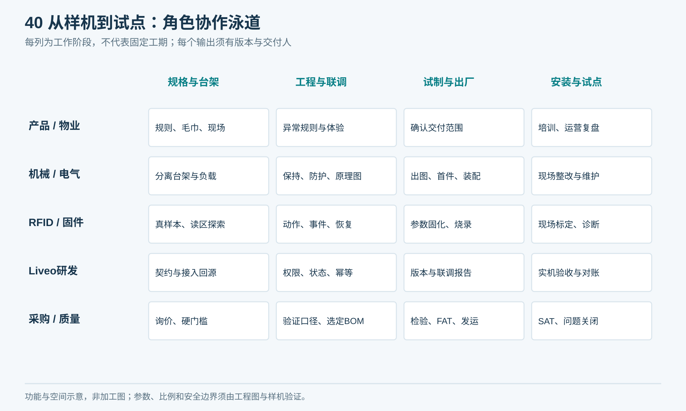
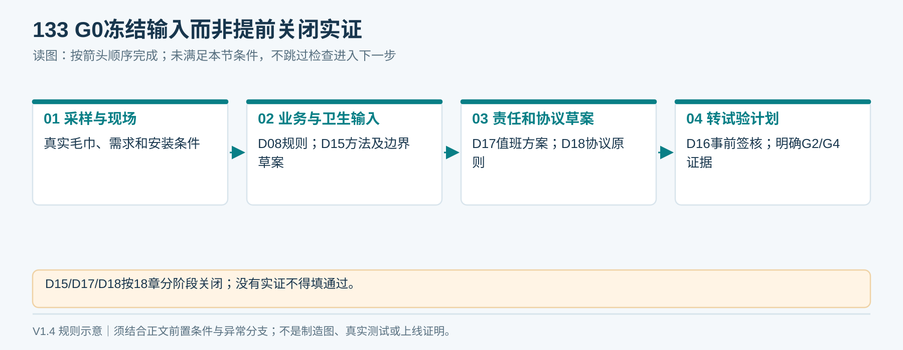
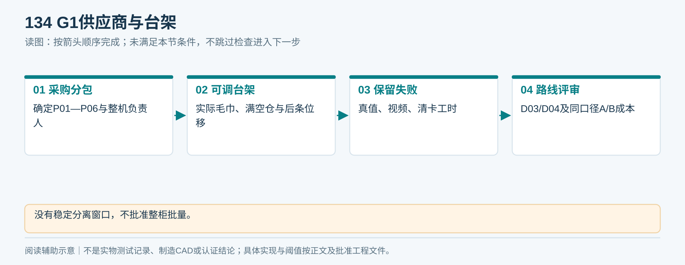
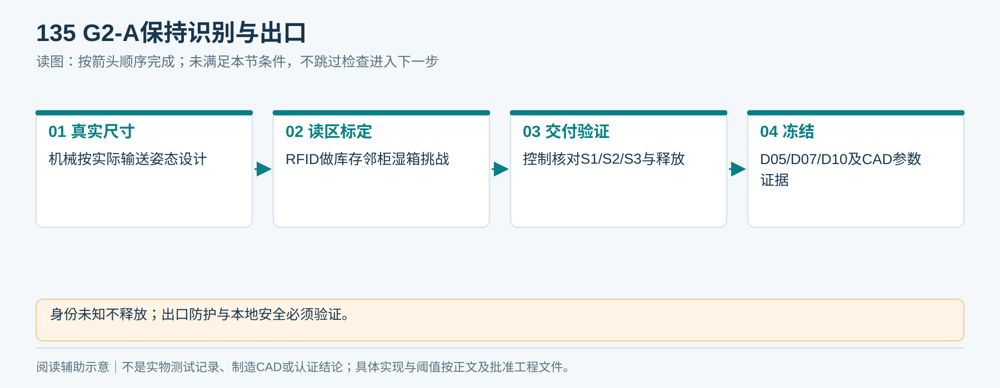
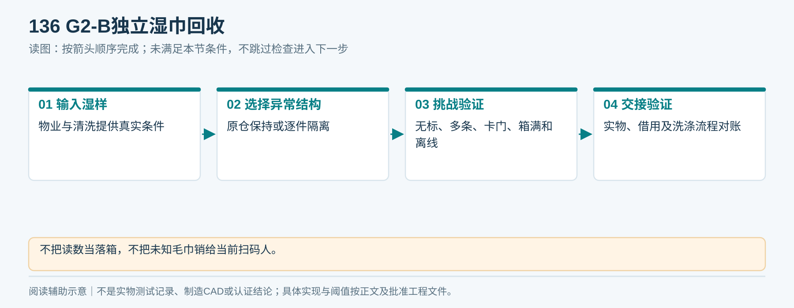
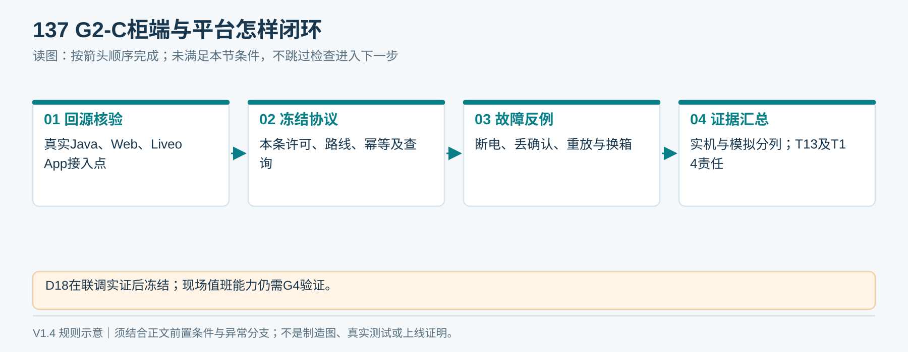
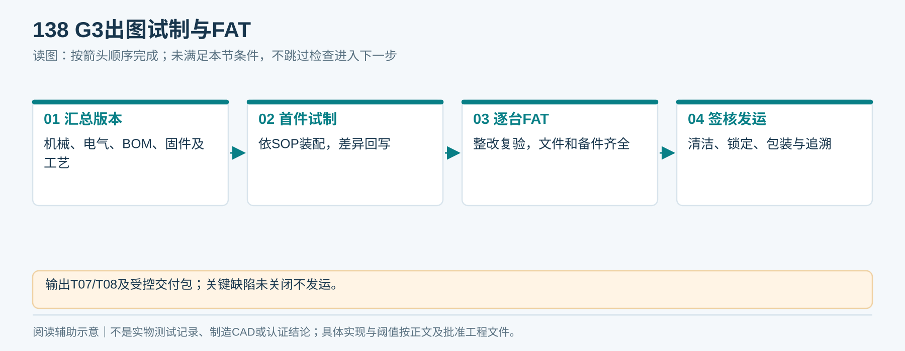
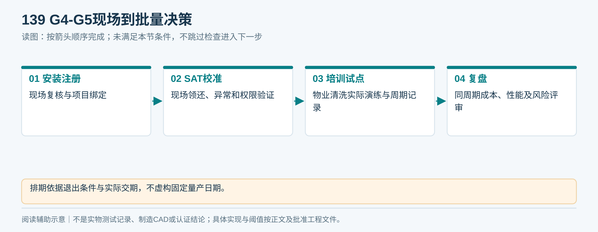
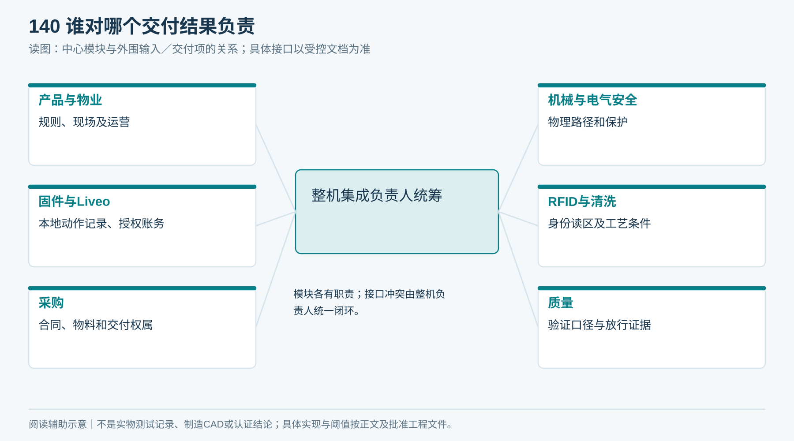

# 19｜实施任务与责任分工

目标：以可验证、可维护的成本完成一台Liveo App集成的Condo毛巾柜试点，再决定批量。

架构：净巾顺序分离、受控识别与小口交付，湿巾独立回收；本地负责运动与安全，平台负责身份授权和借还对账。

工具/技术：机械CAD与电气出图、嵌入式控制、RFID；Liveo侧优先沿用现有Java/Spring Boot与既有前端能力，具体接入先回源。本文为工程推进计划，不含代码改动、数据库表或已完成制造声明。

执行依据：[需求](02_产品需求与毛巾规格.md)、[总体方案](03_总体架构与方案选择.md)、[风险台账](18_风险与决策台账.md)。各任务按责任分工和验收条件推进，采购、发包及上线执行相应审批流程。

## 全局约束

Liveo App命名；成本优先；用户不能开库存门；下一条顺序发放；不自动重发未知结果；净污分离；表结构暂不设计；先实测再冻结；所有批次和版本可追溯。

<!-- figure-40 -->
### 图40｜从样机到试点：角色协作泳道

*职责泳道用于分工，不表示已分配具体人员或已完成某阶段；实际任务清单与签核见19章。*

## 任务1：冻结输入 G0

负责人：产品经理；协作：物业、清洗、机械。

输入：试点场地、实际毛巾和目标服务量。输出：T01、T09勘察、D01/D02/D08输入签核、D15卫生规则与验证计划及预算范围（D15实证仍待G2/G4）。

- [ ] 采集多批毛巾，固定测量方法并填写T01。
- [ ] 用真实清洗程序核对标签工艺和洗后尺寸。
- [ ] 测场地、取物和补货空间、电源网络及湿箱路线。
- [ ] 写明额度、借期、代还、遗留物和争议处理规则。
- [ ] 签核规格与成本边界，拒绝把未测值当生产要求。

验收：另一位工程师可按文件重复测量；每个未定事项有D编号和阻断阶段。

<!-- module-figure-133 -->
**子模块图｜G0输入冻结**

*读图说明：G0需允许另一工程师重复测量；未知项有责任和阻断阶段。*

**闭环约束（V1.4复核）**

补充G0交付：D17值班／SLA草案、D18协议原则、三种额度语义及规则快照；D17最终人员与时限在G4前签核，D18在G2联调验证后冻结，不提前标为已关闭。填表、签核与实证未完成必须保留未关闭。

## 任务2：筛选供应商与台架 G1

负责人：采购＋整机集成；协作：机械、控制、质量。

输入：G0规格及询价文案。输出：T03/T04报价、可调台架、T05原始试验和D03/D04决定。

- [ ] 按P01—P06分包询价，确认唯一整机责任人。
- [ ] 核验技术硬门槛、图纸协议交付与替料规则。
- [ ] 在可调台架测满空仓、不同批次、后条位移和停车滑行。
- [ ] 记录双条、卡巾、损伤与清卡工时，不剪除失败。
- [ ] 纸套／包体仅作为验证对照，按同一口径评估裸巾分离方案；现行产品配置保持不变。

验收：通过约定规格范围的稳定分离窗口；不通过则调整路线，不批准整柜批量。

<!-- module-figure-134 -->
**子模块图｜G1供应商与台架**

*读图说明：没有稳定分离窗口，不批准整柜批量。*

## 任务3：保持识别与安全出口 G2-A

负责人：机械＋RFID＋控制。

输入：G1机构和真实输送姿态。输出：保持/出口CAD、读区标定、D05/D07/D10关闭证据。

- [ ] 按真实物体尺寸设计受控保持段和释放条件。
- [ ] 布置S1/S2/S3、门反馈、库存隔离与维护通路。
- [ ] 做库存/邻柜/满湿箱串读挑战及未识别保持测试。
- [ ] 验证拉拽、防触及、断电和未取走场景。
- [ ] 固化版本和参数，交付可复现标定记录。

验收：未知身份不对外释放，交付证据定义一致，危险动作由本地可靠控制。

<!-- module-figure-135 -->
**子模块图｜G2-A保持识别与出口**

*读图说明：身份未知不释放；出口防护与本地安全必须验证。*

## 任务4：独立回收 G2-B

负责人：机械＋RFID＋物业。

输入：湿巾样本、响应工时和清洗流程。输出：回收模块、异常逐件追踪方式、D06/D15及湿态试验。

- [ ] 先实现入口隔离、读取、选路、转移与接收检测。
- [ ] 比较保持与隔离位方案，计算异常容量。
- [ ] 试无标签、多条、卡门、缺箱、满箱和离线。
- [ ] 核对实物与借用关系，完成清洗和补货交接演练。

验收：不把读数当落箱，不把未知毛巾随意销给当前账号。

<!-- module-figure-136 -->
**子模块图｜G2-B独立湿巾回收**

*读图说明：不把读数当落箱，不把未知毛巾销给当前扫码人。*

## 任务5：Liveo协议与闭环 G2-C

负责人：Liveo技术负责人＋固件。

输入：[协议契约](09_设备协议与联调契约.md)。输出：经批准接口版本、联调记录、D09/D13关闭证据。

- [ ] 回源核验Java/Web/Liveo App的实际接入点和权限规范。
- [ ] 冻结命令、事件、状态和证据语义，准备模拟器。
- [ ] 验证授权、命令去重、乱序、取消竞态、重启和补传。
- [ ] 在授权测试环境完成真实硬件领还及跨项目负向用例。
- [ ] 核对任务、资产、实物、额度和事件，导出结果。

验收：每条成功／异常路径可解释，未实现和未测试的链路不能签通过。

<!-- module-figure-137 -->
**子模块图｜G2-C平台与柜端闭环**

*读图说明：成功与异常都要可解释；未实现和未测试不能签通过。*

**闭环约束（V1.4复核）**

G2-C必须逐项执行C01—C44中协议与业务适用用例，记录物理观察接口／模拟范围；与机械和回收团队合并证据后再进入整机验收。统一使用T13，异常处理使用T14，不以某一模块自测成功替代整链路。

*C01—C44逐案记录四类结果：实物、任务、账务、通道；不能只检查App提示。*

## 任务6：出图、试制与FAT G3

负责人：整机集成＋生产＋质量。

- [ ] 汇总并审查机械、电气、BOM、固件与工艺版本。
- [ ] 关闭适用安全/射频/环境合规事项D11。
- [ ] 首件按SOP装配并回写工艺差异。
- [ ] 每台执行FAT，整改后复验，交付文件和备件。
- [ ] 按运输方案锁定、清洁、包装和签核。

输出：T07/T08与完整受控交付包。未关闭关键缺陷不发运。

<!-- module-figure-138 -->
**子模块图｜G3出图试制与FAT**

*读图说明：输出T07/T08及受控交付包；关键缺陷未关闭不发运。*

## 任务7：安装、SAT和运营 G4/G5

负责人：现场实施＋物业；协作：Liveo、整机、清洗。

- [ ] 完成勘察复核、安装、电气、网络和设备项目注册。
- [ ] 重做现场标定，按SAT逐项领还与故障验证。
- [ ] 培训实际操作人员并演练异常处置。
- [ ] 试运营记录服务量、失败、人工、耗材及损耗。
- [ ] 基于同周期总成本、性能和未关闭风险决定扩点。

输出：T09/T10、签署交接及试点复盘。排期以阶段退出条件和供应商确认交期为依据，不编造固定量产日期。

<!-- module-figure-139 -->
**子模块图｜G4-G5现场到批量决策**

*读图说明：排期依据退出条件与实际交期，不虚构固定量产日期。*

**阶段移交退回机制：** 接收方按T02/T11逐项核对交付版本与证据；缺项或复验失败退回责任方，保留问题号、期限和受影响阶段。机械、电气、RFID、固件及Liveo的局部通过不能代替整机集成负责人汇总签核；人员姓名未指定、必需阈值未批准或阻断问题未关，阶段保持未通过。

## 责任总原则

产品负责规则，机械负责物理路径，电气/安全负责电控保护，固件负责本地动作与记录，Liveo负责授权账务，采购负责合同交付，质量负责验证口径，物业负责现场运营；**整机集成负责人对接口矛盾和整机交付最终统筹**。

<!-- module-figure-140 -->
**子模块图｜谁对哪个交付结果负责**

*读图说明：模块各有职责；接口冲突由整机负责人统一闭环。*

**闭环约束（V1.4复核）**

整机负责人维护R需求→D决策→图纸/BOM/协议版本→V/F/S/C证据→问题T11→复验的追溯链。每项交付要有实际接收人；运营失败回到相应源设计，不能只在现场临时改参数不回写。

*每次整改必须回写源文件与影响范围；文档签收不替代实物验收。*

