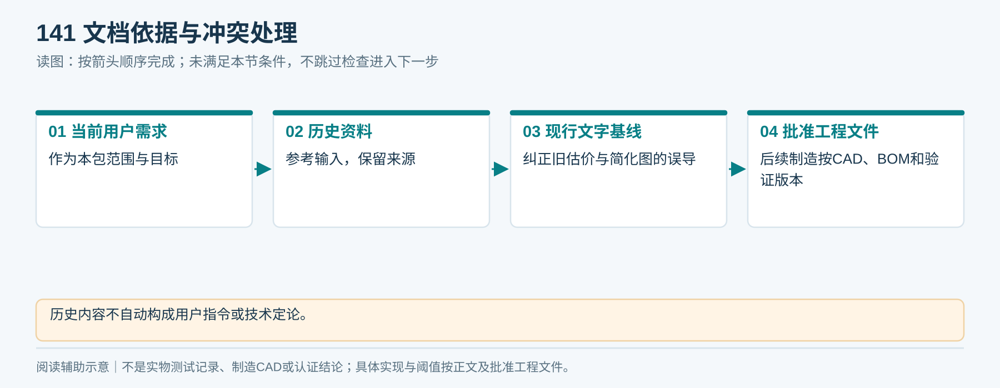
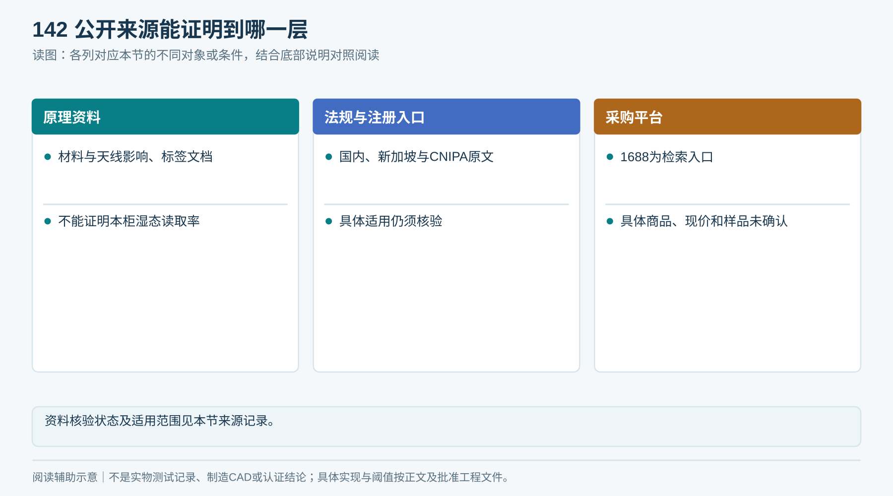
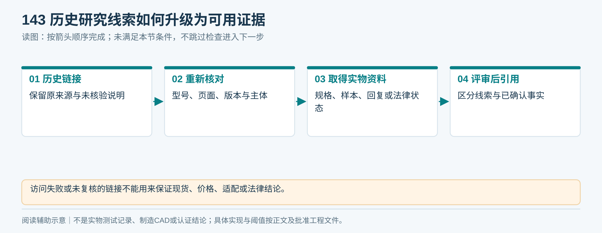
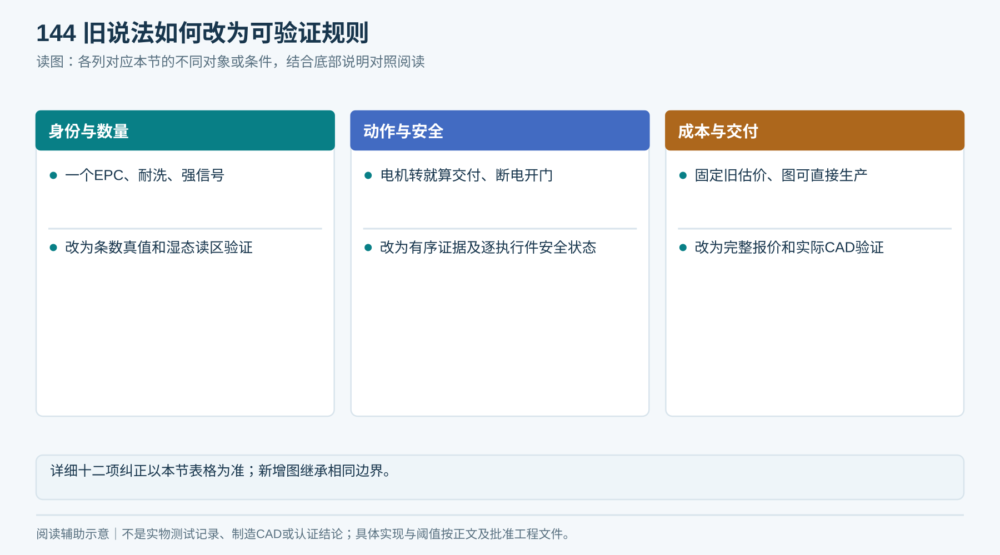
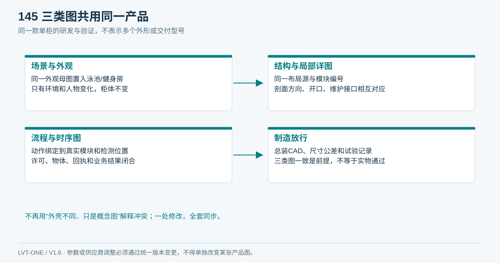
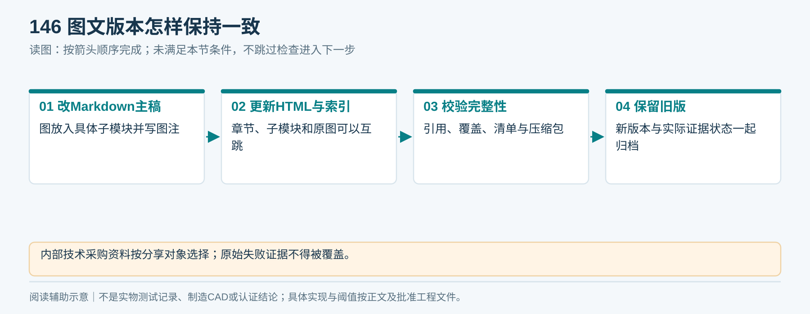

# 20｜资料来源与旧版纠正

## 1. 文档依据

本包依据用户已明确的Condo泳池/健身房、Liveo App、成本优先、快速单条发放、内部组件拆解、不做表结构，以及此前两份报告和技术交底资料整理。历史资料仅作为输入，不作为要求或技术定论。

[历史参考说明](历史参考/说明.md)列出归档文件。本包文字基线优先于历史图里的简化结构或过时参数；实际生产以之后经批准的工程图、BOM、验证记录为准。

<!-- module-figure-141 -->
**子模块图｜文档依据与冲突处理**

*读图说明：历史内容不自动构成用户指令或技术定论。*

## 2. 既有公开资料核对（2026-09-16）

| 来源 | 用途 | 核验状态与边界 |
|---|---|---|
| [NXP AN1629](https://www.nxp.com/docs/en/application-note/AN162910.pdf) | UHF材料、天线与介质影响 | 前轮读取相关章节；本版沿用，不证明本柜湿态读取率 |
| [HID Textile支持](https://support.hidglobal.com/textile-management) | 洗涤标签文档入口 | 前轮可访问；V1.4未复核具体料号和试样 |
| [工信部RFID规定](https://www.miit.gov.cn/zwgk/zcwj/wjfb/tz/art/2024/art_4765b439c05049bdb64df80f744b4f22.html) | 国内射频配置适用核对入口 | 已打开；整机适用与检测需专业核定 |
| [IMDA注册指南](https://iris.imda.gov.sg/guide/equipment-registration-guide) | 新加坡设备注册路径 | 前轮搜索取得入口；V1.4打开未返回可用正文，未核定具体设备分类 |
| [CNIPA专利法](https://www.cnipa.gov.cn/art/2020/11/23/art_524_171347.html) | 专利类型、交底和权属基本依据 | 已打开；非查新或法律状态意见 |
| [1688](https://www.1688.com/) | 国内采购检索平台 | 搜索未获得可核验具体商品和现价 |

<!-- module-figure-142 -->
**子模块图｜公开来源能证明到哪一层**

*读图说明：配图沿用本节已有核验状态，没有把本次排图描述为重新联网查证。*

**V1.5来源更新：** 05章新增微雪／乐鑫／合宙4款板卡官方资料、ESP-MQTT与PubSubClient维护方资料；10章新增14条分配件候选与具体1688店铺／商品入口，并逐条附来源链接。A/B/C表示来源层级，不表示通过采购。部分1688页面无法读取；未核正式报价、当前SKU、店铺资质或样品。09章将设备MQTT由可选改为必选，HTTPS保留独立用途。新图160—162均为设计示意。

## 3. 既有研究延续线索

[RZX标签页](https://www.rzxrfid.com/product/156.html)前轮读取失败；[CYKEO](https://www.cykeo.com/17796.html)、[Chainway](https://www.chainway.net/Products/Info/56)、[Oriental Motor计算](https://www.orientalmotor.com/products/pdfs/2012-2013/G/usa_tech_calculation.pdf)及17章专利链接沿用历史研究，不表述为本轮重新核验的现货、价格、合规或法律结论。

<!-- module-figure-143 -->
**子模块图｜历史研究线索如何升级为可用证据**

*读图说明：访问失败或未复核的链接不能用来保证现货、价格、适配或法律结论。*

## 4. 旧版内容纠正表

| 旧表述／风险 | 本包处理 |
|---|---|
| 用户开大门自由取全部净巾 | 改顺序分离及小口交付，库存门为维护门 |
| 每人预先分配固定毛巾 | 改出巾任务中读取下一条并绑定 |
| 标签防水所以湿巾必然能读 | 区分耐受与射频性能，实际湿态验证 |
| 一次一个EPC等于一条 | 必须验证真实条数，覆盖无标第二条 |
| 信号强弱直接推湿度 | 不作自动含水判断依据 |
| 四天线或最大功率消灭盲区 | 改实际布局与非目标挑战标定 |
| 电机转动即交付、超时自动取消 | 改明确状态、物理证据及待核验 |
| 断电一律全部开门 | 改逐执行件定义安全状态 |
| 固定约5000元总BOM | 失效；按完整范围重新询价，防重复标签计价 |
| 99.5%、8秒或洗涤200次是保证 | 标注建议目标或厂家条件，需试验/签核 |
| RFID+App自然有专利 | 改具体技术贡献研究和代理师查新 |
| 概念结构图可直接生产 | 改必须提交真实CAD、接口、公差和装配文件 |

<!-- module-figure-144 -->
**子模块图｜旧说法如何改为可验证规则**

*读图说明：详细十二项纠正以本节表格为准；新增图继承相同边界。*

## 5. 图的使用边界

当前产品只有一套外形与结构：图14是外观母图，图01/16为同一产品在泳池/健身房场景，图02/15/17/19/26等由统一布局约束，H01—H09局部详图回指同一个安装位置。

旧的双柜场景、不匹配的爆炸外壳、卷巾造型和双门领巾备选已撤出当前阅读与图册。已撤回文件保存在历史参考目录，V1.5整包备份在上级目录；不能拿旧图参与现版本汇报或下单。

*外观、结构、场景必须一致。归一化布局图表达同一产品的空间关系；生产仍需真实毫米尺寸、公差、总装、BOM与试验记录。*

图形资产和当前章节对应关系见[当前图册索引](图册索引.md)，每个结构图的版本与坐标源见[统一设计源](统一设计源/单一产品说明.md)。流程与时序图只表达控制与业务关系，不是另一款机械外形。

## 6. 文档治理

版本：V1.6，2026-09-16。阶段签核、实测、报价和检索结果取得后，更新对应章节并通过T11记录变更。原始证据与签署记录单独归档，不能覆盖或删除失败数据。

整个文件夹属于内部工程与采购材料，含供应商研究和专利方向；向物业客户分享时按用途选择相关资料，法定标识、来源及合规文件保持真实。

<!-- module-figure-146 -->
**子模块图｜图文版本怎样保持一致**

*读图说明：内部技术采购资料按分享对象选择；原始失败证据不得被覆盖。*

**V1.3 闭环补充**

V1.3为跨模块设计逻辑审查：新增21章、13张闭环图（147—159）、T13/T14和规则模型。既有公开来源沿用前轮记录，本轮没有重新核验商品报价、法律或标准。修订追踪见21章第13节；V1.2压缩备份保留，原146张图片与历史Word保留原样。

**V1.4核对与留存：** 本轮重新打开CNIPA专利法与工信部RFID规定公开页，IMDA入口未返回可用正文；没有取得报价、样机、认证报告，也没有完成专利查新。29张SVG按当前规则重画，PNG概念图和历史Word保持原件；旧图05/07的简化语义已在使用处说明。V1.3完整ZIP在同级目录保留。当前逐节及逐图记录见[审查记录](逐模块逐图闭环审查记录.md)，自动文件检查只证明引用／结构一致性。

**V1.6图形修订：** 重新核对外观、场景和柜内位置，见[本轮记录](验证/V1.6统一修订说明.md)。没有重新访问上述法规、商品或厂家网页，不新增法律、报价及实机性能结论。
