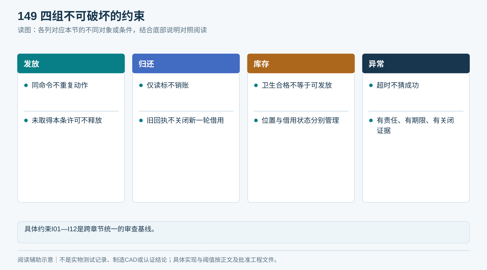

# 21｜端到端逻辑闭环与验收矩阵

**V1.3 · 2026-09-16 · 跨模块设计基线，未实施真机验收。**

## 1. 闭环判据与适用边界

**本章是V1.4跨章节流程基线。** 08/09章定义业务与协议，07/16章执行实物与运营，13—15章验证；图示只解释这些规则，不能绕开正文前置条件。本章状态是建议设计契约，尚未实现到Liveo代码或真实柜端。

“闭环”要求每条路径都有：输入、准入条件、动作、实物证据、业务结果、责任人、期限、异常分支和恢复条件。正常、拒绝、确认未交付、待核验后受控处置都是允许的结果；“未知直接算成功”不是闭环。

| 同时核对的对象 | 必须回答 | 不能代替它的东西 |
|---|---|---|
| 实物与身份 | 哪条毛巾／哪个未知物体，当前在哪里，由谁保管 | 一次RFID读数或电机转过 |
| 发放／归还任务 | 哪个唯一任务、动作发生到哪步、证据是否齐全 | App页面关闭、网络请求超时 |
| 借用与额度 | 哪个账号的哪一轮借用，预留与周期用量如何变化 | 当前扫码人、最新一条借用记录 |
| 通道与责任 | 是否安全清场、能否接下一单、异常谁接手 | 账务已记账、故障提示已消失 |

本章把“不具备能力”的出口也写清：停止相应新任务，保留证据，交授权人员处理。人员、SLA、机械检测能力尚未落实的项目必须阻断上线，不能用文档文字声明已解决。

*文档闭环是规则齐全；实机闭环还需按同一用例验证。*

## 2. 正常全生命周期与唯一交接点

首期推荐使用**在线Liveo App发起领用及归还**。代还者用自己的认证会话发起归还回执，平台销账对象仍是实物对应的原借用人。归还不检查是否还有领用额度，也不要求投放人就是借用人。新离线归还默认关闭，以现有手机承载回执，避免额外柜端取证交互成本；启用离线新接收须另做D17评审。

| 步骤 | 进入条件与动作 | 出口证据／下游 | 不满足时 |
|---|---|---|---|
| L01 登记与首次准入 | 合格毛巾逐条登记，EPC唯一、QC合格 | 资产身份及卫生批次 | 重复或未知隔离 |
| L02 补货 | 维护授权、无活动任务、允许清单与实物相符 | 装载清单和柜／通道归属 | 差异单，不能发放 |
| L03 授权 | 后端核账号、项目、规则和设备 | 原子保存任务、额度预留、待发送命令 | 拒绝；无物理动作 |
| L04 接受与分离 | 柜端核命令、通道版本并持久化 | 一次受控执行，真值验证过的分离过程 | 停止并保留任务 |
| L05 本条确认 | 本条在保持区，读到候选EPC | 平台核资产可发放、清单归属、无别的活动占用 | 不释放；待核验 |
| L06 放行与取走 | 有本任务有效释放许可，柜端本地防护通过 | S2/S3有序证据、TAKEN_CONFIRMED落盘 | 结果未知不自动重发 |
| L07 借用提交 | 平台核完整证据及原任务版本 | 同事务确定借用、预留转换及周期计数 | 保留待确认任务 |
| L08 新归还回执 | 在线建立returnSessionId，安全路径及容量就绪 | App持有回执；柜端持久化接收准备 | 不开启新接收 |
| L09 收件与移交 | 外侧隔离、识别、选路、转移和接收核对 | 指定位置与移交证据 | 原仓保持／逐件隔离 |
| L10 归还核验 | 找到同一资产的对应借出轮次 | 原借用结束，同时在借占用减少 | 事件等待／人工核验 |
| L11 洗涤与QC | 双方交接清单，按工艺处理 | 批次、数量、干燥、质量和标签核验 | 返洗、换标或报废审查 |
| L12 再装载 | 原借用已结、无冻结，QC和装载一致 | 回到L02，下一轮使用新任务ID | 保持待入库，不复用旧任务 |

发放后通道恢复要同时满足：**平台确认该任务业务结论 + 柜端确认空通道与安全复位 + 没有该通道待处理矛盾**。首期宁可等待对账，不用“已取走”一个信号立即接下一单。正常回收箱可容纳多条已确认物体；未知物体必须保持单件可追溯。

*任何一步未知都进有责任人的异常单；不能跳过账务核验直接回净巾库存。*

## 3. 跨模块不变量I01—I12

不变量是任何正常、失败、重试或人工流程都不能破坏的规则。

| 编号 | 不变量 | 核验方式 |
|---|---|---|
| I01 | 同一commandId及内容最多产生一次受控物理执行 | 重投、重启、取消竞态真机记录 |
| I02 | 一个通道同一时刻只有一个执行所有者；一个资产不属于两个活动发放／借用轮次 | 并发与跨柜挑战 |
| I03 | 借用绑定的是认证账号＋原发放任务＋本条资产；不按当前页面或回收扫码人替换 | 代还与错号用例 |
| I04 | 释放前有平台确认的本条许可，且物理单条与本地安全条件通过 | 断网分界、错误EPC与防护用例 |
| I05 | 单EPC不证明单条；传感器并不证明自然人身份 | 无标第二条、现场冒领风险评估 |
| I06 | 归还完成同时需要本条身份、不可回取的实物移交、原借用轮次与平台持久化结果 | 卡仓、旧标签、乱序归还 |
| I07 | 取走、平台确认借出、通道重新可用是不同事实 | 事件缺失与复位失败 |
| I08 | 已取消命令、已执行命令和旧归属命令不能因缓存过期／升级被重新执行 | 持久化封禁与版本迁移 |
| I09 | 归还不直接变净巾；洗净不直接变可发放；未结借用或冻结资产不得重装发放 | 洗好但原账未结用例 |
| I10 | 待执行预留、同时在借数量、周期累计次数各自计算 | 归还后不退款式恢复周期次数 |
| I11 | 未知结果只创建／维持异常证据；超时只升级，不自动罚款或猜成功 | SLA过期与迟到事件 |
| I12 | 补货、洗涤、换箱、维修、迁移都保持身份／任务／保管责任可追溯 | 双向交接与最终盘点 |

前四项需要持久化事务、唯一性控制和柜端执行记录；不能只靠Redis锁。本文只定义契约，不包含数据库表结构。

*具体约束I01—I12是跨章节统一的审查基线。*

## 4. 发放、取消、未取走的完整出口

在08章原状态上补充 `REJECTED`（接受前明确拒绝）、`CANCELLED_NO_EXECUTION`（柜端确认未开始并持久化取消）与“平台业务确认”字段。设备物理阶段与平台记账状态分开，不把同一个状态名当成双方已经原子成功。

| 所在阶段／事件 | 必须执行 | 允许的结果与资源处理 |
|---|---|---|
| 授权未成功 | 不下发命令；业务事务失败不留孤立预留 | REJECTED；没有借用、没有动作 |
| 任务已授权但命令未确认 | 保留待发送记录和原ID；查询或重投同内容 | 仍占预留，不另建任务补发 |
| 取消与开始竞争 | 柜端串行／原子裁定：持久化“开始意图”或“取消封禁”只有一个先赢 | 取消赢：CANCELLED_NO_EXECUTION；开始赢：取消拒绝 |
| QueryCommand返回未见命令 | 只说明当前查询未见，不证明命令以后不会到 | 要取消仍须写入该ID封禁并应答；平台不可仅凭NOT_FOUND退预留 |
| FEEDING断网 | 本地只能推进到可安全保持；未有本条平台释放许可不得公开交付 | 恢复后补身份确认，或转NEEDS_REVIEW |
| IDENTIFIED_HELD | 平台校验资产／清单／活动轮次，原子占用本条并生成一次性许可 | 许可绑定任务、设备、通道、EPC、资产轮次与归属版本 |
| 许可已持久化，随后断网 | 许可已在柜端持久化、本地可信时间确认有效且安全通过时，可完成这一次交付 | 保存结果待同步；无下一单 |
| 许可超期但尚未释放 | 不开始公开释放；查询任务后取得受控续期或维护处置 | 续期不重做分离，不生成第二次物理任务 |
| READY_FOR_PICKUP未取走 | 到T_pickup只提醒／建异常，保持通道占用 | 授权人员核原任务及实物后取出，卫生隔离；有未交付证据才退预留 |
| TAKEN_CONFIRMED已落盘但未传达 | 补传相同事件，不能“超时取消” | 平台确认后形成借用；安全复位也通过才解锁通道 |
| 物理动作与落盘间掉电 | 不知道结果时进入NEEDS_REVIEW | 不能根据最后命令认定成功，也不自动续跑电机 |
| 人工确认未向用户交付 | 记录取出实物、身份、去向及授权审批 | FAILED_NO_DELIVERY；平台受控释放预留，通道自检后复用 |

释放许可一旦被柜端接受，平台不能在断网时单方面假定它已撤销；受控撤销须取得柜端确认。重启后若无法可信判断许可时间或释放历史，进入待核验，不重新公开释放。

普通取消只适用于物理开始前。已经送料、释放或未取走，需要上面的受控处置，不用“取消订单”删除事实。用户关闭App不构成取消。若用户与工作人员同时触碰遗留物，证据不确定就保持待核验，不能同时确认借出又退预留。

*取消与开始只有一个先赢；查询NOT_FOUND和应答超时都不证明取消成功。*

## 5. 归还、代还与事件乱序

首期每次归还先在线生成独立returnSessionId；柜端先持久化该回执，再开放受控入口。未真正接管物体时显示“等待投放”，不是“已收件”。等待投放超时也必须由柜端确认入口关闭、仓内无物并持久化会话终止，才解除回收通道占用；迟到的开入口指令不得重新打开已终止会话。物体探测与取消竞争不明确时保持原会话并待核验。

跨Project、非法或未知物体已进入时，进入受控隔离并给本次回执，不能把已接收实物从记录中丢掉。

正常路线开始前须得到本项目合法身份、正确借用轮次及路线许可；尚未开始转移且失联、无借出终态、轮次不明或身份冲突时，物体保持原仓或进入逐件隔离，直至平台核验。已不可逆转移的断网边界见下文。柜端可缓存RFID候选与历史归属，但不能据过期缓存自动销账。

| 异常／竞争 | 实物与任务 | 账务出口 |
|---|---|---|
| RFID读到但卡在门上 | 保留本次回执及位置，禁止认作已移交 | 原借用不变，转待核验 |
| 归还事件先于取走事件到平台 | 保留身份和移交证据，冻结该资产重发 | 等原issueSessionId取走证据；补齐后按因果关系完成该轮借出与归还 |
| 找不到有效借用 | 不随便匹配另一条或当前投放人；隔离并查借出历史 | 找到原轮次后处理；确无借用则以受控“无借用收件”结案，不能减别人的额度 |
| 同一回执重复补传 | 返回原持久化处理结果 | 不重复结束借用或减占用 |
| 旧归还在资产下一轮借出后到达 | 根据原returnSessionId及锁定的借用轮次处理 | 不能按“最新有效借用”关闭新轮次 |
| 他人代还 | 本次回执可属于代还人；保留实物证据 | 原借用人获归还结果；代还人不能看原住户个人资料 |
| 两个柜声称收到同一EPC | 标记资产冲突，分别保留两个实物位置 | 暂停该资产自动记账与重装，人工核验重复标签／错误读区 |
| 同一物体被反复探测 | 以入口独占与接收周期区分，不能每次扫描都建新归还 | 已提交回执不再次记账 |
| 网络在接管后断开 | 保存原回执与真实位置；转移前保持／逐件隔离，已不可逆转移则记录实际箱批次并冻结 | 待同步；不显示归还成功 |

平台核验时持久化 `matchedIssueSessionId`（或最终loanRef）与资产借用轮次。匹配尚不确定就留空并冻结，不拿事件处理时间推断轮次。匿名离线接收、无扫码自动接收均非首期基线；若要启用，应另外证明回执取得、逐件追踪、数据留存和容量边界。

*投放人不等于原借用人；禁止按事件到达时“最新一笔借用”随意销账。*

**已开始转移时断网：** 物体若已进入不可逆的正常箱路径，只安全收尾并保存实际容器及周转批次，冻结该批正常收运／重发待核验；卫生时限到前须按07章封存异常交接；不能虚构已转到单件隔离位。未知身份在选路前仍须原仓保持或逐件隔离。

**回收两处特别边界：** 物体尚未开始不可逆转移时，失联保持原仓或逐件隔离；已进入既定路径则安全完成、保存实际箱与binCycle并冻结正常流转。卫生暂存到期走有签收的封存异常交接，不能虚构物体在隔离位，也不能为等网络无限期积存。入口无物超时须核门关、仓空及会话封禁；容器更换使旧路线许可失效。详见07章与09章，验收C36—C39。

## 6. 洗涤、库存和补货守恒

每条已知资产分别记录三个语义维度：**物理位置、卫生状态、借用／冻结状态**。例如一条毛巾可以“在异常隔离位、湿污、原借用尚未核销”，这些信息互不替代。原文“借出、污巾、隔离分别计数”按物理位置归类，不把一条既有未结借用又已入箱的毛巾重复计数。

物理位置采用互斥归属：净巾库存、受控保持区、取物口、用户侧（按交付过程推定）、正常污巾容器、单件隔离位、运输／清洗方、待入库、位置未确认。卫生状态独立标为合格／污／待检／不合格；借用状态独立标为无借用／预留／在借／待核验／已结束。

- 已知资产在同一快照中只能占一个物理位置。未知物体按unknownItemRef及保管位置单列，识别后合并到真实资产并保留关联，不能再增加一条“新毛巾”。
- 登记中活跃资产期末数＝期初数＋登记新增＋转入−转出−批准报废−批准损失核销。期末按上述位置分解，其中“位置未确认”不等于现场已找到；未知物体数另报，不能填进已知资产账。
- 盘差先调查，不自动记损失；丢失、报废或责任豁免需要授权处置并保留原事实。后续找回已核销资产时通过受控恢复流程，不能直接复用旧借用状态。
- 洗涤双方按交接单确认实物清单、批次、数量、异常位及签收责任；某批只接收部分时明确剩余保管人。身份未明的单件不得失去原隔离编号后混洗。
- 换标保留资产本身及历史任务；旧EPC失效，新EPC查重，记录授权人和工艺。重新出现的旧标签不能自动变成另一条可借资产。

**补货准入六条件：** QC合格、EPC与资产有效、原借用结束、没有待核验／冻结、目标柜装载清单合法、实际装入与清单一致。首期用已有读写器受控单条核验建立装载清单，标清装载批次；不能只输入“加了50条”。取下一条时还要再次核对，不依赖叠放顺序始终不变。

补货中断：保持维护状态，已装、未装和待确认逐项盘点；清单提交确认且通道自检通过才恢复。洗净但原账未结的毛巾停在待入库／隔离，不重新发放。

*毛巾位置、卫生状态、借用状态是三个维度，不可用一个状态互相代替。*

## 7. 额度、逾期和争议的账务闭环

本方案不设固定每日额度或自动罚款。D08须明确额度主体（账号或Unit）、周期、上限、借期、争议政策和规则版本；同一任务沿用授权时的规则快照，配置变更不能把旧任务强行套入新算法。

| 事件 | 待执行预留 | 同时在借占用 | 周期累计用量 |
|---|---|---|---|
| 授权成功 | 原子新增 | 不增加 | 不先当作成功用量；检查时计入未结束预留 |
| 柜端确认取消／未交付 | 受控释放 | 不增加 | 不增加 |
| 平台确认取走 | 原子转换，不重复占用 | 增加一次 | 若配置了周期计数，按已签规则增加一次 |
| 平台确认该轮归还 | 不变 | 减少该轮一次 | **不因归还自动退回已消耗次数** |
| 结果未知 | 保留对应占用／预留 | 不猜测增减 | 不以超时作成功或退款 |
| 授权责任豁免 | 按批准决定处理额度 | 按明确决议结束责任 | 是否调整另记审批，不能冒充物理归还 |

跨日或跨周期时，未终结任务的预留和在借占用不能自动清掉；周期用量按照签核时点计算，事件晚到也使用原规则快照，不按服务器到达日随意记到下一周期。两个设备同时授权同一额度主体时，平台原子校验，不能各自读到“还有一次”后都放行。

逾期产生提醒／工单，毛巾仍在借。续借、损失、损坏、申诉、离住户停用或移交都经过明确责任处理；账号停用不删除未结记录，归还仍可由授权代还／物业受控办理。首期不自动收费，政策处理与实物事实分别留痕。

*按账号或Unit共享、周期和上限由D08签核；不擅自启用收费。*

**建议额度公式（待D08签核）：** 并发领用检查“当前在借＋全部未终结预留＜同时在借上限”；周期检查“该周期已用＋归属该周期的未终结预留＜周期上限”。推荐以授权时点冻结周期归属，迟到确认仍转换原周期预留；跨日不解除同时在借限制。若项目改为取走时点计周期，须单独定义跨周期占额策略并验证，不能混用两种口径。Unit共享只共享额度主体，借用责任仍保留原认证账号和当时Unit关系；迁出、停用或新住户入住不能改写旧责任。

## 8. 持久化协议、断网与跨项目隔离

**首期：不接受新的离线发放，不接受新的离线归还。** 已在线建立并被柜端接管的任务可做安全收尾与离线存证，但未取得身份释放许可的净巾不能进入公众取物区。原07章“离线接收”在V1.3收窄为已有任务收尾；未来启用须重新评审。

| 协议补充 | 需要解决的断点 |
|---|---|
| 授权任务＋额度预留＋待发命令同一事务落库 | 保存预留后进程崩溃仍能恢复下发；失败不留孤儿预留 |
| Accept记录、开始意图、取消封禁、执行结果在柜端持久化 | 重启、重复命令和取消迟到时不再驱动 |
| ConfirmHeldAsset → ReleasePermit | 身份匹配只能由平台资产状态决定；许可绑定本次任务和资产 |
| taskStateVersion、channelEpoch、assignmentVersion | 任务乱序、通道复用与项目迁移的版本边界分开 |
| returnSessionId＋matchedIssueSessionId＋资产借用轮次 | 旧归还不能关闭后来的新借用 |
| RECEIVED与APPLIED分开的事件确认 | 原事件已可靠接收并不代表账务已核验成功 |
| outcome、reasonCode、caseId、evidenceRef | 失败和人工出口可被双方查询，不是只有错误文字 |

事件确认语义：RECEIVED表示原始事件已耐久保存，可以停止该事件网络重发，但柜端未结任务与证据仍保留；APPLIED表示业务结果已提交；REVIEW_REQUIRED表示已创建待核验责任单。平台接收原始事件、更新业务状态和待发送结果通知采用可靠事务／任务机制，进程重启不能吞掉中间阶段。

命令内容同ID不同摘要必须报冲突；旧轮次、旧归属或已取消命令即使带合法签名也不得执行。普通缓存到期不删除执行或取消封禁历史。按允许重放窗口、留存及迁移策略签核去重记录寿命；无法证明历史已经安全封存时，不得清空后重新接新任务。

柜端返回NOT_FOUND、断线或超时不是未执行证明。平台冻结对应任务并发起对账；若需取消，通过柜端持久化取消封禁再确认。设备损坏无法恢复日志时只能人工核验／争议处置，不向替换控制器重放旧命令。

项目迁移需先排清旧任务与未确认事件，改变assignmentVersion并更换／更新设备凭据。迟到的旧事件在原项目原任务审计与受控对账范围处理；不能套用新项目权限修改新住户账。相同版本控制也用于固件降级和备份恢复，禁止回滚执行历史。

归还App先获得回执再投放；断网时可用已知回执查询后续结果。无新回执的离线场景关闭自动入口，转物业受控人工交接，避免物体已收走却无人可查。

*首期依赖在线创建回执；如无法持久化证据，停止接收新物体。*

**最终结果闭环：** 原事件RECEIVED后仍查询QueryTaskResult；T_settle内无最终结果转有责任人的核验单。相同eventId不同内容不按重复成功处理，非法状态事件不直接丢弃物理证据。许可续期不得创建新执行身份；回收路线许可必须绑定实际箱周转批次和容量预留，换箱后旧许可作废。完整字段及失败路径见09章1、3、4、7节，验收C33—C39。

## 9. 待核验的责任、期限与关单条件

每个NEEDS_REVIEW、RETURN_PENDING_REVIEW或位置不明项必须有caseId，不允许只停在一个状态字段里。建立[异常工单与交接表](执行表单/T14_异常工单与实物交接.md)，由物业值班角色默认承接；平台故障转Liveo技术负责人，机械／电气异常转整机维护，但转交须被接收，原保管责任不能凭转派动作消失。

上线前签核三个运营时间：T_ack（接单响应）、T_resolve（处置期限）、T_pickup（取物等待提醒）。T_ack及T_resolve均从建单时起算，接单或转派不重置原期限；T_pickup从柜端确认可取起算。数值按试点值班与维修能力确定；缺值、无值班人或无可追踪异常位置时阻断上线。不在文档里捏造已承诺SLA。

1. 建单时保存创建时间、到期时间、责任角色、指派人员、任务、候选身份、实际保管人／位置及证据引用。实际接单人、接单时间在本人确认后补录；未响应不能伪填已接单。App在线显示真实进度，离线保留原回执，恢复后查询最终结果。
2. T_ack到期无人接单，升级值班主管；T_resolve到期未解决，主管确认新责任／方案及时间，保留原超期记录。反复超期或隔离容量耗尽，停用受影响自动服务并安排人工交接。
3. 物体转交必须记录“谁交、谁收、哪个物体／隔离位、什么时间、差异是什么”；未签收时责任仍在原交接方。
4. 能证明已交付：按原任务补齐借用；能证明未交付：记录实物回收和卫生去向后结束任务；能证明已归还：按原借用轮次销账；身份可恢复：受控绑定原回执。处理都产生审计结果。
5. 证据不足时进入DISPUTED并升级，不自动收费、清责或恢复通道。若主管按政策豁免住户责任，记录“政策处置”，物体差异另有保管／损失工单继续负责；不得写成“物理归还成功”。
6. 关单需要实物去向或批准的损失／报废处置、账务结论、额度结果、用户通知／可查询结果及审计齐全。通道恢复还必须完成本地安全复验；账务结案不代表设备已修好。

异常关闭和设备恢复是两个检查框：只关闭一个不能自动勾另一个。迟到证据与既有人工结论冲突时重新打开关联异常并追加修正记录，不静默覆盖已签决定。

*超时只触发升级；证据不足不能自动罚款、销账或放开通道。*

**处理无需等到期：** 接单后立即处置；只有到期未响应或未解决才升级，不要求先等T_ack/T_resolve。责任豁免关闭住户争议时，未解决的资产差异必须有已被接收的子单与保管／调查责任；账务关单和通道恢复分别审批。迟到证据冲突追加纠正与重新核验，不重复增减额度。

## 10. 维护、停运与恢复闭环

补货、换箱、清卡、换件、升级、迁移均先停止受影响通道接受新任务，并由平台记录维护占用。维护门状态不代替业务维护锁；另一台控制进程或服务端重试也不能同时取得该通道执行权。

- **清卡／换件：**隔离能源→定位原任务与物体→记录取出或移交→处理卫生／身份→按受影响用例复验→平台确定任务结果→本地复位→解除维护。不能复位后丢下未结任务。
- **换箱：**停止相关回收选路→确认不在转移途中→封存旧箱／逐件隔离清单→新箱在位未满→关联新的容器周转批次→验证反馈→恢复。只有固定binId而没有周转批次不足以区分两次收运。
- **升级：**无活动物理任务、证据已可靠保存、备份可用；历史执行／取消记录单独保留，回退固件不回退物理历史。升级中失败保持维护状态。
- **停运迁移：**停止新增→处理未结束借用或明确受控移交→盘物与补传→旧归属封存→新归属注册与现场标定。无法完成旧账对齐时，旧责任继续存在，不能借迁移把历史清零。
- **恢复判定：**柜端安全反馈与空通道、平台业务结论、资产去向、事件对账、版本兼容和授权人签核共同满足；任何一项不明继续维护／停用。

操作人可能有安全维护权限却没有免除住户责任的权限，反之亦然。审批、对账和操作都按项目范围核对，禁止“万能复位”同时改电机状态、资产状态和住户账务。

*旧项目事件只入原任务审计与受控对账，不能当成新项目操作。*

## 11. 从设计到量产的工程闭环

| 阶段 | 输入 | 输出与接收方 | 失败回到哪里 | 放行责任 |
|---|---|---|---|---|
| G0 | 毛巾、场地、服务与成本目标 | R需求、T01/T09与规则签核→机械／采购 | 缺输入退产品与物业补采 | 产品＋物业 |
| G1 | 冻结输入、询价范围 | A/B台架证据、成本→整机方案评审 | 无窗口退结构或规格，不能跳到整柜 | 整机＋质量 |
| G2 | 路线、接口、真实样本 | 机械／电气／协议及设计验证→生产 | 失败建T11，改源图／固件并重测 | 各模块＋整机 |
| G3 | 已验证设计与批准BOM | 首件、逐台FAT、交付包→安装方 | 缺陷隔离批次，整改后复验 | 工厂质量＋采购方 |
| G4 | 合格设备与场地条件 | SAT、参数备份、培训→物业运营 | 场地问题退实施；设计问题回G2 | 实施＋物业 |
| G5 | 实际周期数据与异常工单 | 成本和风险复盘→批量决策 | 不达标改规则／结构或暂停扩点 | 产品＋整机＋物业 |

设计变更形成一个循环：缺陷证据→影响分析→批准变更→源文件/BOM/固件/参数同步→受影响批次追踪→重测→重新放行。专利筹备按真实版本和贡献更新，不因为补了流程图就宣称新颖性或授权。

所有交付物必须能追到需求R、风险D、验证V/F/S/C、实际版本和负责人；T13记录跨阶段端到端闭环用例。未决值已有负责人并不等于已解决，相关阶段仍然阻断。

*每次整改必须回写源文件与影响范围；文档签收不替代实物验收。*

## 12. C01—C44闭环验收矩阵

下表是必须执行的正常与反例计划，**没有一项被本文件标为真机通过**。执行[闭环逐案验收表](执行表单/T13_闭环逐案验收.md)，每案保留输入、实物位置、任务结果、借用／额度、通道、责任单与日志。正常路径至少要走到同一资产洗好补货后再次发放，不能在“归还成功”页面停止。

| 编号 | 场景与刺激 | 必须满足的结果 | 责任角色 |
|---|---|---|---|
| C01 | 正常全循环：领→取→还→洗→补→同资产再领 | 第二轮使用新任务和借用轮次；库存、账务、额度一致 | 整机＋物业 |
| C02 | 接受前拒绝：账号或设备范围不合法 | 无动作、无借用、无孤立预留 | Liveo |
| C03 | 并发额度：同账号／Unit同时请求两个柜 | 按额度主体原子裁定，不超额放行 | Liveo |
| C04 | 并发通道：两个用户抢同通道 | 一个执行所有者，其余明确忙 | 固件＋Liveo |
| C05 | 重复命令：同ID同内容重投及重启后重投 | 不再次驱动，返回原状态 | 固件 |
| C06 | 命令冲突：同ID不同内容 | 拒绝且不执行替换内容 | 固件 |
| C07 | 取消先赢：取消封禁写入后原命令迟到 | 不驱动；取消确定后退预留 | 固件＋Liveo |
| C08 | 开始先赢：物理开始意图落盘后收到取消 | 取消拒绝，原任务继续受控处理 | 固件 |
| C09 | NOT_FOUND迟到：查询未见后原命令延迟到达 | 不凭未见退预留；需取消封禁或原任务对账 | 固件＋Liveo |
| C10 | 无许可断网：候选EPC保持中失联 | 不公开释放，保留任务和物体 | 固件＋机械 |
| C11 | 许可后断网：取得有效许可后失联 | 只安全完成原任务，落盘待同步，无新领 | 固件 |
| C12 | 动作中掉电：动作与结果落盘之间掉电 | NEEDS_REVIEW；不重发、不猜成功 | 固件＋物业 |
| C13 | 成功事件丢应答：取走事件已应用但应答丢失 | 相同事件重传，借用与周期计数只一次 | Liveo |
| C14 | 未取走：可取后超过T_pickup | 保留占用；人工核实未交付及卫生去向后处理 | 物业 |
| C15 | 单EPC双条：第二条无标签而跟随 | 不得以单EPC认正常单条；风险未关闭则不放行设计 | 机械＋质量 |
| C16 | 串读冲突：读到库存／邻柜／重复EPC | 不放行本条；原始读数与实物进入核验 | RFID＋机械 |
| C17 | 卡仓假归还：读到EPC但没有真正移交 | 不销账；保留实物和回执 | 机械＋固件 |
| C18 | 代还：非原借用人扫码归还 | 销原轮次；代还人不获原住户隐私 | Liveo＋物业 |
| C19 | 归还先到：取走事件尚未上传先收到归还 | 待补原借出证据；冻结资产；补齐后结原轮次 | Liveo |
| C20 | 旧归还晚到：第二轮借出后收到第一轮旧归还 | 原结果去重或原轮次对账，不结束第二轮 | Liveo |
| C21 | 重复回收：同回执重复、同物体反复触发 | 不重复建借还结果或减占用 | 固件＋Liveo |
| C22 | 跨项目与伪事件：错误项目标签／设备身份事件 | 拒绝越界记账；已接实物仍需隔离与回执 | Liveo＋物业 |
| C23 | 未知物体：无标、多标、自带毛巾或仅标签 | 不冒充归还；保持或逐件隔离并分派责任 | 机械＋物业 |
| C24 | 箱体／隔离位不可用：缺箱、满箱、异常位满 | 禁止相关选路及新接收，换箱记录周转批次 | 物业＋固件 |
| C25 | 新离线归还：未建回执时断网 | 首期不开放新入口，指引物业人工交接 | 固件＋物业 |
| C26 | 已接归还断网：回执已建立并接管后失联 | 转移前保持／逐件隔离；转移已不可逆则存实际箱批次并冻结；均待同步不显示成功 | 固件 |
| C27 | 洗好原账未结：清洗QC通过但原借用待核验 | 禁止重装可发放库存，保留待入库差异 | 物业＋Liveo |
| C28 | 补货差异／换标：漏装、多装、重号或旧EPC复现 | 清单不一致不恢复；换标留史且旧关联失效 | 物业＋RFID |
| C29 | 异常超期／争议：T_ack/T_resolve到期仍未知 | 升级责任，不自动罚款或销账；关单需证据或政策处置 | 物业主管 |
| C30 | 维护升级迁移：旧指令及事件在重启／新项目到达 | 历史不清零；旧任务对账不污染新项目 | 固件＋Liveo |
| C31 | 周期切换／账号停用：任务跨日或原账号停用 | 旧预留不清零；按原规则快照；仍有受控归还出口 | Liveo＋物业 |
| C32 | 修复后恢复：实物账务已处理但安全反馈仍异常 | 通道仍停用；所有恢复条件通过才接新任务 | 整机＋物业 |

| 编号 | 场景与刺激 | 必须满足的结果 | 责任角色 |
|---|---|---|---|
| C33 | 最终结果通知丢失：平台RECEIVED后APPLIED通知丢失或迟迟未应用 | 查询原任务得最终结果；超T_settle建责任单，占用不自动解除 | 固件＋Liveo |
| C34 | 同事件ID异内容：相同eventId提交不同证据摘要或非法状态 | 保留冲突原件，拒绝覆盖与重复应用；物理事实进入核验 | Liveo |
| C35 | 许可重发与续期竞争：重复ConfirmHeldAsset，旧许可未撤销即续期或释放 | 同请求同许可同轮次；未证实旧许可未执行且已撤销，不签发替代执行权 | 固件＋Liveo |
| C36 | 选路后换箱：路线批准后容器更换或binCycle改变 | 旧许可不能转移到新箱；保持实物，重核原会话、容量和安全 | 机械＋固件 |
| C37 | 最后容量并发：两个回执申请同一最后正常位／隔离位 | 只有一个容量预留；另一个停止接收或保持原位，不溢出混放 | 固件＋Liveo |
| C38 | 入口超时与迟到投放：会话超时，物体进入与终止／迟到开门竞争 | 仅门关且仓空及终止落盘后放通道；竞争不明转原回执核验 | 机械＋固件 |
| C39 | 不可逆转移中失联：正常箱转移已经开始后断网 | 实际箱和批次存证并冻结；不伪记隔离、不重复转移、不先销账 | 机械＋固件 |
| C40 | 冻结湿巾到卫生期限：待核验湿物未对账且达到批准暂存上限 | 封存异常交接到实际接收人，保留身份／冻结关系和账务责任 | 物业＋清洗 |
| C41 | 清洗失败与补货暴露：QC不合格、返洗超限或开门导致卫生条件失效 | 按批准流程返洗／修复／报废，未重新满足准入不装可借库存 | 物业＋清洗 |
| C42 | 统计边界：零合格服务、失败耗材、跨时钟时延 | 零分母不可计算；失败成本保留；两类时延和误差分列 | 质量＋财务 |
| C43 | 工厂到项目／住户更替：工厂旧命令到生产，Unit迁出后新住户入住 | 拒绝旧命令；历史责任不清零、不转给新住户；旧事件原任务核验 | 固件＋Liveo |
| C44 | 阶段和条件发运：G2尚无现场证据、FAT关键失败或仅次要偏差 | 未来阶段标未执行；关键失败不发运；次要附条件发运不改检验结果 | 质量＋项目经理 |

柜端／平台模拟可先验证协议与状态；物理分离、RFID湿读、防护、人工响应及清洗必须使用真实条件。44案须按适用阶段取得结论或有签核的不适用理由，关键失败整改复验后才可签对应阶段验收；未来场地项不能提前填通过。统计性可靠性仍按13章批准样本计划执行，44案不是成功率证明。

*C01—C44逐案记录四类结果：实物、任务、账务、通道；不能只检查App提示。*

## 13. 审查发现、修订落点与验证边界

| V1.3发现的断点（本版保留并复核） | 对应规则 | 同步落点 |
|---|---|---|
| 命令NOT_FOUND后可能迟到 | 取消封禁与开始原子互斥；不凭NOT_FOUND退预留 | 08/09/13章 |
| 接受任务后断网能否未核资产就释放 | 本条平台许可明确划分保持与公开交付 | 04/06/08/09章 |
| 归还先到、旧归还晚到 | 锁定原借出轮次；缺证据等待并冻结重发 | 07/08/09章 |
| 新离线收件无可查回执 | 首期关闭；已接任务离线收尾另定义 | 02/05/07/09章 |
| 洗净后原账未结仍可能补货 | 卫生、位置、业务三维与六项补货门槛 | 06/07/16章 |
| 归还可能误退周期用量 | 预留、在借、周期次数分开 | 02/07/08章 |
| 待核验只有状态没有人管 | caseId、接单人、期限、升级与关单证据 | 16/18章、T14 |
| 物理归还与政策豁免混淆 | 独立结果；差异工单继续负责 | 08/16章 |
| 升级迁移后旧指令重放 | 执行历史保留，任务／通道／归属版本分开 | 05/09/16章 |
| 文档、台架、FAT/SAT没有一条贯通用例 | C01—C44逐案四账检查与同资产第二轮 | 13/14/15/19章、T13 |

[验证目录](验证/说明.md)包含一份简化状态模型及输出。模型用明确反例检查所写规则，如重复、取消迟到、无许可释放、归还先到、洗净未销账重装；它不调用Liveo、数据库或真实设备，不能当作系统已实现或硬件已验收的证明。

本次可关闭的是设计文字中的矛盾和缺少出口的问题。D01—D16的实测与工程证据仍待取得，新增D17/D18用于冻结回执与异常运营、协议重放与迁移策略。每个未完成条件都有对应的禁止进入阶段；不靠“人工处理即可”假设现实一定完成。

*“逻辑有出口”不等于现实必能完成；缺关键能力时选择拒绝或停用，不伪造成功。*

**V1.4逐模块审查：** [逐模块逐图闭环审查记录](逐模块逐图闭环审查记录.md)记录29类发现、135个二级小节、H01—H09、14份表单及159张图。新增C33—C44补足通知、箱批次、卫生交接和阶段边界。完整机器可读计划为[44项验收用例](闭环验收用例_C01-C44.json)，旧C01-C32文件保留为前32项子集。

**新增用例阶段：** C33—C35在G2协议验证；C36—C39在G2验证设计、G3复核相应整机、G4核实际容量与现场动作；C40在G4验证交接人员；C41在G2验证工艺并在G4实际交接；C42在G2定义／G4采数／G5复盘；C43在G3/G4验证身份交接；C44逐阶段核签。责任和失败出口按表执行。

## 14. 十轮复核后的四项逻辑补充（2026-09-20）

审查依据、反例及十轮记录见[23章](23_十轮端到端逻辑复核与修订.md)。本节细化既有规则，保持LVT-ONE / V1.6外观与布局；仅修订设计契约，未证明代码或实机通过。

### LR01｜人工取出与自动取走判定互斥

工作人员处理READY_FOR_PICKUP遗留物前，须取得原任务的维护处置授权，并等待柜端持久化维护接管确认。柜端在同一任务串行裁定“正常取走确认”和“维护接管”：已确认取走不能被后来维护操作改成未交付；维护接管先成立后，S2/S3仍记录原始变化，但移除只能作为维护取出证据，不能自动生成TAKEN_CONFIRMED。平台不能仅凭维护页面已打开就认为柜端已接管。

维护接管绑定原任务、通道周期、maintenanceSessionId、操作者授权引用及接管证据版本。触碰实物发生在接管确认之前、事件采集与接管先后不清、住户和工作人员存在交叉接触时，保留证据进入NEEDS_REVIEW，不自动借出或退额度。仅靠S0维护门不能实现区分，因为从原取物口取出不必开维护门。

取出后的身份、实物去向、卫生处置、未交付证明及审批齐全后，平台才可确认FAILED_NO_DELIVERY和释放预留；本地复验完成后另行恢复。断网或故障中的紧急安全处置按05章执行，不能等待平台才停止危险；无法取得维护接管确认时，事后按不确定结果核验，不能补造接管前的正常交付结论。

### LR02｜明确拒绝必须是不可复活的命令终态

将“接受前拒绝”区分为平台从未创建／下发命令的授权拒绝，与柜端对已签发命令的终态拒绝。前者在平台授权事务内结束；后者只有对已认证、目标与作用域匹配的原commandId及内容摘要，耐久记录REJECTED和禁止执行结果后，才可被平台作为未执行终态解除该任务预留。拒绝记录与接受／开始／取消在同一串行裁定域内，重启、通道转空、重复命令均不能让该ID转为ACCEPTED。

CHANNEL_BUSY等暂时不可接收若未形成耐久终态，必须明确返回非终态忙／待查询语义；不证明原命令已封禁，平台保留原任务与预留，按原ID查询或走耐久取消，不新建任务补发。字段编码由09章协议签核，禁止双方一方按终态、另一方按可重试理解。存储不可写时不能回“已耐久拒绝”。非法身份、错误目标或同ID异内容只拒绝本次报文并留安全审计，不能抢占或覆盖合法命令的去重记录。

拒绝封禁与取消／执行历史适用同一D18重放保留、恢复和迁移要求，不以普通缓存TTL清除。对应C04/C05/C07/C09的扩展检查。

### LR03｜断网异常先有本地身份，再关联平台工单

已接受任务离线发生异常时，柜端先为该次异常耐久分配localIncidentId，保存原任务／回执、asset或unknownItemRef、位置／binCycle、发现时间及可信度、物理证据和限制状态；caseId在平台未建单前允许为空，标记待同步，不能伪称已派单或已接单。localIncidentId的唯一作用域为设备及持久化存储实例，重启不重用；换板遵循原任务恢复规则。相同异常补传沿用原ID，独立新异常不能为去重而覆盖旧证据。

恢复后平台按设备身份和localIncidentId幂等创建或关联一个caseId，重复补传返回同一映射。映射保留，不重建unknownItemRef、不改变箱位、不释放占用。R04仍一物一异常记录；离线时以localIncidentId追踪，联网后关联caseId，不能因字段暂缺就转入正常箱或接第二件。此规则不授权新离线归还、不代替既有路线许可及本地安全条件。存储不可写时不承诺本地记录成功，执行05章停止接新任务／安全处置，物业用人工交接记录保留物体、任务及发现经过，恢复后受控关联。

保留原T_ack/T_resolve从平台建单起算的口径，另记录异常发现、平台收到、建单、实际接单四个时点及离线未上报时长，转派不重置期限。设备与平台时钟不能直接相减；同一启动内可记录单调耗时，跨重启且无法重建可信耗时则标未知、保留时间界限。D17须签核离线发现途径、人工交接及升级时限，不能等重连才开始管理实物，也不能把建单前的离线滞留从运营报表隐去。未落实人员／途径仍阻断上线。

### LR04｜人工补正与自动事件共用业务结果版本

taskStateVersion只表达柜端任务证据顺序；另定义平台单调递增的businessResultVersion，覆盖自动核验、人工补正、重开和政策处置。柜端物理版本不能拿来覆盖平台修订版本，两者均绑定原任务和资产轮次，重启／重试不归零。

ReconcileTask使用reconcileRequestId、expectedBusinessResultVersion、处理内容摘要及授权证据。平台在同一业务事务内核权限、当前版本和前置条件，保存补正审计、借用／三类额度变化、新业务版本及待通知结果。自动事件处理也参加同一并发裁定。相同请求同内容返回原操作结果并提供当前任务查询入口；同ID异内容拒绝；版本冲突不写账，返回冲突并要求重读证据，不能后台换版本盲目重试。多个任务共享同一资产／额度时，仍执行已有跨任务原子约束，任务版本本身不是全局资产锁。

APPLIED说明某事件的业务处理已提交，不保证其历史结论永远是当前任务结论。应用确认携带appliedBusinessResultVersion；QueryTaskResult及任务结果通知携带当前businessResultVersion、outcome、关联caseId和evidenceRef。接收端按同一任务的版本应用快照：较旧版本不覆盖较新结果，同版本不同内容报冲突，高版本缺少完整结果则查询。收到REVIEW_REQUIRED后持续重试该事件没有意义，但用户查询／重新打开页面、恢复连接及工单状态更新仍须刷新当前任务结果，不能永久缓存旧核验状态。

迟到证据与已签结论冲突时，保存原事件和历史账务，按已有规则重开关联工单；补偿或重新判定追加审计并递增业务版本，不删除原事实、不再次重复计数。是否恢复通道仍按平台结论、本地清场安全和无矛盾共同判断，单一版本或旧APPLIED不构成恢复许可。
