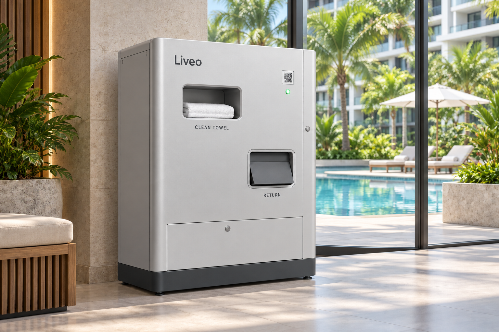
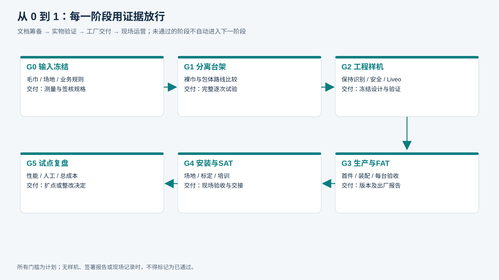

# 智能毛巾柜｜从0到1文档总包

**版本：V1.6 · 2026-09-16 · 内部工程筹备稿**

目标：Condo泳池／健身房，Liveo App授权，快速顺序发放一条干净毛巾，在实际出巾任务中识别并关联住户，独立归还与洗涤闭环，内部组件可分别采购与维护。

## 产品方案与当前状态

**产品结构：** 统一单柜、折叠裸巾、M1/M2独立送料；净巾发放、湿巾回收与电气区域分开。外观、场景及内部结构采用同一布局，见[单一产品说明](统一设计源/单一产品说明.md)。

**系统与采购：** 联网要求为Wi-Fi或有线接入，SIM联网按配置选配；设备通信要求采用MQTT/TLS接入Liveo平台。已整理4款主控板及14条分配件供应商候选，型号、报价和样品结果待确认，详见[采购表](采购候选与链接_V1.5.csv)。

**项目状态：** 方案及执行资料已编制；加工图、样机试验、供应商定选及现场验收待完成。现行资料包括21章、14份执行表单和158张产品配图。版本修订及核对过程见[版本记录](验证/V1.6统一修订说明.md)。

- **优先读[21 端到端逻辑闭环与验收矩阵](21_端到端逻辑闭环与验收矩阵.md)**：正常两轮、取消迟到、断网、归还乱序、洗涤补货、异常关单及恢复。
- [逐模块配图核对](子模块配图核对清单.md) · [当前统一图册](图册总览.html) · [图片索引](图册索引.md)。
- [规则模型与验证边界](验证/说明.md)：简化规则检查不代表代码、硬件或现场验收通过。
- [T13 闭环逐案验收](执行表单/T13_闭环逐案验收.md) · [T14 异常工单与实物交接](执行表单/T14_异常工单与实物交接.md)。44项真实验收用例目前均未执行。

首期建议：新领还均在线建立任务；已有任务依本条释放许可和本地安全条件收尾。转移前未确认归还保持／逐件隔离，已不可逆转移按实际箱批次冻结存证；洗好但原账未结的毛巾不得再发；超时只升级责任，不猜测成功。

- **历史业务审查结果：[逐模块逐图闭环审查记录](逐模块逐图闭环审查记录.md)**，含逐节结论、逐图记录和修订索引。

## 阅读导航

- 项目概览：[01 项目概述](01_立项与汇报摘要.md)。
- 连续图文阅读：[阅读总览.html](阅读总览.html)。双击可用浏览器离线打开，无需安装Markdown软件；修改Markdown后需重新生成HTML。
- 机械核心：[04 内部结构与传动](04_内部机械结构与传动.md)。
- 安排工作：[19 实施任务与责任分工](19_实施任务与责任分工.md)。
- 查看未决事项：[18 风险与决策台账](18_风险与决策台账.md)。

*概念场景图，非样机实拍。*

## 实施阶段与交付成果

## 完整目录

| 阶段 | 文档 | 主要读者 |
|---|---|---|
| 立项 | [01 项目概述](01_立项与汇报摘要.md) | 管理层、产品 |
| 需求 | [02 产品需求与毛巾规格](02_产品需求与毛巾规格.md) | 产品、物业、清洗 |
| 选路线 | [03 总体架构与方案选择](03_总体架构与方案选择.md) | 整机、产品 |
| 机械 | [04 内部机械结构与传动](04_内部机械结构与传动.md) | 机械、供应商 |
| 电控 | [05 电气控制与安全设计](05_电气控制与安全设计.md) | 电气、固件、质量 |
| 识别 | [06 RFID与毛巾身份验证](06_RFID与毛巾身份验证.md) | RFID、采购、测试 |
| 回收 | [07 湿巾归还与洗涤闭环](07_湿巾归还与洗涤闭环.md) | 机械、物业、清洗 |
| 集成 | [08 Liveo平台集成与业务状态](08_Liveo平台集成与业务状态.md) | Liveo、固件 |
| 协议 | [09 设备协议与联调契约](09_设备协议与联调契约.md) | 供应商、研发 |
| 选品 | [10 1688选品与供应商询价](10_1688选品与供应商询价.md) | 采购、技术评审 |
| 成本 | [11 BOM成本与采购冻结](11_BOM成本与采购冻结.md) | 采购、财务 |
| 生产 | [12 工程出图与生产装配](12_工程出图与生产装配.md) | 工厂、整机 |
| 验证 | [13 台架试验与设计验证](13_台架试验与设计验证.md) | 测试、质量 |
| 出厂 | [14 出厂验收FAT](14_出厂验收FAT.md) | 工厂、采购方 |
| 安装 | [15 安装调试与现场验收SAT](15_安装调试与现场验收SAT.md) | 现场实施、物业 |
| 运营 | [16 运营维护与故障处理](16_运营维护与故障处理.md) | 物业、售后 |
| 专利 | [17 国内专利技术交底筹备](17_国内专利技术交底筹备.md) | 技术负责人、代理师 |
| 决策 | [18 风险与决策台账](18_风险与决策台账.md) | 项目经理、各负责人 |
| 执行 | [19 实施任务与责任分工](19_实施任务与责任分工.md) | 全体交付团队 |
| 溯源 | [20 资料来源与旧版纠正](20_资料来源与旧版纠正.md) | 审阅人 |
| 闭环 | [21 端到端逻辑闭环与验收矩阵](21_端到端逻辑闭环与验收矩阵.md) | 全体交付团队 |

## 执行表单

- [T01 毛巾规格采样](执行表单/T01_毛巾规格采样.md)
- [T02 模块接口冻结](执行表单/T02_模块接口冻结.md)
- [T03 供应商对比](执行表单/T03_供应商对比.md)
- [T04 成本与报价](执行表单/T04_成本与报价.md)
- [T05 逐次试验记录](执行表单/T05_逐次试验记录.md)
- [T06 I/O与接线核验](执行表单/T06_IO与接线核验.md)
- [T07 生产首件与装配](执行表单/T07_生产首件与装配.md)
- [T08 出厂验收记录](执行表单/T08_FAT记录.md)
- [T09 场地勘察与现场验收](执行表单/T09_场地与SAT.md)
- [T10 运营维护记录](执行表单/T10_运营维护记录.md)
- [T11 问题与变更记录](执行表单/T11_问题与变更.md)
- [T12 专利交底证据](执行表单/T12_专利交底证据.md)

## 资料范围与工程状态

统一既有方案，并把需求、选品、生产、调试、验收和运营之间的缺口写成具体要求、用例、责任与记录表。主体21章、14份Markdown表单、当前统一图片/流程图，以及两份历史Word参考放在同一文件夹。

**当前已编制方案与执行资料，制造及验收证据待取得。** 实际尺寸、公差、价格、性能、合规适用和专利差异需由相应工程/供应方依据实物完成，全部集中在D01—D18决策项中；各项已登记责任方、验证方法和放行条件。

## 使用与版本规则

- `.md`为编辑主稿；HTML为方便阅读的副本；图片使用相对路径，整文件夹复制可保留引用。
- 表单空白是待实测/填写，不是0或合格。复制表单形成每台、每批、每次独立记录。
- 保留图纸、固件、BOM与配置版本，关键变更使用T11，原始失败记录不得覆盖。
- 本包不包含数据库表结构、生产凭据、已下单声明或代码发布声明。
- 供应商与专利内容用于内部筹备；对外分享按对象选择文档，法定信息如实提供。

## 2026-09-19 固定模型的工程审查入口

原21章主体保留，新增[22｜固定模型下的系统集成审查与工程补充](22_固定模型下的系统集成审查与工程补充.md)：12项具体缺口、原坐标核对、同一CAD总装规则、机械/电气/固件/协议接口及G0—G5证据要求。图14、布局JSON、全部既有图片保持原样；未新增产品结构，未宣布工程冻结。T02和T06增加可填写的具体记录项。

## 2026-09-20 十轮逻辑复核

新增[23｜十轮端到端逻辑复核与修订](23_十轮端到端逻辑复核与修订.md)：四项逻辑契约补充、一处计划措辞纠正、8项待执行验收子场景。08/09/16/21章及T13/T14同步补充。产品仍采用LVT-ONE / V1.6；原外观、布局与图形源未修改，工程及实机验收未放行。
