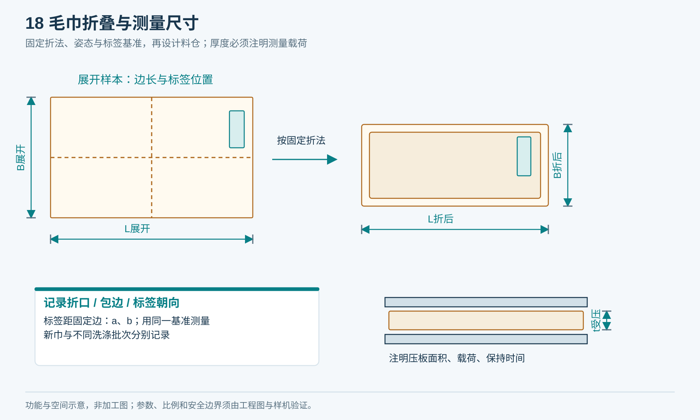

# T01｜毛巾规格采样

适用：G0／产品、清洗与机械。

**空白表示未填写，不代表0、不适用或已通过。每次/每台/每批复制本表形成独立记录，保留原始证据。**

| 记录项 | 填写要求 | 实际记录 |
|---|---|---|
| 样本追溯 | 样本ID、毛巾批次、供应方、洗涤批次和次数、测量人/日期 |  |
| 基础规格 | 材质；长/宽mm；克重g/m²；按规定干燥后的质量g |  |
| 折叠规格 | 折法版本；折后长/宽mm；压板面积、载荷及对应厚度mm |  |
| 姿态 | 送料前缘、折口、包边、标签位置mm及正反面照片路径 |  |
| 受力 | 满/半/近空仓；拉动速度；启动峰值N；稳定力N；重复次数 |  |
| 环境 | 温度、湿度、干燥程序、加水比定义及测量误差 |  |
| 结论 | 实际范围、异常样本、允许范围建议、签核人及版本 |  |

## 提交前检查

- [ ] 同一测量方法覆盖多批样本
- [ ] 照片和原始数据一一对应
- [ ] 未实测值不纳入批准规格

记录文件命名：表号_项目或样机_日期_批次。所有测量填写单位与方法；不适用项写明原因、替代处理及批准人。

## 测量位置参考

按图中的L/B/t及标签基准记录实测值；图示不是批准规格。
