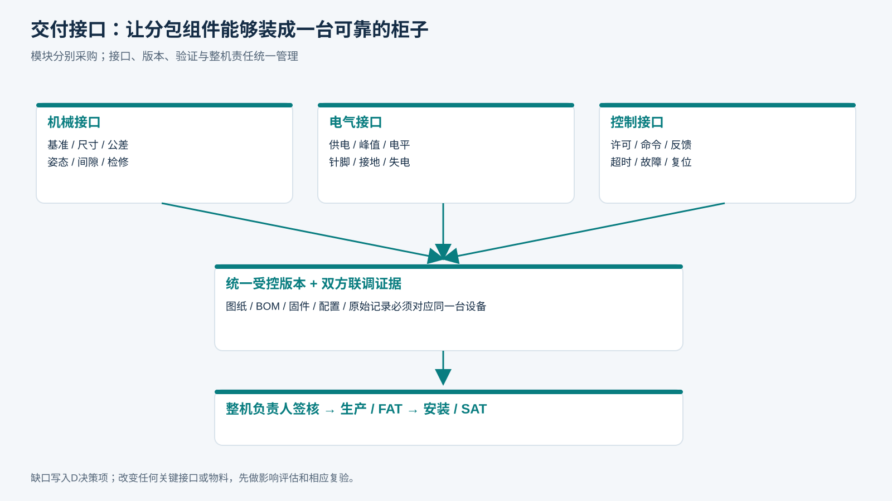

# T02｜模块接口冻结

**V1.6一致性必填：** 产品LVT-ONE；布局源版本____；总装图版本____；外观/开口/分舱/检修门比对____；偏差及T11编号____；复验人和日期____。未完成比对不能标整机一致性通过。

适用：G2／整机集成统筹。

**空白表示未填写，不代表0、不适用或已通过。每次/每台/每批复制本表形成独立记录，保留原始证据。**

<!-- form-figure -->
## 填表参考图

*对照模块两端逐项填写机械、电气、物料和协议接口；图本身不表示接口已签核。*

| 记录项 | 填写要求 | 实际记录 |
|---|---|---|
| 接口两端 | 上游模块及版本；下游模块及版本；双方工程负责人 |  |
| 机械接口 | 安装基准、孔位、外形、公差、质量、重心、过渡间隙与图号 |  |
| 物料接口 | 毛巾姿态、规格范围、标签位置、允许残余潮气、异常物体处理 |  |
| 电气接口 | 供电、峰值、信号电平、针脚、接地、连接器、失电行为 |  |
| 控制接口 | 启动许可、停止、反馈、超时、故障、复位及状态版本 |  |
| 维护接口 | 拆换步骤、清洁方法、工具、空间、易损件和安全隔离 |  |
| 冻结 | 联调证据路径、偏差、双方批准、冻结日期、变更编号 |  |

## 提交前检查

- [ ] 命令与真实反馈分开
- [ ] 上游异常不会强迫下游放行
- [ ] 装配图与I/O和协议一致

记录文件命名：表号_项目或样机_日期_批次。所有测量填写单位与方法；不适用项写明原因、替代处理及批准人。

**V1.3补充核对：** 接口签核补充：ReleasePermit、取消封禁、三类版本、RECEIVED/APPLIED、归还回执与原借用轮次、升级迁移；均按09/21章冻结。

### V1.4 接口补齐

逐项记录ReleasePermit身份与续期封禁、ReturnRoutePermit箱周转批次／容量预留、RECEIVED后QueryTaskResult、T_settle、同eventId载荷冲突、测试到生产凭据／历史移交；每项填写双方负责人、协议版本、验证记录和未决项。未定项不得填“已冻结”。

### V1.5联网／MQTT冻结补充

| 项目 | 需填内容 | 实际冻结记录 |
|---|---|---|
| 硬件 | MC型号、板卡版本、NET-W/E/C/D、I/O分配、驱动与存储 |  |
| 蜂窝 | SIM座／型号、模组频段、天线、APN、运营商、是否现场验证 |  |
| MQTT | Broker、端口、3.1.1、TLS、clientId、Topic/ACL、证书轮换 |  |
| 边界值 | 心跳、退避、时钟偏差、持久队列容量、保留期限和满载策略 |  |
| 验收 | NET01—NET08适用性、判据、责任人和日志位置 |  |
