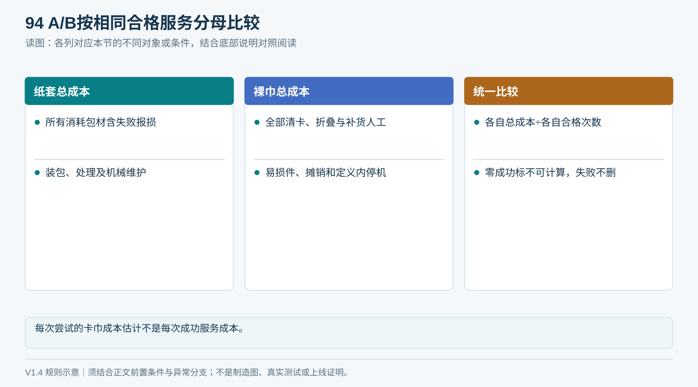

# T04｜成本与报价

> V1.6当前产品仅采用03章统一结构。本文保留的A/B成本比较用于历史研发或受控变更论证，不能作为第二种交付外形、装配结构或已采用的包材方案。

适用：G0—G5／采购、财务、整机。

**空白表示未填写，不代表0、不适用或已通过。每次/每台/每批复制本表形成独立记录，保留原始证据。**

<!-- form-figure -->
## 填表参考图

*按同周期同分母分别填A/B成本；空白报价不计为0元。*

| 记录项 | 填写要求 | 实际记录 |
|---|---|---|
| 核算范围 | A/B/C路线；样机/批量；台数；核算周期；币种和汇率日期 |  |
| NRE | 机械设计、控制/软件、工装、试验、认证等逐项金额及含税状态 |  |
| 物料 | B01—B08每项料号、单价、数量、来源报价、有效期、是否已含 |  |
| 交付 | 装配、质检、运输保险税费、安装调试、培训、备件 |  |
| 运营 | 清洗、包材、装包/补货/清卡/清洁人工、维护、损耗、网络许可 |  |
| 分母 | 周期内真实成功服务次数及定义，自动和人工完成分开 |  |
| 敏感性 | 低/中/高用量；卡巾率；人工费；寿命与成本区间 |  |
| 结论 | 缺失报价项、不可比范围、同周期总成本与单次成本、批准人 |  |

## 提交前检查

- [ ] 空价保持未报价
- [ ] 标签首批和替换不重复
- [ ] NRE与购置不重复全额/摊销计入

记录文件命名：表号_项目或样机_日期_批次。所有测量填写单位与方法；不适用项写明原因、替代处理及批准人。

### 同口径成本核算

记录币种、税费口径、报价版本与有效期、数量、是否含NRE；未报价留空。A/B分别记录总尝试、自动合格、人工合格、失败、实际总成本及固定服务分母；零成功次数标“不可计算”。失败耗材与工时保留。替代料另附试用批准、复验和生产批准。

### V1.5网络成本补充

分别记录NET-W/E/C/D方案；必含主板、I/O、驱动、保护、存储、天线、4G件／路由器、SIM和流量、证书配置、固件／Liveo适配及验证费用。分清NRE、每台物料、每月费用，空白仍为未报价，不得汇总成0。
