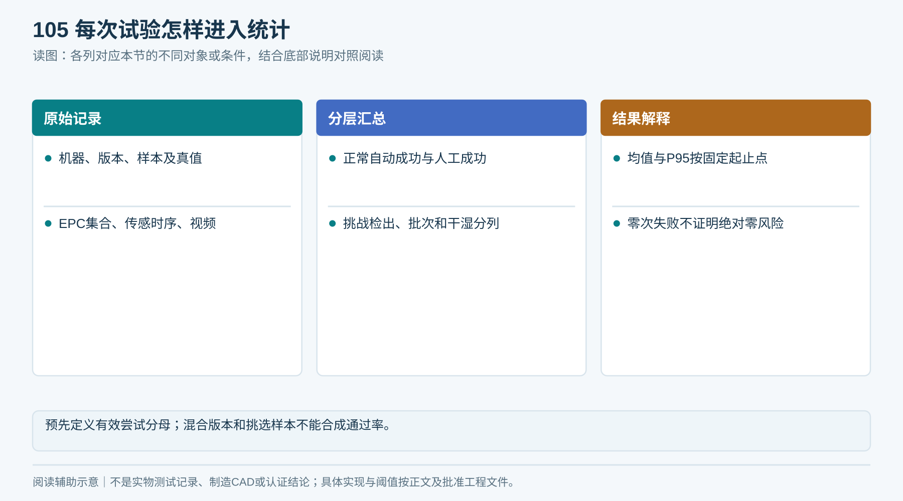

# T05｜逐次试验记录

适用：G1—G2／质量、机械、控制。

**空白表示未填写，不代表0、不适用或已通过。每次/每台/每批复制本表形成独立记录，保留原始证据。**

<!-- form-figure -->
## 填表参考图

*每次记录版本、样本、实物真值、日志和视频，正常与挑战用例分别汇总。*

| 记录项 | 填写要求 | 实际记录 |
|---|---|---|
| 试验定位 | V用例编号、批次、单次ID、日期、操作者、样本计划版本 |  |
| 版本 | 设备序列号、图纸、BOM、固件、配置及上一变更编号 |  |
| 输入 | 毛巾ID/批次、干湿定义、折向、叠高、真值条数 |  |
| 参数 | 分离高度/预紧、带速、停车策略、天线和功率配置 |  |
| 原始观测 | EPC集合、S1/S2/S3与门位时间序列、轴运动、电流、后条位移 |  |
| 结果 | 自动成功/双条/卡巾/损伤/未识别/串读/错误记账/待核验 |  |
| 时间与人工 | 授权接受时间、到可取时间、取走时间、清卡分钟数 |  |
| 证据 | 完整视频、日志路径、失败解释、复验关联和签核 |  |

## 提交前检查

- [ ] 失败不能删除或换批号抹去
- [ ] 物理条数有独立真值
- [ ] 不同版本分别统计

记录文件命名：表号_项目或样机_日期_批次。所有测量填写单位与方法；不适用项写明原因、替代处理及批准人。

### 计时与样本口径

分别记录T_service、T_user、测量端／时钟域、校准误差、网络条件；缺测留空并说明。失败和超时仍有原始记录，不从样本删除；D16签核编号、试验前批准日期和中止条件必填。
