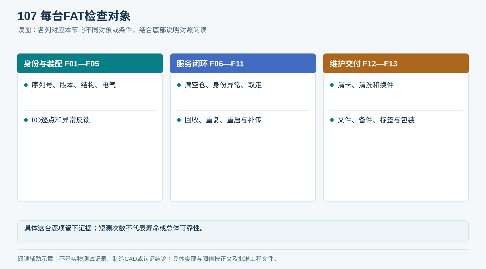

# T08｜出厂验收记录

适用：G3／工厂质量与采购方见证。

**空白表示未填写，不代表0、不适用或已通过。每次/每台/每批复制本表形成独立记录，保留原始证据。**

<!-- form-figure -->
## 填表参考图

*按F01—F13逐台检查，未执行的项目不能填通过。*

| 记录项 | 填写要求 | 实际记录 |
|---|---|---|
| 验收信息 | 设备序列号、订单、版本、地点、日期、双方人员 |  |
| 前提 | 设计验证报告、批准图纸/BOM、合规文件、仪器有效信息 |  |
| 逐项结果 | 按F01—F13逐项记录预期、实际、证据文件、通过/失败/未执行 |  |
| 异常 | 缺陷编号、严重性、整改人、返修版本和复验结果 |  |
| 终盘 | 实物位置、未完任务清单、日志导出、清洁和包装 |  |
| 交付 | 文件/备件/配件数量、凭据受控交付方式、保修资料 |  |
| 签署 | 通过/不通过/未完成；遗留问题；双方签名和日期 |  |

## 提交前检查

- [ ] 空白不得算通过
- [ ] 关键失败禁止发运
- [ ] 具体台检查不替代设计寿命验证

记录文件命名：表号_项目或样机_日期_批次。所有测量填写单位与方法；不适用项写明原因、替代处理及批准人。

## 逐项执行结果

| 编号 | 检查项目 | 实际观测与证据 | 结果 | 检查人/日期 |
|---|---|---|---|---|
| F01 | 型号、序列号、物料/图纸/固件/参数版本 |  | 未执行 |  |
| F02 | 外观、尺寸、毛刺、稳定性与安装件 |  | 未执行 |  |
| F03 | 传动、防护、门与维护入口 |  | 未执行 |  |
| F04 | 接线、保护接地及规定电气测试 |  | 未执行 |  |
| F05 | I/O逐点与断线／矛盾状态 |  | 未执行 |  |
| F06 | 满、半、近空仓发放 |  | 未执行 |  |
| F07 | 无标签、多标签、通道遗留物 |  | 未执行 |  |
| F08 | 未取走与取走 |  | 未执行 |  |
| F09 | 湿归还、卡门、缺箱和异常路线 |  | 未执行 |  |
| F10 | 重复指令和重启恢复 |  | 未执行 |  |
| F11 | 断网、补传和乱序 |  | 未执行 |  |
| F12 | 清卡、清洁、更换易损件 |  | 未执行 |  |
| F13 | 文件、备件、标签、包装与运输锁 |  | 未执行 |  |

**V1.3补充核对：** FAT闭环适用C项按14章与T13登记证据，不把同版本继承证据写成逐台已执行。

### 结果与发运决定分开填写

每项结果：通过／不通过／未完成。发运决定：允许／附条件允许／不允许。附条件只限非安全、非关键功能次要项，必填问题号、双方批准、责任人、期限、SAT关闭证据和启用阻断；检验失败不能改写为通过。
