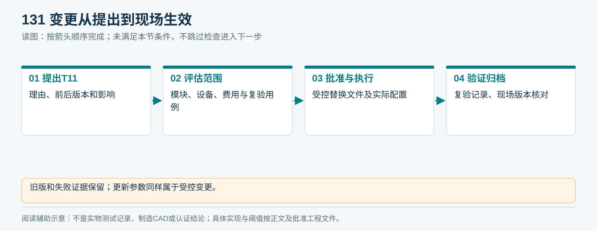

# T11｜问题与变更记录

适用：全阶段／项目经理与模块负责人。

**空白表示未填写，不代表0、不适用或已通过。每次/每台/每批复制本表形成独立记录，保留原始证据。**

<!-- form-figure -->
## 填表参考图

*把变化前后版本、影响设备、复验用例和批准人写完整。*

| 记录项 | 填写要求 | 实际记录 |
|---|---|---|
| 编号 | 问题/变更ID、提出日期、提出人、关联D/V/F/S编号 |  |
| 现状 | 发现方式、实际事实、版本、受影响序列号/批次/地点 |  |
| 影响 | 安全、记账、性能、成本、交期、供应和合规影响 |  |
| 方案 | 根因证据、建议最小改动、文件和物料范围、备选 |  |
| 验证 | 受影响用例、重测方法、原始记录和结果 |  |
| 发布 | 批准人、实施人、目标版本、现场升级/替换和回退方式 |  |
| 关闭 | 实物/文档/软件均核对，残余风险与接受人、日期 |  |

## 提交前检查

- [ ] 未知根因标为调查中
- [ ] 参数更改同样留版本
- [ ] 不覆盖旧失败记录

记录文件命名：表号_项目或样机_日期_批次。所有测量填写单位与方法；不适用项写明原因、替代处理及批准人。

**V1.3补充核对：** 变更关联C用例及物理、账务、责任影响；源文件、版本、受影响设备和复验结果同步。
