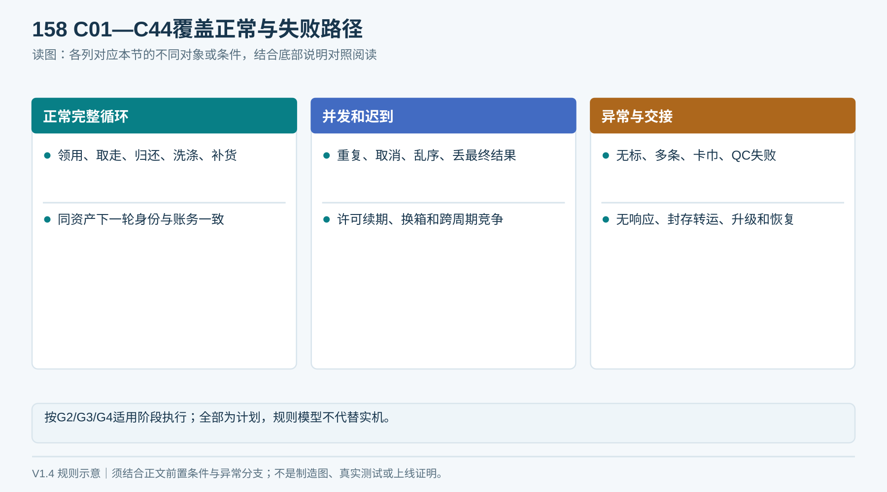

# T13｜闭环逐案验收

每个C01—C44复制一份。默认状态为“未执行”，不能用规则模型结果代填真机验收。参考[21章](../21_端到端逻辑闭环与验收矩阵.md)。

| 记录项 | 实际填写 |
|---|---|
| 用例ID／对应R、D、V/F/S编号 | 待填写 |
| 设备及项目（使用脱敏标识）、日期、执行人／复核人 | 待填写 |
| 图纸、固件、平台、协议、参数及装载批次版本 | 待填写 |
| 执行层级：规则模型／模拟器／台架／FAT／SAT／运营 | 待填写 |
| 前置条件、原任务／回执／命令、资产轮次 | 待填写 |
| 刺激顺序及故障注入点、真实输入 | 待填写 |
| 实物真值与最终位置、身份及保管人 | 待填写 |
| 任务和事件最终结果、版本 | 待填写 |
| 借用对象与原轮次、预留／在借／周期量前后值 | 待填写 |
| 通道清空、防护反馈、恢复或停用结论 | 待填写 |
| 异常caseId、实际责任人、期限、升级情况 | 待填写 |
| 视频、原始日志、签收、证据文件及摘要 | 待填写 |
| 预期与实际差异、问题T11及复验引用 | 待填写 |
| 最终结论／签字 | 未执行 |

C01必须包含同一毛巾洗涤补回后的第二轮；每轮任务和借用版本不同。正常、拒绝、待核验后处置均须核查四类结果。涉及模型无法验证的真实物理条件，必须补真实试验。

## 填表参考图

*C01—C44逐案记录四类结果：实物、任务、账务、通道；不能只检查App提示。*

### V1.4 场景范围与证据阶段

用例范围扩展为C01—C44。逐案先填计划阶段G2／G3／G4、实际版本、设计验证／FAT／SAT、实机或模拟范围；继承证据写明版本相同和覆盖理由。未来阶段标未执行，不用规则模型结果代填实机。新增场景详见21章。

### V1.5网络补充场景

原C01—C44保持编号；另按[09章](../09_设备协议与联调契约.md)逐一登记NET01—NET08。记录网络配置、适用性、批准判据、故障注入、原日志、实物及平台结论。8个网络场景目前均未执行，不能引用规则模型检查冒充实测。

### 2026-09-20｜逻辑边界补充子场景

另登记[23章第4节](../23_十轮端到端逻辑复核与修订.md)的8项LR子场景，保留原C01—C44与NET01—NET08编号；不把8项算成已经执行的测试。记录维护接管时序、终态拒绝落盘、localIncidentId映射、平台业务结果版本和人工补正并发证据。每案均追到实物／任务／账务／通道结果，以及能否按准入条件洗涤、补货和开启第二轮。未满足恢复条件时应停用，不能为完成循环强制放行。
