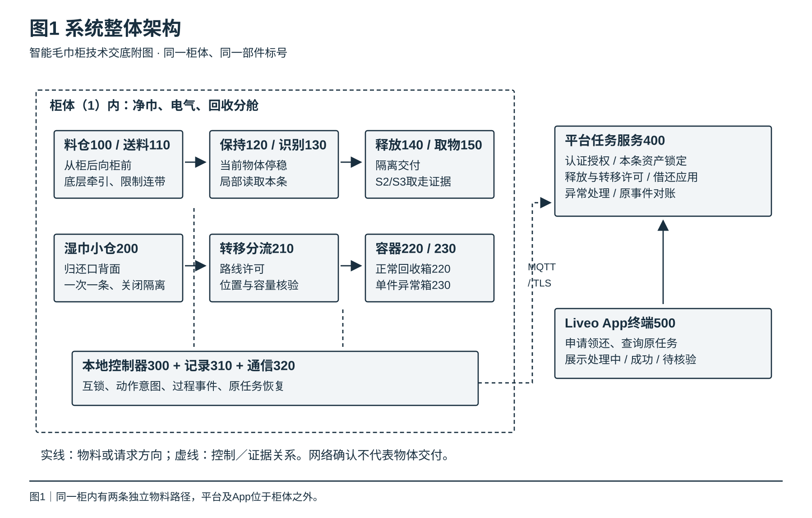
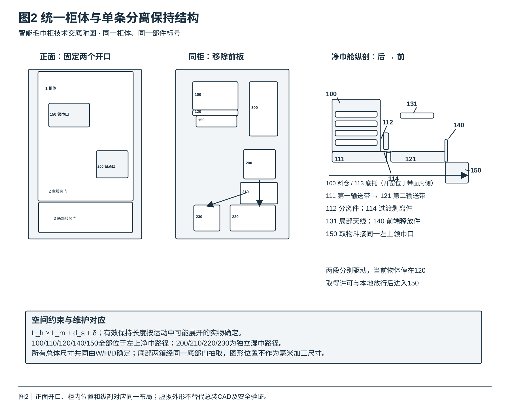
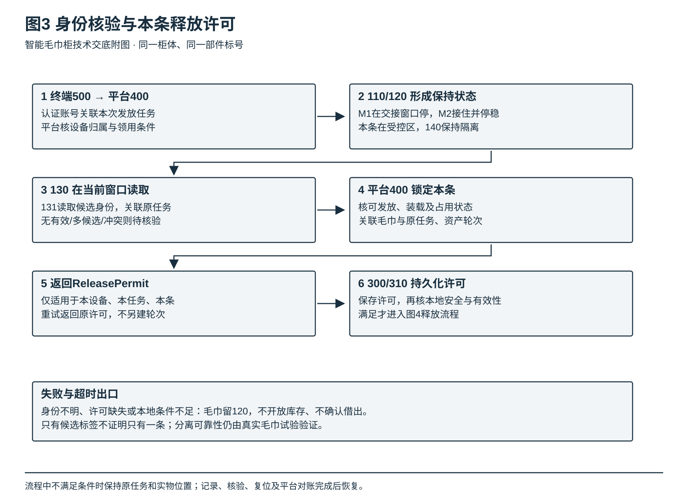
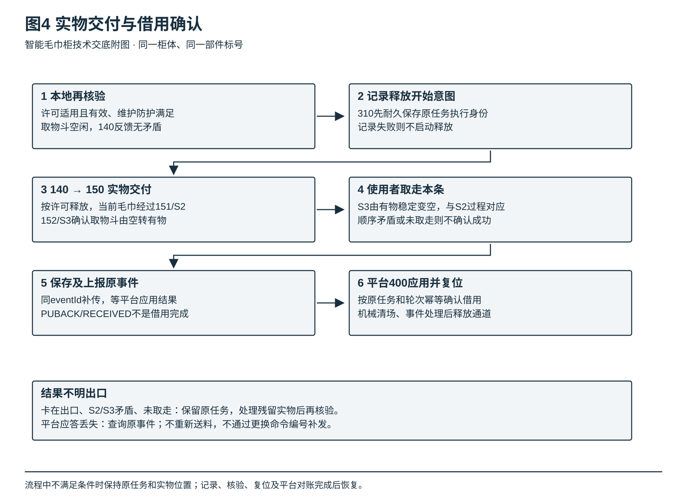
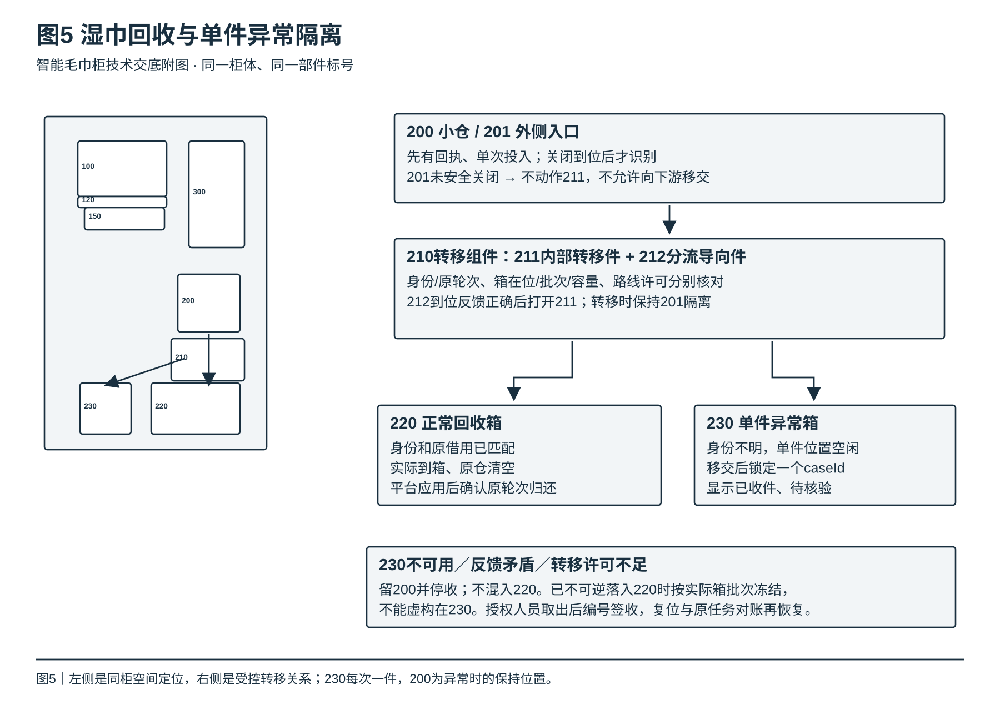
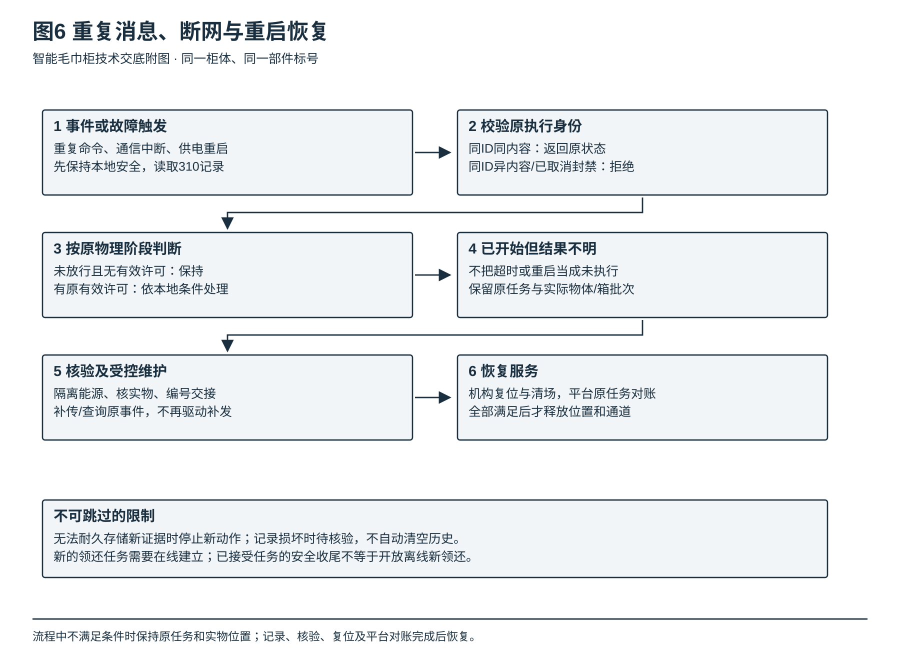
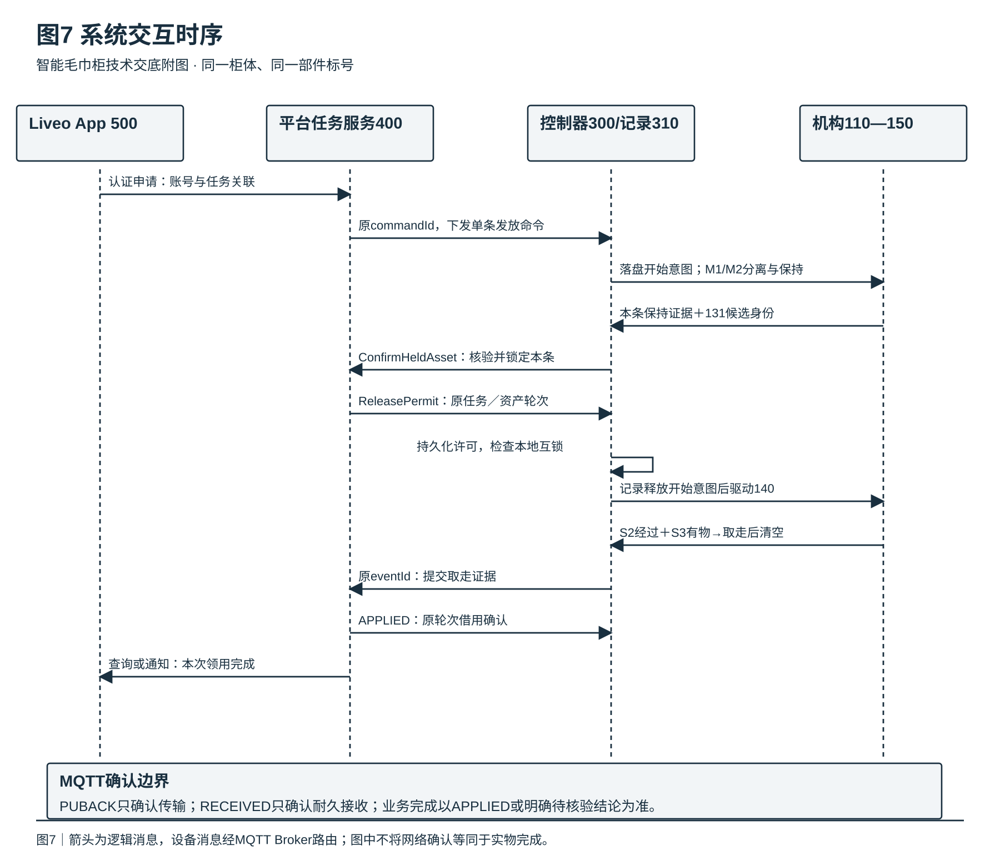

# 专利技术交底书

# 一种具有单条受控发放与异常归还隔离功能的智能毛巾柜系统

版本：V1.0｜日期：2026年9月16日｜用途：技术交底及权利要求讨论稿。

本系统采用单一柜体：左上领巾、右下归还，净污分舱，底部设置正常回收箱与单件异常隔离箱，接入Liveo平台。权利要求是拟议保护内容，未作新颖性、创造性及可授权性结论；实施例为拟实施设计，尚无样机实测结果。

## 摘要

本发明涉及纺织品自动发放、回收及射频识别技术，公开一种智能毛巾柜系统。该系统在同一柜体内设置相互隔离的净巾发放路径和湿巾回收路径。净巾经第一输送组件分离、第二输送组件接收后停留于受控保持区，读取其身份并取得与本次任务对应的释放许可，随后经隔离取物口交付，依据有序的实物检测事件建立借用关联。湿巾在识别小仓内完成隔离和核验后转入正常回收箱，身份不明的湿巾转入单件异常隔离箱；隔离条件不足时保持原仓并停止接收。控制器持久化记录任务、动作阶段与物体位置，在重复消息、断网或重启时恢复原任务，限制重复发放和错误归还确认。

## 权利要求书

以下10项为与本说明内容相对应的拟议权利要求。正式申请时应结合检索结果与实际形成的技术贡献调整范围。

### 1. 一种具有单条受控发放与异常归还隔离功能的智能毛巾柜系统，其特征在于：包括

- 柜体（1），其内设置相互隔离的净巾发放路径和湿巾回收路径，其前侧设置领巾口和归还口；
- 净巾料仓（100）、分离送料组件（110）和接料保持组件（120），所述分离送料组件（110）将折叠毛巾从净巾料仓（100）向接料保持组件（120）输送，所述接料保持组件（120）具有公众不可直接触及的受控保持区；
- 身份识别组件（130）、释放隔离组件（140）及取物检测组件（150），所述身份识别组件（130）在毛巾停留于受控保持区时读取毛巾标签身份，所述释放隔离组件（140）控制受控保持区与领巾口之间的实物移交，所述取物检测组件（150）检测毛巾进入取物位置以及从取物位置移除的过程；
- 湿巾识别小仓（200）、转移分流组件（210）、正常回收箱（220）及单件异常隔离箱（230），所述转移分流组件（210）连接湿巾识别小仓（200）与正常回收箱（220）、单件异常隔离箱（230），并使各转移路径与所述净巾发放路径分开；
- 本地控制器（300）和平台任务服务（400），所述本地控制器（300）根据受控保持状态、识别身份和平台任务服务（400）返回的本条释放许可控制释放隔离组件（140），并将取物检测组件（150）形成的有序过程证据提交平台任务服务（400）以建立该毛巾与本次授权账号的借用关联；所述本地控制器（300）还根据归还识别结果、容器状态与转移许可控制转移分流组件（210），在身份不明且单件异常隔离条件成立时将湿巾转入单件异常隔离箱（230），在转移条件不成立时使湿巾保留在湿巾识别小仓（200）内并停止接收新物体。

### 2. 根据权利要求1所述的系统，其特征在于：所述分离送料组件（110）与接料保持组件（120）沿柜体深度方向从后向前依次布置，其中：

- 净巾料仓（100）的底部设有带开窗的支撑底托（113），第一输送带（111）经所述开窗与底层毛巾接触；
- 第一输送带（111）的出料区域设有高度和预紧可调的弹性分离件（112），用于限制上层毛巾随底层毛巾移动；
- 第一输送带（111）与第二输送带（121）之间设有过渡剥离件（114）；
- 第一输送带（111）和第二输送带（121）分别由独立驱动单元驱动，本地控制器（300）在当前毛巾已被第二输送带（121）接住、后续毛巾仍被限制于上游的已标定交接窗口内停止第一输送带（111），由第二输送带（121）将当前毛巾带入受控保持区并停止。

### 3. 根据权利要求2所述的系统，其特征在于：所述受控保持区的有效输送方向长度满足：

```text
L_h ≥ L_m + d_s + δ
```

其中，L_h为受控保持区的有效长度，L_m为允许毛巾在输送中可能呈现的最大运动长度，d_s为在规定负载和速度边界下确定的停车位移，δ为定位误差及结构间隙的余量；所述释放隔离组件（140）设置于受控保持区朝向领巾口的一端，使当前毛巾在取得有效释放许可前保持在公众不可触及的区域内。

### 4. 根据权利要求1所述的系统，其特征在于：所述身份识别组件（130）包括设置于受控保持区的净巾天线（131）、设置于湿巾识别小仓（200）的湿巾天线（132）以及与其连接的读写器（133）；本地控制器（300）将天线读取时段与对应物体的保持时段关联，分别形成净巾与湿巾候选身份集合，并将无有效身份、存在冲突身份或与当前任务不匹配的结果判为待核验，禁止仅以读到一个标签编号确定实物数量或者实物交付完成。

### 5. 根据权利要求1所述的系统，其特征在于：所述本条释放许可至少关联发放任务标识、命令标识、设备标识、毛巾身份及资产借用轮次；本地控制器（300）在非易失性任务记录中保存所述许可，并在确认许可与当前受控毛巾一致、释放开始时许可有效、维护防护条件满足且取物位置未被占用后，驱动释放隔离组件（140）；不满足上述条件时不向公众取物位置释放毛巾。

### 6. 根据权利要求5所述的系统，其特征在于：所述取物检测组件（150）包括设置于释放通道的通过检测器（151）及设置于取物斗的占用检测器（152）；本地控制器（300）将本次释放动作、通过检测过程、取物斗由无物转为有物以及后续由有物转为空的检测过程按原任务关联，只有所述过程满足对应检测规则且不存在相矛盾的反馈时才形成取走证据；平台任务服务（400）依据所述取走证据及原任务关联执行借用确认，未完成或者相互矛盾的过程保持处理中或待核验。

### 7. 根据权利要求1所述的系统，其特征在于：所述湿巾识别小仓（200）设置有外侧入口隔离件（201）和内部转移件（211），所述内部转移件（211）属于转移分流组件（210）；本地控制器（300）在所述外侧入口隔离件（201）关闭到位、仓内存在当前回执对应的物体、目标容器在位且可接收、分流位置反馈与当前转移许可相符时，才允许内部转移件（211）动作，并在内部转移件（211）动作期间阻止外侧入口重新开放。

### 8. 根据权利要求7所述的系统，其特征在于：所述单件异常隔离箱（230）具有独立的在位和占用状态，接收一件待核验湿巾后与一个异常任务建立位置关联并进入占用锁定状态；在该物体被授权取出、完成带编号的保管交接、隔离位置复位且原任务完成对账之前，不允许再次向该位置转入另一物体；所述单件异常隔离箱（230）不可用时，新的待核验物体保持于湿巾识别小仓（200），不被导入正常回收箱（220）。

### 9. 根据权利要求1所述的系统，其特征在于：所述本地控制器（300）包括非易失性任务记录单元（310），在危险运动开始前记录命令身份和动作开始意图，在物理阶段改变后记录阶段证据及实物位置；对于身份与内容均相同的重复命令返回原任务状态，对于相同身份但内容不同的命令拒绝执行；重启后，依据所述非易失性任务记录和当前检测反馈恢复原任务，无法确定已发生物理动作的结果时进入待核验，禁止以新任务身份重新执行原发放动作。

### 10. 根据权利要求9所述的系统，其特征在于：所述本地控制器（300）通过通信单元（320）采用MQTT协议与平台任务服务（400）双向通信，关键命令和证据事件采用QoS 1传输并通过TLS保护连接；物理动作命令不采用保留消息，通信确认与平台业务应用确认分别记录；通信重连或者网络链路切换后，仍使用原命令标识和事件标识进行补传或结果查询，平台任务服务（400）按原任务及资产借用轮次处理结果，禁止将通信重传解释为再次执行物理动作的授权。

## 技术领域

本发明涉及软质纺织品自动分离与输送、射频识别、机电互锁及物品交接控制技术，更具体地涉及一种在单一柜体内实施净巾单条发放、湿巾独立回收、身份核验、实物交付检测和异常隔离的智能毛巾柜系统，适用于住宅公寓泳池、健身房等共享毛巾服务场景。

## 背景技术

### 现有技术分析

以下按照技术处理方式分析可能存在的局限，不表示所有现有产品均具有这些缺陷，也不代替针对具体专利文献的检索和逐特征对比。

#### 1. 开放式存放或整仓开门取巾方式

**代表性方案**：使用开放层架、人工台面或一次打开整个库存门供使用者取巾。

**技术原理**：以人工操作或者门禁控制限制取用入口，依赖使用者自行取出需要的毛巾。

**主要局限**：

- 开门权限只代表可进入库存区域，不能确定使用者实际取走了几条毛巾。
- 仅凭开门、扫码或按钮事件，难以对应某一件毛巾的实际交接。
- 使用者可接触多件库存，库存保护与净巾卫生接触边界难以分开。
- 对实际取用数量的管理可能依赖额外人工核对。

#### 2. 仅凭送料动作或出口信号确认交付的方式

**代表性方案**：使用皮带、滚筒或推送机构，按运行时长、电机转数或单次光电信号判断发放。

**技术原理**：驱动送料件将软质物品从库存推向出口，并利用部分动作信号估算出料结果。

**主要局限**：

- 毛巾厚度、含绒量、叠放压力、磨损及折叠姿态变化会改变摩擦和连带条件。
- 电机轴旋转不等于毛巾移动；固定运行时间可能在不同负载下得到不同结果。
- 单条厚巾与多条压紧薄巾的厚度范围可能重合，单一间隙不能承担全部数量判断。
- 毛巾经过出口附近不等于已经到达可取位置，也不等于使用者已经取走。

#### 3. 仅凭RFID读数或集中回收箱盘点的方式

**代表性方案**：读取标签后立即记借还，或者依靠大回收箱周围的天线读取投入物。

**技术原理**：通过射频通信获取标签身份，利用身份变化估算物品进出。

**主要局限**：

- RFID解决的是标签通信与身份识别，不能单独证明毛巾的物理分离、到位或取走。
- 含水毛巾、标签朝向、叠压和柜体金属共同影响射频耦合；标签耐洗不等于所有湿态姿态均能可靠读取。
- 库存、既有回收物以及周边标签可能进入有效读取范围，读到的身份不必然属于本次投入物。
- 身份不明的多件湿巾混放后，会丢失每个回执与具体实物之间的位置对应关系。

#### 4. 单独处理机械动作、标签识别与平台记录的共同局限

- **证据断开**：送料成功、读取成功和平台收到消息分别成立，并不自动形成同一件毛巾的完整交接证据。
- **异常去向不清**：只设置“识别失败”状态但未设计保持空间与独立实物位置，无法支持后续核验。
- **恢复条件不足**：通信超时后重新发指令，可能对已经执行的物理动作再次执行。
- **净污边界不明确**：以同一输送面回退湿巾，可能使净巾路径与回收路径发生接触。

### 技术发展趋势

与本交底有关的工程方向包括：将单条形成与后续识别分开；在公众取得物品前设置受控保持空间；使局部读区与实际物体位置及读取时段相对应；通过检测过程确认实物移交；将异常物体的物理位置与原任务绑定；通过本地耐久记录处理网络和供电中断。这些方向用于说明本系统的设计取向，不作市场占有率、行业独创性或必然授权的判断。

## 发明内容

### 技术问题

1. **如何将折叠软巾从叠放库存中顺序分离，并在完成身份核验前阻止公众直接取用？**

需要协调底层牵引、上层限制、两段输送交接及停车过程，使当前毛巾进入可保持的位置，避免仍与库存连续相连时就向使用者开放。

2. **如何将实际发出的那一条毛巾与本次授权账号绑定，而不是将扫码或候选读数当成交付？**

需要在实际出巾任务中读取当前毛巾，并把任务、身份、释放许可和取走证据连接起来；账号认证与毛巾身份识别是两个不同环节。

3. **如何在湿态识别失败时保持单件可追踪，并避免错误结束借用责任？**

需要将投放入口、受控小仓、转移分流与下游容器分开，在正常回收之外提供一件一位的异常位置，以及异常位置不可用时的原仓保持路径。

4. **如何在成本受控的条件下，实现断网、重复消息和重启后的物理动作与记录一致？**

需要以本地检测和持久化任务状态约束动作，把网络确认与业务结果分开；减少误动作和盲目重发，而不是仅通过增加大屏、全柜盘点或复杂取料机构解决。

### 解决方案

#### 1. 单柜分舱与两段送料保持结构

净巾料仓（100）位于柜内左上区域的后侧，第一输送带（111）位于其底部，弹性分离件（112）设置于送料出口附近。第二输送带（121）位于第一输送带（111）朝柜体前方的一侧，通过过渡剥离件（114）接料；其上方及周围构成受控保持区。当前毛巾完全进入受控保持区并停止后，才开始本条身份及释放条件核验。

释放隔离组件（140）位于受控保持区前端，与固定取物斗共同构成隔离交付路径；取物斗连接柜体左上领巾口。湿巾识别小仓（200）位于右侧归还口背面，下接转移分流组件（210）及两个相互独立的容器。电气舱位于右上且与湿巾路径隔离。净巾不借用湿巾接触面，回收不通过反转净巾皮带实现。

#### 2. 保持位置、标签身份与本条释放许可协同

平台先把本次领用任务与已认证账号关联；随后读取的毛巾身份只表示当前保持物的候选身份。平台核对该身份的项目归属、可发放状态、装载记录和活动占用，在同一任务中锁定该毛巾及其借用轮次，返回本条释放许可。柜端落盘许可后再检查本地防护和取物斗状态。

领用关联分为三个阶段：任务关联账号、保持物锁定候选资产、取走证据成立后确认借用。任一阶段的超时不能跳过下一阶段的实物证据。Liveo App为本实施例的使用入口；通用技术方案中的终端不依赖特定界面名称。

#### 3. 湿巾单件隔离与受控移交结构

使用者建立归还回执后，一次投入一条湿巾。外侧入口关闭到位后，湿巾在小仓内保持，读写器于对应读取时段获取候选身份。正常路径需要身份与原借用轮次核验、正常箱在位及容量满足、路线许可和分流反馈一致。

无法识别的物体在单件异常隔离箱（230）空闲且已取得异常转移许可时转入该箱；该箱随即锁定为一个异常任务对应的实物位置。隔离箱被占用、许可缺失、分流不到位或转移过程不确定时，物体保留原仓并停止接收。身份不明不能用投放账号的自报身份替代标签核验。

#### 4. 本地动作日志与平台幂等确认

控制器在动作开始前保存任务及开始意图，在检测阶段变化后保存对应事件；记录至少包含任务标识、设备、实物位置、许可引用和阶段。相同命令身份和内容再次到达时返回已有状态，不再次驱动电机。发生断电时，记录不能证明未动作的任务进入恢复核验，不能仅凭缓存为空或超时就重新送料。

平台分别记录事件已耐久接收和业务已应用。Wi-Fi、有线或选装蜂窝链路均承载同一MQTT通信契约，不改变柜形、内部结构或任务身份。恢复通信后先补传和对账，再依据机械复位及原任务结论恢复服务。

### 技术效果

以下为由上述结构和控制关系推导的预期效果，具体提升幅度和可靠性尚待试验验证。

#### 1. 单条交付边界更明确

- 将库存分离、受控保持和公众取物分开，避免直接开放整仓库存。
- 两段驱动可分别调节交接与停车，便于定位连带、打滑和保持空间不足的问题。
- 取得本条许可前不公开释放，减少仅扫码或仅读到标签即记借出的情况。

#### 2. 湿态异常可定位、可处理

- 小仓将当前投入物与已回收物分开，为局部识别和实物转移判断提供可控位置。
- 单件异常位保持回执与具体实物的对应，避免多个未知物体混放后无法区分。
- 异常位不可用时有原仓保持及停收出口，避免为追求连续运行而错误销账。

#### 3. 通信异常下限制重复动作

- 持久化命令身份和阶段，支持重复消息到达时返回原状态。
- 区分传输确认、事件接收和业务应用，避免把MQTT确认当作实物成功。
- 已发生但未确定的动作保留原任务进入核验，减少以新任务补发造成的重复出巾风险。

#### 4. 维护与运营证据更完整

- 同柜内净巾、电气、回收模块分区维护，正常箱与异常箱分别交接。
- 实物位置、清洗状态和借用状态分别管理，归还物不会直接成为可发放库存。
- 记录支持技术排障和责任追踪；不将普通日志表述为不可篡改证据或自动满足司法证明要求。

## 具体实施方式

### 系统整体架构

本系统由五类功能组成：净巾分离与保持、局部射频识别、隔离交付、湿巾回收与异常隔离、本地控制与平台任务管理。五类功能配置于同一产品中，不代表五种产品。

**统一部件标号及与既有工程模块的对应关系：**

| 本文标号 | 名称 | 对应工程模块／位置 |
|---|---|---|
| 1、2、3 | 柜体、主服务门、底部服务门 | 同一单柜；库存门不向住户开放 |
| 100 | 净巾料仓 | H01；左上净巾舱后部 |
| 110 | 分离送料组件 | H02—H05的供料与过渡总成 |
| 111、112、113、114 | 第一输送带、弹性分离件、支撑底托、过渡剥离件 | H03、H04、H02、H05 |
| 120、121 | 接料保持组件、第二输送带 | H06；左上净巾舱前部 |
| 130、131、132、133 | 身份识别组件、净巾天线、湿巾天线、读写器 | 131位于120；132位于200；133位于电气舱 |
| 140 | 释放隔离组件 | H07；受控区朝向领巾口的一端 |
| 150、151、152 | 取物检测组件、通过检测器、占用检测器 | H08；左上领巾口及其后方固定取物斗 |
| 200、201 | 湿巾识别小仓、外侧入口隔离件 | R01；右侧归还口背面 |
| 210、211、212 | 转移分流组件、内部转移件、分流导向件 | R02；小仓下方，连接两个独立路径 |
| 220 | 正常回收箱 | R03；底部右侧，可从底部服务门抽取 |
| 230 | 单件异常隔离箱 | R04；底部左侧，一次只接收一件 |
| 300、310、320 | 本地控制器、非易失性任务记录单元、通信单元 | E01独立干燥电气舱 |
| 400 | 平台任务服务 | Liveo平台侧任务、许可、借还与异常处理 |
| 500 | 使用终端 | Liveo App；账号来源为认证会话 |

标号在两组实施过程及图1—图7中保持同义。附图的框线表示模块边界或空间关系，不代表已完成屏蔽、密封或人身防护认证。

### 实施例1：泳池配套区域的净巾单条发放

#### 设备环境配置

- **产品结构**：采用统一单柜外形，左上领巾口、右下归还口、右上电气舱、底部两只独立回收容器；M1/M2沿柜深从后向前工作。
- **送料组件**：两组独立减速驱动、平送料带、独立轴承支撑、可调分离件和过渡剥离件；不以电机输出轴直接承担未经计算的全部皮带张紧载荷。
- **识别与检测**：带耐洗标签的折叠毛巾；净巾和湿巾局部天线；送料交接检测S1、通过检测S2、取物斗占用检测S3，以及维护门、释放件、归还入口、分流和箱位反馈。
- **主控与联网**：可运行任务状态机和非易失性日志的控制板，配工业I/O及独立驱动器；通信单元使用现场Wi-Fi或有线网络，蜂窝模组和SIM卡作为同柜网络部件选装。电平、输出负载和隔离按正式接口图核定。
- **平台接口**：Liveo App通过认证接口申请领巾，平台任务服务经MQTT 3.1.1 over TLS与柜端通信，关键消息双向QoS 1。上述为实施要求，不表示现有Liveo代码已完成接入。
- **输入约束**：固定折叠方向和标签位置，通过真实样本采集允许长度、宽度、受压厚度、含湿范围、洗涤批次及可接受磨损；柜宽W、柜高H和柜深D由同一总装统一确定。

#### 毛巾单条分离与受控保持过程

**步骤1：补货及初始状态核验。** 物业在停止发放并完成任务清场后开启主服务门（2），仅打开净巾模块内罩。补入已洗净干燥、质量检查通过、身份合法、原借用已结且无冻结的毛巾，按装载清单核对数量和身份。关闭内罩与服务门，确认保持区和取物斗为空后进入可接单状态。

**步骤2：建立本次授权任务。** 使用者通过Liveo App扫描设备标识并申请一条毛巾。平台从认证会话取得账号，核对设备项目归属和操作范围，并执行额度检查；不得信任客户端任意提交的账号或项目字段。柜端接受有效命令后持久化任务身份，独占发放通道。

**步骤3：M1送料、M2接料。** M1经减速及联接驱动主动滚筒，平送料带通过底托开窗牵引底条；底托承受部分堆重，分离件限制上层跟随。M2在本条接近过渡段时接料。S1记录交接过程，但S1本身不承担“只有一条”的证明责任。

**步骤4：在有效交接窗口停止M1。** 以台架中同步记录的实物运动、传感器时序和后条位移确定可用窗口；不得机械地等本条完全离开料仓后才停。M1停止后，M2将本条带入保持区并停车。发生连带、打滑、超时或反馈矛盾时停止相关运动并转待核验，不能重复启动M1试图补偿。

**步骤5：核对保持空间。** 停稳位置必须允许整条毛巾留在释放隔离组件（140）之前。长度按运动中可能展开的实物计算，而不是只按静态折叠尺寸计算。

```text
L_h ≥ L_m + d_s + δ

用于初估的停车位移：
d_s ≈ v × t_d + v² / (2a)

v：停机触发前的带速；t_d：检测及控制延迟；
a：用于初估的减速度，要求a>0。
```

仅用于展示计算方法的假设：L_m=200 mm、v=0.10 m/s、t_d=0.04 s、a=0.40 m/s²、δ=10 mm，则d_s初估为16.5 mm，L_h初估至少226.5 mm。该组数字不是本柜的冻结尺寸；软巾滑移、制动变化及掉电滑行必须另作实测。料仓/第一段、过渡、第二段、释放取物结构及板厚余量必须共同装进同一个D，局部满足上述式子不等于整柜装配成立。

电机初估关系为`T_out ≥ F·r / η`。例如仅假设F=20 N、r=0.02 m、η=0.8，稳态输出扭矩初估0.5 N·m；还需加入加速、工作制和实际峰值负载，不能据此直接采购0.5 N·m电机。

#### 标签身份读取与释放许可生成过程

**步骤1：建立当前读取窗口。** 本条进入120并停稳、释放件保持关闭后，控制器开启净巾天线（131）的读取窗口，关联本次任务、物理阶段和天线标识。需要分别挑战满库存、满湿箱、邻近标签和不同标签朝向；RFID读区边框不是射频场的绝对边界。

**步骤2：形成候选身份。** 根据该窗口内的读数、受控物体过程和既有装载记录形成候选身份集合。无有效身份、多候选、与装载记录冲突或者物体状态不一致时不释放。仅读到一个EPC仍可能存在无标第二条；该情形必须由机械单条分离及实物挑战验证约束，不能用软件规则假装已检测。

**步骤3：平台锁定本条。** 控制器发送ConfirmHeldAsset，平台核对该毛巾的资产状态、归属和占用，关联本次任务及资产借用轮次，返回ReleasePermit。重复的同一确认请求返回同一许可身份；相同请求标识携带不同EPC属于冲突。

**步骤4：柜端落盘并等待本地放行。** 许可与本条实物一致且已持久化，仍需维护门、防护、释放件反馈和取物斗状态均满足条件。本条许可不允许用于下一条毛巾，也不能越过本地互锁。

以下标识仅演示关联关系，不是数据库表结构、已上线API或真实用户数据：

```text
认证账号：U-DEMO-001
任务：ISSUE-DEMO-001       命令：CMD-DEMO-001
设备：CAB-DEMO-001        资产：TOWEL-DEMO-008
资产轮次：8               通道周期：42
许可：PERMIT-DEMO-001      许可结果：仅授权本任务的本条释放

账号 ↔ 发放任务：申请通过时建立
发放任务 ↔ 候选毛巾：受控保持及平台核验时锁定
账号 ↔ 本轮借用：实际取走证据被平台应用后确认
```

#### 实物交付与借用记录确认过程

**步骤1：记录释放开始意图。** 柜端在驱动140前先保存许可引用和释放开始意图。此后取消不能只因平台超时就宣称没有交付。

**步骤2：内部释放。** 释放件在本地条件允许时动作，M2按已验证的交付动作把本条送入固定取物斗。公众可触及位置与库存、轴系和夹点保持隔离。固定折线通道本身不构成防伸手合格结论。

在本实施例的拟制结构中，140为安装在第二输送带前端的铰接隔离板，由独立减速驱动单元经连杆驱动，设开放和关闭位置反馈。开放位置反馈成立后才允许M2向取物斗送巾；本条尾端离开隔离板运动范围且通道无占用后才允许关闭。板的扫掠空间位于固定防护内，不能伸入公众可触及的取物空间；夹持、失电位置和惯性运动需通过样机验证，不能假定断电关板必然安全。

**步骤3：记录有序实物证据。** S2记录通过过程，S3记录取物斗从空到有物；使用者取走后，S3稳定回到空状态。检测窗口、去抖和矛盾判定须按真实过程标定。未取走、卡在途中、S3跳变或顺序不成立时不能直接确认成功，也不能立即给下一位送料。

**步骤4：平台应用原事件。** 柜端保存取走事件并提交，平台核对原任务、身份及资产轮次，幂等确认借用，返回APPLIED。App可据此显示领用完成；平台只收到MQTT消息或只耐久接收原件时仍显示相应处理中状态。

**步骤5：关闭本次通道周期。** 确认机械复位、取物斗和保持区清空、未决事件处理完毕后，释放通道占用。通道可用与额度结算分别处理；机械已复位不表示原任务可以被删除。

#### 运行监测与异常判定

控制器同时观察物体过程、驱动反馈、门位、任务许可及通信状态，各信号承担明确职责：

| 观察对象 | 能提供的证据 | 不能单独证明的结果 |
|---|---|---|
| S1交接过程 | 当前送料经过某位置的时序 | 实际只有一条、后条没有跟随 |
| RFID读取 | 当前窗口内可通信的标签身份 | 毛巾已分离、已取走或卫生合格 |
| 电机电流/转动 | 负载或驱动状态线索 | 毛巾实际位移和数量 |
| S2及S3有序过程 | 本次通道通过、斗内占用与移除证据 | 未经挑战测试的所有错误投放或恶意操作均可识别 |
| MQTT PUBACK | 传输层确认 | 原事件已应用到借还记录 |
| 容器在位/容量 | 下游接收条件 | 本次毛巾确实落入容器 |

检测规则不能把互相矛盾的信号自动取一个“最可信”而宣称成功。发生异常时保存原始时序、传感器快照、任务及实物位置，供受控核验。

#### 受控停止与恢复策略执行

**步骤1：按实物位置停止。** 卡巾或状态矛盾时停止相关危险运动；受控保持区内的毛巾不得凭远程重试重新出仓，公众口残留物经卫生处理后才可恢复。

**步骤2：保留原任务。** 同一命令重复到达仅返回原状态。同命令不同内容拒绝；已持久化取消封禁的命令即使迟到也不再启动。只有已经证明未执行且清场、许可撤销及平台终结完成，才允许结束原任务。

**步骤3：重启检查。** 先将执行输出置于已定义的安全状态，再读取本地任务记录和门位/物体反馈。若记录为“释放开始”而无完整结果，不把重启当作新任务起点；保持冻结并查询或由物业核验。记录损坏、存储满或时钟不可信时，拒绝相应新动作。

**步骤4：恢复与交接。** 授权人员隔离能源并处理实物，保存毛巾身份或单件未知物编号、去向及接收人；复装完成互锁检查，原任务经平台对账后再恢复。维修可转动不等于业务已闭合。

### 实施例2：健身房入口的湿巾归还与中断恢复

#### 设备环境差异

本实施例使用实施例1的同一柜体、相同领还口、相同模块编号和相同回收容器，仅改变使用工况：投入物为使用后的湿巾，可能出现标签折叠、含水、姿态改变和原借用人不同于投放人的情况。不存在另一套健身房柜外形，也不把湿巾通道画成外置回收副柜。

**步骤1：建立回执并开放入口。** Liveo App取得归还回执returnSessionId，柜端接受并持久化后，在入口空闲、容器条件可满足且下游隔离成立时开放外侧入口。未获得在线回执时，首期不接收新的自动归还；物业可按人工流程受控收件。首期没有默认新增离线打印回执装置。

**步骤2：单次投放与关闭入口。** 使用者一次放一条进入200；确认物体和手部不妨碍安全关门后，201关闭并由反馈确认。关闭失败时不得强夹或打开内部转移件。仅门关上不表示归还完成。

**步骤3：识别与原借用核验。** 使用湿巾天线132在小仓对应时段读取身份。平台按资产及原借用轮次定位原借出关系；代还者账号只用于记录本次投放，不改变原借用人。查到合法资产但无法匹配借用时进入受控无借用收件，不随意清除某人的额度。

**步骤4：核验并锁定目标位置。** 正常箱220需要在位、对应周转批次、容量预留及正常路线许可；异常箱230需要空闲且能关联一个caseId，异常路线许可与箱位一致。分流导向件212由独立驱动定位，并通过位置反馈核对目标方向；无明确反馈不打开211。

本实施例中，201为带回位机构、锁止机构和闭合反馈的手动投入口翻板；手或毛巾阻挡闭合时保持内部通道隔离，不以电机强行关门。211为小仓底部的铰接承托板，由独立驱动单元经连杆开合；212为其下方的摆动导向件，由另一驱动单元定位到通往220或230的导向槽，并分别设置位置反馈。先确定212位置，再打开211；毛巾跨越分流段时禁止改变212方向。导向槽及承托面应可拆洗，排液路径与净巾、电气舱分开。以上结构均装在同一R01/R02空间内，装配间隙、摆动包络及湿巾黏附条件仍需工程出图和实物验证。

**步骤5：执行一次内部移交。** 保持201闭合，打开211，使物体经当前已确认的导向路径进入目标容器。小仓清空、路径通过、容器接收证据与211复位应与原回执有序关联；其中任何一项不能单独证明完成。物体卡在小仓或途中时保留原任务，不销账、不再投第二条。

**步骤6：正常或异常分别闭合。** 正常接收证据经平台核验后结束所匹配的原借用轮次。身份不明但实物已到230时显示“已收件，待核验”，230被该caseId独占；不存在自动结束某个住户借用的推定。230已满或不具备转移条件时物体留200并停止接收，不能混入220。

**步骤7：按中断阶段恢复。**

| 中断位置 | 实物处理 | 平台及后续处理 |
|---|---|---|
| 尚未开放归还入口 | 保持关闭 | 不显示已收件；按原回执查询或终止 |
| 已投入、尚未取得路线许可 | 留200，停止新投放 | 保持回执和待核验位置，恢复后核准 |
| 已持久化有效路线许可但尚未转移 | 按原任务许可及本地安全条件决定继续或保持 | 不换箱、不改任务；结果未明不销账 |
| 已开始不可逆转入正常箱 | 安全收尾，记录实际箱及周转批次 | 冻结相关批次待对账，不虚构已转入异常箱 |
| 已转入异常箱 | 保持单件位置占用 | 关联caseId及保管责任，恢复后补传 |
| 事件上传后应用确认丢失 | 不重复机械移交 | 使用原eventId补传或查结果，幂等应用 |

**步骤8：异常实物交接。** 物业在授权维护状态下通过底部服务门（3）取出异常箱，逐件核验或者装入带caseId的独立封袋。接收人实际签收后才转移保管责任；仅发送告警不代表有人接单。异常箱清空复位与业务处理分别留证，未完成不得释放其占用。证据不足时保留争议，不凭口头声明强行指定EPC。

**步骤9：清洗至补货。** 正常与异常物按已核定交接规则收运；未知单件在身份关系未闭合前不得失去编号并混入普通洗涤。洗涤、完全干燥、质量检查及标签复核通过，且原借用已结、无冻结、装载清单一致后才重新补货。不能将“已归还”直接标为“净巾可借”。

### 性能测试结果

本节规定样机测试口径和结果记录要求。当前尚无样机原始数据，各项实测结果均为“未执行”；示例计算及附图作为设计说明。

#### 发放与回收性能测试

| 测试项目 | 样本及工况 | 记录口径 | 当前结果 |
|---|---|---|---|
| 单条分离 | 满/半/近空仓，不同洗涤批次与厚度 | 尝试次数、实际条数真值、连带、空发和卡巾 | 未执行 |
| 受控保持 | 最长运动姿态、最大滑行和断电过程 | 物体是否完整留在保持边界内、最大位移 | 未执行 |
| 净巾身份识别 | 满库存、满回收箱和邻近标签挑战 | 正确、漏读、错读、串读分别计数 | 未执行 |
| 湿巾识别及分流 | 干/湿、折叠/揉团、各标签朝向 | 身份结果、实际去向、原仓清空及箱位证据 | 未执行 |
| 服务耗时 | 按每阶段记录时间，不只测电机运行 | 申请至可取、取走至平台确认、归还处理耗时 | 未执行 |
| 异常位占用 | 湿读失败比例与物业响应工况 | 隔离占用时长、停收次数、人工处理时间 | 未执行 |

```text
自动单条交付成功率 = 自动完成且实物真值为一条的次数 / 总发放尝试次数
湿态身份正确率 = 湿态身份正确识别次数 / 湿态识别试验次数
错误归还确认率 = 不满足真实归还条件却被确认为成功的次数 / 对应挑战次数
平均合格服务成本 = 同周期定义范围内总成本 / 合格服务次数
```

分母为零时记录“不可计算”；人工清卡后完成与自动完成分开统计。失败样本、超时和无法识别不得从分母中任意排除，且不预填99.5%等保证值。

#### 安全性与一致性测试结果

| 场景 | 需要证明的行为 | 当前结果 |
|---|---|---|
| 无许可、错资产或过期许可 | 140不公开释放本条 | 未执行 |
| 标签合法但实物仍卡住 | 不确认取走或归还 | 未执行 |
| 两条连带但只读到一个标签 | 不以单EPC作为通过依据；验证机械限制及异常检测范围 | 未执行 |
| 异常箱已占用或不在位 | 不再向同位置混入第二件；原仓保持或拒绝新接收 | 未执行 |
| 外侧入口未关或反馈矛盾 | 不执行内部转移，安全停止 | 未执行 |
| 同commandId重复及同ID异内容 | 原状态返回或冲突拒绝，不重复送料 | 未执行 |
| 放行前后断电、事件乱序、网络切换 | 保留原任务/实物位置，不自动补发，不错结新一轮借用 | 未执行 |
| 维护门、拉拽及防触及挑战 | 验证固定防护和本地停止边界 | 未执行 |

#### 使用与维护体验测试

按真实住户和物业参与的试点记录扫码至可取时间、单手取巾是否顺畅、操作高度可达性、归还口误投情况、清洁时长、补货工时、正常/异常箱取出是否干涉、单件异常位满载造成的停收影响。样本人数、周期、阈值由试验计划批准后填写；当前没有可报告的满意度、节省比例或实际运营收益。

## 产业应用前景

### 应用场景

1. **住宅公寓泳池配套区域**：住户通过Liveo App授权领用，使用后在同柜归还。
2. **住宅公寓健身房入口**：使用同一柜体及相同领还流程，按现场需求安排补货和收污。
3. **会所运动配套空间**：在已有账号体系及物业服务流程下接入同一套毛巾交接能力。
4. **集中洗涤配套运营**：正常回收、异常单件和洗净补货之间使用可追踪的交接记录。

上述场景不意味着新增多款外壳。需要改变容量或开口位置时，应对同一产品进行受控设计修订并同步全部图纸。

### 商业价值

1. **限制库存暴露**：小口交付与单条保持有助于减少一次取走整仓的机会。
2. **减少对账歧义**：账号、毛巾、借用轮次和实物证据对应，有助于定位借还争议。
3. **支持模块维护**：料仓、皮带、分离件、读写器、电控及回收模块可分别维护，整机接口和责任统一。
4. **提供成本核算基础**：耗材、清卡、异常处理和补货工时能够按同一服务口径归集；尚不能据此承诺节省百分比。

### 技术发展方向

1. 完成真实毛巾边界下的分离窗口、保持长度和单条交付验证。
2. 对净巾与湿巾读区分别进行天线、功率、材料和周边标签挑战标定。
3. 完成分流导向、单件异常位检测、排液清洁和维护抽取轨迹的工程细化。
4. 完成本地日志、许可、MQTT重传、平台幂等及实际Liveo接口的故障注入联调。

## 附图说明

### 图1：系统整体架构图

说明柜体内100—300各模块与平台任务服务400、Liveo App终端500之间的物料流及控制信息关系。正常与异常回收均在同一柜体内。

### 图2：统一柜体及单条分离保持结构图

说明同一柜体的领还口、服务门和内部区域；通过净巾纵剖表示100、111、112、113、114、121、131、140和150的前后关系。此图为同一布局的投影，不另设柜体尺寸。

### 图3：身份核验与本条释放许可流程图

说明账号先关联任务、当前毛巾进入受控保持区、局部读取、平台锁定本条及柜端持久化许可的顺序；不满足条件时进入保持或待核验。

### 图4：实物交付与借用确认流程图

说明本地安全核验、释放开始记录、S2/S3有序过程、取走事件、平台应用及通道复位；未取走和证据冲突不被当作成功。

### 图5：湿巾回收及单件异常隔离结构图

说明200、201、211、212、220和230的连接关系及互锁；正常箱、单件异常箱、原仓保持三个结果属于同一结构的不同状态。

### 图6：重复消息、断网与重启恢复流程图

说明相同命令返回原状态、同ID异内容拒绝、已有有效许可的原任务处理、结果不明保持以及维护交接后恢复的条件。

### 图7：系统时序交互图

说明Liveo App、平台任务服务、本地控制器、送料识别交付机构的交互；将MQTT传输确认、许可、实物事件和平台业务应用区分开。

## 附图详细内容

### 图1：系统整体架构图



物料沿净巾和湿巾两条独立路径流转，控制与平台信息不作为另一条物料路径。通信中断时本地互锁仍有效。

### 图2：统一柜体及单条分离保持结构图



正视图的领巾口对应150，归还口对应200；纵剖从后向前显示两段输送。尺寸使用同一布局变量，零件细化不能擅自改变另一张图的外壳。

### 图3：身份核验与本条释放许可流程图



候选身份不等于已借出。只有本条许可与本地条件均满足后才进入图4，核验失败保留原任务与实际物体位置。

### 图4：实物交付与借用确认流程图



App显示和平台记录依赖原事件的业务结果；查询、补传和通信确认均不能再次启动送料。

### 图5：湿巾回收及单件异常隔离结构图



230一次只容纳一件待核验物；其在位和占用均需记录。若230不可用，物体留200并停收，而不是混入220。

### 图6：重复消息、断网与重启恢复流程图



恢复前分别核对实物、机构及平台任务；“已维修”“已联网”和“原任务已经结清”不是同一结论。

### 图7：系统时序交互图



同一任务、命令、毛巾轮次及事件身份贯穿时序。控制器必须在动作前落盘开始意图；平台不得凭MQTT PUBACK直接确认领用。

---

**技术范围与资料状态**

1. **技术范围**：采用统一单柜方案，覆盖净巾单条发放、湿巾回收、异常隔离及任务恢复。
2. **对应关系**：权利要求1对应整体架构；2—3对应实施例1送料/保持及图2；4—5对应身份/许可及图3；6对应实物交付及图4；7—8对应实施例2及图5；9—10对应持久化、通信恢复及图6—图7。
3. **需要补入的真实材料**：实际发明人贡献及申请主体由申请人确认；总装细节、各项检测实现、原始样机试验、失败记录和检索对比尚未提供，相关材料待补充。
4. **申请文件边界**：本文用于向代理师说明技术方案。正式申请的说明应达到清楚完整、能够实现的要求，权利要求应有说明书依据；本稿的申请类型和保护范围由申请人与代理师结合实际技术贡献及检索结果确定。依据为本轮核对的[CNIPA《中华人民共和国专利法》第二十二条、第二十六条](https://www.cnipa.gov.cn/art/2020/11/23/art_524_171347.html)。
5. **测试边界**：测试项目及统计口径已列明，性能结论以样机原始数据及试验报告为依据。
